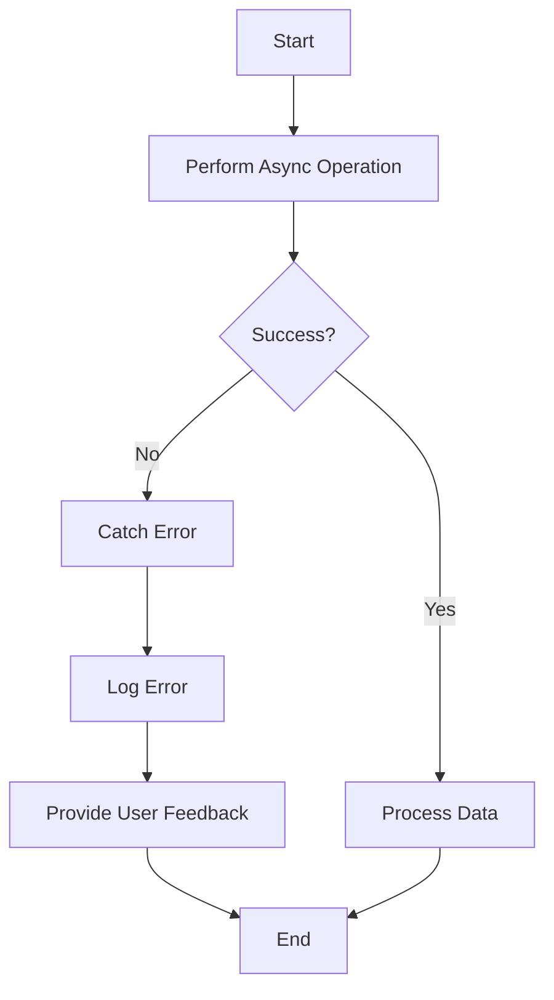

## 10.5 Error Handling in Asynchronous Code

Asynchronous programming is a powerful tool in TypeScript, allowing us to perform tasks like fetching data from a server without blocking the main thread. However, with great power comes great responsibility, and one of the key responsibilities is handling errors effectively. In this section, we'll explore how to manage errors in asynchronous code using `try/catch` blocks, error propagation, and logging strategies.

### Why Error Handling is Crucial in Asynchronous Code

When dealing with asynchronous operations, errors can occur at any point in the process. These errors might be due to network issues, invalid data, or unexpected conditions in your code. Without proper error handling, these issues can lead to application crashes, unresponsive interfaces, or incorrect data being displayed to users.

Robust error handling ensures that your application can gracefully recover from errors, provide meaningful feedback to users, and log information for debugging and monitoring purposes.

### Using `try/catch` with `async/await`

The `async/await` syntax in TypeScript makes it easier to work with asynchronous code by allowing us to write code that looks synchronous. This syntax also simplifies error handling, as we can use `try/catch` blocks to catch errors just like we would in synchronous code.

#### Basic Example of `try/catch` with `async/await`

Let's start with a simple example where we fetch data from an API and handle potential errors:

```typescript
async function fetchData(url: string): Promise<void> {
  try {
    const response = await fetch(url);
    if (!response.ok) {
      throw new Error(`HTTP error! status: ${response.status}`);
    }
    const data = await response.json();
    console.log('Data fetched successfully:', data);
  } catch (error) {
    console.error('Error fetching data:', error);
  }
}

fetchData('https://api.example.com/data');
```

**Explanation:**

- We define an asynchronous function `fetchData` that takes a URL as a parameter.
- Inside the `try` block, we use `await` to pause execution until the `fetch` operation completes.
- We check if the response is not okay (i.e., status code is not in the 200-299 range) and throw an error if it's not.
- If an error occurs at any point in the `try` block, it is caught by the `catch` block, where we log the error message.

### Error Propagation and Rethrowing Exceptions

Sometimes, you may want to handle an error at a higher level in your application rather than immediately where it occurs. In such cases, you can propagate the error by rethrowing it.

#### Propagating Errors

Here's how you can propagate an error up the call stack:

```typescript
async function fetchData(url: string): Promise<any> {
  const response = await fetch(url);
  if (!response.ok) {
    throw new Error(`HTTP error! status: ${response.status}`);
  }
  return response.json();
}

async function processData(url: string): Promise<void> {
  try {
    const data = await fetchData(url);
    console.log('Processing data:', data);
  } catch (error) {
    console.error('Error processing data:', error);
    throw error; // Rethrow the error for higher-level handling
  }
}

async function main(): Promise<void> {
  try {
    await processData('https://api.example.com/data');
  } catch (error) {
    console.error('An error occurred in the main function:', error);
  }
}

main();
```

**Explanation:**

- The `fetchData` function throws an error if the fetch operation fails.
- The `processData` function catches the error, logs it, and then rethrows it.
- The `main` function catches the rethrown error and logs it, providing a centralized place for error handling.

### Providing User Feedback

When an error occurs, it's important to provide feedback to the user so they understand what went wrong and what they can do about it. This can be done through UI elements like alerts, notifications, or messages.

#### Example with User Feedback

```typescript
async function fetchDataWithFeedback(url: string): Promise<void> {
  try {
    const response = await fetch(url);
    if (!response.ok) {
      throw new Error(`HTTP error! status: ${response.status}`);
    }
    const data = await response.json();
    console.log('Data fetched successfully:', data);
    // Update UI with data
  } catch (error) {
    console.error('Error fetching data:', error);
    alert('Failed to fetch data. Please try again later.');
  }
}

fetchDataWithFeedback('https://api.example.com/data');
```

**Explanation:**

- In the `catch` block, we use `alert` to notify the user of the error.
- This provides immediate feedback, allowing the user to understand that something went wrong.

### Logging and Monitoring Strategies

Logging errors is crucial for debugging and monitoring the health of your application. By logging errors, you can identify patterns, diagnose issues, and improve your code over time.

#### Basic Logging Example

```typescript
async function fetchDataWithLogging(url: string): Promise<void> {
  try {
    const response = await fetch(url);
    if (!response.ok) {
      throw new Error(`HTTP error! status: ${response.status}`);
    }
    const data = await response.json();
    console.log('Data fetched successfully:', data);
  } catch (error) {
    console.error('Error fetching data:', error);
    // Send error details to a logging service
  }
}

fetchDataWithLogging('https://api.example.com/data');
```

**Explanation:**

- We log the error details using `console.error`.
- In a real-world application, you might send these details to a logging service like Sentry or Loggly for further analysis.

### Try It Yourself

Now that we've covered the basics, try modifying the code examples to handle different types of errors. For instance, you could simulate a network error by using an invalid URL or handle JSON parsing errors by modifying the response data.

### Visualizing Error Handling Flow

To better understand the flow of error handling in asynchronous code, let's look at a flowchart that illustrates the process:



**Description:**

- The flowchart starts with an asynchronous operation.
- If the operation is successful, the data is processed.
- If an error occurs, it is caught, logged, and user feedback is provided.

### References and Further Reading

For more information on error handling in asynchronous JavaScript and TypeScript, check out these resources:

- [MDN Web Docs: Handling Errors in JavaScript](https://developer.mozilla.org/en-US/docs/Web/JavaScript/Guide/Control_flow_and_error_handling#handling_runtime_errors)
- [TypeScript Official Documentation: Asynchronous Programming](https://www.typescriptlang.org/docs/handbook/release-notes/typescript-2-1.html#asyncawait)

### Key Takeaways

- Use `try/catch` blocks with `async/await` to handle errors in asynchronous code.
- Propagate errors by rethrowing them when necessary.
- Provide meaningful feedback to users when errors occur.
- Implement logging and monitoring strategies to track and diagnose errors.

By mastering these techniques, you'll be well-equipped to handle errors in your asynchronous TypeScript applications, ensuring a smooth and reliable user experience.

## Quiz Time!



### What is the primary purpose of using `try/catch` blocks in asynchronous code?

- [x] To handle errors that occur during asynchronous operations
- [ ] To improve the performance of asynchronous code
- [ ] To make asynchronous code run synchronously
- [ ] To prevent the use of `await` in asynchronous functions

> **Explanation:** `try/catch` blocks are used to handle errors that occur during asynchronous operations, allowing the code to gracefully recover from errors.

### How can you propagate an error to a higher level in your application?

- [x] By rethrowing the error in the `catch` block
- [ ] By logging the error and ignoring it
- [ ] By using a `finally` block
- [ ] By wrapping the error in a new error object

> **Explanation:** Rethrowing the error in the `catch` block allows it to be handled at a higher level in the application.

### What is a common way to provide user feedback when an error occurs in asynchronous code?

- [x] Displaying an alert or notification
- [ ] Logging the error to the console
- [ ] Ignoring the error
- [ ] Restarting the application

> **Explanation:** Displaying an alert or notification provides immediate feedback to the user, informing them that an error has occurred.

### Why is logging errors important in asynchronous code?

- [x] It helps diagnose issues and improve code over time
- [ ] It prevents errors from occurring
- [ ] It makes the code run faster
- [ ] It is required by TypeScript

> **Explanation:** Logging errors helps diagnose issues and improve code over time by providing insights into what went wrong.

### Which of the following is a benefit of using `async/await` for error handling?

- [x] It allows for synchronous-looking code
- [ ] It eliminates the need for error handling
- [ ] It makes code run faster
- [ ] It prevents all errors from occurring

> **Explanation:** `async/await` allows for synchronous-looking code, making it easier to use `try/catch` blocks for error handling.

### What should you do if you want to handle an error at a higher level in your application?

- [x] Rethrow the error in the `catch` block
- [ ] Log the error and ignore it
- [ ] Use a `finally` block
- [ ] Wrap the error in a new error object

> **Explanation:** Rethrowing the error in the `catch` block allows it to be handled at a higher level in the application.

### How can you simulate a network error for testing purposes?

- [x] Use an invalid URL
- [ ] Use a valid URL
- [ ] Use a local server
- [ ] Use a secure connection

> **Explanation:** Using an invalid URL can simulate a network error for testing purposes.

### What is the purpose of the `finally` block in error handling?

- [x] To execute code regardless of whether an error occurred
- [ ] To catch errors that were not caught by the `catch` block
- [ ] To improve the performance of the code
- [ ] To prevent errors from occurring

> **Explanation:** The `finally` block is used to execute code regardless of whether an error occurred, often for cleanup purposes.

### What is a common strategy for monitoring errors in production applications?

- [x] Using a logging service like Sentry or Loggly
- [ ] Ignoring errors
- [ ] Restarting the application
- [ ] Using `console.log` for all errors

> **Explanation:** Using a logging service like Sentry or Loggly is a common strategy for monitoring errors in production applications.

### True or False: `async/await` syntax makes it impossible for errors to occur in asynchronous code.

- [ ] True
- [x] False

> **Explanation:** `async/await` syntax does not prevent errors from occurring; it simply provides a more readable way to handle them using `try/catch` blocks.


