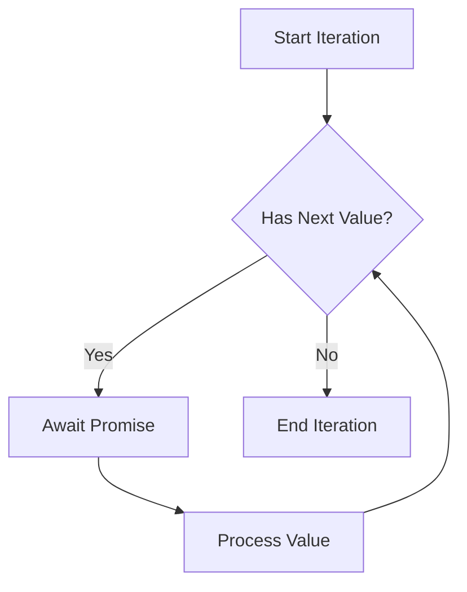

## 10.6 Working with Asynchronous Iterators

In this section, we will explore the fascinating world of asynchronous iterators in TypeScript. Asynchronous iterators are a powerful feature that allows us to work with data streams or sequences that are processed asynchronously. This is particularly useful when dealing with operations like reading from a network, handling paginated APIs, or processing large datasets that are not available all at once.

### Understanding Asynchronous Iterators

Before diving into asynchronous iterators, let's briefly revisit what iterators are. In JavaScript and TypeScript, an iterator is an object that provides a sequence of values, one at a time, through a `next()` method. This method returns an object with two properties: `value` (the current value) and `done` (a boolean indicating if the iteration is complete).

Asynchronous iterators extend this concept to handle sequences of data that are fetched or computed asynchronously. Instead of returning a value immediately, asynchronous iterators return a Promise that resolves to the next value. This allows us to handle data that arrives over time, such as data from a server or a file being read in chunks.

### The `for await...of` Loop

The `for await...of` loop is a special kind of loop designed to work with asynchronous iterators. It allows us to iterate over data that is fetched asynchronously, waiting for each Promise to resolve before proceeding to the next iteration.

#### Example: Basic Usage of `for await...of`

Let's start with a simple example to illustrate how `for await...of` works. Suppose we have an asynchronous function that simulates fetching data from a server:

```typescript
async function* fetchData() {
    const data = ["data1", "data2", "data3"];
    for (const item of data) {
        // Simulate a delay
        await new Promise(resolve => setTimeout(resolve, 1000));
        yield item;
    }
}

async function processData() {
    for await (const item of fetchData()) {
        console.log(item);
    }
}

processData();
```

In this example, `fetchData` is an asynchronous generator function that yields data items with a delay. The `processData` function uses `for await...of` to iterate over the data, logging each item to the console as it becomes available.

### Use Cases for Asynchronous Iterators

Asynchronous iterators are particularly useful in scenarios where data is not available all at once or needs to be processed as it arrives. Let's explore some common use cases:

#### Consuming Streams

Streams are a perfect example of data that can be processed asynchronously. Whether you're reading from a file, a network socket, or a web API, streams provide data in chunks. Asynchronous iterators allow you to process these chunks as they arrive.

#### Example: Reading a Stream

Here's an example of using an asynchronous iterator to read data from a stream:

```typescript
async function* readStream(stream: ReadableStream) {
    const reader = stream.getReader();
    try {
        while (true) {
            const { done, value } = await reader.read();
            if (done) break;
            yield value;
        }
    } finally {
        reader.releaseLock();
    }
}

async function processStream(stream: ReadableStream) {
    for await (const chunk of readStream(stream)) {
        console.log(new TextDecoder().decode(chunk));
    }
}
```

In this example, `readStream` is an asynchronous generator that reads chunks from a `ReadableStream`. The `processStream` function uses `for await...of` to process each chunk as it becomes available.

#### Handling Paginated APIs

Many web APIs return data in pages, requiring multiple requests to fetch all the data. Asynchronous iterators can simplify the process of iterating over paginated data.

#### Example: Fetching Paginated Data

Consider an API that returns data in pages:

```typescript
async function* fetchPaginatedData(url: string) {
    let page = 1;
    while (true) {
        const response = await fetch(`${url}?page=${page}`);
        const data = await response.json();
        if (data.length === 0) break;
        yield* data;
        page++;
    }
}

async function processPaginatedData(url: string) {
    for await (const item of fetchPaginatedData(url)) {
        console.log(item);
    }
}

processPaginatedData("https://api.example.com/data");
```

In this example, `fetchPaginatedData` is an asynchronous generator that fetches pages of data from an API. The `processPaginatedData` function uses `for await...of` to process each item as it is fetched.

### Defining Custom Asynchronous Iterators

Creating custom asynchronous iterators in TypeScript is straightforward. You can define an asynchronous generator function using the `async function*` syntax. This function can yield values asynchronously using the `yield` keyword.

#### Example: Custom Asynchronous Iterator

Let's create a custom asynchronous iterator that generates a sequence of numbers with a delay:

```typescript
async function* asyncNumberGenerator(limit: number) {
    for (let i = 0; i < limit; i++) {
        await new Promise(resolve => setTimeout(resolve, 500));
        yield i;
    }
}

async function processNumbers(limit: number) {
    for await (const num of asyncNumberGenerator(limit)) {
        console.log(num);
    }
}

processNumbers(5);
```

In this example, `asyncNumberGenerator` is an asynchronous generator that yields numbers from 0 to `limit - 1`, with a delay between each number. The `processNumbers` function uses `for await...of` to process each number.

### Compatibility Considerations

While asynchronous iterators are a powerful feature, they may not be supported in all environments, particularly older browsers or Node.js versions. To ensure compatibility, consider using a transpiler like Babel or TypeScript's own compiler settings to target environments that do not natively support asynchronous iterators.

### Try It Yourself

To get a better understanding of asynchronous iterators, try modifying the examples above. For instance, you can:

- Change the delay in the `fetchData` or `asyncNumberGenerator` functions to see how it affects the output.
- Modify the `fetchPaginatedData` function to fetch data from a real API.
- Experiment with error handling in asynchronous iterators by introducing errors in the data fetching process.

### Visualizing Asynchronous Iteration

To help visualize how asynchronous iteration works, consider the following flowchart, which illustrates the process of iterating over an asynchronous iterator using `for await...of`:



In this flowchart, the iteration starts by checking if there is a next value. If there is, the loop awaits the Promise and processes the value. This continues until there are no more values, at which point the iteration ends.

### Key Takeaways

- Asynchronous iterators allow you to work with data that is fetched or computed asynchronously.
- The `for await...of` loop is used to iterate over asynchronous iterators, waiting for each Promise to resolve.
- Asynchronous iterators are useful for consuming streams, handling paginated APIs, and processing data that arrives over time.
- You can define custom asynchronous iterators using the `async function*` syntax.
- Consider compatibility with older environments when using asynchronous iterators.

By mastering asynchronous iterators, you can handle complex data processing tasks in a clean and efficient manner, making your TypeScript applications more robust and responsive.

## Quiz Time!



### What is an asynchronous iterator?

- [x] An object that provides a sequence of values asynchronously
- [ ] A synchronous loop that processes data
- [ ] A function that returns a Promise
- [ ] A method for handling errors in async code

> **Explanation:** An asynchronous iterator is an object that provides a sequence of values asynchronously, allowing you to handle data that arrives over time.

### Which loop is used to iterate over asynchronous iterators?

- [ ] for...in
- [ ] for...of
- [x] for await...of
- [ ] while

> **Explanation:** The `for await...of` loop is used to iterate over asynchronous iterators, waiting for each Promise to resolve before proceeding.

### What does the `yield` keyword do in an asynchronous generator?

- [x] It produces a value from the generator
- [ ] It stops the generator
- [ ] It returns a Promise
- [ ] It handles errors

> **Explanation:** The `yield` keyword produces a value from the generator, allowing the `for await...of` loop to process it.

### In the example `fetchPaginatedData`, what does the `yield* data` statement do?

- [x] It yields each item in the `data` array
- [ ] It stops the iteration
- [ ] It fetches the next page
- [ ] It logs the data to the console

> **Explanation:** The `yield* data` statement yields each item in the `data` array, allowing the `for await...of` loop to process them individually.

### How can you ensure compatibility with older environments when using asynchronous iterators?

- [x] Use a transpiler like Babel
- [ ] Avoid using async code
- [ ] Use synchronous loops
- [ ] Only run code in modern browsers

> **Explanation:** Using a transpiler like Babel can ensure compatibility with older environments that do not natively support asynchronous iterators.

### What is a common use case for asynchronous iterators?

- [x] Consuming data streams
- [ ] Synchronous data processing
- [ ] Error handling
- [ ] Logging data to the console

> **Explanation:** Asynchronous iterators are commonly used for consuming data streams, where data arrives over time.

### What does the `await` keyword do in a `for await...of` loop?

- [x] It waits for the Promise to resolve
- [ ] It stops the loop
- [ ] It handles errors
- [ ] It logs data to the console

> **Explanation:** The `await` keyword waits for the Promise to resolve, ensuring that the loop processes each value as it becomes available.

### What is the purpose of the `try...finally` block in the `readStream` example?

- [x] To release the reader lock
- [ ] To handle errors
- [ ] To stop the iteration
- [ ] To log data to the console

> **Explanation:** The `try...finally` block ensures that the reader lock is released, even if an error occurs during iteration.

### How do asynchronous iterators differ from regular iterators?

- [x] They return Promises instead of values
- [ ] They are used in synchronous loops
- [ ] They handle errors automatically
- [ ] They are faster

> **Explanation:** Asynchronous iterators return Promises instead of values, allowing them to handle data that is fetched or computed asynchronously.

### True or False: Asynchronous iterators can be used to handle paginated API data.

- [x] True
- [ ] False

> **Explanation:** True. Asynchronous iterators can simplify the process of iterating over paginated API data, fetching and processing each page as it becomes available.


