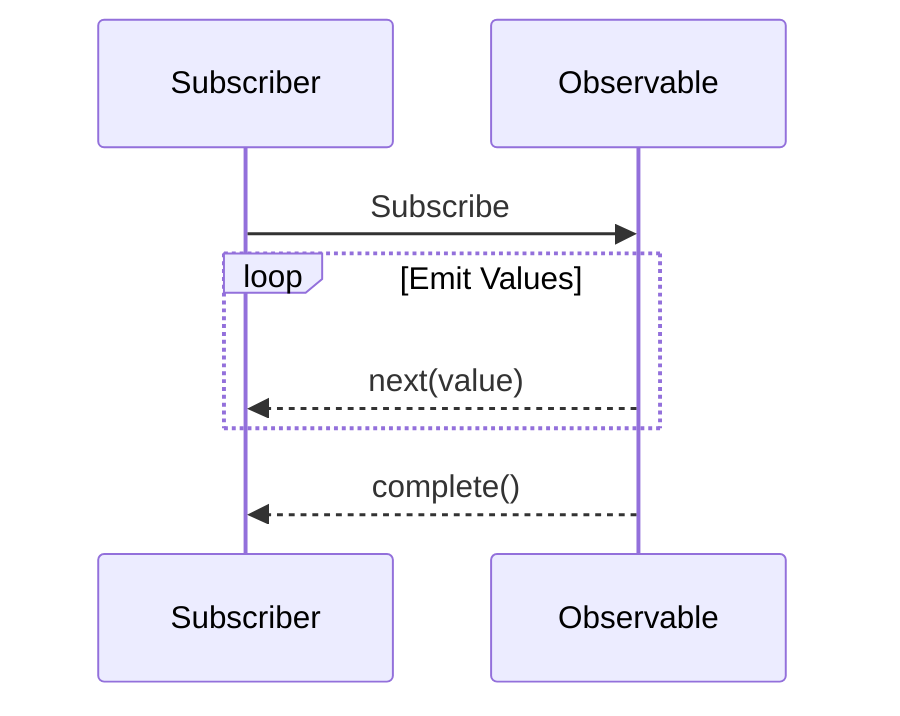

## 10.7 The `Observable` Pattern (Introduction)

As we delve deeper into the world of asynchronous programming in TypeScript, we encounter a powerful concept known as the **Observable pattern**. Observables provide a robust way to handle asynchronous data streams, offering more flexibility and control than traditional methods like Promises. In this section, we'll explore what observables are, how they compare to Promises, and provide a simple example using the RxJS library.

### What Are Observables?

Observables are a design pattern used to work with asynchronous data streams. They are part of the Reactive Programming paradigm, which focuses on data streams and the propagation of change. In simpler terms, an observable is like a stream of data that you can listen to and react to as new data comes in.

#### Key Characteristics of Observables:

- **Lazy Evaluation**: Observables are lazy, meaning they don't execute until you subscribe to them. This allows you to define a data stream without immediately consuming resources.
- **Multiple Values Over Time**: Unlike Promises, which resolve to a single value, observables can emit multiple values over time, making them ideal for scenarios like handling user input, web socket connections, or any other event-driven data.
- **Cancellable**: You can unsubscribe from an observable, effectively canceling the data stream and freeing up resources.

### Observables vs. Promises

Both observables and Promises are used to handle asynchronous operations, but they have some key differences:

| Feature          | Observables                             | Promises                          |
|------------------|-----------------------------------------|-----------------------------------|
| **Values**       | Can emit multiple values over time      | Resolve to a single value         |
| **Lazy**         | Yes, execution starts on subscription   | No, execution starts immediately  |
| **Cancellable**  | Yes, can be unsubscribed                | No, once started, cannot be canceled |
| **Operators**    | Rich set of operators for transformation | Limited transformation capabilities |

### A Simple Example Using RxJS

To illustrate the concept of observables, let's use the RxJS library, a popular library for reactive programming in JavaScript and TypeScript. RxJS provides a wide array of operators that allow you to create, transform, and manage observables.

First, ensure you have RxJS installed in your project. You can do this by running:

```bash
npm install rxjs
```

Now, let's create a simple observable that emits a sequence of numbers:

```typescript
import { Observable } from 'rxjs';

// Create an observable that emits numbers 1 to 5
const numberObservable = new Observable<number>((subscriber) => {
  for (let i = 1; i <= 5; i++) {
    subscriber.next(i); // Emit the current number
  }
  subscriber.complete(); // Signal that the observable is complete
});

// Subscribe to the observable
numberObservable.subscribe({
  next(value) {
    console.log(`Received value: ${value}`);
  },
  complete() {
    console.log('Observable completed');
  }
});
```

**Explanation:**

- **Observable Creation**: We create an observable using the `Observable` constructor. The function passed to the constructor is called when the observable is subscribed to.
- **Emitting Values**: The `subscriber.next(value)` method is used to emit values to the subscribers.
- **Completion**: The `subscriber.complete()` method signals that no more values will be emitted.
- **Subscription**: We subscribe to the observable using the `subscribe` method, which takes an object with `next` and `complete` handlers.

### Visualizing the Observable Flow

To better understand how observables work, let's visualize the flow of data using a diagram:



**Diagram Explanation:**

- The subscriber initiates the process by subscribing to the observable.
- The observable emits values over time, which are received by the subscriber.
- Once all values are emitted, the observable sends a completion signal.

### Encouragement for Further Exploration

While this introduction provides a basic understanding of observables, it's important to note that this is an advanced topic with a wide range of applications and complexities. Observables are incredibly powerful, especially when dealing with complex asynchronous data flows in applications.

For those interested in diving deeper, consider exploring the following resources:

- [RxJS Documentation](https://rxjs.dev/): The official documentation for RxJS, providing comprehensive guides and API references.
- [ReactiveX](http://reactivex.io/): A website dedicated to reactive programming, offering tutorials and resources for various languages, including JavaScript and TypeScript.
- [MDN Web Docs on Observables](https://developer.mozilla.org/en-US/docs/Web/JavaScript/Guide/Using_promises): While primarily focused on Promises, this resource provides a good foundation for understanding asynchronous programming concepts.

### Try It Yourself

To solidify your understanding of observables, try modifying the example above:

- **Change the Range**: Modify the loop to emit a different range of numbers.
- **Add a Delay**: Introduce a delay between emissions using the `setTimeout` function to simulate asynchronous data.
- **Error Handling**: Add error handling to the observable by using the `subscriber.error()` method and handle it in the subscription.

### Key Takeaways

- **Observables** are a powerful tool for managing asynchronous data streams, allowing for multiple values over time and cancellation of operations.
- **Comparison with Promises**: Observables offer more flexibility than Promises, especially in scenarios involving multiple data emissions.
- **RxJS** is a popular library that provides a rich set of operators for working with observables in TypeScript.

By understanding the basics of observables, you open the door to more advanced asynchronous programming techniques that can greatly enhance the performance and responsiveness of your applications.

## Quiz Time!



### What is a key characteristic of observables?

- [x] They can emit multiple values over time.
- [ ] They resolve to a single value.
- [ ] They execute immediately upon creation.
- [ ] They cannot be canceled once started.

> **Explanation:** Observables can emit multiple values over time, making them suitable for handling streams of data.

### How do observables differ from promises in terms of execution?

- [x] Observables are lazy and execute upon subscription.
- [ ] Observables execute immediately upon creation.
- [ ] Promises are lazy and execute upon subscription.
- [ ] Promises can emit multiple values over time.

> **Explanation:** Observables are lazy, meaning they execute only when subscribed to, whereas promises execute immediately.

### What library is commonly used for working with observables in TypeScript?

- [x] RxJS
- [ ] Lodash
- [ ] Axios
- [ ] jQuery

> **Explanation:** RxJS is a popular library for working with observables in JavaScript and TypeScript.

### What method is used to emit values in an observable?

- [x] subscriber.next(value)
- [ ] subscriber.emit(value)
- [ ] subscriber.send(value)
- [ ] subscriber.dispatch(value)

> **Explanation:** The `subscriber.next(value)` method is used to emit values to subscribers.

### Can observables be canceled?

- [x] Yes, by unsubscribing.
- [ ] No, they cannot be canceled once started.
- [ ] Yes, by calling a cancel method.
- [ ] No, they complete automatically.

> **Explanation:** Observables can be canceled by unsubscribing, freeing up resources.

### What is the purpose of the `subscriber.complete()` method?

- [x] To signal that no more values will be emitted.
- [ ] To emit a final value.
- [ ] To cancel the observable.
- [ ] To restart the observable.

> **Explanation:** The `subscriber.complete()` method signals that the observable has finished emitting values.

### Which of the following is NOT a feature of observables?

- [ ] Lazy evaluation
- [ ] Multiple values over time
- [ ] Cancellable
- [x] Immediate execution upon creation

> **Explanation:** Observables are lazy and do not execute immediately upon creation.

### What is a common use case for observables?

- [x] Handling user input events
- [ ] Fetching a single API response
- [ ] Performing synchronous calculations
- [ ] Managing static configuration data

> **Explanation:** Observables are well-suited for handling streams of events, such as user input.

### Which method is used to subscribe to an observable?

- [x] subscribe
- [ ] listen
- [ ] attach
- [ ] connect

> **Explanation:** The `subscribe` method is used to listen to an observable's emitted values.

### True or False: Observables can only emit a single value.

- [ ] True
- [x] False

> **Explanation:** Observables can emit multiple values over time, unlike promises which resolve to a single value.


