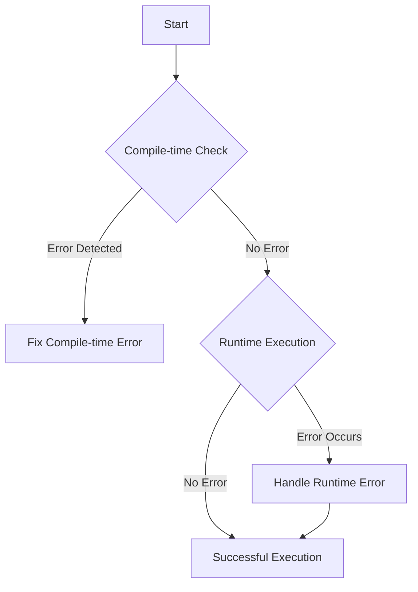

## 11.1 Understanding Runtime vs. Compile-time Errors

As we delve deeper into TypeScript, understanding the distinction between runtime and compile-time errors becomes crucial. This knowledge not only helps in writing robust code but also in debugging and maintaining it. Let's explore these two types of errors, how TypeScript helps prevent them, and strategies for handling them effectively.

### What are Compile-time Errors?

Compile-time errors occur during the compilation process, which is when TypeScript code is transformed into JavaScript. These errors are detected by the TypeScript compiler (`tsc`) before the code is executed in the browser or Node.js environment. 

#### How TypeScript's Static Typing Helps

TypeScript's static typing system is a powerful tool that helps catch errors at compile time. By specifying types for variables, function parameters, and return values, TypeScript can ensure that the code adheres to expected types, reducing the likelihood of errors.

**Example of Compile-time Error:**

```typescript
// Attempting to assign a string to a number type variable
let age: number = "twenty-five"; // Error: Type 'string' is not assignable to type 'number'.
```

In the example above, TypeScript immediately flags the error because a string is being assigned to a variable declared as a number. This type of error is caught before the code is run, preventing potential runtime issues.

#### Limitations of Static Type Checking

While TypeScript's static type checking is robust, it has its limitations. It cannot catch every possible error, especially those related to logic or runtime conditions. For example, if a function is expected to return a number but returns `undefined` due to a logical error, TypeScript may not catch this at compile time.

### What are Runtime Errors?

Runtime errors occur while the program is executing. These errors are not detected by the compiler and only become apparent when the code is run. They can be caused by various factors such as incorrect logic, invalid user input, or issues with external resources.

#### Why Runtime Errors Occur

Despite TypeScript's compile-time checks, runtime errors can still occur due to:

- **Logic Errors**: Mistakes in the algorithm or logic that lead to unexpected behavior.
- **External Factors**: Issues with network requests, file operations, or user input that cannot be predicted at compile time.
- **Dynamic Operations**: Operations that involve dynamic data types or structures that are not fully known at compile time.

**Example of Runtime Error:**

```typescript
function divide(a: number, b: number): number {
    return a / b;
}

console.log(divide(10, 0)); // Runtime Error: Division by zero
```

In this example, dividing by zero is a logical error that results in a runtime error. The TypeScript compiler cannot predict this error because it depends on the values provided at runtime.

### Proactive Error Handling Strategies

To minimize the impact of runtime errors, it's essential to adopt proactive error handling strategies. Here are some techniques:

#### 1. Use of Try/Catch Blocks

Try/catch blocks allow you to handle exceptions gracefully, providing a way to recover from errors without crashing the application.

```typescript
try {
    let result = divide(10, 0);
    console.log(result);
} catch (error) {
    console.error("An error occurred:", error.message);
}
```

#### 2. Input Validation

Always validate user input to ensure it meets expected criteria before processing it. This can prevent many common runtime errors.

```typescript
function safeDivide(a: number, b: number): number | null {
    if (b === 0) {
        console.error("Cannot divide by zero.");
        return null;
    }
    return a / b;
}
```

#### 3. Defensive Programming

Adopt a defensive programming approach by anticipating potential errors and handling them proactively.

```typescript
function getProperty(obj: any, key: string): any {
    if (obj && key in obj) {
        return obj[key];
    }
    console.warn(`Property ${key} does not exist on the object.`);
    return undefined;
}
```

### Visualizing the Error Handling Process

To better understand the flow of error handling in TypeScript, let's visualize it using a flowchart.



**Figure 1:** Error Handling Process in TypeScript

### Encouraging Proactive Error Handling

Proactive error handling is not just about fixing errors when they occur but anticipating and preventing them. Here are some best practices:

- **Write Unit Tests**: Ensure your code behaves as expected by writing tests for critical functions and components.
- **Use Linters and Static Analysis Tools**: Tools like ESLint can catch potential issues early in the development process.
- **Regular Code Reviews**: Peer reviews can help identify potential errors and improve code quality.
- **Stay Updated**: Keep up with TypeScript updates and best practices to leverage new features and improvements.

### Conclusion

Understanding the difference between compile-time and runtime errors is crucial for writing robust TypeScript applications. While TypeScript's static typing helps catch many errors early, runtime errors can still occur due to various factors. By adopting proactive error handling strategies, you can minimize the impact of these errors and build more reliable applications.

### Try It Yourself

Experiment with the code examples provided in this section. Try introducing errors intentionally to see how TypeScript handles them. Modify the examples to handle different types of errors and observe the outcomes.

## Quiz Time!



### What is a compile-time error?

- [x] An error detected by the TypeScript compiler before the code is executed.
- [ ] An error that occurs during the execution of the program.
- [ ] An error caused by incorrect user input.
- [ ] An error related to network requests.

> **Explanation:** Compile-time errors are detected by the TypeScript compiler during the compilation process, before the code is executed.

### Which of the following is an example of a runtime error?

- [ ] Assigning a string to a number type variable.
- [x] Division by zero during program execution.
- [ ] Missing a semicolon at the end of a statement.
- [ ] Incorrectly typed function parameter.

> **Explanation:** Division by zero is a logical error that occurs during program execution, making it a runtime error.

### How does TypeScript's static typing help prevent errors?

- [x] By catching type mismatches at compile time.
- [ ] By preventing all runtime errors.
- [ ] By validating user input automatically.
- [ ] By ensuring network requests are successful.

> **Explanation:** TypeScript's static typing catches type mismatches at compile time, reducing the likelihood of errors.

### What is a limitation of static type checking?

- [x] It cannot catch logic errors or runtime conditions.
- [ ] It prevents all types of errors.
- [ ] It automatically handles exceptions.
- [ ] It validates all user inputs.

> **Explanation:** Static type checking cannot catch logic errors or runtime conditions, which occur during program execution.

### Which strategy is recommended for handling runtime errors?

- [x] Use try/catch blocks to handle exceptions.
- [ ] Ignore runtime errors and focus on compile-time errors.
- [ ] Rely solely on TypeScript's type system.
- [ ] Avoid using external libraries.

> **Explanation:** Using try/catch blocks allows you to handle exceptions gracefully and recover from runtime errors.

### What should you do to prevent runtime errors related to user input?

- [x] Validate user input before processing it.
- [ ] Trust that all user input is correct.
- [ ] Avoid using user input in your code.
- [ ] Use only static data in your applications.

> **Explanation:** Validating user input ensures it meets expected criteria, preventing many common runtime errors.

### What is defensive programming?

- [x] Anticipating potential errors and handling them proactively.
- [ ] Ignoring errors and focusing on new features.
- [ ] Writing code without any error handling.
- [ ] Relying on the compiler to catch all errors.

> **Explanation:** Defensive programming involves anticipating potential errors and handling them proactively to prevent issues.

### How can you visualize the error handling process in TypeScript?

- [x] Using flowcharts to represent the process.
- [ ] Writing long paragraphs of text.
- [ ] Creating complex diagrams with multiple layers.
- [ ] Using only code examples without visual aids.

> **Explanation:** Flowcharts provide a clear visual representation of the error handling process, making it easier to understand.

### What is the benefit of writing unit tests?

- [x] Ensuring code behaves as expected and catching errors early.
- [ ] Eliminating the need for error handling.
- [ ] Automatically fixing all runtime errors.
- [ ] Preventing compile-time errors.

> **Explanation:** Unit tests help ensure code behaves as expected, catching errors early in the development process.

### True or False: TypeScript can catch all runtime errors.

- [ ] True
- [x] False

> **Explanation:** False. TypeScript can catch many errors at compile time, but runtime errors can still occur due to various factors.


