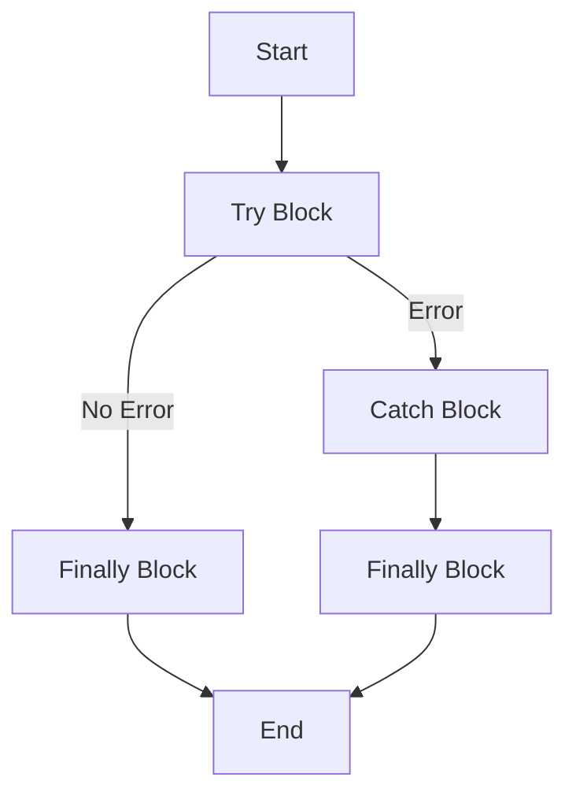

## 11.2 Using Try/Catch Blocks

Error handling is a crucial aspect of programming that ensures your applications can gracefully handle unexpected situations. In TypeScript, the `try`, `catch`, and `finally` blocks provide a structured way to manage errors and maintain the stability of your code. In this section, we will explore how these constructs work, how to implement them effectively, and best practices to follow.

### Understanding the Basics

The `try`, `catch`, and `finally` blocks in TypeScript are used to handle exceptions, which are runtime errors that occur during the execution of your code. Here's a breakdown of each component:

- **`try` Block**: This block contains the code that might throw an error. If an error occurs, the control is transferred to the `catch` block.
- **`catch` Block**: This block is executed if an error is thrown in the `try` block. It allows you to handle the error gracefully.
- **`finally` Block**: This block is optional and contains code that will run regardless of whether an error was thrown or not. It's typically used for clean-up activities.

### Syntax of Try/Catch/Finally

The basic syntax of a `try/catch/finally` block is as follows:

```typescript
try {
    // Code that may throw an error
} catch (error) {
    // Code to handle the error
} finally {
    // Code that will always run
}
```

### Example: Handling Errors in Synchronous Code

Let's start with a simple example to demonstrate how `try/catch` works in synchronous code. Consider a function that divides two numbers:

```typescript
function divideNumbers(a: number, b: number): number {
    if (b === 0) {
        throw new Error("Division by zero is not allowed.");
    }
    return a / b;
}

try {
    let result = divideNumbers(10, 0);
    console.log(`Result: ${result}`);
} catch (error) {
    console.error(`An error occurred: ${error.message}`);
} finally {
    console.log("Execution completed.");
}
```

**Explanation:**

- In the `divideNumbers` function, we check if the divisor `b` is zero. If it is, we throw an error using `throw new Error(...)`.
- The `try` block contains the call to `divideNumbers`. If an error is thrown, the control moves to the `catch` block.
- The `catch` block logs the error message to the console.
- The `finally` block logs a message indicating that execution is complete, regardless of whether an error occurred.

### Example: Handling Errors in Asynchronous Code

Handling errors in asynchronous code, such as when using Promises, requires a slightly different approach. Here's an example using `async/await`:

```typescript
async function fetchData(url: string): Promise<any> {
    try {
        let response = await fetch(url);
        if (!response.ok) {
            throw new Error(`HTTP error! Status: ${response.status}`);
        }
        let data = await response.json();
        return data;
    } catch (error) {
        console.error(`Failed to fetch data: ${error.message}`);
        throw error; // Re-throw the error after logging
    } finally {
        console.log("Fetch attempt completed.");
    }
}

(async () => {
    try {
        let data = await fetchData("https://api.example.com/data");
        console.log(data);
    } catch (error) {
        console.error("Error in async function:", error.message);
    }
})();
```

**Explanation:**

- The `fetchData` function attempts to fetch data from a URL. If the response is not okay, it throws an error.
- The `catch` block logs the error and re-throws it to allow further handling by the caller.
- The `finally` block logs a message indicating the completion of the fetch attempt.
- In the calling code, we use an `async` IIFE (Immediately Invoked Function Expression) to handle the promise returned by `fetchData`.

### Best Practices for Using Try/Catch Blocks

1. **Use Specific Error Messages**: Always provide clear and specific error messages. This helps in debugging and understanding what went wrong.

2. **Avoid Catching Errors Too Broadly**: Catch only the exceptions you expect and can handle. Catching all errors can hide bugs and make debugging difficult.

3. **Use Finally for Clean-up**: Place any clean-up code, such as closing files or releasing resources, in the `finally` block to ensure it runs regardless of an error.

4. **Re-throw Errors When Necessary**: If you catch an error but cannot handle it fully, consider re-throwing it. This allows higher-level code to handle the error appropriately.

5. **Avoid Silent Failures**: Do not catch errors without logging or handling them. Silent failures can lead to undetected issues in your application.

### Common Mistakes to Avoid

- **Ignoring Errors**: Catching an error without taking any action is a common mistake. Always log or handle the error in some way.
- **Overusing Try/Catch**: Use `try/catch` judiciously. Not every piece of code needs to be wrapped in a `try/catch` block.
- **Catching Non-Errors**: Ensure that you are only catching actual errors. Avoid using `try/catch` for control flow, such as breaking out of loops.

### Thoughtful Placement of Error Handling Blocks

When placing `try/catch` blocks, consider the following:

- **Scope of the Try Block**: Keep the `try` block as small as possible. This makes it easier to identify which code might throw an error.
- **Separation of Concerns**: Separate error handling logic from business logic. This improves code readability and maintainability.
- **Error Propagation**: Decide whether an error should be handled locally or propagated to a higher level. This depends on the context and the nature of the error.

### Visualizing Try/Catch/Finally Flow

To better understand the flow of execution in `try/catch/finally` blocks, let's visualize it using a flowchart:



**Description**: This flowchart illustrates the execution flow of `try/catch/finally` blocks. The `try` block is executed first. If no error occurs, the `finally` block is executed. If an error occurs, the `catch` block handles it, followed by the `finally` block.

### Try It Yourself

To reinforce your understanding, try modifying the code examples:

- **Experiment with Different Errors**: Change the divisor in the `divideNumbers` function to a non-zero value and observe the behavior.
- **Add More Error Handling**: In the `fetchData` function, add additional checks for network errors or invalid JSON responses.
- **Create Your Own Examples**: Write a function that reads a file and handles errors such as file not found or permission denied.

### Additional Resources

For further reading on error handling in TypeScript, consider the following resources:

- [MDN Web Docs on Error Handling](https://developer.mozilla.org/en-US/docs/Web/JavaScript/Guide/Control_flow_and_error_handling)
- [TypeScript Handbook on Error Handling](https://www.typescriptlang.org/docs/handbook/2/everyday-types.html#exceptions)

### Key Takeaways

- The `try`, `catch`, and `finally` blocks provide a structured way to handle errors in TypeScript.
- Use specific error messages and avoid catching errors too broadly.
- Place clean-up code in the `finally` block to ensure it runs regardless of errors.
- Thoughtful placement of error handling blocks improves code readability and maintainability.

## Quiz Time!



### What is the purpose of the `try` block in TypeScript?

- [x] To contain code that might throw an error
- [ ] To handle errors that occur
- [ ] To execute code after an error is caught
- [ ] To ensure code runs regardless of errors

> **Explanation:** The `try` block contains code that might throw an error, allowing the program to attempt execution and catch any exceptions that occur.

### What does the `catch` block do?

- [ ] Contains code that might throw an error
- [x] Handles errors that occur in the `try` block
- [ ] Ensures code runs regardless of errors
- [ ] Re-throws errors for higher-level handling

> **Explanation:** The `catch` block is executed if an error is thrown in the `try` block, allowing you to handle the error gracefully.

### What is the role of the `finally` block?

- [ ] To handle errors that occur
- [ ] To contain code that might throw an error
- [x] To execute code regardless of whether an error occurred
- [ ] To re-throw errors for higher-level handling

> **Explanation:** The `finally` block contains code that will run regardless of whether an error was thrown or not, typically used for clean-up activities.

### When should you re-throw an error in a `catch` block?

- [x] When the error cannot be fully handled locally
- [ ] When the error is already handled
- [ ] When no error occurs
- [ ] When the error is trivial

> **Explanation:** Re-throwing an error allows higher-level code to handle it appropriately if it cannot be fully managed locally.

### What is a common mistake when using `try/catch` blocks?

- [x] Catching errors too broadly
- [ ] Using specific error messages
- [ ] Placing clean-up code in the `finally` block
- [ ] Logging errors

> **Explanation:** Catching errors too broadly can hide bugs and make debugging difficult, as it may catch exceptions you did not anticipate.

### Why is it important to use specific error messages?

- [x] To aid in debugging and understanding what went wrong
- [ ] To make the code run faster
- [ ] To prevent errors from occurring
- [ ] To avoid using `try/catch` blocks

> **Explanation:** Specific error messages help in debugging and understanding the nature of the error, making it easier to fix.

### What should you avoid doing in a `catch` block?

- [x] Ignoring errors without logging or handling them
- [ ] Logging errors
- [ ] Handling errors gracefully
- [ ] Re-throwing errors when necessary

> **Explanation:** Ignoring errors without logging or handling them can lead to undetected issues in your application.

### What is the benefit of using a `finally` block?

- [ ] To catch errors
- [ ] To throw errors
- [x] To ensure clean-up code runs regardless of errors
- [ ] To handle specific errors

> **Explanation:** The `finally` block ensures that clean-up code runs regardless of whether an error occurred, maintaining resource integrity.

### How should you decide where to place `try/catch` blocks?

- [x] Keep the `try` block as small as possible
- [ ] Enclose the entire program in a `try` block
- [ ] Use `try/catch` for every function
- [ ] Avoid using `try/catch` blocks

> **Explanation:** Keeping the `try` block small makes it easier to identify which code might throw an error, improving readability and maintainability.

### True or False: The `finally` block is optional in a `try/catch` statement.

- [x] True
- [ ] False

> **Explanation:** The `finally` block is optional and is used for clean-up activities that should run regardless of whether an error occurred.


