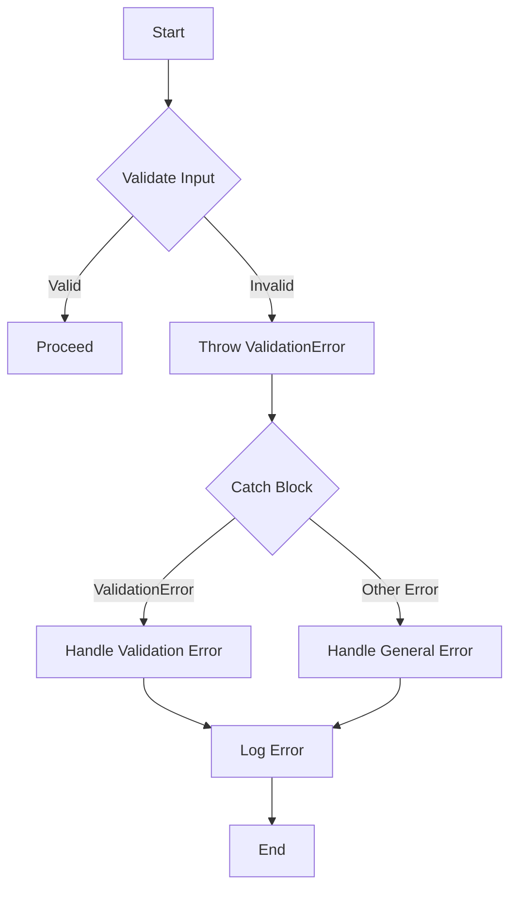

## 11.3 Custom Error Types

In software development, error handling is a crucial aspect that ensures our applications can gracefully handle unexpected situations. While TypeScript provides built-in error handling mechanisms, creating custom error types can significantly enhance the clarity and maintainability of your code. In this section, we'll explore how to create custom error classes in TypeScript, when to use them, and how they can improve your error handling strategy.

### Understanding the Need for Custom Error Types

Before diving into the implementation, let's understand why custom error types are beneficial:

1. **Specificity**: Custom errors allow you to represent specific error conditions, making it easier to identify and handle different error scenarios.
2. **Clarity**: By using custom errors, you can provide more descriptive error messages and additional context, improving the readability and maintainability of your code.
3. **Separation of Concerns**: Custom errors help separate different error types, allowing you to handle them differently based on their nature.
4. **Enhanced Debugging**: With custom errors, you can include additional information such as error codes, timestamps, or user-friendly messages, aiding in debugging and logging.

### Extending the Built-in `Error` Class

To create a custom error type in TypeScript, we extend the built-in `Error` class. This allows us to leverage the existing error-handling infrastructure while adding our custom logic. Let's see how this is done with a simple example:

```typescript
class ValidationError extends Error {
    constructor(message: string) {
        super(message); // Call the parent class constructor
        this.name = "ValidationError"; // Set the error name
    }
}

// Usage example
try {
    throw new ValidationError("Invalid input provided.");
} catch (error) {
    if (error instanceof ValidationError) {
        console.error(`Validation Error: ${error.message}`);
    } else {
        console.error(`General Error: ${error.message}`);
    }
}
```

In this example, we define a `ValidationError` class that extends the `Error` class. We set the `name` property to "ValidationError" to differentiate it from other error types.

### When to Use Custom Errors

Custom errors are particularly useful in the following scenarios:

- **Validation Errors**: When user input does not meet certain criteria.
- **Network Errors**: When there are issues with network requests, such as timeouts or unreachable servers.
- **Database Errors**: When database operations fail, such as connection errors or query failures.
- **Business Logic Errors**: When specific business rules are violated.

### Including Additional Information in Custom Errors

Custom errors can carry additional information that can be useful for debugging or providing more context. Let's enhance our `ValidationError` example by adding an error code:

```typescript
class ValidationError extends Error {
    errorCode: number;

    constructor(message: string, errorCode: number) {
        super(message);
        this.name = "ValidationError";
        this.errorCode = errorCode; // Add an error code
    }
}

// Usage example
try {
    throw new ValidationError("Invalid input provided.", 1001);
} catch (error) {
    if (error instanceof ValidationError) {
        console.error(`Validation Error [${error.errorCode}]: ${error.message}`);
    } else {
        console.error(`General Error: ${error.message}`);
    }
}
```

In this version, we added an `errorCode` property to the `ValidationError` class. This allows us to provide more specific information about the error, which can be particularly useful for logging or displaying user-friendly messages.

### Using Custom Errors in `throw` Statements and `catch` Blocks

Custom errors can be used just like built-in errors in `throw` statements and `catch` blocks. Here's a more comprehensive example demonstrating how to use custom errors in a function that validates user input:

```typescript
class ValidationError extends Error {
    errorCode: number;

    constructor(message: string, errorCode: number) {
        super(message);
        this.name = "ValidationError";
        this.errorCode = errorCode;
    }
}

function validateUserInput(input: string): void {
    if (input.trim() === "") {
        throw new ValidationError("Input cannot be empty.", 1001);
    }
    if (input.length < 5) {
        throw new ValidationError("Input must be at least 5 characters long.", 1002);
    }
    // Additional validation logic...
}

// Usage example
try {
    validateUserInput("abc");
} catch (error) {
    if (error instanceof ValidationError) {
        console.error(`Validation Error [${error.errorCode}]: ${error.message}`);
    } else {
        console.error(`General Error: ${error.message}`);
    }
}
```

In this example, the `validateUserInput` function throws a `ValidationError` if the input does not meet certain criteria. The `catch` block then handles the error, providing specific feedback based on the error type.

### Encouraging Clearer Error Differentiation

Using custom errors encourages clearer error differentiation, allowing you to handle different error types appropriately. For instance, you might choose to log validation errors differently from network errors or display different messages to the user.

### Try It Yourself

To solidify your understanding, try modifying the code examples above. Here are some suggestions:

- Add more custom error types, such as `NetworkError` or `DatabaseError`.
- Include additional properties in your custom errors, like `timestamp` or `userFriendlyMessage`.
- Experiment with different error handling strategies in the `catch` block.

### Visualizing Error Handling Flow

Let's visualize the flow of error handling using a Mermaid.js diagram:



This diagram illustrates the process of input validation, where a `ValidationError` is thrown if the input is invalid, and the error is subsequently handled in the catch block.

### References and Further Reading

For more information on error handling in TypeScript, consider exploring the following resources:

- [MDN Web Docs: Error Handling](https://developer.mozilla.org/en-US/docs/Web/JavaScript/Guide/Control_flow_and_error_handling)
- [TypeScript Handbook: Errors](https://www.typescriptlang.org/docs/handbook/release-notes/typescript-2-2.html)
- [W3Schools: JavaScript Errors](https://www.w3schools.com/js/js_errors.asp)

### Summary

In this section, we've explored the concept of custom error types in TypeScript. By extending the built-in `Error` class, we can create specific error types that enhance the clarity and maintainability of our code. Custom errors allow us to include additional information, differentiate between error types, and handle errors more effectively. As you continue your TypeScript journey, consider incorporating custom errors into your projects to improve your error-handling strategy.

## Quiz Time!



### What is the primary benefit of using custom error types in TypeScript?

- [x] Specificity and clarity in error handling
- [ ] Reducing code size
- [ ] Improving application speed
- [ ] Eliminating all errors

> **Explanation:** Custom error types provide specificity and clarity, allowing developers to handle different error scenarios more effectively.

### How do you create a custom error type in TypeScript?

- [x] By extending the built-in `Error` class
- [ ] By using a special error keyword
- [ ] By creating a new error function
- [ ] By modifying the existing `Error` class

> **Explanation:** Custom error types are created by extending the built-in `Error` class, allowing developers to add specific logic and properties.

### What property is commonly added to custom error types for additional context?

- [x] errorCode
- [ ] errorLevel
- [ ] errorType
- [ ] errorName

> **Explanation:** The `errorCode` property is commonly added to custom error types to provide additional context and specificity.

### In the provided example, what happens if the input is less than 5 characters long?

- [x] A `ValidationError` is thrown
- [ ] A `TypeError` is thrown
- [ ] The input is accepted
- [ ] The function returns `null`

> **Explanation:** If the input is less than 5 characters long, a `ValidationError` is thrown to indicate the validation failure.

### What is the purpose of the `catch` block in error handling?

- [x] To handle errors that are thrown
- [ ] To prevent errors from occurring
- [ ] To log all function calls
- [ ] To execute code before an error is thrown

> **Explanation:** The `catch` block is used to handle errors that are thrown, allowing developers to provide specific responses or logging.

### Which of the following is NOT a scenario where custom errors are useful?

- [ ] Validation Errors
- [ ] Network Errors
- [ ] Database Errors
- [x] Syntax Errors

> **Explanation:** Syntax errors are typically caught by the compiler, whereas custom errors are useful for runtime scenarios like validation, network, and database errors.

### What does the `super` keyword do in the custom error class constructor?

- [x] Calls the parent class constructor
- [ ] Declares a new error type
- [ ] Initializes a new error object
- [ ] Defines a static error method

> **Explanation:** The `super` keyword is used to call the parent class constructor, which is necessary when extending the `Error` class.

### How can custom errors improve debugging?

- [x] By providing additional information and context
- [ ] By reducing the number of errors
- [ ] By automatically fixing errors
- [ ] By hiding errors from the user

> **Explanation:** Custom errors can include additional information and context, such as error codes and messages, which aids in debugging.

### What is the role of the `instanceof` operator in the `catch` block?

- [x] To check the type of the error
- [ ] To throw a new error
- [ ] To log the error message
- [ ] To suppress the error

> **Explanation:** The `instanceof` operator is used to check the type of the error, allowing developers to handle different error types appropriately.

### True or False: Custom errors can only be used in TypeScript.

- [ ] True
- [x] False

> **Explanation:** Custom errors can be used in both JavaScript and TypeScript, though TypeScript provides additional type safety and features.




