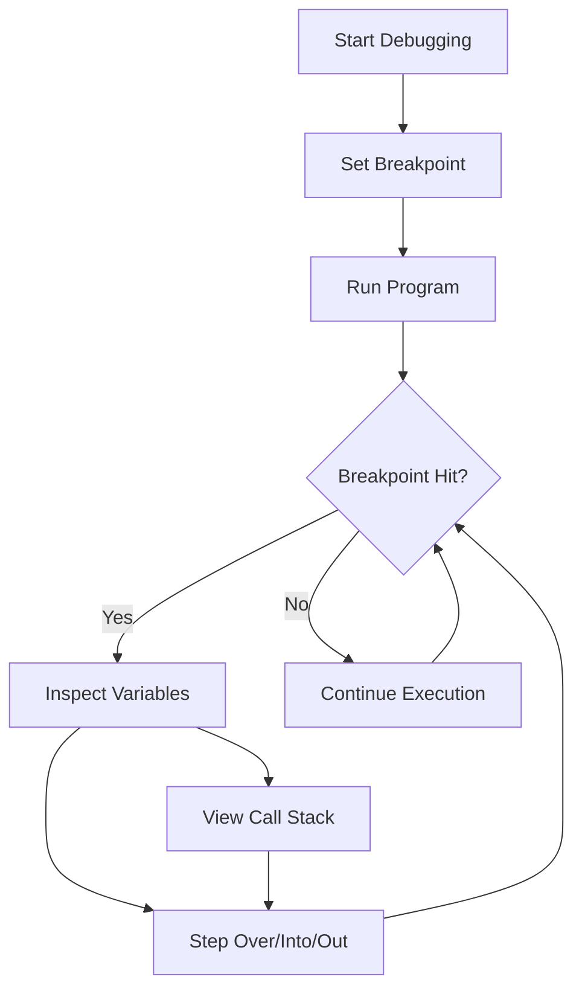

## 11.4 Debugging TypeScript Code

Debugging is an essential skill for any developer. It allows us to identify and fix errors in our code, ensuring that our applications run smoothly. In this section, we'll explore how to debug TypeScript code effectively using popular tools and techniques. We'll focus on Visual Studio Code (VSCode), a widely used code editor, but the concepts can be applied to other editors as well.

### Introduction to Debugging Tools

Before we dive into the specifics, let's briefly discuss the tools available for debugging TypeScript code. Most modern code editors come equipped with powerful debugging capabilities. Here are some of the key features you can expect:

- **Breakpoints**: Pause the execution of your code at specific lines to inspect the state of your application.
- **Stepping**: Move through your code line by line to understand the flow of execution.
- **Variable Inspection**: Examine the values of variables at different points in your program.
- **Call Stack**: View the sequence of function calls that led to the current point in execution.
- **Watch Expressions**: Monitor specific expressions or variables as you step through your code.

Let's explore how to use these tools in VSCode.

### Setting Up VSCode for TypeScript Debugging

VSCode is a popular choice for TypeScript development due to its robust debugging features. To get started with debugging in VSCode, follow these steps:

1. **Install the TypeScript Extension**: Ensure you have the TypeScript extension installed in VSCode. This extension provides syntax highlighting, IntelliSense, and other features that enhance your TypeScript development experience.

2. **Configure the Debugger**: VSCode uses a `launch.json` file to configure debugging settings. You can create this file by navigating to the Debug view (accessible via the left sidebar or by pressing `Ctrl+Shift+D`) and clicking on the "create a launch.json file" link.

3. **Add a Debug Configuration**: In the `launch.json` file, add a configuration for debugging TypeScript. Here's a basic example:

    ```json
    {
      "version": "0.2.0",
      "configurations": [
        {
          "type": "node",
          "request": "launch",
          "name": "Launch Program",
          "program": "${workspaceFolder}/app.ts",
          "preLaunchTask": "tsc: build - tsconfig.json",
          "outFiles": [
            "${workspaceFolder}/dist/**/*.js"
          ]
        }
      ]
    }
    ```

    - **type**: Specifies the type of debugger. For TypeScript, we use `node`.
    - **request**: Indicates whether to launch or attach to a program. Use `launch` to start a new debugging session.
    - **program**: Points to the entry point of your TypeScript application.
    - **preLaunchTask**: Runs a task before launching the debugger. Here, it compiles TypeScript files.
    - **outFiles**: Specifies the location of compiled JavaScript files.

4. **Compile Your TypeScript Code**: Ensure your TypeScript code is compiled to JavaScript before debugging. You can do this manually using the TypeScript compiler (`tsc`) or configure VSCode to compile automatically.

### Setting Breakpoints and Stepping Through Code

Breakpoints are a powerful tool for pausing the execution of your code and inspecting its state. Let's see how to set breakpoints and step through code in VSCode:

1. **Set a Breakpoint**: Open your TypeScript file in VSCode and click in the gutter (the left margin) next to the line number where you want to set a breakpoint. A red dot will appear, indicating the breakpoint.

2. **Start Debugging**: Click the green play button in the Debug view or press `F5` to start debugging. Your program will run until it hits the breakpoint.

3. **Step Through Code**: Once the execution pauses at a breakpoint, you can use the following commands to navigate through your code:
   - **Step Over (`F10`)**: Execute the current line and move to the next line.
   - **Step Into (`F11`)**: Enter a function call to debug its execution.
   - **Step Out (`Shift+F11`)**: Exit the current function and return to the caller.

4. **Inspect Variables**: Hover over variables in your code to see their current values. You can also view variables in the "Variables" pane in the Debug view.

5. **View the Call Stack**: The "Call Stack" pane shows the sequence of function calls that led to the current point in execution. This is useful for understanding how your program reached a particular state.

### Configuring Source Maps for Debugging

When debugging TypeScript, you're often working with compiled JavaScript code. Source maps bridge the gap between your TypeScript source code and the generated JavaScript, allowing you to debug TypeScript directly. Here's how to configure source maps:

1. **Enable Source Maps**: In your `tsconfig.json` file, enable source map generation by setting the `sourceMap` option to `true`:

    ```json
    {
      "compilerOptions": {
        "sourceMap": true,
        "outDir": "./dist"
      }
    }
    ```

2. **Compile Your Code**: Run the TypeScript compiler to generate the JavaScript files and their corresponding source maps. The source maps will have a `.map` extension and contain mappings between TypeScript and JavaScript code.

3. **Debug with Source Maps**: With source maps enabled, you can set breakpoints and step through TypeScript code in VSCode, even though the underlying execution is happening in JavaScript.

### Tips for Debugging Common Issues

Debugging can be challenging, especially for beginners. Here are some tips to help you tackle common issues:

- **Check for Syntax Errors**: Syntax errors are often the easiest to fix. Use the TypeScript compiler to identify and resolve these errors before running your code.

- **Use Console Logging**: While breakpoints are powerful, sometimes a simple `console.log` statement can provide quick insights into your code's behavior. Use logging to verify assumptions and track variable values.

- **Validate Assumptions**: Ensure that your assumptions about the code are correct. If a variable isn't behaving as expected, double-check its value and the logic that manipulates it.

- **Review Function Calls**: If a function isn't producing the expected result, review its input parameters and the sequence of function calls leading to it.

- **Simplify the Problem**: If you're stuck, try to isolate the problem by creating a smaller, simpler version of your code. This can help you identify the root cause more easily.

- **Consult Documentation**: Don't hesitate to refer to TypeScript and JavaScript documentation for clarification on language features and behaviors.

### Try It Yourself: Debugging Sample Code

Let's put these debugging techniques into practice with a sample TypeScript program. This program calculates the factorial of a number:

```typescript
function factorial(n: number): number {
  if (n < 0) {
    throw new Error("Negative numbers are not allowed.");
  }
  if (n === 0) {
    return 1;
  }
  return n * factorial(n - 1);
}

try {
  console.log(factorial(5)); // Expected output: 120
  console.log(factorial(-1)); // This will throw an error
} catch (error) {
  console.error("An error occurred:", error.message);
}
```

**Exercise**: Set breakpoints in the `factorial` function and step through the code to understand how the recursion works. Inspect the value of `n` at each step and observe how the error is handled when a negative number is passed.

### Visualizing the Debugging Process

To better understand the flow of debugging, let's use a flowchart to visualize the process of setting breakpoints and stepping through code:



**Description**: This flowchart illustrates the debugging process in VSCode. You start by setting a breakpoint and running your program. When a breakpoint is hit, you can inspect variables, step through code, and view the call stack to understand the program's flow.

### References and Further Reading

For more information on debugging TypeScript code, consider exploring the following resources:

- [VSCode Debugging Documentation](https://code.visualstudio.com/docs/editor/debugging)
- [TypeScript Handbook](https://www.typescriptlang.org/docs/handbook/intro.html)
- [MDN Web Docs: Debugging JavaScript](https://developer.mozilla.org/en-US/docs/Learn/JavaScript/First_steps/What_went_wrong)

### Engagement and Reinforcement

To reinforce your learning, try debugging different TypeScript programs. Experiment with setting breakpoints, stepping through code, and inspecting variables. Practice makes perfect, and the more you debug, the more confident you'll become in identifying and resolving issues.

### Summary

Debugging is a crucial skill for any developer, and mastering it will greatly enhance your ability to write reliable and efficient TypeScript code. By using tools like VSCode and understanding how to set breakpoints, step through code, and inspect variables, you'll be well-equipped to tackle any debugging challenge. Remember to enable source maps for a seamless debugging experience and apply the tips provided to resolve common issues effectively.

## Quiz Time!



### What is the purpose of setting breakpoints in your code?

- [x] To pause execution and inspect the state of the program
- [ ] To speed up the execution of the program
- [ ] To permanently stop the program
- [ ] To delete code lines

> **Explanation:** Breakpoints allow you to pause the execution of your program at a specific line to inspect variables and understand the flow of execution.

### Which VSCode feature allows you to move through your code line by line?

- [ ] Breakpoints
- [ ] Call Stack
- [x] Stepping
- [ ] Watch Expressions

> **Explanation:** Stepping lets you move through your code line by line, helping you understand how your program executes.

### What is the role of source maps in debugging TypeScript?

- [x] They map TypeScript code to its compiled JavaScript code
- [ ] They increase the performance of TypeScript code
- [ ] They convert TypeScript to HTML
- [ ] They are used for styling TypeScript code

> **Explanation:** Source maps allow you to debug TypeScript code by mapping it to the compiled JavaScript, making it easier to set breakpoints and inspect the code.

### How do you enable source maps in a TypeScript project?

- [ ] By installing a special VSCode extension
- [x] By setting `sourceMap` to `true` in `tsconfig.json`
- [ ] By using a command-line tool
- [ ] By writing custom JavaScript code

> **Explanation:** You enable source maps by setting the `sourceMap` option to `true` in your `tsconfig.json` file.

### What is the purpose of the `launch.json` file in VSCode?

- [ ] To store TypeScript code
- [x] To configure debugging settings
- [ ] To compile TypeScript code
- [ ] To manage project dependencies

> **Explanation:** The `launch.json` file is used to configure debugging settings in VSCode, specifying how the debugger should run your program.

### Which command in VSCode allows you to enter a function call to debug its execution?

- [ ] Step Over
- [x] Step Into
- [ ] Step Out
- [ ] Continue

> **Explanation:** The "Step Into" command allows you to enter a function call and debug its execution line by line.

### What should you do if a function isn't producing the expected result?

- [ ] Ignore it and move on
- [ ] Rewrite the entire code
- [x] Review its input parameters and the sequence of function calls
- [ ] Delete the function

> **Explanation:** Reviewing the input parameters and the sequence of function calls can help you identify why a function isn't producing the expected result.

### What is a common method to quickly verify assumptions about your code?

- [ ] Using breakpoints
- [x] Using `console.log` statements
- [ ] Using a different programming language
- [ ] Using a third-party library

> **Explanation:** `console.log` statements are a quick way to verify assumptions about your code by printing variable values and program flow.

### What is the benefit of viewing the call stack during debugging?

- [ ] It speeds up code execution
- [x] It shows the sequence of function calls leading to the current point
- [ ] It compiles the code faster
- [ ] It deletes unnecessary code

> **Explanation:** The call stack shows the sequence of function calls that led to the current point in execution, helping you understand the program's flow.

### True or False: Debugging is only necessary for large projects.

- [ ] True
- [x] False

> **Explanation:** Debugging is necessary for projects of all sizes to identify and fix errors, ensuring the application runs smoothly.


