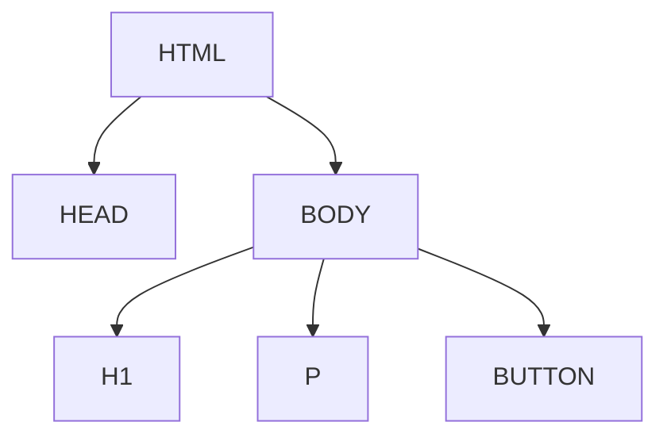

## 12.1 Introduction to TypeScript in the Browser

Welcome to the exciting world of web development with TypeScript! In this section, we will explore how TypeScript can be used to interact with the Document Object Model (DOM) in the browser. This is a crucial skill for anyone looking to build dynamic, interactive web applications. Let's dive in!

### Understanding TypeScript in the Browser

TypeScript is a superset of JavaScript, which means it builds on JavaScript by adding static types. This helps catch errors early and makes your code more robust. However, browsers do not understand TypeScript directly. They only understand JavaScript. So, how does TypeScript code run in the browser?

#### The TypeScript Compiler

The TypeScript compiler (`tsc`) is a tool that converts TypeScript code into JavaScript. This process is known as transpilation. Once transpiled, the JavaScript code can be executed by any modern web browser. Here's a simple flow of how this works:

1. **Write TypeScript Code**: You write your code in TypeScript, leveraging its features like static typing and interfaces.
2. **Compile to JavaScript**: Use the TypeScript compiler to transpile your TypeScript code into JavaScript.
3. **Run in Browser**: The resulting JavaScript code is included in your HTML file and executed by the browser.

### Introducing the Document Object Model (DOM)

The Document Object Model (DOM) is a programming interface for web documents. It represents the page so that programs can change the document structure, style, and content. The DOM is a tree-like structure where each node represents a part of the document.

#### Significance of the DOM

The DOM is significant because it allows developers to create dynamic and interactive web pages. By manipulating the DOM, you can change the content and structure of a webpage without having to reload the entire page. This is the foundation of modern web applications, enabling features like dynamic content updates, animations, and user interactions.

### Setting Up TypeScript for DOM Manipulation

To start using TypeScript in the browser, you need to set up your development environment. This involves installing TypeScript and configuring your project to include DOM type definitions.

#### Step 1: Install TypeScript

First, ensure you have Node.js installed on your machine. Then, install TypeScript globally using npm (Node Package Manager):

```bash
npm install -g typescript
```

#### Step 2: Create a TypeScript Project

Create a new directory for your project and navigate into it:

```bash
mkdir my-typescript-project
cd my-typescript-project
```

Initialize a new TypeScript project:

```bash
tsc --init
```

This command creates a `tsconfig.json` file, which is used to configure the TypeScript compiler.

#### Step 3: Include DOM Type Definitions

TypeScript includes built-in type definitions for the DOM, which means you can use TypeScript to interact with the DOM without any additional setup. These type definitions are part of the TypeScript standard library.

### A Simple TypeScript Script for DOM Manipulation

Let's create a simple TypeScript script that manipulates the DOM. We'll create a button that, when clicked, changes the text of a paragraph.

#### Step 1: Create an HTML File

Create an `index.html` file with the following content:

```html
<!DOCTYPE html>
<html lang="en">
<head>
    <meta charset="UTF-8">
    <meta name="viewport" content="width=device-width, initial-scale=1.0">
    <title>TypeScript DOM Manipulation</title>
</head>
<body>
    <h1>Welcome to TypeScript DOM Manipulation</h1>
    <p id="text">This is a sample paragraph.</p>
    <button id="changeTextButton">Change Text</button>

    <script src="dist/bundle.js"></script>
</body>
</html>
```

#### Step 2: Write TypeScript Code

Create a `main.ts` file with the following TypeScript code:

```typescript
// Select the paragraph and button elements
const paragraph = document.getElementById('text') as HTMLParagraphElement;
const button = document.getElementById('changeTextButton') as HTMLButtonElement;

// Function to change the text of the paragraph
function changeText(): void {
    paragraph.textContent = 'The text has been changed!';
}

// Add an event listener to the button
button.addEventListener('click', changeText);
```

**Explanation:**

- We use `document.getElementById` to select the paragraph and button elements. The `as` keyword is used for type assertions, telling TypeScript that these elements are of specific types (`HTMLParagraphElement` and `HTMLButtonElement`).
- We define a function `changeText` that changes the text content of the paragraph.
- We add an event listener to the button that calls the `changeText` function when the button is clicked.

#### Step 3: Compile TypeScript to JavaScript

Compile your TypeScript code to JavaScript:

```bash
tsc main.ts --outDir dist
```

This command compiles `main.ts` into JavaScript and outputs it to the `dist` directory.

### The Role of Bundlers and Module Loaders

In modern web development, applications often consist of multiple JavaScript files. Managing these files manually can be cumbersome. This is where bundlers and module loaders come in.

#### Bundlers

A bundler is a tool that combines multiple JavaScript files into a single file (or a few files) for inclusion in an HTML document. Popular bundlers include Webpack, Parcel, and Rollup.

#### Module Loaders

Module loaders, like SystemJS, dynamically load JavaScript modules in the browser. They allow you to use the ES6 module syntax (`import` and `export`) in your code.

For our simple example, we used the `--outDir` option to specify the output directory for the compiled JavaScript. In larger projects, you would typically use a bundler like Webpack to manage your TypeScript and JavaScript files.

### Try It Yourself

Now that you've seen a simple example, try modifying the code to enhance your understanding. Here are a few suggestions:

- **Change the Button Text**: Modify the button text to something more descriptive.
- **Add More Elements**: Add more paragraphs and buttons, and write functions to manipulate them.
- **Style the Elements**: Use CSS to style the elements and make the page more visually appealing.

### Visualizing the DOM Structure

To better understand how the DOM is structured, let's visualize it using a Mermaid.js diagram. This will help you see how elements are nested within each other.



**Diagram Explanation:**

- The `HTML` element is the root of the document.
- The `HEAD` and `BODY` elements are children of `HTML`.
- The `H1`, `P`, and `BUTTON` elements are children of `BODY`.

### Key Takeaways

- **TypeScript in the Browser**: TypeScript code must be compiled to JavaScript to run in the browser.
- **DOM Manipulation**: The DOM is a tree-like structure that represents the document, allowing for dynamic content updates.
- **TypeScript and the DOM**: TypeScript includes built-in type definitions for the DOM, making it easy to manipulate DOM elements.
- **Bundlers and Module Loaders**: These tools help manage multiple JavaScript files and dependencies in larger projects.

### Further Reading

To deepen your understanding of TypeScript and the DOM, consider exploring the following resources:

- [MDN Web Docs: Introduction to the DOM](https://developer.mozilla.org/en-US/docs/Web/API/Document_Object_Model/Introduction)
- [TypeScript Handbook: The Basics](https://www.typescriptlang.org/docs/handbook/2/basic-types.html)
- [Webpack Documentation](https://webpack.js.org/concepts/)

## Quiz Time!



### What is the role of the TypeScript compiler?

- [x] To convert TypeScript code into JavaScript
- [ ] To execute TypeScript code directly in the browser
- [ ] To compile JavaScript into TypeScript
- [ ] To manage HTML and CSS files

> **Explanation:** The TypeScript compiler transpiles TypeScript code into JavaScript, which can then be run in the browser.

### What does the DOM represent?

- [x] The structure of a web document
- [ ] The styling of a web document
- [ ] The server-side logic of a web application
- [ ] The database schema of a web application

> **Explanation:** The DOM represents the structure of a web document, allowing for dynamic manipulation of its elements.

### How do you select an element by its ID in TypeScript?

- [x] `document.getElementById('elementId')`
- [ ] `document.querySelector('#elementId')`
- [ ] `document.getElementByClassName('elementId')`
- [ ] `document.getElementByTagName('elementId')`

> **Explanation:** `document.getElementById('elementId')` is used to select an element by its ID.

### What is the purpose of a bundler in web development?

- [x] To combine multiple JavaScript files into a single file
- [ ] To compile TypeScript into JavaScript
- [ ] To manage HTML and CSS files
- [ ] To execute JavaScript code in the server

> **Explanation:** A bundler combines multiple JavaScript files into a single file for easier inclusion in an HTML document.

### Which of the following is a popular JavaScript bundler?

- [x] Webpack
- [ ] Node.js
- [ ] Express
- [ ] MongoDB

> **Explanation:** Webpack is a popular JavaScript bundler used to manage and bundle JavaScript files.

### What is the `as` keyword used for in TypeScript?

- [x] For type assertions
- [ ] For declaring variables
- [ ] For importing modules
- [ ] For creating classes

> **Explanation:** The `as` keyword is used for type assertions, telling TypeScript the specific type of a variable.

### What does the `addEventListener` method do?

- [x] Attaches an event handler to an element
- [ ] Removes an event handler from an element
- [ ] Changes the content of an element
- [ ] Styles an element

> **Explanation:** `addEventListener` attaches an event handler to an element, allowing it to respond to events like clicks.

### What is the output directory specified by the `--outDir` option in the TypeScript compiler?

- [x] The directory where compiled JavaScript files are placed
- [ ] The directory where TypeScript source files are located
- [ ] The directory where HTML files are stored
- [ ] The directory where CSS files are saved

> **Explanation:** The `--outDir` option specifies the directory where compiled JavaScript files are placed.

### Why do we need to compile TypeScript to JavaScript?

- [x] Because browsers only understand JavaScript
- [ ] Because TypeScript is slower than JavaScript
- [ ] Because TypeScript is not secure
- [ ] Because JavaScript is more readable

> **Explanation:** Browsers only understand JavaScript, so TypeScript must be compiled to JavaScript to run in the browser.

### True or False: TypeScript can directly manipulate the DOM without compilation.

- [ ] True
- [x] False

> **Explanation:** False. TypeScript must be compiled to JavaScript before it can manipulate the DOM in the browser.


