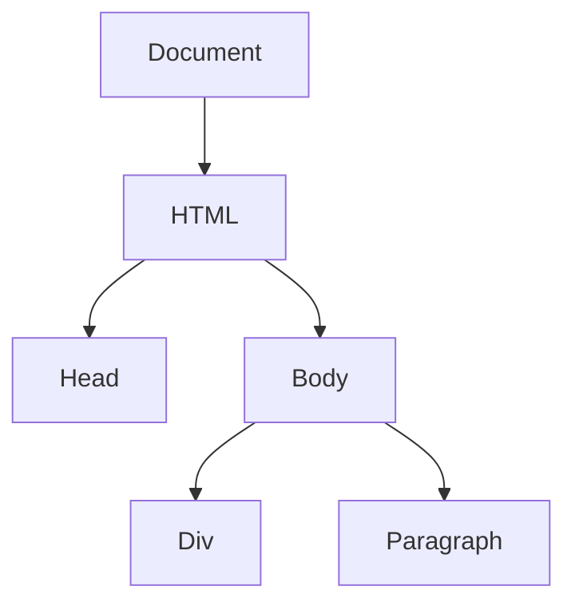

## 12.2 Selecting and Manipulating DOM Elements

In this section, we will explore how to select and manipulate DOM (Document Object Model) elements using TypeScript. By the end of this chapter, you'll be able to safely and effectively interact with the DOM, leveraging TypeScript's type system to minimize errors and enhance code quality.

### Understanding the DOM

Before we dive into the specifics of selecting and manipulating DOM elements, let's briefly review what the DOM is. The DOM is a programming interface for web documents. It represents the page so that programs can change the document structure, style, and content. The DOM represents the document as a tree of nodes, where each node is an object representing a part of the document.



*Figure 1: Simplified DOM Tree Structure*

### Selecting DOM Elements

To manipulate the DOM, we first need to select the elements we want to work with. There are several methods available in the DOM API for selecting elements:

1. **`getElementById`**: Selects a single element by its ID.
2. **`getElementsByClassName`**: Selects all elements with a given class name.
3. **`getElementsByTagName`**: Selects all elements with a given tag name.
4. **`querySelector`**: Selects the first element that matches a CSS selector.
5. **`querySelectorAll`**: Selects all elements that match a CSS selector.

#### Using `getElementById`

The `getElementById` method is one of the most common ways to select a single element. It returns an `HTMLElement` or `null` if no element with the specified ID exists.

```typescript
const element = document.getElementById('myElement');
if (element) {
    // Safe to manipulate the element
    element.style.color = 'blue';
} else {
    console.error('Element not found');
}
```

**Key Points:**
- Always check if the element is `null` before manipulating it to avoid runtime errors.
- Use `HTMLElement` type for the variable to ensure type safety.

#### Using `querySelector`

The `querySelector` method is more flexible as it allows you to use CSS selectors to find elements. It returns the first element that matches the selector or `null` if no match is found.

```typescript
const button = document.querySelector<HTMLButtonElement>('.submit-button');
if (button) {
    button.disabled = true;
} else {
    console.error('Button not found');
}
```

**Key Points:**
- Use type assertions (`<HTMLButtonElement>`) to specify the expected type of the element.
- This helps TypeScript understand the specific properties available on the element.

#### Using `querySelectorAll`

When you need to select multiple elements, `querySelectorAll` is your go-to method. It returns a `NodeList` of all elements matching the selector.

```typescript
const items = document.querySelectorAll('.list-item');
items.forEach(item => {
    (item as HTMLElement).style.backgroundColor = 'lightgrey';
});
```

**Key Points:**
- `NodeList` is not an array, but you can iterate over it using `forEach`.
- Use type assertions to specify the type of each element in the list.

### Typing Returned Elements

When selecting elements, it's crucial to type them correctly to leverage TypeScript's type system. This ensures that you only access properties and methods that exist on the element.

#### Using Type Assertions

Type assertions are a way to tell TypeScript what type you expect a variable to be. This is particularly useful when using `querySelector` or `querySelectorAll`.

```typescript
const input = document.querySelector('input[name="username"]') as HTMLInputElement;
input.value = 'JohnDoe';
```

**Key Points:**
- Type assertions do not perform any runtime checks; they only affect the TypeScript compiler.
- Use them when you are certain about the element type.

#### Handling Null Values

Since methods like `getElementById` and `querySelector` can return `null`, it's important to handle this possibility to avoid runtime errors.

```typescript
const header = document.getElementById('header');
if (header !== null) {
    header.textContent = 'Welcome!';
} else {
    console.warn('Header element is missing');
}
```

**Key Points:**
- Always check for `null` before accessing properties or methods on the element.
- Use conditional statements to handle cases where the element might not exist.

### Manipulating DOM Elements

Once you've selected the elements, you can manipulate them in various ways, such as changing their properties, attributes, styles, and content.

#### Changing Element Properties

You can change properties like `textContent`, `innerHTML`, and `value` to update the content of an element.

```typescript
const paragraph = document.querySelector('p');
if (paragraph) {
    paragraph.textContent = 'This is the updated text content.';
}
```

**Key Points:**
- Use `textContent` to set or get the text content of an element.
- `innerHTML` can be used for HTML content, but be cautious of security risks like XSS (Cross-Site Scripting).

#### Modifying Element Styles

You can modify the styles of an element using the `style` property.

```typescript
const box = document.querySelector('.box');
if (box) {
    box.style.width = '200px';
    box.style.height = '200px';
    box.style.backgroundColor = 'red';
}
```

**Key Points:**
- Use camelCase for CSS properties in JavaScript/TypeScript (e.g., `backgroundColor`).
- Directly setting styles can lead to inline styles, which might override CSS classes.

#### Adding and Removing Classes

Manipulating classes is a common task when working with the DOM. You can use `classList` to add, remove, or toggle classes.

```typescript
const menu = document.querySelector('.menu');
if (menu) {
    menu.classList.add('active');
    menu.classList.remove('inactive');
    menu.classList.toggle('visible');
}
```

**Key Points:**
- `classList` provides methods like `add`, `remove`, and `toggle` for class manipulation.
- This approach is cleaner and more efficient than manually concatenating class strings.

#### Setting Attributes

You can set or remove attributes using `setAttribute` and `removeAttribute`.

```typescript
const link = document.querySelector('a');
if (link) {
    link.setAttribute('href', 'https://example.com');
    link.removeAttribute('target');
}
```

**Key Points:**
- Use `setAttribute` to add or update attributes on an element.
- `removeAttribute` is used to remove an attribute from an element.

### Best Practices for DOM Manipulation

To ensure your code is robust and maintainable, follow these best practices:

1. **Check for `null`**: Always check if an element is `null` before manipulating it to prevent runtime errors.

2. **Use Type Assertions Sparingly**: Only use type assertions when you are certain about the element type. Overuse can lead to errors if the assumptions are incorrect.

3. **Avoid Inline Styles**: Whenever possible, use CSS classes instead of inline styles to maintain separation of concerns.

4. **Be Cautious with `innerHTML`**: Avoid using `innerHTML` to insert user-generated content to prevent XSS attacks.

5. **Leverage TypeScript's Type System**: Use TypeScript's type system to catch errors at compile time, reducing the likelihood of runtime errors.

### Try It Yourself

Let's put what we've learned into practice. Try modifying the following code to change the background color of all paragraphs to blue when a button is clicked.

```typescript
document.querySelector('button')?.addEventListener('click', () => {
    const paragraphs = document.querySelectorAll('p');
    paragraphs.forEach(paragraph => {
        (paragraph as HTMLElement).style.backgroundColor = 'blue';
    });
});
```

**Challenge:**
- Add a class to each paragraph instead of changing the style directly.
- Ensure the button is not `null` before adding the event listener.

### Summary

In this section, we've explored how to select and manipulate DOM elements using TypeScript. By understanding how to type elements correctly and handle potential `null` values, you can write safer and more reliable code. Remember to follow best practices to avoid common pitfalls and ensure your code is maintainable.

## Quiz Time!



### Which method is used to select an element by its ID?

- [x] `getElementById`
- [ ] `querySelector`
- [ ] `getElementsByClassName`
- [ ] `querySelectorAll`

> **Explanation:** `getElementById` is used to select an element by its ID.

### What does `querySelector` return if no match is found?

- [x] `null`
- [ ] `undefined`
- [ ] An empty string
- [ ] An empty array

> **Explanation:** `querySelector` returns `null` if no element matches the selector.

### How do you specify the type of an element returned by `querySelector`?

- [x] Using type assertions
- [ ] Using `typeof`
- [ ] Using `instanceof`
- [ ] Using `typeof`

> **Explanation:** Type assertions are used to specify the expected type of an element.

### What should you check before manipulating a DOM element?

- [x] If the element is `null`
- [ ] If the element is `undefined`
- [ ] If the element is an object
- [ ] If the element is a string

> **Explanation:** Always check if the element is `null` to avoid runtime errors.

### Which property is used to change the text content of an element?

- [x] `textContent`
- [ ] `innerHTML`
- [ ] `outerHTML`
- [ ] `innerText`

> **Explanation:** `textContent` is used to change the text content of an element.

### What is the risk of using `innerHTML` with user-generated content?

- [x] XSS attacks
- [ ] Memory leaks
- [ ] Slow performance
- [ ] Type errors

> **Explanation:** Using `innerHTML` with user-generated content can lead to XSS attacks.

### How can you add a class to an element?

- [x] Using `classList.add()`
- [ ] Using `setAttribute()`
- [ ] Using `className =`
- [ ] Using `style.class =`

> **Explanation:** `classList.add()` is used to add a class to an element.

### What does `querySelectorAll` return?

- [x] A `NodeList`
- [ ] An `Array`
- [ ] An `Object`
- [ ] A `String`

> **Explanation:** `querySelectorAll` returns a `NodeList` of matching elements.

### Which method is used to remove an attribute from an element?

- [x] `removeAttribute`
- [ ] `setAttribute`
- [ ] `deleteAttribute`
- [ ] `clearAttribute`

> **Explanation:** `removeAttribute` is used to remove an attribute from an element.

### True or False: Type assertions perform runtime checks.

- [ ] True
- [x] False

> **Explanation:** Type assertions do not perform runtime checks; they only affect the TypeScript compiler.


