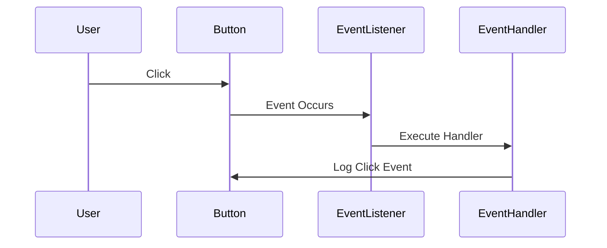

## 12.3 Handling Events

In web development, events are actions or occurrences that happen in the browser, such as a user clicking a button, submitting a form, or pressing a key. Handling these events effectively is crucial for creating interactive and dynamic web applications. In this section, we'll explore how to handle events in TypeScript, focusing on attaching event listeners, typing event callbacks, and managing user interactions with properly typed event objects.

### Understanding Event Handling in the Browser

Event handling in the browser involves listening for specific events and executing a function, known as an event handler, when those events occur. This process allows us to respond to user interactions and update the user interface accordingly.

#### The Event Object

When an event occurs, the browser creates an event object containing information about the event, such as the type of event, the target element, and any additional data related to the event. This event object is passed to the event handler function, allowing us to access and manipulate event details.

### Adding Event Listeners

To handle events in TypeScript, we need to attach event listeners to DOM elements. An event listener is a function that waits for a specific event to occur on a target element. When the event occurs, the listener executes the associated event handler function.

#### Example: Adding a Click Event Listener

Let's start by adding a click event listener to a button element. We'll use TypeScript to ensure proper typing and error prevention.

```typescript
// Select the button element
const button = document.getElementById('myButton') as HTMLButtonElement;

// Define the event handler function
function handleClick(event: MouseEvent): void {
  console.log('Button clicked!', event);
}

// Attach the event listener to the button
button.addEventListener('click', handleClick);
```

In this example, we select a button element with the ID `myButton` and attach a click event listener to it. The `handleClick` function is executed whenever the button is clicked. We specify the type of the event parameter as `MouseEvent` to ensure proper typing.

### Typing Event Callbacks

Typing event callbacks in TypeScript is essential for leveraging the full power of TypeScript's type system. By specifying the correct event type, we gain access to event-specific properties and methods, improving code quality and reducing errors.

#### Common Event Types and Interfaces

TypeScript provides several interfaces for common event types, each with its own set of properties and methods. Here are some of the most frequently used event types:

- **MouseEvent**: Represents events related to mouse actions, such as clicks, double-clicks, and mouse movements.
- **KeyboardEvent**: Represents events related to keyboard actions, such as key presses and releases.
- **FocusEvent**: Represents events related to focus changes, such as when an element gains or loses focus.
- **InputEvent**: Represents events related to input changes, such as when a user types in a text field.

#### Example: Typing a Keyboard Event

Let's look at an example of handling a keyboard event with proper typing.

```typescript
// Select the input element
const input = document.getElementById('myInput') as HTMLInputElement;

// Define the event handler function
function handleKeyPress(event: KeyboardEvent): void {
  console.log('Key pressed:', event.key);
}

// Attach the event listener to the input
input.addEventListener('keydown', handleKeyPress);
```

In this example, we select an input element with the ID `myInput` and attach a keydown event listener to it. The `handleKeyPress` function logs the key pressed by the user. We specify the type of the event parameter as `KeyboardEvent` to access keyboard-specific properties like `event.key`.

### Event Delegation

Event delegation is a technique that allows us to manage events efficiently by attaching a single event listener to a parent element instead of multiple listeners to each child element. This approach is particularly useful when dealing with dynamic content or large numbers of elements.

#### Example: Using Event Delegation

Consider a list of items where we want to handle click events on each item. Instead of attaching a click event listener to each item, we can use event delegation to attach a single listener to the parent list element.

```typescript
// Select the list element
const list = document.getElementById('myList') as HTMLUListElement;

// Define the event handler function
function handleItemClick(event: MouseEvent): void {
  const target = event.target as HTMLElement;
  if (target.tagName === 'LI') {
    console.log('List item clicked:', target.textContent);
  }
}

// Attach the event listener to the list
list.addEventListener('click', handleItemClick);
```

In this example, we attach a click event listener to the parent list element with the ID `myList`. The `handleItemClick` function checks if the clicked target is a list item (`LI`) and logs its text content. This approach reduces the number of event listeners and improves performance.

### Removing Event Listeners

In some cases, we may need to remove event listeners to prevent memory leaks or unwanted behavior. TypeScript allows us to remove event listeners using the `removeEventListener` method.

#### Example: Removing an Event Listener

Let's modify our previous example to remove the click event listener from the button after it is clicked.

```typescript
// Select the button element
const button = document.getElementById('myButton') as HTMLButtonElement;

// Define the event handler function
function handleClick(event: MouseEvent): void {
  console.log('Button clicked!', event);
  button.removeEventListener('click', handleClick);
}

// Attach the event listener to the button
button.addEventListener('click', handleClick);
```

In this example, we call `removeEventListener` within the `handleClick` function to remove the click event listener from the button after it is clicked once.

### Encouraging Proper Typing

Proper typing of event objects in TypeScript is crucial for several reasons:

1. **Improved IDE Support**: With proper typing, IDEs can provide better autocompletion, documentation, and error checking, making development more efficient.
2. **Error Prevention**: Typing helps catch errors at compile time, reducing runtime issues and improving code reliability.
3. **Code Readability**: Typed code is often more readable and self-documenting, making it easier for others to understand and maintain.

### Try It Yourself

Experiment with the examples provided in this section by making the following modifications:

- Add a new button to the page and attach a double-click event listener to it.
- Modify the list example to handle right-click events on list items.
- Create a form with input fields and attach focus and blur event listeners to each field.

### Visualizing Event Handling

To better understand event handling, let's visualize the process using a Mermaid.js diagram. This diagram illustrates the flow of attaching and handling a click event on a button element.



This sequence diagram shows the interaction between the user, button, event listener, and event handler during a click event. The user clicks the button, triggering the event listener, which executes the event handler function.

### Summary

In this section, we've explored how to handle events in TypeScript by attaching event listeners, typing event callbacks, and managing user interactions with properly typed event objects. We've covered common event types, event delegation, and the importance of proper typing for better code quality. By following these practices, you can create interactive and dynamic web applications with confidence.

---

## Quiz Time!



### What is the purpose of an event listener in the browser?

- [x] To wait for a specific event to occur on a target element and execute a function when it does
- [ ] To modify the DOM structure directly
- [ ] To create new HTML elements dynamically
- [ ] To handle server-side logic

> **Explanation:** An event listener waits for a specific event to occur on a target element and executes a function, known as an event handler, when that event occurs.

### Which TypeScript interface is used to type a click event?

- [ ] KeyboardEvent
- [x] MouseEvent
- [ ] FocusEvent
- [ ] InputEvent

> **Explanation:** The `MouseEvent` interface is used to type events related to mouse actions, such as clicks.

### How can you remove an event listener in TypeScript?

- [ ] By setting the event handler to `null`
- [x] By using the `removeEventListener` method
- [ ] By deleting the target element
- [ ] By using the `detachEvent` method

> **Explanation:** The `removeEventListener` method is used to remove an event listener from a target element.

### What is event delegation?

- [ ] Attaching multiple event listeners to each child element
- [x] Attaching a single event listener to a parent element to manage events for its children
- [ ] Using inline event handlers in HTML
- [ ] Removing event listeners from all child elements

> **Explanation:** Event delegation involves attaching a single event listener to a parent element to manage events for its children, improving performance and efficiency.

### Why is proper typing of event objects important in TypeScript?

- [x] It improves IDE support and error prevention
- [ ] It increases the size of the codebase
- [x] It enhances code readability and maintainability
- [ ] It makes the code run faster

> **Explanation:** Proper typing improves IDE support, error prevention, and code readability, making development more efficient and reliable.

### Which method is used to attach an event listener to a DOM element?

- [ ] `attachEventListener`
- [x] `addEventListener`
- [ ] `bindEventListener`
- [ ] `setEventListener`

> **Explanation:** The `addEventListener` method is used to attach an event listener to a DOM element.

### What property of the `KeyboardEvent` interface provides the key pressed by the user?

- [ ] `event.code`
- [ ] `event.which`
- [x] `event.key`
- [ ] `event.charCode`

> **Explanation:** The `event.key` property of the `KeyboardEvent` interface provides the key pressed by the user.

### Which event type is used to handle changes in input fields?

- [ ] MouseEvent
- [ ] KeyboardEvent
- [ ] FocusEvent
- [x] InputEvent

> **Explanation:** The `InputEvent` type is used to handle changes in input fields.

### What is the purpose of the event object in event handling?

- [ ] To store data in the browser's local storage
- [x] To provide information about the event, such as type and target
- [ ] To create new event listeners automatically
- [ ] To modify the CSS styles of elements

> **Explanation:** The event object provides information about the event, such as its type and target, allowing us to access and manipulate event details.

### True or False: In event delegation, each child element must have its own event listener.

- [ ] True
- [x] False

> **Explanation:** False. In event delegation, a single event listener is attached to a parent element to manage events for its children, reducing the number of listeners needed.


