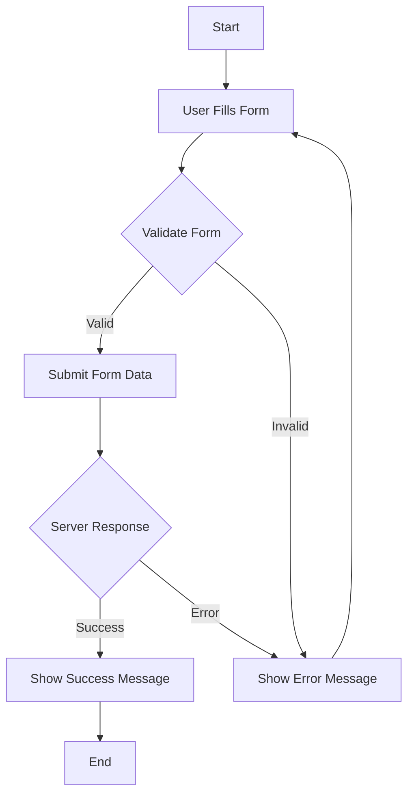

## 12.4 Working with Forms

Forms are a fundamental part of web applications, allowing users to input and submit data. In this section, we will explore how to work with forms using TypeScript, focusing on accessing form elements, validating data, handling submission events, and providing user feedback. By the end of this guide, you'll have a solid understanding of how to manage forms effectively in your TypeScript projects.

### Accessing Form Elements and Their Values

To work with forms, we must first understand how to access form elements and retrieve their values. TypeScript, with its static typing, helps ensure that we handle form elements correctly.

#### Accessing Form Elements

Let's start by accessing form elements using TypeScript. Consider a simple HTML form with a text input and a submit button:

```html
<form id="userForm">
  <label for="username">Username:</label>
  <input type="text" id="username" name="username" />
  <button type="submit">Submit</button>
</form>
```

To access the form and its elements in TypeScript, we can use the `document.getElementById` method. Here's how:

```typescript
const form = document.getElementById('userForm') as HTMLFormElement;
const usernameInput = document.getElementById('username') as HTMLInputElement;

if (form && usernameInput) {
  console.log('Form and input elements are accessible.');
}
```

In this example, we use type assertions (`as HTMLFormElement` and `as HTMLInputElement`) to inform TypeScript about the specific types of the elements we're working with. This helps us avoid type errors and leverage TypeScript's type-checking capabilities.

#### Retrieving Input Values

Once we have access to the form elements, we can retrieve their values. Here's how to get the value of the `username` input field:

```typescript
const usernameValue = usernameInput.value;
console.log(`Username: ${usernameValue}`);
```

This simple approach allows us to access and manipulate form data using TypeScript.

### Form Validation Techniques Using TypeScript

Form validation is crucial for ensuring that users provide valid and complete data. TypeScript can help us implement robust validation logic with its type system and error-checking capabilities.

#### Basic Validation

Let's implement basic validation for our form. We'll check if the username field is not empty before allowing submission:

```typescript
form.addEventListener('submit', (event) => {
  event.preventDefault(); // Prevent default form submission

  const usernameValue = usernameInput.value.trim();

  if (!usernameValue) {
    alert('Username is required.');
    return;
  }

  console.log('Form submitted successfully.');
});
```

In this example, we prevent the default form submission behavior using `event.preventDefault()`. We then check if the `usernameValue` is empty and display an alert if it is. This ensures that the user provides a username before the form is submitted.

#### Advanced Validation

For more complex validation, we can use regular expressions or custom logic. Suppose we want to ensure that the username contains only alphanumeric characters:

```typescript
const usernamePattern = /^[a-zA-Z0-9]+$/;

if (!usernamePattern.test(usernameValue)) {
  alert('Username must contain only alphanumeric characters.');
  return;
}
```

By using regular expressions, we can enforce specific patterns and rules for form inputs.

### Handling Form Submission Events

Handling form submission events is a key aspect of working with forms. Let's explore how to manage these events using TypeScript.

#### Listening for Form Submissions

We can listen for form submission events using the `addEventListener` method. Here's how:

```typescript
form.addEventListener('submit', (event) => {
  event.preventDefault(); // Prevent default form submission

  // Perform validation and other logic here
});
```

By attaching an event listener to the form, we can intercept the submission event and execute custom logic, such as validation or data processing.

#### Submitting Form Data

Once the form data is validated, we can proceed with submission. In a real-world application, this often involves sending the data to a server. Here's a simple example using the `fetch` API:

```typescript
const submitFormData = async (data: { username: string }) => {
  try {
    const response = await fetch('/submit', {
      method: 'POST',
      headers: {
        'Content-Type': 'application/json',
      },
      body: JSON.stringify(data),
    });

    if (!response.ok) {
      throw new Error('Failed to submit form data.');
    }

    console.log('Form data submitted successfully.');
  } catch (error) {
    console.error('Error:', error);
  }
};

form.addEventListener('submit', (event) => {
  event.preventDefault();

  const usernameValue = usernameInput.value.trim();

  if (!usernameValue) {
    alert('Username is required.');
    return;
  }

  submitFormData({ username: usernameValue });
});
```

In this example, we define an `async` function `submitFormData` that sends the form data to a server endpoint using the `fetch` API. We handle errors using a `try-catch` block and log success or error messages accordingly.

### Preventing Default Form Submission Behavior

Preventing the default form submission behavior is essential when we want to handle submissions programmatically. We've already seen how to do this using `event.preventDefault()`. Let's explore why this is important.

#### Why Prevent Default Behavior?

By default, submitting a form causes the browser to reload the page, which can interrupt the user experience. By preventing this behavior, we gain control over the submission process, allowing us to validate data, display feedback, and submit data asynchronously without refreshing the page.

### Best Practices for User Feedback and Error Messages

Providing clear user feedback and error messages is crucial for a positive user experience. Let's discuss some best practices for achieving this.

#### Displaying Error Messages

When validation fails, it's important to inform the user about the issue. Instead of using `alert`, consider displaying error messages near the relevant form fields:

```typescript
const showError = (message: string) => {
  const errorElement = document.createElement('div');
  errorElement.className = 'error-message';
  errorElement.textContent = message;
  form.insertBefore(errorElement, form.firstChild);
};

form.addEventListener('submit', (event) => {
  event.preventDefault();

  const usernameValue = usernameInput.value.trim();

  // Clear previous error messages
  const previousError = form.querySelector('.error-message');
  if (previousError) {
    previousError.remove();
  }

  if (!usernameValue) {
    showError('Username is required.');
    return;
  }

  if (!usernamePattern.test(usernameValue)) {
    showError('Username must contain only alphanumeric characters.');
    return;
  }

  submitFormData({ username: usernameValue });
});
```

In this example, we create a `showError` function that displays error messages near the form. We also ensure that previous error messages are cleared before displaying new ones.

#### Providing Success Feedback

When the form is submitted successfully, provide positive feedback to the user. This could be a success message or a visual indicator:

```typescript
const showSuccess = () => {
  const successElement = document.createElement('div');
  successElement.className = 'success-message';
  successElement.textContent = 'Form submitted successfully!';
  form.insertBefore(successElement, form.firstChild);
};

form.addEventListener('submit', (event) => {
  event.preventDefault();

  const usernameValue = usernameInput.value.trim();

  // Clear previous messages
  const previousError = form.querySelector('.error-message');
  if (previousError) {
    previousError.remove();
  }
  const previousSuccess = form.querySelector('.success-message');
  if (previousSuccess) {
    previousSuccess.remove();
  }

  if (!usernameValue) {
    showError('Username is required.');
    return;
  }

  if (!usernamePattern.test(usernameValue)) {
    showError('Username must contain only alphanumeric characters.');
    return;
  }

  submitFormData({ username: usernameValue });
  showSuccess();
});
```

By providing both error and success feedback, we enhance the user experience and make our forms more user-friendly.

### Try It Yourself

Now that we've covered the basics of working with forms in TypeScript, it's time to experiment. Here are some suggestions for modifying the code examples:

- **Add More Fields**: Extend the form with additional input fields, such as email or password, and implement validation for each.
- **Style the Messages**: Use CSS to style the error and success messages for a more polished look.
- **Enhance Validation**: Implement more advanced validation logic, such as checking for a minimum password length or a valid email format.
- **Handle Server Responses**: Modify the `submitFormData` function to handle different server responses, such as displaying a message if the username is already taken.

### Visual Aids

To better understand the flow of form handling, let's visualize the process using a flowchart:



This flowchart illustrates the typical flow of form handling, from user input to validation, submission, and feedback.

### References and Links

For further reading and deeper dives into form handling and validation, consider exploring the following resources:

- [MDN Web Docs: FormData](https://developer.mozilla.org/en-US/docs/Web/API/FormData)
- [MDN Web Docs: Constraint Validation](https://developer.mozilla.org/en-US/docs/Web/Guide/HTML/Constraint_validation)
- [W3Schools: HTML Forms](https://www.w3schools.com/html/html_forms.asp)

### Engagement and Reinforcement

To reinforce your understanding, try answering these questions:

- How can you access a form element using TypeScript?
- What is the purpose of `event.preventDefault()` in form handling?
- How can you provide user feedback when a form submission is successful?

### Summary

In this section, we've explored how to work with forms using TypeScript. We covered accessing form elements, validating data, handling submission events, preventing default behavior, and providing user feedback. By following these best practices, you can create robust and user-friendly forms in your TypeScript applications.

---

## Quiz Time!



### What method is used to prevent the default form submission behavior?

- [x] `event.preventDefault()`
- [ ] `event.stopPropagation()`
- [ ] `event.preventSubmission()`
- [ ] `event.cancelDefault()`

> **Explanation:** `event.preventDefault()` is used to prevent the default action of an event, such as form submission.

### How can you access a form element in TypeScript?

- [x] Using `document.getElementById` with type assertions
- [ ] Using `document.querySelector` without type assertions
- [ ] Using `document.getElementsByClassName`
- [ ] Using `document.getElementsByTagName`

> **Explanation:** `document.getElementById` with type assertions is a common way to access form elements in TypeScript.

### What is a common way to provide user feedback for form validation errors?

- [x] Displaying error messages near the form fields
- [ ] Using console logs
- [ ] Sending an email to the user
- [ ] Redirecting to an error page

> **Explanation:** Displaying error messages near the form fields is a user-friendly way to provide feedback.

### What is the purpose of form validation?

- [x] To ensure users provide valid and complete data
- [ ] To make forms look more attractive
- [ ] To prevent users from submitting forms
- [ ] To increase the website's loading speed

> **Explanation:** Form validation ensures that users provide valid and complete data before submission.

### Which method can be used to send form data to a server?

- [x] `fetch`
- [ ] `alert`
- [ ] `console.log`
- [ ] `document.write`

> **Explanation:** The `fetch` method is used to send HTTP requests, including form data, to a server.

### What is the advantage of using regular expressions in form validation?

- [x] To enforce specific patterns and rules for input fields
- [ ] To make the code more complex
- [ ] To slow down form processing
- [ ] To prevent any input from being submitted

> **Explanation:** Regular expressions allow us to enforce specific patterns and rules for form inputs.

### How can you clear previous error messages before displaying new ones?

- [x] By removing existing error elements from the DOM
- [ ] By hiding the form
- [ ] By refreshing the page
- [ ] By logging out the user

> **Explanation:** Removing existing error elements from the DOM ensures that only relevant error messages are displayed.

### What is a best practice for providing success feedback after form submission?

- [x] Displaying a success message or visual indicator
- [ ] Redirecting to a new page
- [ ] Doing nothing
- [ ] Sending a confirmation email

> **Explanation:** Displaying a success message or visual indicator provides positive feedback to the user.

### Why is it important to prevent the default form submission behavior?

- [x] To gain control over the submission process and enhance user experience
- [ ] To make the form submission slower
- [ ] To prevent any data from being submitted
- [ ] To increase server load

> **Explanation:** Preventing the default behavior allows us to handle submissions programmatically and improve user experience.

### True or False: TypeScript can help implement robust form validation logic with its type system.

- [x] True
- [ ] False

> **Explanation:** TypeScript's type system and error-checking capabilities help implement robust form validation logic.


