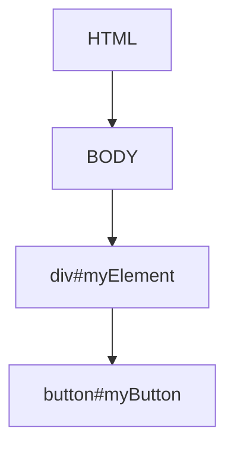

## 12.5 Manipulating CSS with TypeScript

In this section, we will explore how to manipulate CSS using TypeScript. As you may know, CSS (Cascading Style Sheets) is used to style HTML elements on a web page. With TypeScript, you can dynamically change these styles and classes, allowing for interactive and responsive web applications. Let's dive in!

### Modifying Inline Styles

Inline styles are CSS rules applied directly to an HTML element via the `style` attribute. TypeScript allows us to modify these styles programmatically using the `style` property of a DOM element.

#### Accessing the `style` Property

To modify an inline style, you first need to access the `style` property of a DOM element. Here's a simple example:

```typescript
// Select the element by its ID
const element = document.getElementById('myElement');

// Check if the element exists
if (element) {
  // Change the background color to blue
  element.style.backgroundColor = 'blue';
}
```

In this example, we select an element with the ID `myElement` and change its background color to blue. The `style` property provides access to various CSS properties, allowing you to modify them directly.

#### Commonly Used CSS Properties

Here are some common CSS properties you might want to modify:

- `color`: Changes the text color.
- `backgroundColor`: Changes the background color.
- `width`: Sets the width of the element.
- `height`: Sets the height of the element.
- `margin`: Sets the margin around the element.
- `padding`: Sets the padding inside the element.
- `border`: Sets the border around the element.

#### Example: Changing Multiple Styles

You can change multiple styles at once using the `style` property. Here's an example:

```typescript
if (element) {
  element.style.color = 'white';
  element.style.backgroundColor = 'black';
  element.style.padding = '10px';
  element.style.border = '2px solid red';
}
```

This example sets the text color to white, background color to black, padding to 10 pixels, and border to a 2-pixel solid red line.

### Managing CSS Classes with `classList`

While inline styles are useful for quick changes, using CSS classes is a more efficient and maintainable way to style elements. The `classList` property of a DOM element allows you to add, remove, and toggle CSS classes.

#### Adding and Removing Classes

To add or remove a class, you can use the `add` and `remove` methods of `classList`:

```typescript
if (element) {
  // Add a class
  element.classList.add('active');

  // Remove a class
  element.classList.remove('inactive');
}
```

In this example, we add the `active` class and remove the `inactive` class from the element.

#### Toggling Classes

The `toggle` method is useful for switching a class on and off:

```typescript
if (element) {
  // Toggle the 'highlight' class
  element.classList.toggle('highlight');
}
```

This will add the `highlight` class if it is not present, and remove it if it is.

#### Checking for a Class

You can check if an element has a specific class using the `contains` method:

```typescript
if (element) {
  if (element.classList.contains('active')) {
    console.log('Element is active');
  } else {
    console.log('Element is not active');
  }
}
```

### Dynamic Styling Based on User Interactions

TypeScript can be used to dynamically change styles based on user interactions, such as clicks or hover events. This can enhance the user experience by providing visual feedback.

#### Example: Changing Styles on Click

Let's create an example where we change the background color of an element when it's clicked:

```typescript
const button = document.getElementById('myButton');

if (button) {
  button.addEventListener('click', () => {
    if (element) {
      element.style.backgroundColor = element.style.backgroundColor === 'blue' ? 'green' : 'blue';
    }
  });
}
```

In this example, we add a click event listener to a button. When the button is clicked, it toggles the background color of `myElement` between blue and green.

#### Example: Hover Effects

You can also change styles on hover using mouse events:

```typescript
if (element) {
  element.addEventListener('mouseover', () => {
    element.style.backgroundColor = 'yellow';
  });

  element.addEventListener('mouseout', () => {
    element.style.backgroundColor = '';
  });
}
```

This example changes the background color to yellow when the mouse is over the element and reverts it when the mouse leaves.

### Considerations for CSS Specificity and Performance

When manipulating CSS, it's important to consider specificity and performance.

#### CSS Specificity

CSS specificity determines which styles are applied when multiple rules match an element. Inline styles have the highest specificity, followed by IDs, classes, and element selectors. Using classes is generally preferred over inline styles for maintainability and separation of concerns.

#### Performance Considerations

Frequent manipulation of styles can impact performance, especially in large applications. To optimize performance:

- **Batch Style Changes**: Apply multiple style changes at once to minimize reflows and repaints.
- **Use Classes**: Toggle classes instead of changing individual styles to leverage CSS rules.
- **Avoid Inline Styles**: Use inline styles sparingly and prefer CSS classes.

### Encouraging Separation of Concerns

Separation of concerns is a design principle that promotes organizing code into distinct sections, each handling a specific aspect of functionality. In web development, this means separating HTML, CSS, and JavaScript.

#### Using CSS Classes Over Inline Styles

Using CSS classes instead of inline styles promotes separation of concerns. It allows you to define styles in a stylesheet and apply them via classes, making your code more maintainable and reusable.

```css
/* styles.css */
.active {
  background-color: green;
  color: white;
}
```

```typescript
// TypeScript code
if (element) {
  element.classList.add('active');
}
```

By defining styles in a CSS file and applying them through TypeScript, you maintain a clean separation between style and behavior.

### Try It Yourself

Now that we've covered the basics, try experimenting with the code examples. Here are some ideas:

- Change the text color of an element when a button is clicked.
- Toggle multiple classes on an element based on different user interactions.
- Create a hover effect that changes the size of an element.

### Visual Aids

To better understand the DOM and CSS manipulation, let's look at a simple DOM tree diagram:



**Diagram Description**: This diagram represents a simple DOM structure with a `div` element having an ID `myElement` and a `button` element with an ID `myButton`.

### Summary

In this section, we learned how to manipulate CSS using TypeScript. We explored modifying inline styles, managing CSS classes, and dynamically changing styles based on user interactions. We also discussed the importance of CSS specificity, performance considerations, and the principle of separation of concerns.

### Additional Resources

For more information on CSS and DOM manipulation, check out these resources:

- [MDN Web Docs: CSS](https://developer.mozilla.org/en-US/docs/Web/CSS)
- [MDN Web Docs: DOM](https://developer.mozilla.org/en-US/docs/Web/API/Document_Object_Model)
- [W3Schools: CSS](https://www.w3schools.com/css/)

## Quiz Time!



### What is the `style` property used for in TypeScript?

- [x] To modify inline styles of a DOM element
- [ ] To add event listeners to a DOM element
- [ ] To create new DOM elements
- [ ] To remove a DOM element

> **Explanation:** The `style` property is used to access and modify the inline styles of a DOM element.

### Which method is used to add a CSS class to a DOM element?

- [ ] remove()
- [x] add()
- [ ] toggle()
- [ ] contains()

> **Explanation:** The `add()` method of `classList` is used to add a CSS class to a DOM element.

### How can you toggle a CSS class on a DOM element?

- [ ] add()
- [ ] remove()
- [x] toggle()
- [ ] contains()

> **Explanation:** The `toggle()` method of `classList` is used to toggle a CSS class on a DOM element.

### What is the purpose of the `contains()` method in `classList`?

- [ ] To add a class
- [ ] To remove a class
- [x] To check if a class is present
- [ ] To toggle a class

> **Explanation:** The `contains()` method checks if a specific class is present on a DOM element.

### Why is it recommended to use CSS classes over inline styles?

- [x] For better maintainability and separation of concerns
- [ ] Because inline styles are not supported in TypeScript
- [ ] To improve the performance of JavaScript code
- [ ] To avoid using the `style` property

> **Explanation:** Using CSS classes promotes separation of concerns and makes the code more maintainable and reusable.

### What is CSS specificity?

- [x] A rule that determines which CSS styles are applied when multiple rules match an element
- [ ] A method to add styles to a DOM element
- [ ] A way to toggle CSS classes
- [ ] A property of the `style` object

> **Explanation:** CSS specificity determines which styles are applied when multiple rules match an element.

### Which of the following is a performance consideration when manipulating CSS?

- [x] Batch style changes to minimize reflows and repaints
- [ ] Use inline styles for all elements
- [ ] Avoid using CSS classes
- [ ] Use the `style` property for all style changes

> **Explanation:** Batching style changes helps minimize reflows and repaints, improving performance.

### How can you change the background color of an element on a click event?

- [x] Use an event listener to modify the `style.backgroundColor` property
- [ ] Use the `contains()` method to check the class
- [ ] Use the `toggle()` method to change the class
- [ ] Use the `remove()` method to remove the class

> **Explanation:** An event listener can be used to change the `style.backgroundColor` property on a click event.

### What is the benefit of using the `toggle()` method?

- [x] It simplifies the process of adding and removing classes
- [ ] It only adds classes
- [ ] It only removes classes
- [ ] It checks if a class is present

> **Explanation:** The `toggle()` method simplifies the process of adding and removing classes by switching them on and off.

### True or False: Inline styles have higher specificity than CSS classes.

- [x] True
- [ ] False

> **Explanation:** Inline styles have higher specificity than CSS classes, meaning they will override class styles if both are applied.


