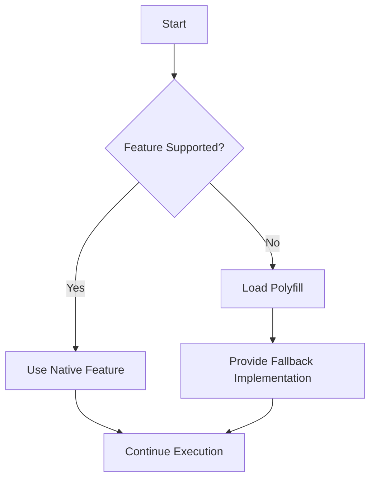

## 12.6 Browser Compatibility and Polyfills

As we delve deeper into TypeScript and its application in web development, it's crucial to understand how to ensure that your code runs smoothly across different browsers. This section will guide you through the challenges of browser compatibility and the use of polyfills to address these issues.

### Understanding Browser Compatibility

Web browsers are the gateways through which users interact with your web applications. However, not all browsers are created equal. They differ in how they implement web standards and support various APIs. This disparity can lead to compatibility issues where a feature works perfectly in one browser but fails in another.

#### Key Concepts

- **Browser Engines**: Each browser uses a different engine to render web pages. For example, Chrome uses Blink, Firefox uses Gecko, and Safari uses WebKit. These engines interpret HTML, CSS, and JavaScript, but they may do so differently.
- **Feature Support**: Browsers may support different sets of features. For instance, newer APIs like `fetch` or `Promise` might not be available in older browsers.
- **Version Discrepancies**: Even within the same browser, different versions might support different features.

#### Importance of Compatibility

Ensuring browser compatibility is essential for providing a consistent user experience. Users expect your application to work regardless of their choice of browser. Therefore, addressing compatibility issues is a critical step in web development.

### Handling Compatibility Issues with Polyfills

A polyfill is a piece of code (usually JavaScript) used to provide modern functionality on older browsers that do not natively support it. Polyfills allow you to use newer APIs and features without worrying about breaking your application for users with older browsers.

#### How Polyfills Work

Polyfills essentially "fill in" the gaps in a browser's functionality. They detect whether a specific feature is supported and, if not, implement it using available technologies. This ensures that your code can run even in environments that do not support certain features natively.

#### Common Polyfills

Let's explore some common polyfills that you might encounter or need in your TypeScript projects:

1. **`fetch` API Polyfill**

   The `fetch` API is a modern way to make network requests. However, it is not supported in older browsers like Internet Explorer. You can use a polyfill to provide this functionality.

   ```typescript
   // Example of using the fetch API
   fetch('https://api.example.com/data')
     .then(response => response.json())
     .then(data => console.log(data))
     .catch(error => console.error('Error:', error));
   ```

   To include a `fetch` polyfill, you can use libraries such as `whatwg-fetch` or `isomorphic-fetch`.

2. **`Promise` Polyfill**

   Promises are a fundamental part of modern JavaScript for handling asynchronous operations. Older browsers may not support them natively.

   ```typescript
   // Example of using Promises
   const myPromise = new Promise((resolve, reject) => {
     setTimeout(() => resolve('Success!'), 1000);
   });

   myPromise.then(result => console.log(result));
   ```

   To polyfill Promises, you can use libraries like `es6-promise`.

3. **`Array.prototype.includes` Polyfill**

   The `includes` method is a convenient way to check if an array contains a specific element. It's not available in older browsers.

   ```typescript
   const fruits = ['apple', 'banana', 'mango'];
   console.log(fruits.includes('banana')); // true
   ```

   You can use the `core-js` library to polyfill this method.

### Including Polyfills in Your Project

To include polyfills in your TypeScript project, you typically follow these steps:

1. **Install the Polyfill Library**

   Use a package manager like npm to install the required polyfill library. For example:

   ```bash
   npm install whatwg-fetch
   ```

2. **Import the Polyfill**

   Import the polyfill at the beginning of your main TypeScript file. This ensures that the polyfill is loaded before any other code that might depend on it.

   ```typescript
   // Importing the fetch polyfill
   import 'whatwg-fetch';
   ```

3. **Configure TypeScript**

   Ensure your `tsconfig.json` is set up to handle the polyfills. This might include setting the `lib` option to include `es2015` or higher, depending on the features you need.

   ```json
   {
     "compilerOptions": {
       "target": "es5",
       "lib": ["dom", "es2015"],
       "module": "commonjs"
     }
   }
   ```

### Testing Across Multiple Browsers

Testing your application in multiple browsers is crucial to ensure compatibility. Here are some strategies:

- **Use Browser Developer Tools**: Most modern browsers have built-in developer tools that allow you to test and debug your applications.
- **Cross-Browser Testing Tools**: Tools like BrowserStack or Sauce Labs enable you to test your application across different browsers and devices.
- **Automated Testing**: Implement automated tests using frameworks like Selenium to ensure consistent behavior across browsers.

### Try It Yourself

To better understand how polyfills work, try the following exercises:

1. **Modify the Fetch Example**: Change the URL in the fetch example to another API endpoint and observe how the polyfill handles the request.
2. **Experiment with Promises**: Create a new promise that simulates an asynchronous operation, such as fetching data from a server, and use a polyfill to ensure it works in older browsers.
3. **Test Array Methods**: Use the `includes` method on an array of numbers and test it in a browser that doesn't support it natively, using a polyfill to provide the functionality.

### Visual Aids

To help visualize the concept of polyfills, consider the following diagram that illustrates how a polyfill checks for feature support and provides a fallback if necessary.



### Key Takeaways

- **Browser Compatibility**: Different browsers support different features. Ensuring compatibility is crucial for a consistent user experience.
- **Polyfills**: Polyfills provide a way to use modern features in older browsers by implementing missing functionality.
- **Testing**: Always test your application in multiple browsers to identify and fix compatibility issues.

### Further Reading

For more information on browser compatibility and polyfills, consider the following resources:

- [MDN Web Docs on Polyfills](https://developer.mozilla.org/en-US/docs/Glossary/Polyfill)
- [Can I use](https://caniuse.com/) - Check browser support for various web technologies.
- [Core-js](https://github.com/zloirock/core-js) - A comprehensive library for polyfilling JavaScript features.

## Quiz Time!



### Which of the following is a reason for browser compatibility issues?

- [x] Different browser engines interpret code differently.
- [ ] All browsers support the same features.
- [ ] Browsers are updated simultaneously.
- [ ] JavaScript is not supported in any browser.

> **Explanation:** Different browsers use different engines, which can lead to varying interpretations of code and feature support.

### What is a polyfill?

- [x] A piece of code that provides modern functionality on older browsers.
- [ ] A tool for debugging JavaScript code.
- [ ] A browser extension for enhancing performance.
- [ ] A type of CSS framework.

> **Explanation:** A polyfill is used to implement modern features in browsers that do not support them natively.

### Which library can be used to polyfill the `fetch` API?

- [x] whatwg-fetch
- [ ] lodash
- [ ] axios
- [ ] jquery

> **Explanation:** `whatwg-fetch` is a library used to polyfill the `fetch` API in environments where it is not supported.

### How do you include a polyfill in a TypeScript project?

- [x] Import the polyfill at the beginning of your main TypeScript file.
- [ ] Add the polyfill to your HTML file.
- [ ] Use a CSS file to include the polyfill.
- [ ] Polyfills cannot be included in TypeScript projects.

> **Explanation:** Polyfills are typically imported at the start of your main TypeScript file to ensure they are loaded before other code.

### Which method can be polyfilled using `core-js`?

- [x] Array.prototype.includes
- [ ] document.querySelector
- [ ] console.log
- [ ] window.alert

> **Explanation:** `core-js` can polyfill methods like `Array.prototype.includes` for older browsers.

### What is the purpose of the `lib` option in `tsconfig.json`?

- [x] To specify the libraries to include during compilation.
- [ ] To define the output directory for compiled files.
- [ ] To set the target browser for the application.
- [ ] To enable strict type checking.

> **Explanation:** The `lib` option specifies which libraries to include, such as `es2015`, which can affect polyfill requirements.

### Which tool can be used for cross-browser testing?

- [x] BrowserStack
- [ ] Node.js
- [ ] TypeScript Compiler
- [ ] Visual Studio Code

> **Explanation:** BrowserStack is a tool that allows you to test your application across different browsers and devices.

### Why is it important to test your application in multiple browsers?

- [x] To ensure consistent behavior and appearance across different environments.
- [ ] Because all browsers have the same bugs.
- [ ] To make the application slower.
- [ ] To increase the code size.

> **Explanation:** Testing in multiple browsers ensures that your application works consistently for all users.

### What does the `Promise` polyfill do?

- [x] It provides Promise functionality in environments where it is not natively supported.
- [ ] It speeds up Promise execution.
- [ ] It converts Promises to callbacks.
- [ ] It disables Promises in modern browsers.

> **Explanation:** A `Promise` polyfill implements the Promise API in environments that lack native support.

### True or False: Polyfills can only be used in TypeScript projects.

- [ ] True
- [x] False

> **Explanation:** Polyfills can be used in any JavaScript environment, not just TypeScript projects.


