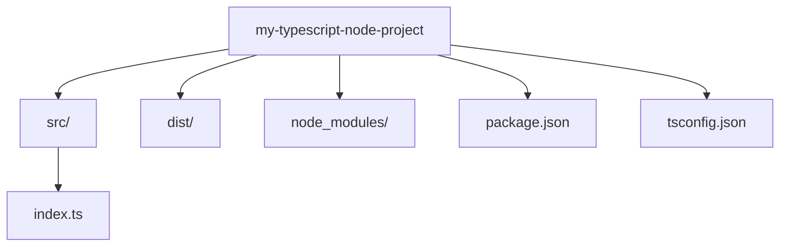

## 13.1 Setting Up a Node.js Project with TypeScript

In this section, we will walk through the process of setting up a Node.js project with TypeScript. This guide is designed for absolute beginners, so we'll start from scratch and explain each step in detail. By the end of this guide, you'll have a fully functional Node.js project using TypeScript, ready for development.

### Why Use TypeScript with Node.js?

Before we dive into the setup, let's briefly discuss why you might want to use TypeScript with Node.js. TypeScript offers several benefits, including:

- **Static Typing**: Helps catch errors at compile time rather than runtime.
- **Improved Code Quality**: Encourages better coding practices and maintainability.
- **Enhanced Tooling**: Provides better autocompletion and navigation in your code editor.
- **Seamless Integration**: TypeScript compiles down to JavaScript, making it easy to integrate with existing Node.js projects.

### Prerequisites

Before we begin, ensure you have the following installed on your system:

- **Node.js**: Download and install from [nodejs.org](https://nodejs.org/).
- **npm**: Comes bundled with Node.js, used for managing packages.

### Step 1: Initialize a New Node.js Project

Let's start by creating a new directory for your project and initializing it with npm.

1. **Create a Project Directory**: Open your terminal and run the following command to create a new directory for your project:

    ```bash
    mkdir my-typescript-node-project
    cd my-typescript-node-project
    ```

2. **Initialize npm**: Run the following command to create a `package.json` file, which will manage your project's dependencies:

    ```bash
    npm init -y
    ```

    The `-y` flag automatically answers "yes" to all prompts, creating a default `package.json`.

### Step 2: Install TypeScript and Necessary Tools

Next, we'll install TypeScript and some additional tools that will make development easier.

1. **Install TypeScript**: Run the following command to install TypeScript as a development dependency:

    ```bash
    npm install typescript --save-dev
    ```

2. **Install ts-node**: `ts-node` allows you to run TypeScript files directly without compiling them to JavaScript first. Install it using:

    ```bash
    npm install ts-node --save-dev
    ```

3. **Install nodemon**: `nodemon` automatically restarts your Node.js application when file changes are detected. It's useful for development. Install it using:

    ```bash
    npm install nodemon --save-dev
    ```

### Step 3: Configure TypeScript

Now that we have TypeScript installed, let's configure it for our project.

1. **Create a tsconfig.json**: This file contains TypeScript compiler options. Run the following command to generate a default `tsconfig.json`:

    ```bash
    npx tsc --init
    ```

2. **Configure tsconfig.json**: Open the `tsconfig.json` file and update it with the following settings:

    ```json
    {
      "compilerOptions": {
        "target": "ES6", // Specify ECMAScript target version
        "module": "commonjs", // Specify module code generation
        "outDir": "./dist", // Redirect output structure to the directory
        "rootDir": "./src", // Specify the root directory of input files
        "strict": true, // Enable all strict type-checking options
        "esModuleInterop": true, // Enables emit interoperability between CommonJS and ES Modules
        "skipLibCheck": true, // Skip type checking of declaration files
        "forceConsistentCasingInFileNames": true // Disallow inconsistently-cased references to the same file
      },
      "include": ["src"], // Specify which files to include
      "exclude": ["node_modules"] // Specify which files to exclude
    }
    ```

### Step 4: Organize Your Project Structure

A well-organized project structure is crucial for maintainability. Here's a simple structure you can follow:

```
my-typescript-node-project/
│
├── src/
│   └── index.ts
│
├── dist/
│
├── node_modules/
│
├── package.json
│
├── tsconfig.json
│
└── .gitignore
```

- **src/**: Contains your TypeScript source files.
- **dist/**: The output directory for compiled JavaScript files.
- **node_modules/**: Contains installed npm packages.
- **package.json**: Manages project dependencies.
- **tsconfig.json**: TypeScript configuration file.
- **.gitignore**: Specifies files and directories to ignore in version control.

### Step 5: Write Your First TypeScript File

Let's create a simple TypeScript file to test our setup.

1. **Create index.ts**: Inside the `src` directory, create a file named `index.ts` and add the following code:

    ```typescript
    // src/index.ts

    const greet = (name: string): string => {
      return `Hello, ${name}!`;
    };

    console.log(greet("World"));
    ```

    This code defines a function `greet` that takes a string `name` and returns a greeting message.

### Step 6: Run Your TypeScript Project

Now, let's run the TypeScript file using `ts-node`.

1. **Run with ts-node**: Execute the following command in your terminal:

    ```bash
    npx ts-node src/index.ts
    ```

    You should see the output: `Hello, World!`

### Step 7: Automate with nodemon

To make development easier, let's use `nodemon` to automatically restart the application when changes are made.

1. **Add a Script to package.json**: Open `package.json` and add the following script:

    ```json
    "scripts": {
      "start": "nodemon --exec ts-node src/index.ts"
    }
    ```

2. **Run the Script**: Use the following command to start the application with `nodemon`:

    ```bash
    npm start
    ```

    Now, any changes you make to `src/index.ts` will automatically restart the application.

### Step 8: Compile TypeScript to JavaScript

Finally, let's compile our TypeScript code to JavaScript for production use.

1. **Compile TypeScript**: Run the following command to compile your TypeScript files:

    ```bash
    npx tsc
    ```

    This will generate JavaScript files in the `dist` directory.

2. **Run Compiled JavaScript**: Execute the compiled JavaScript file using Node.js:

    ```bash
    node dist/index.js
    ```

    You should see the same output: `Hello, World!`

### Try It Yourself

Now that you've set up a Node.js project with TypeScript, try making some modifications:

- **Change the Greeting**: Modify the `greet` function to include a different message.
- **Add a New Function**: Create a new function in `index.ts` and call it from `greet`.
- **Experiment with Types**: Try using different TypeScript types, such as `number` or `boolean`.

### Visual Aids

To help visualize the project structure, here's a diagram representing the folder hierarchy:



### Key Takeaways

- **TypeScript Integration**: TypeScript enhances Node.js projects with static typing and improved tooling.
- **Project Structure**: Organizing your project with `src` and `dist` directories helps maintain clarity.
- **Development Tools**: `ts-node` and `nodemon` streamline the development process by allowing direct execution of TypeScript files and automatic restarts.

### Additional Resources

- [Node.js Official Website](https://nodejs.org/)
- [TypeScript Documentation](https://www.typescriptlang.org/docs/)
- [npm Documentation](https://docs.npmjs.com/)

## Quiz Time!



### What is the main benefit of using TypeScript with Node.js?

- [x] Static typing helps catch errors at compile time.
- [ ] It makes the code run faster.
- [ ] It reduces the size of the application.
- [ ] It automatically optimizes code for production.

> **Explanation:** TypeScript provides static typing, which helps catch errors at compile time rather than runtime, improving code quality and maintainability.

### Which command initializes a new Node.js project with a default package.json?

- [ ] npm install
- [x] npm init -y
- [ ] npm start
- [ ] npx tsc

> **Explanation:** The `npm init -y` command initializes a new Node.js project and creates a default `package.json` file.

### What is the purpose of the tsconfig.json file?

- [ ] To store environment variables.
- [x] To configure TypeScript compiler options.
- [ ] To list project dependencies.
- [ ] To define application routes.

> **Explanation:** The `tsconfig.json` file is used to configure TypeScript compiler options, such as target ECMAScript version and module system.

### Which tool allows you to run TypeScript files directly without compiling them first?

- [ ] nodemon
- [ ] npm
- [x] ts-node
- [ ] npx

> **Explanation:** `ts-node` is a tool that allows you to run TypeScript files directly without compiling them to JavaScript first.

### What does the "strict" option in tsconfig.json enable?

- [x] All strict type-checking options.
- [ ] Faster compilation.
- [ ] Automatic code formatting.
- [ ] Debugging features.

> **Explanation:** The "strict" option in `tsconfig.json` enables all strict type-checking options, ensuring better type safety.

### How can you automatically restart a Node.js application when files change?

- [ ] Use npm start
- [x] Use nodemon
- [ ] Use ts-node
- [ ] Use npx

> **Explanation:** `nodemon` is a tool that automatically restarts a Node.js application when file changes are detected, making development more efficient.

### Which command compiles TypeScript files to JavaScript?

- [ ] npm start
- [ ] ts-node
- [x] npx tsc
- [ ] nodemon

> **Explanation:** The `npx tsc` command compiles TypeScript files to JavaScript, generating output in the specified directory.

### Where should TypeScript source files be placed in the project structure?

- [ ] dist/
- [x] src/
- [ ] node_modules/
- [ ] package.json

> **Explanation:** TypeScript source files should be placed in the `src/` directory, which is specified as the root directory in `tsconfig.json`.

### What is the purpose of the dist/ directory?

- [ ] To store configuration files.
- [ ] To store node modules.
- [x] To store compiled JavaScript files.
- [ ] To store TypeScript source files.

> **Explanation:** The `dist/` directory is used to store compiled JavaScript files generated from TypeScript source files.

### True or False: TypeScript can be used with existing Node.js projects without any changes.

- [x] True
- [ ] False

> **Explanation:** True. TypeScript compiles down to JavaScript, making it easy to integrate with existing Node.js projects without requiring changes to the existing JavaScript code.


