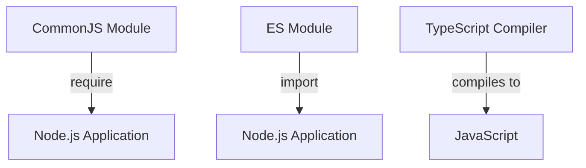

## 13.2 CommonJS vs. ES Modules in Node.js

In this section, we will delve into the two primary module systems used in Node.js: CommonJS and ES Modules. Understanding these systems is crucial for effectively managing dependencies and organizing code in Node.js applications. We'll explore how TypeScript interacts with these module systems, provide configuration guidance, and offer best practices for using each.

### Understanding Module Systems

Modules are a way to organize and encapsulate code into reusable units. They help manage dependencies and maintain a clean codebase by separating concerns. Node.js supports two module systems:

1. **CommonJS**: The original module system for Node.js, using `require` and `module.exports`.
2. **ES Modules (ESM)**: A more modern system, using `import` and `export`, introduced in ECMAScript 2015 (ES6).

### CommonJS: The Traditional Module System

CommonJS has been the default module system in Node.js since its inception. It uses `require` to import modules and `module.exports` to export them. Here's a simple example:

```javascript
// math.js
function add(a, b) {
  return a + b;
}

module.exports = { add };
```

```javascript
// app.js
const math = require('./math');
console.log(math.add(2, 3)); // Output: 5
```

#### Key Characteristics of CommonJS

- **Synchronous Loading**: Modules are loaded synchronously, which is suitable for server-side applications.
- **Single Export Object**: CommonJS modules export a single object, which can contain multiple properties and methods.
- **Dynamic Imports**: You can conditionally load modules using `require`.

### ES Modules: The Modern Approach

ES Modules (ESM) provide a standardized module system for JavaScript, offering several advantages over CommonJS:

```javascript
// math.mjs
export function add(a, b) {
  return a + b;
}
```

```javascript
// app.mjs
import { add } from './math.mjs';
console.log(add(2, 3)); // Output: 5
```

#### Key Characteristics of ES Modules

- **Asynchronous Loading**: Modules are loaded asynchronously, which can improve performance in certain scenarios.
- **Named Exports**: Allows exporting multiple items individually, providing more flexibility.
- **Static Structure**: The module structure is static, enabling better optimization by tools like bundlers.

### Node.js Support for ES Modules

Node.js has gradually added support for ES Modules. As of Node.js 12, ES Modules are fully supported, but there are some considerations:

- **File Extension**: Use `.mjs` for ES Modules or set `"type": "module"` in `package.json` to use `.js`.
- **Import Paths**: Use file extensions in import paths (e.g., `import { add } from './math.mjs';`).
- **No `require`**: ES Modules do not support `require`; use `import` instead.

### Configuring TypeScript for Module Systems

TypeScript can compile code to both CommonJS and ES Modules. The choice depends on your project requirements and Node.js version.

#### Configuring for CommonJS

To configure TypeScript for CommonJS, set the `module` option in `tsconfig.json`:

```json
{
  "compilerOptions": {
    "module": "CommonJS",
    "target": "ES6",
    "outDir": "./dist"
  }
}
```

#### Configuring for ES Modules

For ES Modules, adjust the `module` option:

```json
{
  "compilerOptions": {
    "module": "ESNext",
    "target": "ES6",
    "outDir": "./dist"
  }
}
```

### Examples of Module Imports and Exports

Let's explore how to use both module systems in a Node.js context with TypeScript.

#### CommonJS Example

```typescript
// math.ts
function add(a: number, b: number): number {
  return a + b;
}

export = { add };
```

```typescript
// app.ts
import math = require('./math');
console.log(math.add(2, 3)); // Output: 5
```

#### ES Modules Example

```typescript
// math.ts
export function add(a: number, b: number): number {
  return a + b;
}
```

```typescript
// app.ts
import { add } from './math';
console.log(add(2, 3)); // Output: 5
```

### Compatibility Considerations and Best Practices

When choosing between CommonJS and ES Modules, consider the following:

- **Project Requirements**: Use CommonJS for older Node.js versions or when compatibility with existing CommonJS modules is necessary.
- **Performance**: ES Modules can offer performance benefits due to their asynchronous nature.
- **Tooling Support**: Ensure your build tools and environment support the chosen module system.

#### Best Practices

- **Consistency**: Stick to one module system within a project to avoid confusion.
- **Use TypeScript's `esModuleInterop`**: This compiler option can help with compatibility between CommonJS and ES Modules.
- **Leverage TypeScript's Type Safety**: Use TypeScript's type system to ensure module interfaces are correctly defined and used.

### Visualizing Module Systems

To better understand the flow of module imports and exports, let's use a diagram to illustrate the process.



**Diagram Explanation**: This diagram shows how CommonJS and ES Modules are integrated into a Node.js application, with TypeScript compiling TypeScript code into JavaScript.

### Try It Yourself

Experiment with the examples provided by modifying the functions or adding new ones. Try switching between CommonJS and ES Modules to see how the configuration changes affect your code.

### Summary

In this section, we've explored the differences between CommonJS and ES Modules, how Node.js supports them, and how to configure TypeScript for each. By understanding these module systems, you can make informed decisions about organizing and managing dependencies in your Node.js applications.

## Quiz Time!



### What is the primary module system used in Node.js?

- [x] CommonJS
- [ ] ES Modules
- [ ] AMD
- [ ] UMD

> **Explanation:** CommonJS is the traditional module system used in Node.js, utilizing `require` and `module.exports`.

### Which keyword is used to import modules in ES Modules?

- [ ] require
- [x] import
- [ ] include
- [ ] fetch

> **Explanation:** ES Modules use the `import` keyword to bring in modules.

### How do you export a function in CommonJS?

- [ ] export function
- [x] module.exports
- [ ] exports
- [ ] export default

> **Explanation:** In CommonJS, `module.exports` is used to export functions or objects.

### What file extension is recommended for ES Modules in Node.js?

- [ ] .js
- [x] .mjs
- [ ] .ts
- [ ] .json

> **Explanation:** The `.mjs` extension is recommended for ES Modules unless `"type": "module"` is set in `package.json`.

### Which Node.js version fully supports ES Modules?

- [ ] Node.js 8
- [ ] Node.js 10
- [x] Node.js 12
- [ ] Node.js 14

> **Explanation:** Node.js 12 introduced full support for ES Modules.

### What TypeScript compiler option is used to target CommonJS?

- [ ] "module": "ESNext"
- [ ] "module": "ES6"
- [x] "module": "CommonJS"
- [ ] "module": "AMD"

> **Explanation:** The `"module": "CommonJS"` option configures TypeScript to compile to CommonJS.

### What is a key advantage of ES Modules over CommonJS?

- [ ] Synchronous loading
- [x] Asynchronous loading
- [ ] Dynamic imports
- [ ] Single export object

> **Explanation:** ES Modules support asynchronous loading, which can improve performance.

### What TypeScript option helps with compatibility between CommonJS and ES Modules?

- [ ] "strict"
- [x] "esModuleInterop"
- [ ] "noImplicitAny"
- [ ] "target"

> **Explanation:** The `esModuleInterop` option helps with compatibility between CommonJS and ES Modules.

### Can you use `require` in ES Modules?

- [ ] True
- [x] False

> **Explanation:** ES Modules do not support `require`; they use `import` instead.

### What is the purpose of module systems in Node.js?

- [x] To organize and encapsulate code into reusable units
- [ ] To execute code faster
- [ ] To compile TypeScript to JavaScript
- [ ] To manage network requests

> **Explanation:** Module systems help organize and encapsulate code into reusable units, managing dependencies and maintaining a clean codebase.


