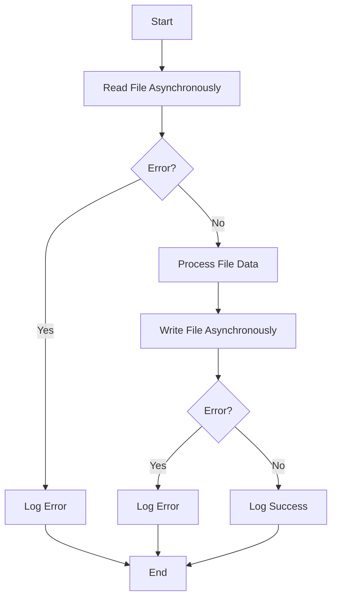

## 13.3 File System Operations

In this section, we will explore how to perform file system operations using Node.js APIs in TypeScript. Understanding how to read from and write to files is an essential skill for many applications, from reading configuration files to logging application output. Let's dive into the `fs` module in Node.js and learn how to handle files effectively using TypeScript.

### Introduction to the `fs` Module

Node.js provides a built-in module called `fs` (short for "file system") that allows us to interact with the file system on our computer. The `fs` module provides both synchronous and asynchronous methods for file operations, enabling us to choose the best approach based on our application's needs.

To use the `fs` module in your TypeScript project, you need to import it:

```typescript
import * as fs from 'fs';
```

### Synchronous File Operations

Synchronous file operations are blocking, meaning they halt the execution of your program until the operation completes. While this can be useful for simple scripts or when you need to ensure a sequence of operations, it can lead to performance issues in larger applications.

#### Reading Files Synchronously

To read a file synchronously, you can use the `fs.readFileSync` method. This method reads the entire contents of a file into memory and returns it as a buffer or string.

```typescript
import * as fs from 'fs';

try {
    const data: string = fs.readFileSync('example.txt', 'utf8');
    console.log(data);
} catch (err) {
    console.error('Error reading file:', err);
}
```

In this example, we read the contents of `example.txt` and log it to the console. We use a `try...catch` block to handle any errors that might occur, such as if the file does not exist.

#### Writing Files Synchronously

To write data to a file synchronously, use the `fs.writeFileSync` method. This method writes data to a file, replacing the file if it already exists.

```typescript
import * as fs from 'fs';

const content: string = 'Hello, TypeScript!';

try {
    fs.writeFileSync('example.txt', content, 'utf8');
    console.log('File written successfully');
} catch (err) {
    console.error('Error writing file:', err);
}
```

Here, we write the string "Hello, TypeScript!" to `example.txt`. If the file does not exist, it will be created.

### Asynchronous File Operations

Asynchronous file operations are non-blocking, allowing your program to continue executing while the file operation is performed in the background. This is generally preferred for larger applications as it improves performance and responsiveness.

#### Reading Files Asynchronously

To read a file asynchronously, use the `fs.readFile` method. This method takes a callback function that is called when the operation completes.

```typescript
import * as fs from 'fs';

fs.readFile('example.txt', 'utf8', (err, data) => {
    if (err) {
        console.error('Error reading file:', err);
        return;
    }
    console.log(data);
});
```

In this example, we provide a callback function to handle the result of the file read operation. If an error occurs, it is passed as the first argument to the callback.

#### Writing Files Asynchronously

To write data to a file asynchronously, use the `fs.writeFile` method. This method also takes a callback function to handle the completion of the operation.

```typescript
import * as fs from 'fs';

const content: string = 'Hello, TypeScript!';

fs.writeFile('example.txt', content, 'utf8', (err) => {
    if (err) {
        console.error('Error writing file:', err);
        return;
    }
    console.log('File written successfully');
});
```

Here, we write data to `example.txt` asynchronously and handle any errors in the callback function.

### Typing Callbacks and Handling Errors

When working with asynchronous file operations, it's important to properly type your callbacks to ensure type safety. In TypeScript, you can define the types for the parameters of your callback functions.

For example, the callback for `fs.readFile` can be typed as follows:

```typescript
type ReadFileCallback = (err: NodeJS.ErrnoException | null, data: string | Buffer) => void;

const callback: ReadFileCallback = (err, data) => {
    if (err) {
        console.error('Error reading file:', err);
        return;
    }
    console.log(data);
};

fs.readFile('example.txt', 'utf8', callback);
```

In this example, we define a type `ReadFileCallback` for the callback function, specifying that `err` can be either `NodeJS.ErrnoException` or `null`, and `data` can be a `string` or `Buffer`.

### Using Promises with `fs.promises` API

Node.js also provides a Promise-based API for file operations through `fs.promises`. This allows us to use modern JavaScript features like `async` and `await` to handle asynchronous operations more elegantly.

#### Reading Files with Promises

To read a file using promises, use the `fs.promises.readFile` method. This method returns a promise that resolves with the file data.

```typescript
import { promises as fsPromises } from 'fs';

async function readFileAsync(filePath: string): Promise<void> {
    try {
        const data: string = await fsPromises.readFile(filePath, 'utf8');
        console.log(data);
    } catch (err) {
        console.error('Error reading file:', err);
    }
}

readFileAsync('example.txt');
```

In this example, we define an asynchronous function `readFileAsync` that reads a file using `await` to handle the promise returned by `fs.promises.readFile`.

#### Writing Files with Promises

To write data to a file using promises, use the `fs.promises.writeFile` method. This method returns a promise that resolves when the file has been written.

```typescript
import { promises as fsPromises } from 'fs';

async function writeFileAsync(filePath: string, content: string): Promise<void> {
    try {
        await fsPromises.writeFile(filePath, content, 'utf8');
        console.log('File written successfully');
    } catch (err) {
        console.error('Error writing file:', err);
    }
}

writeFileAsync('example.txt', 'Hello, TypeScript!');
```

Here, we define an asynchronous function `writeFileAsync` that writes data to a file using `await` to handle the promise returned by `fs.promises.writeFile`.

### Practical Examples

Let's explore some practical examples of file system operations in TypeScript, such as reading configuration files and logging output.

#### Reading a Configuration File

Suppose we have a JSON configuration file named `config.json`:

```json
{
    "appName": "MyApp",
    "version": "1.0.0",
    "port": 3000
}
```

We can read this configuration file and parse its contents using TypeScript:

```typescript
import { promises as fsPromises } from 'fs';

interface Config {
    appName: string;
    version: string;
    port: number;
}

async function readConfig(filePath: string): Promise<Config> {
    try {
        const data: string = await fsPromises.readFile(filePath, 'utf8');
        const config: Config = JSON.parse(data);
        return config;
    } catch (err) {
        console.error('Error reading configuration file:', err);
        throw err;
    }
}

readConfig('config.json').then(config => {
    console.log('Configuration:', config);
}).catch(err => {
    console.error('Failed to load configuration:', err);
});
```

In this example, we define an interface `Config` to represent the structure of our configuration file. We then read and parse the file using `fs.promises.readFile` and `JSON.parse`.

#### Logging Output to a File

Logging application output to a file can be useful for debugging and monitoring. Let's create a simple logger that writes messages to a log file.

```typescript
import { promises as fsPromises } from 'fs';

async function logMessage(filePath: string, message: string): Promise<void> {
    const timestamp: string = new Date().toISOString();
    const logEntry: string = `[${timestamp}] ${message}\n`;

    try {
        await fsPromises.appendFile(filePath, logEntry, 'utf8');
        console.log('Log entry added');
    } catch (err) {
        console.error('Error writing log entry:', err);
    }
}

logMessage('app.log', 'Application started');
```

Here, we define an asynchronous function `logMessage` that appends a timestamped log entry to a file using `fs.promises.appendFile`.

### Try It Yourself

Now that we've covered the basics of file system operations in TypeScript, try experimenting with the examples provided. Here are some suggestions:

- Modify the `readFileAsync` function to read a different file and handle different file encodings.
- Enhance the `writeFileAsync` function to handle different file formats, such as JSON or CSV.
- Create a simple application that reads a list of tasks from a file and logs completed tasks to a separate log file.

### Visual Aids

To help visualize the flow of file operations, let's use a Mermaid.js flowchart to illustrate the process of reading and writing files asynchronously.



This flowchart shows the steps involved in reading a file asynchronously, processing its data, and writing the result to another file, with error handling at each stage.

### References and Links

For more information on Node.js file system operations and TypeScript, check out these resources:

- [Node.js File System Documentation](https://nodejs.org/api/fs.html)
- [TypeScript Handbook](https://www.typescriptlang.org/docs/handbook/intro.html)
- [MDN Web Docs: File System](https://developer.mozilla.org/en-US/docs/Web/API/File_System_Access_API)

### Engagement and Reinforcement

To reinforce your learning, consider the following questions:

- What are the advantages of using asynchronous file operations over synchronous ones?
- How can you ensure type safety when working with callbacks in TypeScript?
- What are some use cases for reading and writing files in a Node.js application?

### Key Takeaways

- The `fs` module in Node.js provides both synchronous and asynchronous methods for file operations.
- Asynchronous file operations are preferred for larger applications to improve performance.
- TypeScript allows you to define types for callback functions, ensuring type safety.
- The `fs.promises` API provides a Promise-based approach to file operations, enabling the use of `async` and `await`.

By mastering file system operations in TypeScript, you can build robust applications that efficiently handle file input and output.

## Quiz Time!



### What is the primary advantage of using asynchronous file operations in Node.js?

- [x] They do not block the execution of the program.
- [ ] They are easier to write than synchronous operations.
- [ ] They provide better error handling.
- [ ] They are the only way to read files in Node.js.

> **Explanation:** Asynchronous file operations allow the program to continue executing while the file operation is performed in the background, improving performance.

### Which method is used to read a file synchronously in Node.js?

- [x] fs.readFileSync
- [ ] fs.readFile
- [ ] fs.promises.readFile
- [ ] fs.readSync

> **Explanation:** `fs.readFileSync` is the method used to read a file synchronously in Node.js.

### How can you handle errors when using fs.readFile asynchronously?

- [x] By checking the error parameter in the callback function.
- [ ] By using a try...catch block.
- [ ] By using a finally block.
- [ ] By ignoring the error parameter.

> **Explanation:** When using `fs.readFile` asynchronously, errors are passed as the first parameter to the callback function, which should be checked and handled.

### What type of value does fs.readFileSync return?

- [x] A Buffer or a string
- [ ] A Promise
- [ ] An array
- [ ] An object

> **Explanation:** `fs.readFileSync` returns the file contents as a Buffer or a string, depending on the encoding specified.

### Which Node.js module provides a Promise-based API for file operations?

- [x] fs.promises
- [ ] fs.sync
- [ ] fs.async
- [ ] fs.promise

> **Explanation:** `fs.promises` provides a Promise-based API for file operations, allowing the use of `async` and `await`.

### How do you import the fs module in a TypeScript file?

- [x] import * as fs from 'fs';
- [ ] import fs from 'fs';
- [ ] require('fs');
- [ ] import { fs } from 'fs';

> **Explanation:** The correct way to import the `fs` module in a TypeScript file is `import * as fs from 'fs';`.

### What is the purpose of the utf8 parameter in fs.readFile?

- [x] It specifies the encoding of the file contents.
- [ ] It sets the file read mode.
- [ ] It enables error handling.
- [ ] It determines the file type.

> **Explanation:** The `utf8` parameter specifies the encoding of the file contents, ensuring they are read as a string.

### Which method appends data to a file asynchronously?

- [x] fs.appendFile
- [ ] fs.writeFile
- [ ] fs.appendFileSync
- [ ] fs.promises.writeFile

> **Explanation:** `fs.appendFile` is used to append data to a file asynchronously.

### What is the correct way to handle a Promise returned by fs.promises.readFile?

- [x] Using async and await
- [ ] Using a callback function
- [ ] Using a try...catch block
- [ ] Using a finally block

> **Explanation:** A Promise returned by `fs.promises.readFile` can be handled using `async` and `await`.

### True or False: Synchronous file operations are preferred for large applications.

- [ ] True
- [x] False

> **Explanation:** Asynchronous file operations are preferred for large applications because they improve performance by not blocking the execution of the program.


