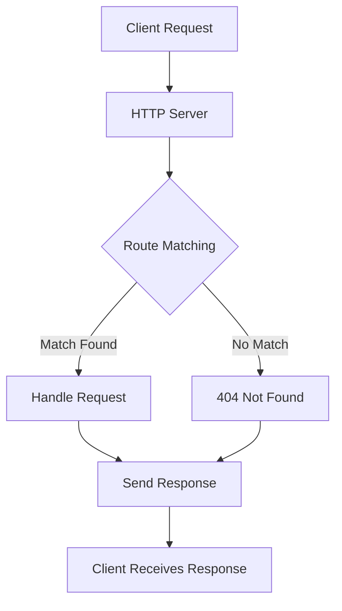

## 13.4 Creating HTTP Servers

In this section, we'll explore how to build a simple HTTP server using TypeScript and Node.js. We'll cover the basics of handling requests, sending responses, and introduce routing and serving static content. By the end of this guide, you'll have a solid foundation for creating more complex web servers.

### Setting Up Your Environment

Before we dive into creating an HTTP server, let's ensure that your development environment is ready. You'll need Node.js and TypeScript installed on your machine. If you haven't set them up yet, refer to the earlier section on setting up your development environment.

### Creating a Basic HTTP Server

Node.js provides a built-in module called `http` that allows us to create an HTTP server. Let's start by creating a basic server that listens for incoming requests and sends a simple response.

#### Step 1: Initialize a New Project

First, create a new directory for your project and navigate into it:

```bash
mkdir my-http-server
cd my-http-server
```

Initialize a new Node.js project:

```bash
npm init -y
```

This command creates a `package.json` file with default settings.

#### Step 2: Install TypeScript

Next, install TypeScript as a development dependency:

```bash
npm install typescript --save-dev
```

Create a `tsconfig.json` file to configure the TypeScript compiler:

```json
{
  "compilerOptions": {
    "target": "ES6",
    "module": "commonjs",
    "outDir": "./dist",
    "rootDir": "./src",
    "strict": true
  },
  "include": ["src"]
}
```

#### Step 3: Create the Server File

Create a new directory named `src` and add a file called `server.ts` inside it:

```bash
mkdir src
touch src/server.ts
```

Open `server.ts` in your code editor and add the following code:

```typescript
import * as http from 'http';

// Create an HTTP server
const server = http.createServer((req, res) => {
  res.statusCode = 200; // Set the status code to 200 (OK)
  res.setHeader('Content-Type', 'text/plain'); // Set the response content type
  res.end('Hello, World!\n'); // Send a response
});

// Define the port number
const port = 3000;

// Start the server and listen on the specified port
server.listen(port, () => {
  console.log(`Server running at http://localhost:${port}/`);
});
```

#### Step 4: Compile and Run the Server

Compile the TypeScript code to JavaScript using the TypeScript compiler:

```bash
npx tsc
```

This command generates a `dist` directory containing the compiled JavaScript files. Now, run the server:

```bash
node dist/server.js
```

Open your web browser and navigate to `http://localhost:3000/`. You should see "Hello, World!" displayed on the page.

### Handling Requests and Sending Responses

Now that we have a basic server running, let's explore how to handle different types of requests and send appropriate responses.

#### Understanding Request and Response Objects

In Node.js, the `http` module provides two important objects: `IncomingMessage` and `ServerResponse`. These objects represent the request and response, respectively.

- **IncomingMessage**: Contains information about the incoming request, such as the URL, HTTP method, headers, and more.
- **ServerResponse**: Used to send a response back to the client, including setting status codes, headers, and the response body.

#### Handling Different Request Methods

Let's modify our server to handle different HTTP request methods, such as GET and POST.

```typescript
import * as http from 'http';

const server = http.createServer((req, res) => {
  const { method, url } = req;

  if (method === 'GET' && url === '/') {
    res.statusCode = 200;
    res.setHeader('Content-Type', 'text/plain');
    res.end('Welcome to the homepage!\n');
  } else if (method === 'POST' && url === '/data') {
    let body = '';

    // Collect data from the request body
    req.on('data', chunk => {
      body += chunk.toString();
    });

    req.on('end', () => {
      res.statusCode = 200;
      res.setHeader('Content-Type', 'application/json');
      res.end(`Received data: ${body}\n`);
    });
  } else {
    res.statusCode = 404;
    res.setHeader('Content-Type', 'text/plain');
    res.end('Not Found\n');
  }
});

const port = 3000;
server.listen(port, () => {
  console.log(`Server running at http://localhost:${port}/`);
});
```

In this example, we handle GET requests to the root URL (`/`) and POST requests to `/data`. For other routes, we return a 404 Not Found status.

### Basic Routing and Serving Static Content

Routing is the process of determining how an application responds to a client request to a particular endpoint. Let's implement basic routing and serve static content.

#### Implementing Basic Routing

We can extend our server to handle more routes by checking the `url` and `method` properties of the request object.

```typescript
import * as http from 'http';

const server = http.createServer((req, res) => {
  const { method, url } = req;

  switch (url) {
    case '/':
      if (method === 'GET') {
        res.statusCode = 200;
        res.setHeader('Content-Type', 'text/plain');
        res.end('Welcome to the homepage!\n');
      }
      break;
    case '/about':
      if (method === 'GET') {
        res.statusCode = 200;
        res.setHeader('Content-Type', 'text/plain');
        res.end('About us page\n');
      }
      break;
    default:
      res.statusCode = 404;
      res.setHeader('Content-Type', 'text/plain');
      res.end('Not Found\n');
  }
});

const port = 3000;
server.listen(port, () => {
  console.log(`Server running at http://localhost:${port}/`);
});
```

#### Serving Static Content

To serve static files, such as HTML, CSS, or images, we can use the `fs` module to read files from the file system and send them as responses.

```typescript
import * as http from 'http';
import * as fs from 'fs';
import * as path from 'path';

const server = http.createServer((req, res) => {
  const { method, url } = req;

  if (method === 'GET' && url === '/') {
    const filePath = path.join(__dirname, 'public', 'index.html');
    fs.readFile(filePath, (err, data) => {
      if (err) {
        res.statusCode = 500;
        res.setHeader('Content-Type', 'text/plain');
        res.end('Internal Server Error\n');
      } else {
        res.statusCode = 200;
        res.setHeader('Content-Type', 'text/html');
        res.end(data);
      }
    });
  } else {
    res.statusCode = 404;
    res.setHeader('Content-Type', 'text/plain');
    res.end('Not Found\n');
  }
});

const port = 3000;
server.listen(port, () => {
  console.log(`Server running at http://localhost:${port}/`);
});
```

In this example, we serve an `index.html` file located in a `public` directory when the root URL is accessed.

### Typing Request and Response Objects

TypeScript allows us to add type annotations to our code, making it easier to catch errors and understand the code's structure. Let's add types to our server code.

```typescript
import * as http from 'http';
import * as fs from 'fs';
import * as path from 'path';

const server: http.Server = http.createServer((req: http.IncomingMessage, res: http.ServerResponse) => {
  const { method, url } = req;

  if (method === 'GET' && url === '/') {
    const filePath: string = path.join(__dirname, 'public', 'index.html');
    fs.readFile(filePath, (err: NodeJS.ErrnoException | null, data: Buffer) => {
      if (err) {
        res.statusCode = 500;
        res.setHeader('Content-Type', 'text/plain');
        res.end('Internal Server Error\n');
      } else {
        res.statusCode = 200;
        res.setHeader('Content-Type', 'text/html');
        res.end(data);
      }
    });
  } else {
    res.statusCode = 404;
    res.setHeader('Content-Type', 'text/plain');
    res.end('Not Found\n');
  }
});

const port: number = 3000;
server.listen(port, () => {
  console.log(`Server running at http://localhost:${port}/`);
});
```

By adding type annotations, we improve code readability and leverage TypeScript's type-checking capabilities.

### Experimenting with Routes and Middleware

Now that you have a basic understanding of creating an HTTP server, try experimenting with adding more routes or implementing middleware functions.

#### Adding More Routes

Add more routes to your server by checking the `url` and `method` properties. For example, you can create a route for `/contact` that returns contact information.

#### Implementing Middleware

Middleware functions are functions that have access to the request and response objects and can modify them or end the request-response cycle. You can create middleware to log requests, authenticate users, or handle errors.

### Try It Yourself

1. **Add a New Route**: Create a new route for `/contact` that returns contact information.
2. **Serve Static Files**: Add a CSS file to the `public` directory and serve it along with the HTML file.
3. **Implement Middleware**: Create a middleware function that logs each request's method and URL to the console.

### Visualizing the HTTP Server Flow

Let's visualize the flow of an HTTP server using a Mermaid.js diagram:



This diagram illustrates the process of a client request being received by the server, matched to a route, handled, and then a response being sent back to the client.

### Summary

In this section, we learned how to create a simple HTTP server using TypeScript and Node.js. We explored handling requests, sending responses, implementing basic routing, and serving static content. We also discussed typing request and response objects and encouraged experimentation with routes and middleware.

### Additional Resources

- [Node.js HTTP Module Documentation](https://nodejs.org/api/http.html)
- [TypeScript Handbook](https://www.typescriptlang.org/docs/handbook/intro.html)
- [MDN Web Docs: HTTP](https://developer.mozilla.org/en-US/docs/Web/HTTP)

## Quiz Time!



### What module in Node.js is used to create an HTTP server?

- [x] `http`
- [ ] `fs`
- [ ] `path`
- [ ] `url`

> **Explanation:** The `http` module in Node.js is used to create an HTTP server.

### What method is used to start the server and listen on a specified port?

- [x] `listen`
- [ ] `start`
- [ ] `begin`
- [ ] `open`

> **Explanation:** The `listen` method is used to start the server and listen on a specified port.

### What type of object is `IncomingMessage` in Node.js?

- [x] Request object
- [ ] Response object
- [ ] Server object
- [ ] Client object

> **Explanation:** `IncomingMessage` is the request object in Node.js, representing the incoming request.

### What type of object is `ServerResponse` in Node.js?

- [x] Response object
- [ ] Request object
- [ ] Server object
- [ ] Client object

> **Explanation:** `ServerResponse` is the response object in Node.js, used to send a response back to the client.

### What status code is used to indicate a successful HTTP request?

- [x] 200
- [ ] 404
- [ ] 500
- [ ] 301

> **Explanation:** The status code 200 indicates a successful HTTP request.

### What method is used to read files in Node.js?

- [x] `fs.readFile`
- [ ] `http.createServer`
- [ ] `path.join`
- [ ] `url.parse`

> **Explanation:** The `fs.readFile` method is used to read files in Node.js.

### What method is used to set the response content type?

- [x] `setHeader`
- [ ] `writeHead`
- [ ] `end`
- [ ] `send`

> **Explanation:** The `setHeader` method is used to set the response content type.

### What is the purpose of the `end` method in the response object?

- [x] To send the response and end the request-response cycle
- [ ] To set the response headers
- [ ] To start the server
- [ ] To read the request body

> **Explanation:** The `end` method is used to send the response and end the request-response cycle.

### What is the default HTTP method for a form submission?

- [x] GET
- [ ] POST
- [ ] PUT
- [ ] DELETE

> **Explanation:** The default HTTP method for a form submission is GET.

### True or False: TypeScript allows us to add type annotations to the request and response objects.

- [x] True
- [ ] False

> **Explanation:** True. TypeScript allows us to add type annotations to the request and response objects for better code readability and type-checking.


