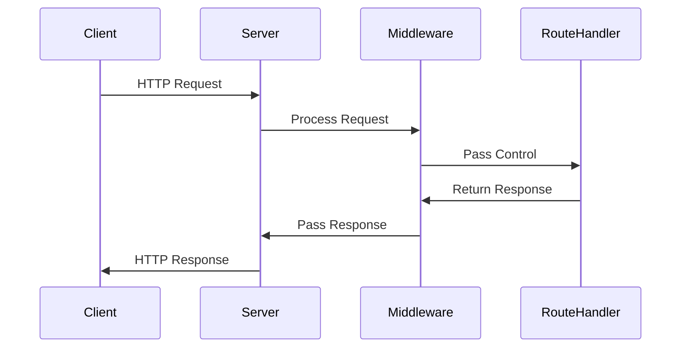

## 13.5 Using Express.js with TypeScript

In this section, we'll explore how to use Express.js with TypeScript to build robust web servers. Express.js is a popular web framework for Node.js that simplifies the process of creating web applications and APIs. By integrating it with TypeScript, we can leverage static typing to catch errors early and improve code quality.

### Why Use Express.js Over the Basic `http` Module?

Before diving into the setup, let's understand why Express.js is preferred over the basic `http` module in Node.js:

- **Simplified Routing**: Express.js provides a straightforward way to define routes and handle HTTP requests, making it easier to build complex applications.
- **Middleware Support**: Express.js allows you to use middleware functions to process requests, which can be used for logging, authentication, error handling, and more.
- **Extensive Ecosystem**: With a vast collection of middleware and plugins, Express.js can be easily extended to meet various application needs.
- **Community and Documentation**: Express.js has a large community and comprehensive documentation, making it easier to find solutions and best practices.

### Setting Up Express.js with TypeScript

Let's get started by setting up a basic Express.js server with TypeScript.

#### Step 1: Initialize a New Node.js Project

First, create a new directory for your project and initialize a Node.js project:

```bash
mkdir express-typescript-server
cd express-typescript-server
npm init -y
```

#### Step 2: Install Required Dependencies

Next, install Express.js, TypeScript, and the necessary type definitions:

```bash
npm install express
npm install --save-dev typescript @types/node @types/express ts-node
```

- `express`: The Express.js library.
- `typescript`: The TypeScript compiler.
- `@types/node`: Type definitions for Node.js.
- `@types/express`: Type definitions for Express.js.
- `ts-node`: A TypeScript execution engine for Node.js.

#### Step 3: Configure TypeScript

Create a `tsconfig.json` file to configure TypeScript:

```json
{
  "compilerOptions": {
    "target": "ES6",
    "module": "commonjs",
    "outDir": "./dist",
    "rootDir": "./src",
    "strict": true,
    "esModuleInterop": true,
    "skipLibCheck": true
  },
  "include": ["src/**/*.ts"],
  "exclude": ["node_modules"]
}
```

- **target**: Specifies the JavaScript version to compile to.
- **module**: Sets the module system to CommonJS, which is used by Node.js.
- **outDir**: The directory where compiled JavaScript files will be output.
- **rootDir**: The root directory of the source files.
- **strict**: Enables all strict type-checking options.
- **esModuleInterop**: Allows interoperability between CommonJS and ES Modules.
- **skipLibCheck**: Skips type checking of declaration files.

#### Step 4: Create the Server

Create a `src` directory and add an `index.ts` file:

```typescript
import express, { Request, Response } from 'express';

const app = express();
const PORT = process.env.PORT || 3000;

// Define a simple route
app.get('/', (req: Request, res: Response) => {
  res.send('Hello, TypeScript with Express!');
});

// Start the server
app.listen(PORT, () => {
  console.log(`Server is running on http://localhost:${PORT}`);
});
```

- **express**: Import the Express.js module.
- **Request, Response**: Import types for request and response objects.

#### Step 5: Run the Server

Use `ts-node` to run your TypeScript server:

```bash
npx ts-node src/index.ts
```

Visit `http://localhost:3000` in your browser to see your Express.js server in action.

### Creating Routes in Express.js

Routes are essential for handling different endpoints in your web application. Let's create a few routes to demonstrate how they work.

#### Example: Defining Routes

Add the following code to your `index.ts` file:

```typescript
// Define a new route for /about
app.get('/about', (req: Request, res: Response) => {
  res.send('About Page');
});

// Define a route with a parameter
app.get('/user/:id', (req: Request, res: Response) => {
  const userId = req.params.id;
  res.send(`User ID: ${userId}`);
});
```

- **Static Route**: The `/about` route returns a simple message.
- **Dynamic Route**: The `/user/:id` route captures a parameter from the URL.

### Using Middleware in Express.js

Middleware functions are functions that have access to the request and response objects. They can modify the request and response, end the request-response cycle, or call the next middleware function.

#### Example: Logging Middleware

Let's create a simple logging middleware:

```typescript
// Middleware function to log request details
app.use((req: Request, res: Response, next) => {
  console.log(`${req.method} ${req.url}`);
  next(); // Call the next middleware or route handler
});
```

- **app.use**: Adds a middleware function to the application.
- **next**: A function to pass control to the next middleware.

### Error Handling in Express.js

Error handling is crucial for building reliable applications. Express.js provides a simple way to handle errors using middleware.

#### Example: Error Handling Middleware

Add the following error handling middleware:

```typescript
// Error handling middleware
app.use((err: Error, req: Request, res: Response, next) => {
  console.error(err.stack);
  res.status(500).send('Something went wrong!');
});
```

- **Error Handling Middleware**: Defined with four parameters (err, req, res, next).
- **res.status(500)**: Sends a 500 Internal Server Error response.

### Using Type Definitions for Express.js

Type definitions help TypeScript understand the structure of Express.js objects. This improves code completion and error checking.

#### Example: Typing Request and Response

When defining routes, it's important to specify the types for request and response objects:

```typescript
app.get('/api/data', (req: Request, res: Response) => {
  const data = { message: 'Hello, TypeScript!' };
  res.json(data);
});
```

- **Request, Response**: TypeScript types for request and response objects.

### Best Practices for Structuring Express.js Applications

As your application grows, it's important to organize your code for maintainability and scalability.

#### 1. Use a Modular Structure

Divide your application into modules, each responsible for a specific feature or functionality.

```plaintext
src/
  ├── routes/
  │   ├── index.ts
  │   └── users.ts
  ├── middleware/
  │   └── logger.ts
  ├── controllers/
  │   └── userController.ts
  └── index.ts
```

- **routes/**: Contains route definitions.
- **middleware/**: Contains middleware functions.
- **controllers/**: Contains business logic for handling requests.

#### 2. Use Environment Variables

Store configuration values, such as database credentials and API keys, in environment variables.

```typescript
const PORT = process.env.PORT || 3000;
```

- **process.env**: Access environment variables.

#### 3. Implement Error Handling

Ensure that your application gracefully handles errors and provides meaningful feedback to users.

```typescript
app.use((err: Error, req: Request, res: Response, next) => {
  console.error(err.message);
  res.status(500).json({ error: 'Internal Server Error' });
});
```

### Try It Yourself

Experiment with the following modifications to the code examples:

- Add a new route that returns a JSON object with your name and favorite programming language.
- Create a middleware function that adds a custom header to all responses.
- Implement error handling for a route that throws an error when accessed.

### Visualizing the Express.js Workflow

To better understand how Express.js processes requests, let's visualize the workflow using a sequence diagram.



- **Client**: Sends an HTTP request to the server.
- **Server**: Receives the request and passes it to middleware.
- **Middleware**: Processes the request and passes control to the route handler.
- **RouteHandler**: Handles the request and returns a response.
- **Server**: Sends the response back to the client.

### References and Links

- [Express.js Documentation](https://expressjs.com/)
- [TypeScript Handbook](https://www.typescriptlang.org/docs/handbook/intro.html)
- [Node.js Documentation](https://nodejs.org/en/docs/)

### Engagement and Reinforcement

- **Question**: What are the benefits of using middleware in Express.js?
- **Challenge**: Create a new route that accepts query parameters and returns them as a JSON response.

### Summary

In this section, we've explored how to set up an Express.js server with TypeScript. We've covered routing, middleware, error handling, and best practices for structuring applications. By using TypeScript with Express.js, you can build scalable and maintainable web applications with improved type safety and code quality.

## Quiz Time!



### What is one advantage of using Express.js over the basic `http` module?

- [x] Simplified routing
- [ ] Built-in database support
- [ ] Automatic scaling
- [ ] Native support for TypeScript

> **Explanation:** Express.js provides simplified routing, making it easier to handle HTTP requests compared to the basic `http` module.

### Which command is used to install Express.js and its type definitions?

- [x] npm install express @types/express
- [ ] npm install express-types
- [ ] npm install express --save
- [ ] npm install express --dev

> **Explanation:** The command `npm install express @types/express` installs Express.js and its type definitions.

### What is the purpose of middleware in Express.js?

- [x] To process requests and responses
- [ ] To handle database connections
- [ ] To serve static files
- [ ] To compile TypeScript code

> **Explanation:** Middleware functions in Express.js are used to process requests and responses.

### How do you define a route with a parameter in Express.js?

- [x] app.get('/user/:id', (req, res) => { ... })
- [ ] app.get('/user', (req, res) => { ... })
- [ ] app.post('/user/:id', (req, res) => { ... })
- [ ] app.put('/user', (req, res) => { ... })

> **Explanation:** The syntax `app.get('/user/:id', (req, res) => { ... })` defines a route with a parameter `id`.

### What is the role of `next()` in middleware functions?

- [x] To pass control to the next middleware or route handler
- [ ] To terminate the request-response cycle
- [ ] To send a response to the client
- [ ] To initialize the server

> **Explanation:** The `next()` function is used to pass control to the next middleware or route handler.

### How can you handle errors in Express.js?

- [x] By using error-handling middleware
- [ ] By using try-catch blocks
- [ ] By using promises
- [ ] By using async-await

> **Explanation:** Error-handling middleware is used in Express.js to handle errors.

### What is the purpose of the `tsconfig.json` file?

- [x] To configure TypeScript compiler options
- [ ] To define Express.js routes
- [ ] To manage Node.js dependencies
- [ ] To store environment variables

> **Explanation:** The `tsconfig.json` file is used to configure TypeScript compiler options.

### Which command is used to run a TypeScript file using `ts-node`?

- [x] npx ts-node src/index.ts
- [ ] node src/index.ts
- [ ] npm run src/index.ts
- [ ] ts-node src/index.ts

> **Explanation:** The command `npx ts-node src/index.ts` is used to run a TypeScript file using `ts-node`.

### What is the benefit of using type definitions in Express.js?

- [x] Improved code completion and error checking
- [ ] Faster server performance
- [ ] Automatic database integration
- [ ] Built-in security features

> **Explanation:** Type definitions improve code completion and error checking in Express.js applications.

### True or False: Express.js can only be used with TypeScript.

- [ ] True
- [x] False

> **Explanation:** Express.js can be used with both JavaScript and TypeScript.


