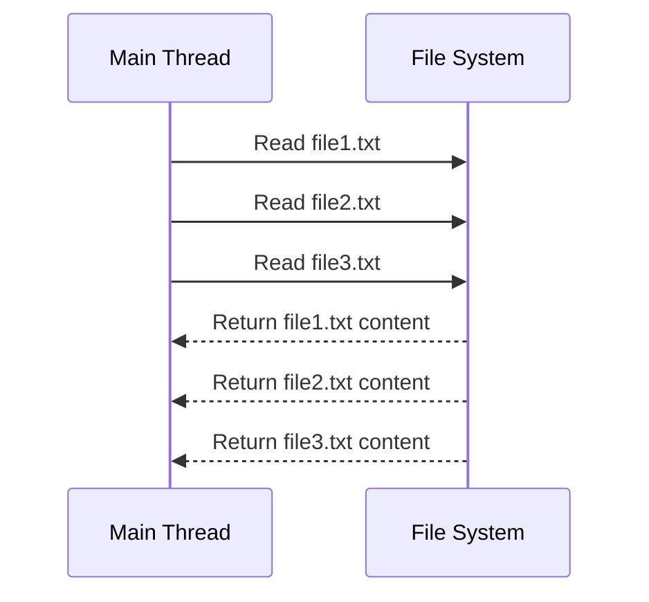

## 13.6 Asynchronous Programming in Node.js

In this section, we will delve into the world of asynchronous programming in Node.js, a crucial aspect of building efficient and scalable applications. Asynchronous programming allows Node.js to handle multiple operations concurrently without blocking the execution of other code. This is particularly important in a server environment where you want to maximize the use of resources and provide a responsive experience to users. Let's explore how TypeScript can help us write clean and effective asynchronous code in Node.js.

### Understanding Non-Blocking I/O

Node.js is built on the V8 JavaScript engine and uses an event-driven, non-blocking I/O model. This means that Node.js can handle multiple operations simultaneously without waiting for one operation to complete before starting another. This is achieved through asynchronous programming, which is essential for building fast and responsive applications.

#### Why Non-Blocking I/O Matters

In traditional blocking I/O, each operation must complete before the next one starts. This can lead to inefficiencies, especially when dealing with I/O-bound operations like reading files or making network requests. Non-blocking I/O allows Node.js to initiate multiple operations and continue executing code while waiting for these operations to complete.

### Asynchronous Patterns in Node.js

Node.js provides several patterns for handling asynchronous operations. Let's explore these patterns using TypeScript.

#### Callbacks

Callbacks are one of the earliest and simplest ways to handle asynchronous operations in JavaScript. A callback is a function passed as an argument to another function, which is then executed once the operation is complete.

```typescript
import * as fs from 'fs';

// Read a file asynchronously using a callback
fs.readFile('example.txt', 'utf8', (err, data) => {
  if (err) {
    console.error('Error reading file:', err);
    return;
  }
  console.log('File content:', data);
});
```

In the example above, `fs.readFile` is an asynchronous function that reads a file. The callback function is executed once the file reading is complete. If an error occurs, it is passed as the first argument to the callback.

##### Pitfalls of Callbacks: Callback Hell

While callbacks are simple, they can lead to "callback hell" when dealing with multiple asynchronous operations. This occurs when callbacks are nested within other callbacks, making the code difficult to read and maintain.

```typescript
// Example of callback hell
fs.readFile('file1.txt', 'utf8', (err, data1) => {
  if (err) throw err;
  fs.readFile('file2.txt', 'utf8', (err, data2) => {
    if (err) throw err;
    fs.readFile('file3.txt', 'utf8', (err, data3) => {
      if (err) throw err;
      console.log(data1, data2, data3);
    });
  });
});
```

To mitigate callback hell, we can use more modern asynchronous patterns like Promises and async/await.

#### Promises

Promises provide a cleaner and more manageable way to handle asynchronous operations. A Promise represents a value that may be available now, or in the future, or never.

```typescript
import { promises as fsPromises } from 'fs';

// Read a file asynchronously using Promises
fsPromises.readFile('example.txt', 'utf8')
  .then(data => {
    console.log('File content:', data);
  })
  .catch(err => {
    console.error('Error reading file:', err);
  });
```

In this example, `fsPromises.readFile` returns a Promise. We use the `then` method to handle the successful completion of the operation and `catch` to handle errors.

#### Async/Await

Async/await is a syntactic sugar built on top of Promises, making asynchronous code look and behave more like synchronous code. This pattern is easier to read and write, especially when dealing with multiple asynchronous operations.

```typescript
import { promises as fsPromises } from 'fs';

// Read a file asynchronously using async/await
async function readFileAsync() {
  try {
    const data = await fsPromises.readFile('example.txt', 'utf8');
    console.log('File content:', data);
  } catch (err) {
    console.error('Error reading file:', err);
  }
}

readFileAsync();
```

In the example above, the `readFileAsync` function is declared with the `async` keyword, allowing us to use the `await` keyword to pause the execution of the function until the Promise is resolved. This makes the code easier to understand and maintain.

### Error Handling in Asynchronous Code

Handling errors in asynchronous code is crucial to building robust applications. Let's explore how to handle errors using the different asynchronous patterns.

#### Error Handling with Callbacks

In the callback pattern, errors are typically passed as the first argument to the callback function. It's important to check for errors and handle them appropriately.

```typescript
fs.readFile('example.txt', 'utf8', (err, data) => {
  if (err) {
    console.error('Error reading file:', err);
    return;
  }
  console.log('File content:', data);
});
```

#### Error Handling with Promises

Promises provide a `catch` method to handle errors. This method is called if the Promise is rejected.

```typescript
fsPromises.readFile('example.txt', 'utf8')
  .then(data => {
    console.log('File content:', data);
  })
  .catch(err => {
    console.error('Error reading file:', err);
  });
```

#### Error Handling with Async/Await

When using async/await, we can use a `try/catch` block to handle errors. This approach is similar to error handling in synchronous code.

```typescript
async function readFileAsync() {
  try {
    const data = await fsPromises.readFile('example.txt', 'utf8');
    console.log('File content:', data);
  } catch (err) {
    console.error('Error reading file:', err);
  }
}

readFileAsync();
```

### Common Pitfalls and Best Practices

Asynchronous programming can be challenging, especially for beginners. Here are some common pitfalls and best practices to keep in mind:

#### Avoiding Callback Hell

To avoid callback hell, consider using Promises or async/await. These patterns provide a more readable and maintainable way to handle asynchronous operations.

#### Chaining Promises

When dealing with multiple asynchronous operations, you can chain Promises to avoid nesting.

```typescript
fsPromises.readFile('file1.txt', 'utf8')
  .then(data1 => {
    console.log('File 1 content:', data1);
    return fsPromises.readFile('file2.txt', 'utf8');
  })
  .then(data2 => {
    console.log('File 2 content:', data2);
    return fsPromises.readFile('file3.txt', 'utf8');
  })
  .then(data3 => {
    console.log('File 3 content:', data3);
  })
  .catch(err => {
    console.error('Error reading files:', err);
  });
```

#### Using Async/Await for Sequential Operations

Async/await is particularly useful for sequential asynchronous operations, making the code look more like synchronous code.

```typescript
async function readFilesSequentially() {
  try {
    const data1 = await fsPromises.readFile('file1.txt', 'utf8');
    console.log('File 1 content:', data1);

    const data2 = await fsPromises.readFile('file2.txt', 'utf8');
    console.log('File 2 content:', data2);

    const data3 = await fsPromises.readFile('file3.txt', 'utf8');
    console.log('File 3 content:', data3);
  } catch (err) {
    console.error('Error reading files:', err);
  }
}

readFilesSequentially();
```

#### Using Async/Await for Parallel Operations

For parallel operations, you can use `Promise.all` to execute multiple Promises concurrently.

```typescript
async function readFilesInParallel() {
  try {
    const [data1, data2, data3] = await Promise.all([
      fsPromises.readFile('file1.txt', 'utf8'),
      fsPromises.readFile('file2.txt', 'utf8'),
      fsPromises.readFile('file3.txt', 'utf8')
    ]);

    console.log('File 1 content:', data1);
    console.log('File 2 content:', data2);
    console.log('File 3 content:', data3);
  } catch (err) {
    console.error('Error reading files:', err);
  }
}

readFilesInParallel();
```

### Visualizing Asynchronous Flow

To better understand how asynchronous operations work, let's visualize the flow of asynchronous code using a sequence diagram.



In this diagram, the main thread initiates multiple file read operations. The file system processes these requests concurrently and returns the results as they become available.

### Try It Yourself

Now that we've covered the basics of asynchronous programming in Node.js, it's time to try it yourself. Here are some exercises to help you practice:

1. Modify the `readFilesSequentially` function to read four files instead of three.
2. Create a function that fetches data from a public API using `fetch` and handles the response using async/await.
3. Experiment with error handling by introducing an error in one of the file paths and observing how the error is handled in both Promises and async/await.

### Key Takeaways

- Asynchronous programming is essential for building efficient and scalable applications in Node.js.
- Node.js uses a non-blocking I/O model to handle multiple operations concurrently.
- Callbacks, Promises, and async/await are common patterns for handling asynchronous operations.
- Error handling is crucial in asynchronous code to build robust applications.
- Avoid callback hell by using Promises or async/await for cleaner and more maintainable code.

By mastering asynchronous programming in Node.js, you'll be well-equipped to build high-performance applications that can handle multiple operations concurrently.

## Quiz Time!



### What is the main advantage of non-blocking I/O in Node.js?

- [x] It allows handling multiple operations concurrently without blocking execution.
- [ ] It simplifies synchronous code execution.
- [ ] It increases the complexity of code.
- [ ] It requires more memory to execute.

> **Explanation:** Non-blocking I/O allows Node.js to handle multiple operations simultaneously, improving efficiency and responsiveness.

### Which of the following is a common pitfall of using callbacks?

- [x] Callback hell
- [ ] Synchronous execution
- [ ] Memory leaks
- [ ] Type errors

> **Explanation:** Callback hell occurs when callbacks are nested within other callbacks, making code difficult to read and maintain.

### How do Promises improve asynchronous code readability?

- [x] By allowing chaining and reducing nesting
- [ ] By requiring more lines of code
- [ ] By using synchronous patterns
- [ ] By eliminating the need for error handling

> **Explanation:** Promises allow chaining of asynchronous operations, reducing nesting and improving code readability.

### What keyword is used to pause the execution of an async function until a Promise is resolved?

- [x] await
- [ ] async
- [ ] defer
- [ ] yield

> **Explanation:** The `await` keyword pauses the execution of an async function until the Promise is resolved.

### Which method is used to handle errors in Promises?

- [x] catch
- [ ] finally
- [ ] resolve
- [ ] reject

> **Explanation:** The `catch` method is used to handle errors in Promises.

### What is the purpose of the `async` keyword in a function?

- [x] To allow the use of `await` within the function
- [ ] To make the function synchronous
- [ ] To handle errors automatically
- [ ] To improve performance

> **Explanation:** The `async` keyword allows the use of `await` within the function, enabling asynchronous operations.

### How can you execute multiple Promises concurrently?

- [x] Using `Promise.all`
- [ ] Using `await` in a loop
- [ ] Using nested callbacks
- [ ] Using synchronous functions

> **Explanation:** `Promise.all` executes multiple Promises concurrently and waits for all of them to resolve.

### What is the benefit of using async/await over Promises?

- [x] It makes asynchronous code look like synchronous code.
- [ ] It eliminates the need for error handling.
- [ ] It requires fewer lines of code.
- [ ] It improves performance.

> **Explanation:** Async/await makes asynchronous code look like synchronous code, improving readability and maintainability.

### Which of the following is a best practice for handling errors in async/await?

- [x] Using try/catch blocks
- [ ] Ignoring errors
- [ ] Using nested callbacks
- [ ] Using synchronous functions

> **Explanation:** Using try/catch blocks is a best practice for handling errors in async/await.

### True or False: Async/await can be used with any function, regardless of whether it returns a Promise.

- [ ] True
- [x] False

> **Explanation:** Async/await can only be used with functions that return a Promise.


