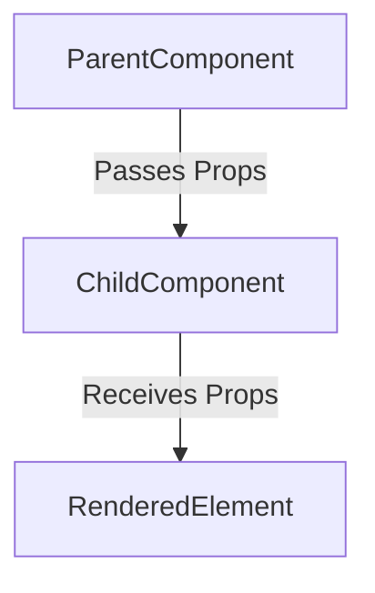

## 14.2 Functional Components and Props in React with TypeScript

React is a popular JavaScript library for building user interfaces, and TypeScript enhances it by adding type safety, making your code more predictable and easier to debug. In this section, we will explore how to create functional components in React using TypeScript, define and type props interfaces, and enhance code predictability.

### What are Functional Components?

Functional components in React are JavaScript functions that return React elements. They are a simpler way to write components that do not require lifecycle methods or state management. Functional components are often preferred for their simplicity and ease of testing.

#### Creating a Simple Functional Component

Let's start by creating a simple functional component in React using TypeScript:

```typescript
import React from 'react';

// Define a functional component
const Greeting: React.FC = () => {
  return <h1>Hello, World!</h1>;
};

export default Greeting;
```

In the example above, we define a functional component called `Greeting` using the `React.FC` type, which stands for "Function Component." This type provides type checking and autocomplete support for props and ensures that the component returns a valid React element.

### Defining and Typing Props Interfaces

Props (short for "properties") are a mechanism for passing data from parent components to child components in React. To ensure type safety, we define interfaces for the props that our components expect.

#### Creating a Props Interface

Let's create a functional component that accepts props:

```typescript
import React from 'react';

// Define an interface for the props
interface GreetingProps {
  name: string;
}

// Use the interface in the functional component
const Greeting: React.FC<GreetingProps> = ({ name }) => {
  return <h1>Hello, {name}!</h1>;
};

export default Greeting;
```

In this example, we define an interface `GreetingProps` with a single property `name` of type `string`. We then use this interface in our functional component by specifying `React.FC<GreetingProps>`. This ensures that the `Greeting` component expects a `name` prop of type `string`.

### Using Typed Props in Components

Typed props allow us to catch errors at compile time rather than runtime, making our code more robust and easier to maintain. Let's see another example with multiple props:

```typescript
import React from 'react';

// Define an interface for the props
interface UserProps {
  firstName: string;
  lastName: string;
  age: number;
}

// Use the interface in the functional component
const UserCard: React.FC<UserProps> = ({ firstName, lastName, age }) => {
  return (
    <div>
      <h2>{firstName} {lastName}</h2>
      <p>Age: {age}</p>
    </div>
  );
};

export default UserCard;
```

Here, the `UserCard` component expects three props: `firstName`, `lastName`, and `age`. By defining the `UserProps` interface, we ensure that the component receives the correct types for each prop.

### Default Props and Optional Props

In some cases, you may want to provide default values for props or make certain props optional. TypeScript allows us to define optional props using the `?` syntax in the interface.

#### Defining Optional Props

Let's modify the `UserCard` component to make the `age` prop optional:

```typescript
import React from 'react';

// Define an interface for the props
interface UserProps {
  firstName: string;
  lastName: string;
  age?: number; // Optional prop
}

// Use the interface in the functional component
const UserCard: React.FC<UserProps> = ({ firstName, lastName, age }) => {
  return (
    <div>
      <h2>{firstName} {lastName}</h2>
      <p>Age: {age ? age : 'Unknown'}</p>
    </div>
  );
};

export default UserCard;
```

In this example, the `age` prop is optional, indicated by the `?` after the property name. If `age` is not provided, the component will display "Unknown."

#### Providing Default Props

To provide default values for props, we can use default parameter syntax in the function signature:

```typescript
import React from 'react';

// Define an interface for the props
interface UserProps {
  firstName: string;
  lastName: string;
  age?: number;
}

// Use the interface in the functional component
const UserCard: React.FC<UserProps> = ({ firstName, lastName, age = 18 }) => {
  return (
    <div>
      <h2>{firstName} {lastName}</h2>
      <p>Age: {age}</p>
    </div>
  );
};

export default UserCard;
```

Here, we provide a default value of `18` for the `age` prop. If `age` is not passed, the component will use the default value.

### Prop Destructuring and Types for Cleaner Code

Destructuring props in the function signature is a common pattern in React that leads to cleaner and more readable code. It allows us to directly extract the values we need from the props object.

#### Destructuring Props

Let's revisit the `UserCard` component with prop destructuring:

```typescript
import React from 'react';

// Define an interface for the props
interface UserProps {
  firstName: string;
  lastName: string;
  age?: number;
}

// Use the interface in the functional component
const UserCard: React.FC<UserProps> = ({ firstName, lastName, age = 18 }) => {
  return (
    <div>
      <h2>{firstName} {lastName}</h2>
      <p>Age: {age}</p>
    </div>
  );
};

export default UserCard;
```

By destructuring the `firstName`, `lastName`, and `age` props directly in the function signature, we make the code more concise and easier to understand.

### Try It Yourself

Now that we've covered the basics of functional components and props in React with TypeScript, try experimenting with the examples provided. Here are some suggestions:

- Modify the `UserCard` component to include additional props, such as `email` or `address`.
- Create a new component that accepts an array of objects as a prop and renders a list.
- Experiment with different default values for optional props.

### Visualizing Component and Prop Flow

To better understand how components and props work together in React, let's visualize the flow using a diagram:



In this diagram, the `ParentComponent` passes props to the `ChildComponent`, which then uses these props to render elements. This flow illustrates the unidirectional data flow in React.

### References and Further Reading

- [React Documentation: Components and Props](https://reactjs.org/docs/components-and-props.html)
- [TypeScript Handbook: Interfaces](https://www.typescriptlang.org/docs/handbook/interfaces.html)
- [MDN Web Docs: Destructuring Assignment](https://developer.mozilla.org/en-US/docs/Web/JavaScript/Reference/Operators/Destructuring_assignment)

### Key Takeaways

- Functional components in React are simple functions that return React elements.
- Props are used to pass data from parent components to child components.
- TypeScript interfaces help ensure type safety for props, making your code more predictable.
- Optional props and default values provide flexibility in component usage.
- Destructuring props leads to cleaner and more readable code.

## Quiz Time!



### What is a functional component in React?

- [x] A JavaScript function that returns a React element
- [ ] A class that extends React.Component
- [ ] A method that handles state changes
- [ ] A function that manages lifecycle events

> **Explanation:** A functional component is a JavaScript function that returns a React element. It is a simpler way to write components that do not require lifecycle methods or state management.

### How do you define a props interface in TypeScript?

- [x] Using the `interface` keyword
- [ ] Using the `class` keyword
- [ ] Using the `function` keyword
- [ ] Using the `type` keyword

> **Explanation:** In TypeScript, you define a props interface using the `interface` keyword. This interface specifies the types of props that a component expects.

### What does the `React.FC` type represent?

- [x] Function Component
- [ ] Functional Class
- [ ] Functional Constructor
- [ ] Function Callback

> **Explanation:** `React.FC` stands for Function Component. It is a type that provides type checking and autocomplete support for props in functional components.

### How can you make a prop optional in TypeScript?

- [x] By adding a `?` after the prop name in the interface
- [ ] By using the `optional` keyword
- [ ] By setting the prop to `undefined`
- [ ] By using the `default` keyword

> **Explanation:** In TypeScript, you can make a prop optional by adding a `?` after the prop name in the interface. This indicates that the prop is not required.

### What is the benefit of destructuring props in a functional component?

- [x] It leads to cleaner and more readable code
- [ ] It makes the component faster
- [ ] It allows props to be modified
- [ ] It prevents props from being passed

> **Explanation:** Destructuring props in a functional component leads to cleaner and more readable code by directly extracting the values needed from the props object.

### How do you provide a default value for a prop in a functional component?

- [x] Using default parameter syntax in the function signature
- [ ] By setting the prop to `null`
- [ ] By using the `default` keyword
- [ ] By defining a defaultProps object

> **Explanation:** You provide a default value for a prop in a functional component using default parameter syntax in the function signature. This allows the component to use the default value if the prop is not provided.

### What is the purpose of props in React?

- [x] To pass data from parent components to child components
- [ ] To manage component state
- [ ] To handle events
- [ ] To define component styles

> **Explanation:** Props are used to pass data from parent components to child components in React. They allow components to be dynamic and reusable.

### Which of the following is a correct way to type a functional component with props in TypeScript?

- [x] `const MyComponent: React.FC<MyProps> = ({ prop1, prop2 }) => { ... }`
- [ ] `const MyComponent: React.Component<MyProps> = ({ prop1, prop2 }) => { ... }`
- [ ] `const MyComponent: React.Function<MyProps> = ({ prop1, prop2 }) => { ... }`
- [ ] `const MyComponent: React.Props<MyProps> = ({ prop1, prop2 }) => { ... }`

> **Explanation:** The correct way to type a functional component with props in TypeScript is by using `React.FC<MyProps>`, where `MyProps` is the interface defining the prop types.

### True or False: Functional components can have lifecycle methods.

- [ ] True
- [x] False

> **Explanation:** False. Functional components do not have lifecycle methods. They are simpler components that focus on rendering UI based on props.

### What is the advantage of using TypeScript with React?

- [x] It provides type safety, making the code more predictable and easier to debug
- [ ] It makes the code run faster
- [ ] It reduces the size of the application
- [ ] It allows the use of lifecycle methods in functional components

> **Explanation:** The advantage of using TypeScript with React is that it provides type safety, making the code more predictable and easier to debug. It helps catch errors at compile time rather than runtime.


