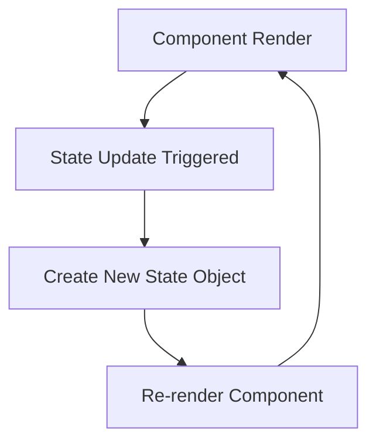

## 14.3 State Management with Hooks

In this section, we will explore how to manage state in React components using Hooks, specifically the `useState` hook, in combination with TypeScript. State management is a fundamental concept in React, allowing components to maintain and update data over time. By the end of this guide, you'll be able to effectively manage state in your React applications using TypeScript, ensuring type safety and predictability.

### Introduction to React Hooks

React Hooks are functions that let us use state and other React features in functional components. Before Hooks, state management was primarily handled in class components. However, Hooks provide a more concise and functional approach to managing state and other side effects in React components.

The `useState` hook is one of the most commonly used Hooks. It allows us to add state to functional components, making them more powerful and versatile.

### Understanding `useState`

The `useState` hook is a function that returns an array with two elements: the current state value and a function to update that state. Let's look at a simple example:

```typescript
import React, { useState } from 'react';

const Counter: React.FC = () => {
  // Declare a state variable 'count' with initial value 0
  const [count, setCount] = useState<number>(0);

  return (
    <div>
      <p>You clicked {count} times</p>
      <button onClick={() => setCount(count + 1)}>
        Click me
      </button>
    </div>
  );
};

export default Counter;
```

In this example, we use the `useState` hook to declare a state variable `count` and a function `setCount` to update it. The initial value of `count` is set to `0`. The `useState` hook is typed with `<number>`, indicating that `count` is a number.

### Typing State Variables and Setter Functions

When using TypeScript with `useState`, it is important to provide the correct type for the state variable. This ensures that the state variable and its updates are type-safe. Let's explore how to type state variables and setter functions:

```typescript
const [state, setState] = useState<Type>(initialState);
```

- **Type**: This is the type of the state variable. It can be a primitive type (like `number`, `string`, `boolean`) or a complex type (like an object or an array).
- **initialState**: This is the initial value of the state variable. It should match the specified type.

#### Example: Typing a String State

```typescript
const [name, setName] = useState<string>('John Doe');
```

In this example, `name` is a string state variable initialized with `'John Doe'`.

#### Example: Typing an Object State

```typescript
interface User {
  name: string;
  age: number;
}

const [user, setUser] = useState<User>({ name: 'Alice', age: 30 });
```

Here, `user` is an object state variable with properties `name` and `age`. The `User` interface defines the shape of the object.

### Handling Complex State Objects

When dealing with complex state objects, it's crucial to maintain immutability. This means that instead of directly modifying the state object, we create a new object with the updated values. This approach ensures that React can efficiently determine when to re-render components.

#### Example: Updating an Object State

```typescript
interface User {
  name: string;
  age: number;
}

const [user, setUser] = useState<User>({ name: 'Alice', age: 30 });

const updateUserName = (newName: string) => {
  setUser(prevUser => ({
    ...prevUser,
    name: newName
  }));
};
```

In this example, we use the spread operator (`...`) to create a new user object with the updated `name`. The `prevUser` parameter represents the previous state, which we spread into the new object to retain unchanged properties.

### Importance of Immutability in State Updates

Immutability is a key concept in React state management. By treating state as immutable, we ensure that changes to state are predictable and trackable. This approach helps React efficiently determine when a component needs to re-render, improving performance and reliability.

### Exercises: Practicing State Management

Let's put your knowledge to the test with some exercises. Try implementing the following scenarios using `useState` and TypeScript:

1. **Counter Component**: Create a counter component with increment and decrement buttons. Ensure the state variable is typed as a number.

2. **User Profile**: Build a user profile component that allows updating the user's name and age. Use an object to manage the state and ensure immutability when updating.

3. **Todo List**: Implement a simple todo list where you can add and remove tasks. Use an array of strings to manage the list of tasks.

### Try It Yourself

Now that you've learned the basics of state management with hooks, try modifying the examples above. For instance, add a reset button to the counter component or allow updating additional user properties in the user profile component. Experimenting with these examples will help reinforce your understanding of state management in React with TypeScript.

### Visual Aids

To help visualize the concept of state management, let's look at a simple flowchart depicting the state update process in a React component:



This flowchart illustrates the cycle of rendering a component, triggering a state update, creating a new state object, and re-rendering the component with the updated state.

### References and Links

For more information on React Hooks and state management, check out the following resources:

- [React Hooks Documentation](https://reactjs.org/docs/hooks-intro.html)
- [TypeScript with React](https://www.typescriptlang.org/docs/handbook/react.html)
- [MDN Web Docs: JavaScript](https://developer.mozilla.org/en-US/docs/Web/JavaScript)

### Engagement and Reinforcement

To further solidify your understanding, consider these questions:

- Why is immutability important in React state management?
- How does TypeScript enhance the use of `useState` in React components?
- What are some common pitfalls when managing state in React?

### Summary

In this section, we've explored how to manage state in React components using the `useState` hook and TypeScript. We've learned how to type state variables, handle complex state objects, and ensure immutability in state updates. By practicing these concepts, you'll be well-equipped to manage state effectively in your React applications.

## Quiz Time!



### What is the primary purpose of the `useState` hook in React?

- [x] To add state to functional components
- [ ] To manage side effects in components
- [ ] To handle component lifecycle events
- [ ] To create context providers

> **Explanation:** The `useState` hook is used to add state to functional components, allowing them to maintain and update data over time.

### How do you type a state variable using `useState` in TypeScript?

- [x] By providing a type argument to `useState`
- [ ] By using a type assertion
- [ ] By declaring a type interface
- [ ] By using a type guard

> **Explanation:** You type a state variable in TypeScript by providing a type argument to `useState`, ensuring type safety for the state variable.

### What is the correct way to update an object state in React?

- [x] Create a new object with updated values
- [ ] Directly modify the existing state object
- [ ] Use a type assertion to change the state
- [ ] Use a type guard to update the state

> **Explanation:** To update an object state in React, create a new object with updated values to maintain immutability.

### Why is immutability important in React state management?

- [x] It ensures predictable state changes
- [ ] It allows direct modification of state
- [ ] It prevents re-rendering of components
- [ ] It simplifies the component lifecycle

> **Explanation:** Immutability ensures predictable state changes, allowing React to efficiently determine when to re-render components.

### What does the `setState` function returned by `useState` do?

- [x] Updates the state variable
- [ ] Initializes the state variable
- [ ] Resets the state variable
- [ ] Deletes the state variable

> **Explanation:** The `setState` function updates the state variable, triggering a re-render of the component with the new state.

### How can you ensure immutability when updating an array state in React?

- [x] Use array methods like `map`, `filter`, or `concat`
- [ ] Directly modify the array elements
- [ ] Use a type assertion to change the array
- [ ] Use a type guard to update the array

> **Explanation:** Use array methods like `map`, `filter`, or `concat` to create a new array with the desired changes, ensuring immutability.

### What is the initial value of a state variable in `useState`?

- [x] The value passed as an argument to `useState`
- [ ] The default value of the variable's type
- [ ] The previous state value
- [ ] The value returned by a type guard

> **Explanation:** The initial value of a state variable is the value passed as an argument to `useState`.

### How does TypeScript enhance the use of `useState` in React components?

- [x] By providing type safety for state variables
- [ ] By simplifying the component lifecycle
- [ ] By allowing direct state modifications
- [ ] By preventing component re-renders

> **Explanation:** TypeScript enhances the use of `useState` by providing type safety for state variables, ensuring correct usage throughout the component.

### What is the purpose of the spread operator in state updates?

- [x] To create a new object or array with updated values
- [ ] To directly modify the existing state
- [ ] To delete properties from the state
- [ ] To reset the state to its initial value

> **Explanation:** The spread operator is used to create a new object or array with updated values, maintaining immutability in state updates.

### True or False: React Hooks can only be used in class components.

- [ ] True
- [x] False

> **Explanation:** False. React Hooks are designed to be used in functional components, providing state and other React features without the need for class components.


