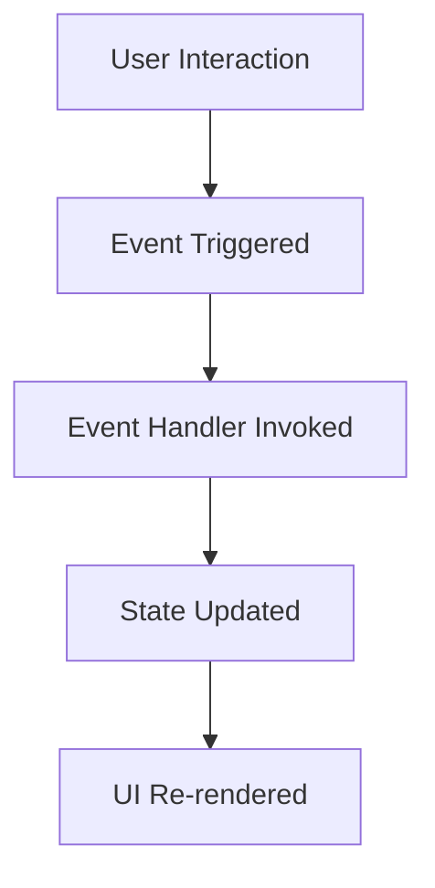

## 14.4 Handling Events in React

Handling events in React is a crucial part of building interactive web applications. With TypeScript, we can add type safety to our event handlers, ensuring that our code is both robust and easy to maintain. In this section, we'll explore how to handle various DOM events in React components using TypeScript, including clicks, form submissions, and keyboard events. We'll also delve into synthetic events and their interfaces in React, and discuss common patterns for managing default behaviors.

### Understanding Synthetic Events

React uses a system called "Synthetic Events" to handle events. Synthetic events are a cross-browser wrapper around the browser's native event system. They provide a consistent API regardless of the browser being used, which simplifies event handling in React applications.

#### Why Use Synthetic Events?

- **Cross-Browser Compatibility**: Synthetic events abstract away the differences between browsers, providing a consistent interface.
- **Performance**: React reuses event objects for performance reasons, pooling them to reduce memory overhead.
- **Unified API**: Synthetic events provide a unified API that makes it easier to handle events across different browsers.

### Typing Event Handlers

In TypeScript, we can use specific types provided by React to type our event handlers. This ensures that we handle events correctly and helps prevent common errors.

#### Common Event Types

- **`React.MouseEvent`**: Used for mouse events such as clicks.
- **`React.ChangeEvent`**: Used for form element changes.
- **`React.KeyboardEvent`**: Used for keyboard events.
- **`React.FormEvent`**: Used for form submissions.

Let's look at how to use these types in practice.

### Handling Click Events

Click events are one of the most common types of events in web applications. In React, we can handle click events using the `onClick` attribute.

```tsx
import React from 'react';

const ClickButton: React.FC = () => {
  const handleClick = (event: React.MouseEvent<HTMLButtonElement>) => {
    event.preventDefault(); // Prevent default behavior
    console.log('Button clicked!');
  };

  return <button onClick={handleClick}>Click Me</button>;
};

export default ClickButton;
```

#### Explanation

- **Event Parameter**: The `handleClick` function receives a `React.MouseEvent<HTMLButtonElement>` parameter, which provides information about the click event.
- **Prevent Default**: We use `event.preventDefault()` to prevent the default action associated with the event.

### Handling Form Submissions

Forms are essential for collecting user input. Handling form submissions involves capturing the form's data and preventing the default submission behavior.

```tsx
import React, { useState } from 'react';

const FormComponent: React.FC = () => {
  const [inputValue, setInputValue] = useState<string>('');

  const handleSubmit = (event: React.FormEvent<HTMLFormElement>) => {
    event.preventDefault(); // Prevent form submission
    console.log('Form submitted with:', inputValue);
  };

  return (
    <form onSubmit={handleSubmit}>
      <input
        type="text"
        value={inputValue}
        onChange={(e) => setInputValue(e.target.value)}
      />
      <button type="submit">Submit</button>
    </form>
  );
};

export default FormComponent;
```

#### Explanation

- **Form Submission**: We handle the form submission using the `onSubmit` attribute.
- **Type Safety**: The `handleSubmit` function is typed with `React.FormEvent<HTMLFormElement>`.
- **State Management**: We use the `useState` hook to manage the input value.

### Handling Keyboard Events

Keyboard events are useful for capturing user interactions with the keyboard, such as pressing keys.

```tsx
import React from 'react';

const KeyPressComponent: React.FC = () => {
  const handleKeyPress = (event: React.KeyboardEvent<HTMLInputElement>) => {
    if (event.key === 'Enter') {
      console.log('Enter key pressed');
    }
  };

  return <input type="text" onKeyPress={handleKeyPress} />;
};

export default KeyPressComponent;
```

#### Explanation

- **Key Detection**: We check if the `Enter` key is pressed using `event.key`.
- **Typing**: The `handleKeyPress` function is typed with `React.KeyboardEvent<HTMLInputElement>`.

### Handling Change Events

Change events are triggered when the value of an input element changes. They are commonly used in forms.

```tsx
import React, { useState } from 'react';

const InputComponent: React.FC = () => {
  const [text, setText] = useState<string>('');

  const handleChange = (event: React.ChangeEvent<HTMLInputElement>) => {
    setText(event.target.value);
  };

  return <input type="text" value={text} onChange={handleChange} />;
};

export default InputComponent;
```

#### Explanation

- **State Update**: We update the state with the new input value using `setText`.
- **Typing**: The `handleChange` function is typed with `React.ChangeEvent<HTMLInputElement>`.

### Common Patterns for Handling Events

When handling events in React, there are several common patterns that can help you write cleaner and more efficient code.

#### Preventing Default Behaviors

Often, you'll want to prevent the default behavior of an event, such as form submission or link navigation. This can be done using `event.preventDefault()`.

```tsx
const handleClick = (event: React.MouseEvent<HTMLAnchorElement>) => {
  event.preventDefault();
  console.log('Link clicked, but default behavior prevented.');
};
```

#### Stopping Event Propagation

Sometimes, you might want to stop an event from propagating to parent elements. This can be achieved using `event.stopPropagation()`.

```tsx
const handleDivClick = (event: React.MouseEvent<HTMLDivElement>) => {
  event.stopPropagation();
  console.log('Div clicked, but event propagation stopped.');
};
```

### Try It Yourself

Experiment with the code examples provided. Try modifying the event handlers to log different messages or perform different actions. For example:

- Change the `handleClick` function to log the coordinates of the click event.
- Modify the `handleKeyPress` function to detect different keys.
- Update the `handleChange` function to transform the input value before setting it in the state.

### Visualizing Event Handling

To better understand how events flow in a React application, let's visualize the process using a flowchart.



#### Diagram Explanation

- **User Interaction**: The process begins with a user interaction, such as a click or key press.
- **Event Triggered**: The interaction triggers an event.
- **Event Handler Invoked**: The event handler associated with the event is invoked.
- **State Updated**: The event handler may update the component's state.
- **UI Re-rendered**: React re-renders the UI to reflect any state changes.

### References and Further Reading

- [React Documentation on Handling Events](https://reactjs.org/docs/handling-events.html)
- [TypeScript Handbook on React](https://www.typescriptlang.org/docs/handbook/react.html)
- [MDN Web Docs on Event Handling](https://developer.mozilla.org/en-US/docs/Web/API/EventTarget/addEventListener)

### Engagement and Reinforcement

To reinforce your understanding, consider the following exercises:

1. Create a form with multiple input fields and handle their changes using a single event handler.
2. Implement a component that changes its background color when a specific key is pressed.
3. Build a simple to-do list application that handles form submissions and displays the list of tasks.

### Key Takeaways

- **Synthetic Events**: React's synthetic events provide a consistent API for handling events across browsers.
- **Type Safety**: Use TypeScript's event types to ensure type safety in your event handlers.
- **Common Patterns**: Prevent default behaviors and stop event propagation when necessary.

## Quiz Time!



### What is a synthetic event in React?

- [x] A cross-browser wrapper around the browser's native event system.
- [ ] A native event provided by the browser.
- [ ] A custom event created by the developer.
- [ ] An event that only works in Internet Explorer.

> **Explanation:** Synthetic events are a cross-browser wrapper around the browser's native event system, providing a consistent API.

### Which type is used for typing mouse events in React?

- [ ] React.KeyboardEvent
- [x] React.MouseEvent
- [ ] React.ChangeEvent
- [ ] React.FormEvent

> **Explanation:** `React.MouseEvent` is used for typing mouse events in React.

### How do you prevent the default behavior of an event in React?

- [ ] event.stopPropagation()
- [x] event.preventDefault()
- [ ] event.stopDefault()
- [ ] event.prevent()

> **Explanation:** `event.preventDefault()` is used to prevent the default behavior of an event.

### What is the purpose of `event.stopPropagation()`?

- [x] To stop an event from propagating to parent elements.
- [ ] To prevent the default behavior of an event.
- [ ] To log the event to the console.
- [ ] To trigger a custom event.

> **Explanation:** `event.stopPropagation()` stops an event from propagating to parent elements.

### Which type is used for typing form submission events in React?

- [ ] React.MouseEvent
- [ ] React.KeyboardEvent
- [x] React.FormEvent
- [ ] React.ChangeEvent

> **Explanation:** `React.FormEvent` is used for typing form submission events in React.

### What method is used to update the state in a React component?

- [ ] setState()
- [x] useState()
- [ ] updateState()
- [ ] changeState()

> **Explanation:** `useState()` is the hook used to manage state in functional components.

### Which event type is used for handling changes in input elements?

- [ ] React.MouseEvent
- [ ] React.KeyboardEvent
- [ ] React.FormEvent
- [x] React.ChangeEvent

> **Explanation:** `React.ChangeEvent` is used for handling changes in input elements.

### What is the purpose of using TypeScript in React?

- [x] To add type safety and prevent common errors.
- [ ] To make the code run faster.
- [ ] To increase the size of the application.
- [ ] To replace JavaScript entirely.

> **Explanation:** TypeScript adds type safety, helping to prevent common errors and improve code quality.

### How can you detect the Enter key press in a keyboard event?

- [ ] if (event.keyCode === 13)
- [x] if (event.key === 'Enter')
- [ ] if (event.key === 'EnterKey')
- [ ] if (event.code === 'Enter')

> **Explanation:** `event.key` is used to detect specific keys, such as the Enter key.

### True or False: React's synthetic events are specific to each browser.

- [ ] True
- [x] False

> **Explanation:** React's synthetic events provide a consistent API across all browsers, abstracting away browser-specific differences.


