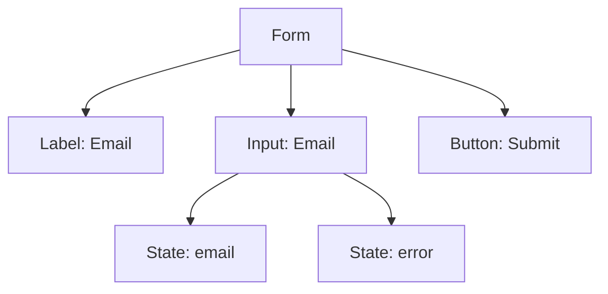

## 14.5 Forms and Controlled Components

In this section, we will explore how to build forms in React using TypeScript, focusing on controlled and uncontrolled components, managing form inputs, and implementing form validation. By the end of this section, you will have a solid understanding of how to handle form data effectively and provide a seamless user experience.

### Understanding Controlled vs. Uncontrolled Components

Before diving into form management, it's essential to understand the difference between controlled and uncontrolled components in React.

#### Controlled Components

In React, a controlled component is a form element whose value is controlled by React state. This means that the form data is handled by the component's state, and any changes to the form input are managed through event handlers.

**Example of a Controlled Component:**

```typescript
import React, { useState } from 'react';

const ControlledForm = () => {
  const [inputValue, setInputValue] = useState<string>('');

  const handleChange = (event: React.ChangeEvent<HTMLInputElement>) => {
    setInputValue(event.target.value);
  };

  return (
    <div>
      <label htmlFor="controlled-input">Controlled Input:</label>
      <input
        type="text"
        id="controlled-input"
        value={inputValue}
        onChange={handleChange}
      />
      <p>Current Value: {inputValue}</p>
    </div>
  );
};

export default ControlledForm;
```

In this example, the `inputValue` state variable holds the current value of the input field. The `handleChange` function updates this state whenever the input changes, ensuring that the component's state is always in sync with the input value.

#### Uncontrolled Components

Uncontrolled components, on the other hand, rely on the DOM to manage their state. Instead of using React state, you access the input value using a `ref`.

**Example of an Uncontrolled Component:**

```typescript
import React, { useRef } from 'react';

const UncontrolledForm = () => {
  const inputRef = useRef<HTMLInputElement>(null);

  const handleSubmit = () => {
    if (inputRef.current) {
      alert(`Uncontrolled Input Value: ${inputRef.current.value}`);
    }
  };

  return (
    <div>
      <label htmlFor="uncontrolled-input">Uncontrolled Input:</label>
      <input type="text" id="uncontrolled-input" ref={inputRef} />
      <button type="button" onClick={handleSubmit}>
        Submit
      </button>
    </div>
  );
};

export default UncontrolledForm;
```

In this example, we use a `ref` to access the input value directly from the DOM when the form is submitted.

### Managing Form Inputs Using State

Controlled components are generally preferred in React because they provide a single source of truth for form data, making it easier to manage and validate inputs.

#### Typing Input Change Handlers

When working with TypeScript, it's important to type your event handlers to ensure type safety. The `React.ChangeEvent` type is commonly used for input change events.

**Example of Typing Input Change Handlers:**

```typescript
const handleChange = (event: React.ChangeEvent<HTMLInputElement>) => {
  setInputValue(event.target.value);
};
```

In this example, `event` is typed as `React.ChangeEvent<HTMLInputElement>`, ensuring that TypeScript can infer the correct types for `event.target` and `event.target.value`.

### Form Validation and Error Handling

Form validation is crucial for ensuring that users provide valid data. In React, you can implement form validation by adding logic to your event handlers and state management.

#### Basic Form Validation Example

Let's create a simple form with validation for an email input:

```typescript
import React, { useState } from 'react';

const EmailForm = () => {
  const [email, setEmail] = useState<string>('');
  const [error, setError] = useState<string | null>(null);

  const handleChange = (event: React.ChangeEvent<HTMLInputElement>) => {
    setEmail(event.target.value);
  };

  const validateEmail = (email: string): boolean => {
    const emailRegex = /^[^\s@]+@[^\s@]+\.[^\s@]+$/;
    return emailRegex.test(email);
  };

  const handleSubmit = (event: React.FormEvent) => {
    event.preventDefault();
    if (validateEmail(email)) {
      setError(null);
      alert(`Email submitted: ${email}`);
    } else {
      setError('Please enter a valid email address.');
    }
  };

  return (
    <form onSubmit={handleSubmit}>
      <label htmlFor="email">Email:</label>
      <input type="email" id="email" value={email} onChange={handleChange} />
      {error && <p style={{ color: 'red' }}>{error}</p>}
      <button type="submit">Submit</button>
    </form>
  );
};

export default EmailForm;
```

In this example, we use a regular expression to validate the email format. If the email is invalid, an error message is displayed.

### Best Practices for Form Management and User Experience

1. **Keep Forms Simple and Intuitive**: Ensure that forms are easy to understand and fill out. Use clear labels and provide examples if necessary.

2. **Provide Real-time Feedback**: Validate inputs as users type and provide immediate feedback. This helps users correct errors before submitting the form.

3. **Use Accessible Form Elements**: Ensure that form elements are accessible to all users, including those using screen readers. Use semantic HTML and ARIA attributes where necessary.

4. **Handle Errors Gracefully**: Display error messages in a user-friendly manner. Avoid technical jargon and provide clear instructions on how to correct errors.

5. **Optimize for Mobile**: Ensure that forms are responsive and easy to use on mobile devices. Use appropriate input types (e.g., `email`, `tel`) to trigger the correct keyboard on mobile devices.

### Try It Yourself

To reinforce your understanding, try modifying the examples provided:

- Add additional input fields to the controlled form and manage their state.
- Implement a password validation function that checks for a minimum length and includes special characters.
- Experiment with different input types, such as checkboxes and radio buttons, and manage their state in a controlled manner.

### Visualizing the Form Structure

Let's visualize the structure of a simple form using a DOM tree diagram:



This diagram represents the relationship between form elements and their corresponding state variables.

### References and Links

For further reading on React forms and TypeScript, consider the following resources:

- [React Documentation: Forms](https://reactjs.org/docs/forms.html)
- [TypeScript Handbook: React & JSX](https://www.typescriptlang.org/docs/handbook/jsx.html)
- [MDN Web Docs: Form Validation](https://developer.mozilla.org/en-US/docs/Learn/Forms/Form_validation)

### Engagement and Reinforcement

- **Question**: What are the advantages of using controlled components over uncontrolled components?
- **Exercise**: Create a form with multiple input fields and implement validation for each field.

### Summary

In this section, we've explored the concepts of controlled and uncontrolled components in React, learned how to manage form inputs using state, and implemented form validation. By following best practices, you can create user-friendly forms that provide a seamless experience for your users.

## Quiz Time!



### What is a controlled component in React?

- [x] A component where form data is handled by React state.
- [ ] A component that relies on the DOM to manage its state.
- [ ] A component that does not use any state management.
- [ ] A component that uses refs to access input values.

> **Explanation:** A controlled component is one where the form data is handled by React state, allowing for a single source of truth.

### How do you type an input change handler in TypeScript?

- [x] Use `React.ChangeEvent<HTMLInputElement>`.
- [ ] Use `React.MouseEvent<HTMLButtonElement>`.
- [ ] Use `React.KeyboardEvent<HTMLInputElement>`.
- [ ] Use `React.FormEvent<HTMLFormElement>`.

> **Explanation:** The correct type for an input change handler is `React.ChangeEvent<HTMLInputElement>`.

### What is the purpose of form validation?

- [x] To ensure users provide valid data.
- [ ] To style form elements.
- [ ] To manage form layout.
- [ ] To handle form submissions.

> **Explanation:** Form validation ensures that users provide valid data before submitting the form.

### Which of the following is a best practice for form management?

- [x] Provide real-time feedback to users.
- [ ] Use technical jargon in error messages.
- [ ] Avoid using labels for inputs.
- [ ] Ignore mobile optimization.

> **Explanation:** Providing real-time feedback helps users correct errors before submitting the form.

### What is the benefit of using semantic HTML in forms?

- [x] It improves accessibility for screen readers.
- [ ] It reduces the need for CSS.
- [ ] It increases form submission speed.
- [ ] It eliminates the need for JavaScript.

> **Explanation:** Semantic HTML improves accessibility, making forms easier to navigate for users with screen readers.

### How can you access the value of an uncontrolled input?

- [x] Use a `ref` to access the input value directly from the DOM.
- [ ] Use React state to manage the input value.
- [ ] Use a global variable to store the input value.
- [ ] Use a callback function to retrieve the input value.

> **Explanation:** Uncontrolled inputs use `refs` to access their values directly from the DOM.

### What is the role of the `useState` hook in controlled components?

- [x] To manage the state of form inputs.
- [ ] To fetch data from an API.
- [ ] To render components conditionally.
- [ ] To handle side effects.

> **Explanation:** The `useState` hook is used to manage the state of form inputs in controlled components.

### Why is it important to handle errors gracefully in forms?

- [x] To provide a better user experience.
- [ ] To increase form submission speed.
- [ ] To reduce code complexity.
- [ ] To eliminate the need for validation.

> **Explanation:** Handling errors gracefully improves the user experience by providing clear instructions on how to correct errors.

### What is the purpose of using `aria` attributes in forms?

- [x] To improve accessibility for users with disabilities.
- [ ] To style form elements.
- [ ] To manage form layout.
- [ ] To handle form submissions.

> **Explanation:** `aria` attributes improve accessibility by providing additional information to assistive technologies.

### True or False: Controlled components provide a single source of truth for form data.

- [x] True
- [ ] False

> **Explanation:** Controlled components provide a single source of truth by managing form data through React state.


