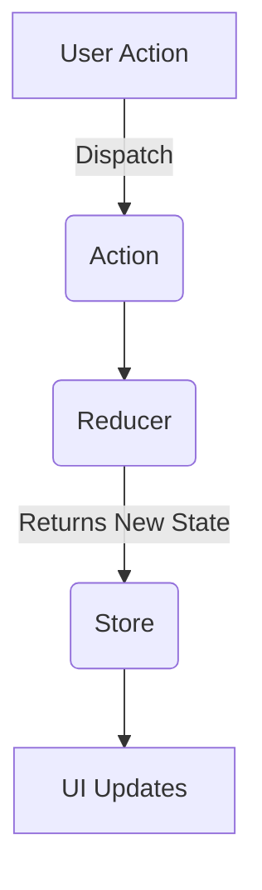

## 14.7 Introduction to Redux with TypeScript

State management is a crucial aspect of building scalable and maintainable applications, especially when dealing with complex user interfaces. Redux is a popular library that helps manage state in JavaScript applications by providing a predictable state container. In this section, we will explore how to integrate Redux with TypeScript, ensuring type safety and enhancing the development experience.

### Understanding Redux: Core Principles

Redux is based on a few core principles that make it predictable and easy to understand:

1. **Single Source of Truth**: The entire state of the application is stored in a single JavaScript object called the store.
2. **State is Read-Only**: The only way to change the state is by dispatching an action, an object describing what happened.
3. **Changes are Made with Pure Functions**: To specify how the state tree is transformed by actions, you write pure functions called reducers.

These principles ensure that the state management logic is centralized and predictable, making it easier to debug and test.

### Setting Up Redux in a TypeScript Project

To get started with Redux in a TypeScript project, we need to install the necessary packages. Let's assume you already have a React and TypeScript project set up. If not, you can create one using Create React App with TypeScript support:

```bash
npx create-react-app my-app --template typescript
```

Next, install Redux and the React bindings for Redux:

```bash
npm install redux react-redux
```

For TypeScript support, we also need to install the type definitions:

```bash
npm install @types/react-redux
```

### Typing Actions and Action Creators

Actions in Redux are plain JavaScript objects that describe what happened in the application. They typically have a `type` property and may include additional data. In TypeScript, we can define action types using string constants and create action creators with type annotations.

```typescript
// actionTypes.ts
export const INCREMENT = 'INCREMENT';
export const DECREMENT = 'DECREMENT';

// actions.ts
import { INCREMENT, DECREMENT } from './actionTypes';

interface IncrementAction {
  type: typeof INCREMENT;
}

interface DecrementAction {
  type: typeof DECREMENT;
}

export type CounterActionTypes = IncrementAction | DecrementAction;

export const increment = (): IncrementAction => ({ type: INCREMENT });
export const decrement = (): DecrementAction => ({ type: DECREMENT });
```

### Creating and Typing Reducers

Reducers are pure functions that take the current state and an action as arguments and return a new state. In TypeScript, we can define the state shape and ensure that our reducer handles all possible action types.

```typescript
// reducer.ts
import { CounterActionTypes, INCREMENT, DECREMENT } from './actions';

interface CounterState {
  count: number;
}

const initialState: CounterState = {
  count: 0,
};

const counterReducer = (
  state = initialState,
  action: CounterActionTypes
): CounterState => {
  switch (action.type) {
    case INCREMENT:
      return { count: state.count + 1 };
    case DECREMENT:
      return { count: state.count - 1 };
    default:
      return state;
  }
};

export default counterReducer;
```

### Configuring the Redux Store

The store holds the application state and provides methods to dispatch actions and subscribe to state changes. We can create a store using the `createStore` function from Redux and pass our reducer to it.

```typescript
// store.ts
import { createStore } from 'redux';
import counterReducer from './reducer';

const store = createStore(counterReducer);

export default store;
```

### Dispatching Actions and Selecting State

With the store configured, we can dispatch actions to update the state and select state values in our components. The `useDispatch` and `useSelector` hooks from `react-redux` make this process straightforward.

```typescript
// Counter.tsx
import React from 'react';
import { useDispatch, useSelector } from 'react-redux';
import { increment, decrement } from './actions';
import { CounterState } from './reducer';

const Counter: React.FC = () => {
  const dispatch = useDispatch();
  const count = useSelector((state: CounterState) => state.count);

  return (
    <div>
      <h1>Count: {count}</h1>
      <button onClick={() => dispatch(increment())}>Increment</button>
      <button onClick={() => dispatch(decrement())}>Decrement</button>
    </div>
  );
};

export default Counter;
```

### Middleware and Integrating Redux DevTools

Middleware in Redux provides a way to extend the store's capabilities by intercepting dispatched actions. Common middleware includes `redux-thunk` for handling asynchronous actions. We can also integrate Redux DevTools for debugging.

```typescript
// store.ts
import { createStore, applyMiddleware } from 'redux';
import thunk from 'redux-thunk';
import { composeWithDevTools } from 'redux-devtools-extension';
import counterReducer from './reducer';

const store = createStore(
  counterReducer,
  composeWithDevTools(applyMiddleware(thunk))
);

export default store;
```

### Try It Yourself

Now that we have a basic understanding of Redux with TypeScript, try modifying the code to add a new action that resets the count to zero. Update the action types, action creators, reducer, and component to handle this new action.

### Visualizing Redux Flow

To help visualize the flow of data in a Redux application, let's use a diagram to illustrate how actions, reducers, and the store interact.



This diagram shows that user actions trigger dispatches, which are processed by reducers to update the store, leading to UI updates.

### Additional Resources

For more information on Redux and TypeScript, consider exploring the following resources:

- [Redux Official Documentation](https://redux.js.org/)
- [TypeScript Handbook](https://www.typescriptlang.org/docs/handbook/intro.html)
- [React Redux TypeScript Guide](https://react-redux.js.org/using-react-redux/usage-with-typescript)

### Key Takeaways

- Redux provides a predictable state container for JavaScript applications.
- TypeScript enhances Redux by providing type safety for actions, reducers, and the store.
- Middleware and Redux DevTools can extend and debug your Redux setup.

## Quiz Time!



### What is the primary purpose of Redux?

- [x] To manage application state predictably
- [ ] To style components
- [ ] To handle HTTP requests
- [ ] To manage component lifecycle

> **Explanation:** Redux is primarily used to manage application state in a predictable manner.

### Which principle of Redux states that the entire state is stored in a single object?

- [x] Single Source of Truth
- [ ] State is Read-Only
- [ ] Changes are Made with Pure Functions
- [ ] Action Dispatching

> **Explanation:** The Single Source of Truth principle states that the entire state is stored in a single object.

### What is the role of a reducer in Redux?

- [x] To specify how the state changes in response to actions
- [ ] To dispatch actions
- [ ] To store the application state
- [ ] To render components

> **Explanation:** Reducers specify how the state changes in response to actions.

### What TypeScript type is used to define action types?

- [x] String constants
- [ ] Numbers
- [ ] Booleans
- [ ] Arrays

> **Explanation:** Action types are defined using string constants in TypeScript.

### Which hook is used to dispatch actions in a React component?

- [x] useDispatch
- [ ] useState
- [ ] useEffect
- [ ] useReducer

> **Explanation:** The `useDispatch` hook is used to dispatch actions in a React component.

### What middleware is commonly used for handling asynchronous actions in Redux?

- [x] redux-thunk
- [ ] redux-saga
- [ ] redux-logger
- [ ] redux-promise

> **Explanation:** `redux-thunk` is commonly used for handling asynchronous actions in Redux.

### How do you integrate Redux DevTools in a TypeScript project?

- [x] By using composeWithDevTools
- [ ] By installing redux-logger
- [ ] By using useSelector
- [ ] By using useDispatch

> **Explanation:** Redux DevTools can be integrated using `composeWithDevTools`.

### What is the purpose of the `useSelector` hook?

- [x] To select state from the Redux store
- [ ] To dispatch actions
- [ ] To create reducers
- [ ] To define action types

> **Explanation:** The `useSelector` hook is used to select state from the Redux store.

### Which package provides type definitions for React Redux?

- [x] @types/react-redux
- [ ] @types/redux
- [ ] @types/react
- [ ] @types/react-router

> **Explanation:** The `@types/react-redux` package provides type definitions for React Redux.

### True or False: Redux requires TypeScript to function correctly.

- [ ] True
- [x] False

> **Explanation:** Redux does not require TypeScript to function, but TypeScript enhances the development experience by providing type safety.


