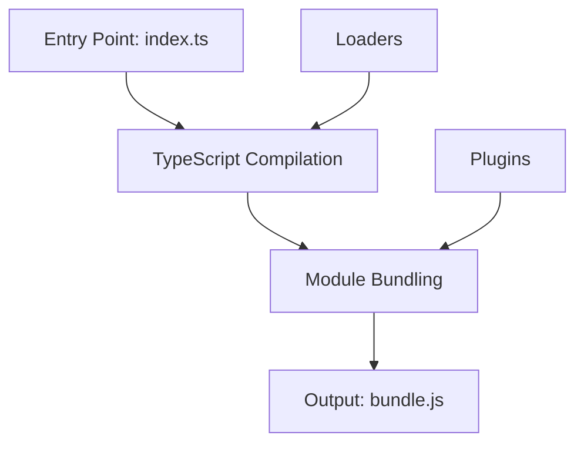

## 15.1 Using Webpack with TypeScript

In this section, we'll explore how to use Webpack with TypeScript to bundle your applications for deployment. Webpack is a powerful tool that helps manage and optimize your code, making it easier to maintain and deploy. Let's dive in!

### What is Webpack?

Webpack is a module bundler for modern JavaScript applications. It takes modules with dependencies and generates static assets representing those modules. In simpler terms, Webpack helps you bundle your JavaScript files into a single file (or a few files) that can be easily included in your web pages.

#### Why Use Webpack?

- **Module Bundling**: Webpack bundles all your JavaScript files into a single file, reducing the number of HTTP requests needed to load a page.
- **Code Splitting**: It allows you to split your code into smaller chunks, which can be loaded on demand, improving load times.
- **Asset Management**: Webpack can manage and optimize other assets like CSS, images, and fonts.
- **Development Tools**: It provides features like hot module replacement, which speeds up development by updating modules in the browser without a full reload.

### Setting Up Webpack with TypeScript

To get started with Webpack and TypeScript, you'll need to set up a basic project structure and install the necessary packages.

#### Step 1: Initialize Your Project

First, create a new directory for your project and navigate into it:

```bash
mkdir my-typescript-app
cd my-typescript-app
```

Initialize a new Node.js project:

```bash
npm init -y
```

This command creates a `package.json` file with default settings.

#### Step 2: Install Webpack and TypeScript

Next, install Webpack, TypeScript, and the necessary loaders:

```bash
npm install --save-dev webpack webpack-cli typescript ts-loader
```

- **webpack**: The core Webpack library.
- **webpack-cli**: Command-line interface for Webpack.
- **typescript**: TypeScript compiler.
- **ts-loader**: A TypeScript loader for Webpack.

#### Step 3: Configure TypeScript

Create a `tsconfig.json` file to configure the TypeScript compiler:

```json
{
  "compilerOptions": {
    "target": "es5",
    "module": "es6",
    "strict": true,
    "esModuleInterop": true,
    "skipLibCheck": true,
    "forceConsistentCasingInFileNames": true
  },
  "include": ["src"]
}
```

This configuration specifies that TypeScript should compile to ES5, use ES6 modules, and include all files in the `src` directory.

#### Step 4: Set Up Webpack Configuration

Create a `webpack.config.js` file to configure Webpack:

```javascript
const path = require('path');

module.exports = {
  entry: './src/index.ts',
  module: {
    rules: [
      {
        test: /\.ts$/,
        use: 'ts-loader',
        exclude: /node_modules/,
      },
    ],
  },
  resolve: {
    extensions: ['.ts', '.js'],
  },
  output: {
    filename: 'bundle.js',
    path: path.resolve(__dirname, 'dist'),
  },
};
```

- **entry**: The entry point of your application.
- **module.rules**: Specifies that `ts-loader` should handle `.ts` files.
- **resolve.extensions**: Allows Webpack to resolve `.ts` and `.js` files.
- **output**: Defines the output file (`bundle.js`) and directory (`dist`).

### Running Your Webpack Build

Add a build script to your `package.json`:

```json
"scripts": {
  "build": "webpack"
}
```

Now, you can build your project by running:

```bash
npm run build
```

This command compiles your TypeScript code and bundles it into `dist/bundle.js`.

### Code Splitting

Code splitting is a powerful feature of Webpack that allows you to split your code into separate bundles. This can improve load times by only loading the necessary code for a given page.

#### Dynamic Imports

You can use dynamic imports to split your code:

```typescript
function loadModule() {
  import('./module').then((module) => {
    module.doSomething();
  });
}
```

Webpack will create a separate bundle for `module.ts`, which will be loaded only when `loadModule` is called.

### Loaders and Plugins

#### Loaders

Loaders allow you to preprocess files as they are loaded. For example, you can use loaders to transpile TypeScript, compile Sass to CSS, or optimize images.

#### Plugins

Plugins extend Webpack's functionality. For example, you can use plugins to generate HTML files, clean the output directory, or define environment variables.

### Example: Using a Plugin

Install the `html-webpack-plugin`:

```bash
npm install --save-dev html-webpack-plugin
```

Update your `webpack.config.js` to use the plugin:

```javascript
const HtmlWebpackPlugin = require('html-webpack-plugin');

module.exports = {
  // ... other configurations ...
  plugins: [
    new HtmlWebpackPlugin({
      template: './src/index.html',
    }),
  ],
};
```

This configuration generates an `index.html` file in the `dist` directory, including a script tag for `bundle.js`.

### Troubleshooting Tips

- **Module Not Found**: Ensure your file paths are correct and that the necessary loaders are installed.
- **TypeScript Errors**: Check your `tsconfig.json` for any misconfigurations.
- **Build Performance**: Use the `--mode production` flag for optimized builds.

### Try It Yourself

Experiment with the following:

- Add a CSS file and use `css-loader` and `style-loader` to include it in your bundle.
- Split your code into multiple entry points and observe how Webpack handles them.
- Use the `CleanWebpackPlugin` to clean the `dist` directory before each build.

### Visualizing the Webpack Process

Below is a Mermaid diagram illustrating the Webpack bundling process:



This diagram shows how Webpack takes an entry point, compiles TypeScript, bundles modules, and produces an output file, with plugins and loaders enhancing the process.

### Key Takeaways

- Webpack is a powerful tool for bundling JavaScript applications.
- TypeScript can be integrated with Webpack using `ts-loader`.
- Code splitting and plugins enhance the functionality and performance of your builds.
- Troubleshooting involves checking paths, configurations, and performance settings.

### Further Reading

- [Webpack Documentation](https://webpack.js.org/)
- [TypeScript Documentation](https://www.typescriptlang.org/docs/)
- [ts-loader GitHub Repository](https://github.com/TypeStrong/ts-loader)

## Quiz Time!



### What is the primary purpose of Webpack?

- [x] To bundle JavaScript files for deployment
- [ ] To compile TypeScript to JavaScript
- [ ] To manage CSS stylesheets
- [ ] To optimize images

> **Explanation:** Webpack is primarily used to bundle JavaScript files, although it can also manage other assets.

### Which package is used to load TypeScript files in Webpack?

- [ ] babel-loader
- [x] ts-loader
- [ ] css-loader
- [ ] file-loader

> **Explanation:** `ts-loader` is specifically designed to load and compile TypeScript files in Webpack.

### What is the purpose of the `resolve.extensions` option in Webpack?

- [x] To specify file extensions Webpack should resolve
- [ ] To define output file names
- [ ] To set the entry point of the application
- [ ] To configure plugins

> **Explanation:** `resolve.extensions` tells Webpack which file extensions to resolve automatically.

### How can you split your code into separate bundles in Webpack?

- [ ] By using plugins
- [x] By using dynamic imports
- [ ] By configuring the output option
- [ ] By setting up multiple entry points

> **Explanation:** Dynamic imports allow Webpack to split code into separate bundles that can be loaded on demand.

### Which plugin generates an HTML file that includes your Webpack bundles?

- [ ] CleanWebpackPlugin
- [x] HtmlWebpackPlugin
- [ ] MiniCssExtractPlugin
- [ ] TerserPlugin

> **Explanation:** `HtmlWebpackPlugin` generates an HTML file with script tags for your bundles.

### What command do you use to build your project with Webpack?

- [ ] npm start
- [x] npm run build
- [ ] npm install
- [ ] npm test

> **Explanation:** `npm run build` executes the build script defined in `package.json`.

### Which Webpack feature improves load times by loading only necessary code?

- [ ] Plugins
- [ ] Loaders
- [x] Code splitting
- [ ] Entry points

> **Explanation:** Code splitting improves load times by loading only the code needed for a particular page or feature.

### What should you check if you encounter a "Module Not Found" error?

- [x] File paths and loader installations
- [ ] TypeScript version
- [ ] CSS stylesheets
- [ ] HTML templates

> **Explanation:** "Module Not Found" errors often result from incorrect file paths or missing loaders.

### What does the `--mode production` flag do in Webpack?

- [ ] Enables hot module replacement
- [x] Optimizes the build for production
- [ ] Disables code splitting
- [ ] Compiles TypeScript to JavaScript

> **Explanation:** The `--mode production` flag optimizes the build for production, reducing file size and improving performance.

### True or False: Webpack can only bundle JavaScript files.

- [ ] True
- [x] False

> **Explanation:** Webpack can bundle various types of files, including JavaScript, CSS, images, and more, using appropriate loaders.


