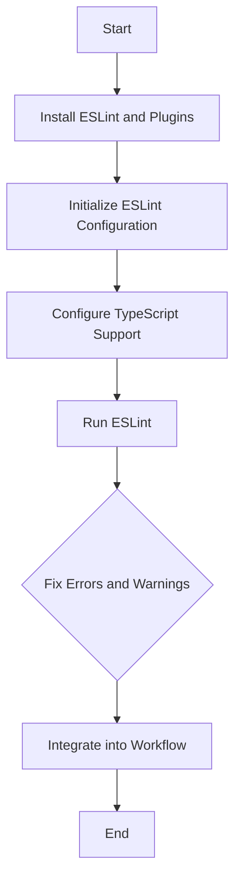

## 15.2 Linting with ESLint

In the world of software development, maintaining a consistent code style and ensuring code quality are crucial for the success of any project. This is where linting comes into play. In this section, we will explore how to set up ESLint, a popular linting tool, to enforce code quality and style guidelines in TypeScript projects. We will cover the importance of linting, the steps to install and configure ESLint with TypeScript support, popular ESLint configurations, and how to fix linting errors and warnings. By the end of this section, you'll be equipped to integrate linting seamlessly into your development workflow.

### Why Linting Matters

Linting is the process of analyzing code to identify potential errors, enforce coding standards, and improve code quality. It serves several important purposes:

- **Consistency**: Linting ensures that code follows a consistent style, making it easier to read and maintain.
- **Error Prevention**: By catching potential errors early, linting reduces the likelihood of bugs in the code.
- **Best Practices**: Linting encourages the use of best practices, leading to more robust and efficient code.
- **Collaboration**: A consistent codebase facilitates collaboration among team members, as everyone adheres to the same coding standards.

### Setting Up ESLint for TypeScript

To get started with ESLint in a TypeScript project, follow these steps:

#### Step 1: Install ESLint

First, we need to install ESLint and its TypeScript plugin. Open your terminal and navigate to your project's root directory. Then, run the following command:

```bash
npm install eslint @typescript-eslint/parser @typescript-eslint/eslint-plugin --save-dev
```

- **`eslint`**: The core ESLint package.
- **`@typescript-eslint/parser`**: A parser that allows ESLint to understand TypeScript syntax.
- **`@typescript-eslint/eslint-plugin`**: A plugin that provides TypeScript-specific linting rules.

#### Step 2: Initialize ESLint Configuration

Next, we need to create an ESLint configuration file. Run the following command to initialize ESLint:

```bash
npx eslint --init
```

You will be prompted with several questions to set up your configuration. Here are some recommended answers for a TypeScript project:

1. **How would you like to use ESLint?**: To check syntax, find problems, and enforce code style.
2. **What type of modules does your project use?**: JavaScript modules (import/export).
3. **Which framework does your project use?**: None (assuming a non-React project).
4. **Does your project use TypeScript?**: Yes.
5. **Where does your code run?**: Node (or Browser, depending on your project).
6. **What format do you want your config file to be in?**: JSON.

This will create an `.eslintrc.json` file in your project root.

#### Step 3: Configure ESLint for TypeScript

Open the `.eslintrc.json` file and modify it to include TypeScript support. Here's a basic configuration:

```json
{
  "parser": "@typescript-eslint/parser",
  "extends": [
    "eslint:recommended",
    "plugin:@typescript-eslint/recommended"
  ],
  "parserOptions": {
    "ecmaVersion": 2020,
    "sourceType": "module"
  },
  "rules": {
    // Add custom rules here
  }
}
```

- **`parser`**: Specifies the parser to use, which is `@typescript-eslint/parser` for TypeScript.
- **`extends`**: Includes recommended rules from ESLint and the TypeScript ESLint plugin.
- **`parserOptions`**: Configures the ECMAScript version and module type.

### Popular ESLint Configurations

ESLint configurations, also known as presets, provide a set of predefined rules that you can use to enforce coding standards. Some popular configurations include:

- **Airbnb**: Known for its strict rules, the Airbnb configuration is widely used in the JavaScript community. To use it, install the package:

  ```bash
  npm install eslint-config-airbnb-typescript --save-dev
  ```

  Then, add it to your `.eslintrc.json`:

  ```json
  {
    "extends": [
      "airbnb-typescript"
    ]
  }
  ```

- **Standard**: A simpler configuration that focuses on readability and simplicity. Install it with:

  ```bash
  npm install eslint-config-standard-with-typescript --save-dev
  ```

  And extend it in your configuration:

  ```json
  {
    "extends": [
      "standard-with-typescript"
    ]
  }
  ```

### Fixing Linting Errors and Warnings

Once ESLint is set up, you can run it to analyze your code. Use the following command to lint your TypeScript files:

```bash
npx eslint . --ext .ts
```

This command will check all TypeScript files in your project for linting errors and warnings. ESLint will output a list of issues, along with suggestions for fixing them.

#### Example Code with Linting Errors

Let's look at an example TypeScript file with some common linting errors:

```typescript
// example.ts
let message: string = "Hello, World!";
console.log(message);

function greet(name) {
  return "Hello, " + name;
}

greet("Alice");
```

Running ESLint on this file might produce the following output:

```
example.ts
  2:7  error  Unexpected console statement  no-console
  4:10  error  'name' is defined but never used  @typescript-eslint/no-unused-vars
  5:10  error  Unexpected string concatenation  prefer-template
```

#### Fixing the Errors

Let's fix these errors one by one:

1. **Unexpected console statement**: If you want to allow console statements, you can disable this rule in your `.eslintrc.json`:

   ```json
   "rules": {
     "no-console": "off"
   }
   ```

2. **Unused variable**: The `name` parameter is not used in the `greet` function. Let's fix it:

   ```typescript
   function greet(name: string): string {
     return `Hello, ${name}`;
   }
   ```

3. **String concatenation**: Use template literals instead of string concatenation:

   ```typescript
   function greet(name: string): string {
     return `Hello, ${name}`;
   }
   ```

### Integrating Linting into Your Workflow

To make linting a seamless part of your development process, consider the following practices:

- **Pre-commit Hooks**: Use tools like `husky` to run ESLint before committing code. This ensures that only linted code is committed to the repository.

  ```bash
  npm install husky lint-staged --save-dev
  ```

  Add the following to your `package.json`:

  ```json
  "husky": {
    "hooks": {
      "pre-commit": "lint-staged"
    }
  },
  "lint-staged": {
    "*.ts": "eslint"
  }
  ```

- **Continuous Integration**: Integrate ESLint into your CI/CD pipeline to automatically check code quality on every build.

- **Editor Integration**: Most code editors, like Visual Studio Code, have ESLint plugins that provide real-time feedback on linting errors as you write code.

### Try It Yourself

Now that you've learned how to set up and use ESLint with TypeScript, try experimenting with different rules and configurations. Modify the example code to introduce new linting errors and see how ESLint catches them. Customize your `.eslintrc.json` to fit your project's needs and explore the vast array of rules available.

### Visual Aids

Here is a simple flowchart illustrating the ESLint setup process:



### References and Links

- [ESLint Official Documentation](https://eslint.org/docs/user-guide/getting-started)
- [TypeScript ESLint Plugin](https://github.com/typescript-eslint/typescript-eslint)
- [Airbnb JavaScript Style Guide](https://github.com/airbnb/javascript)
- [Standard JavaScript Style Guide](https://standardjs.com/)

### Engagement and Reinforcement

Consider these questions as you integrate ESLint into your projects:

- How does linting improve the readability and maintainability of your code?
- What are some common linting errors you've encountered, and how did you resolve them?
- How can you customize ESLint to better fit your team's coding standards?

### Key Takeaways

- Linting is essential for maintaining consistent code quality and style.
- ESLint, combined with the TypeScript plugin, provides powerful linting capabilities for TypeScript projects.
- Popular ESLint configurations, like Airbnb and Standard, offer predefined rules to enforce coding standards.
- Integrating linting into your development workflow ensures that code quality is maintained throughout the project lifecycle.

## Quiz Time!



### What is the primary purpose of linting in a TypeScript project?

- [x] To ensure consistent code style and quality
- [ ] To compile TypeScript code to JavaScript
- [ ] To manage project dependencies
- [ ] To deploy applications to production

> **Explanation:** Linting is used to enforce consistent code style and quality by identifying potential errors and enforcing coding standards.

### Which command is used to install ESLint and its TypeScript plugin?

- [x] npm install eslint @typescript-eslint/parser @typescript-eslint/eslint-plugin --save-dev
- [ ] npm install eslint typescript --save-dev
- [ ] npm install eslint-plugin-typescript --save-dev
- [ ] npm install eslint-config-typescript --save-dev

> **Explanation:** The command installs ESLint, the TypeScript parser, and the TypeScript ESLint plugin, which are necessary for linting TypeScript code.

### What is the purpose of the `@typescript-eslint/parser`?

- [x] To allow ESLint to understand TypeScript syntax
- [ ] To compile TypeScript code to JavaScript
- [ ] To provide a set of predefined linting rules
- [ ] To manage project dependencies

> **Explanation:** The `@typescript-eslint/parser` allows ESLint to parse and understand TypeScript syntax, enabling it to lint TypeScript files.

### Which ESLint configuration is known for its strict rules?

- [x] Airbnb
- [ ] Standard
- [ ] Prettier
- [ ] Google

> **Explanation:** The Airbnb configuration is known for its strict rules and is widely used in the JavaScript community.

### How can you run ESLint on all TypeScript files in your project?

- [x] npx eslint . --ext .ts
- [ ] npx eslint --fix
- [ ] npx eslint --init
- [ ] npx eslint --watch

> **Explanation:** The command `npx eslint . --ext .ts` runs ESLint on all TypeScript files in the current directory and its subdirectories.

### What is the benefit of integrating ESLint into a CI/CD pipeline?

- [x] To automatically check code quality on every build
- [ ] To deploy applications to production
- [ ] To manage project dependencies
- [ ] To compile TypeScript code to JavaScript

> **Explanation:** Integrating ESLint into a CI/CD pipeline ensures that code quality is automatically checked on every build, preventing poor-quality code from being merged.

### Which tool can be used to run ESLint before committing code?

- [x] Husky
- [ ] Prettier
- [ ] Babel
- [ ] Webpack

> **Explanation:** Husky can be used to set up pre-commit hooks that run ESLint before committing code, ensuring that only linted code is committed.

### What does the `no-console` rule do?

- [x] It disallows the use of `console` statements
- [ ] It enforces the use of `console` statements
- [ ] It allows the use of `console` statements
- [ ] It logs errors to the console

> **Explanation:** The `no-console` rule disallows the use of `console` statements, which are often used for debugging and should not be present in production code.

### How can you disable a specific ESLint rule in your configuration?

- [x] By setting the rule to "off" in the `rules` section of `.eslintrc.json`
- [ ] By removing the rule from the `extends` section
- [ ] By adding the rule to the `parserOptions` section
- [ ] By running `eslint --disable-rule`

> **Explanation:** You can disable a specific ESLint rule by setting it to "off" in the `rules` section of your `.eslintrc.json` configuration file.

### True or False: ESLint can only be used with JavaScript projects.

- [ ] True
- [x] False

> **Explanation:** False. ESLint can be used with both JavaScript and TypeScript projects, thanks to plugins like `@typescript-eslint`.


