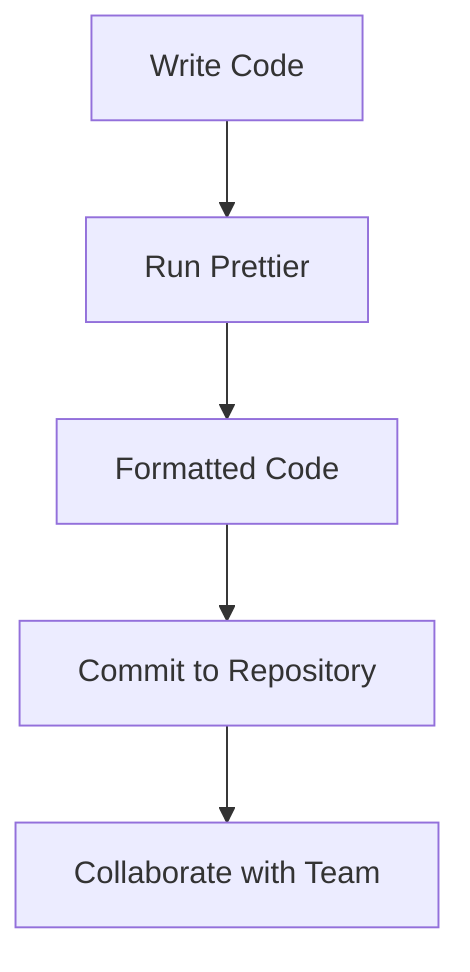

## 15.3 Formatting Code with Prettier

In the world of software development, maintaining a consistent code style is crucial for readability, maintainability, and collaboration. Prettier is a powerful tool that helps developers achieve this by automatically formatting code according to a set of predefined rules. In this section, we'll explore how Prettier can be integrated into your TypeScript projects to ensure your code is always neat and tidy.

### What is Prettier?

Prettier is an opinionated code formatter that supports a wide range of languages, including JavaScript and TypeScript. It enforces a consistent style by parsing your code and reprinting it with its own rules, which are configurable to some extent. This means that no matter how you write your code, Prettier will format it according to the rules you set, ensuring uniformity across your entire codebase.

### Why Use Prettier?

- **Consistency**: Prettier ensures that all code follows the same style, making it easier to read and understand.
- **Saves Time**: By automating the formatting process, Prettier saves developers from manually formatting code.
- **Reduces Code Review Overhead**: With consistent formatting, code reviews can focus on logic and functionality rather than style.
- **Improves Collaboration**: A uniform code style makes it easier for teams to work together, as everyone adheres to the same formatting rules.

### Setting Up Prettier with TypeScript

Let's walk through the steps to set up Prettier in a TypeScript project.

#### Step 1: Install Prettier

First, you need to install Prettier as a development dependency in your project. You can do this using npm or yarn:

```bash
npm install --save-dev prettier
```

or

```bash
yarn add --dev prettier
```

#### Step 2: Create a Prettier Configuration File

Prettier can be configured using a `.prettierrc` file. This file can be in JSON, YAML, or JavaScript format. Here's an example of a basic `.prettierrc` file:

```json
{
  "semi": true,
  "singleQuote": true,
  "trailingComma": "all",
  "printWidth": 80
}
```

- **semi**: Adds a semicolon at the end of every statement.
- **singleQuote**: Uses single quotes instead of double quotes.
- **trailingComma**: Adds trailing commas wherever possible.
- **printWidth**: Sets the maximum line length.

#### Step 3: Add Prettier to Your Scripts

To format your code using Prettier, you can add a script to your `package.json` file:

```json
"scripts": {
  "format": "prettier --write 'src/**/*.ts'"
}
```

This script will format all TypeScript files in the `src` directory.

### Configuring Prettier Options

Prettier offers a variety of configuration options to match your project's style preferences. Here are some commonly used options:

- **tabWidth**: Specify the number of spaces per indentation level.
- **useTabs**: Indent lines with tabs instead of spaces.
- **jsxSingleQuote**: Use single quotes in JSX.
- **bracketSpacing**: Print spaces between brackets in object literals.
- **arrowParens**: Include parentheses around a sole arrow function parameter.

You can find a full list of options in the [Prettier documentation](https://prettier.io/docs/en/options.html).

### Integrating Prettier with Code Editors

Most modern code editors support Prettier integration, allowing you to format your code automatically on save.

#### Visual Studio Code

1. **Install the Prettier Extension**: Go to the Extensions view (`Ctrl+Shift+X`), search for "Prettier - Code formatter", and install it.
2. **Configure Format on Save**: Open your settings (`Ctrl+,`), search for "format on save", and enable it.
3. **Set Prettier as Default Formatter**: In your settings, search for "default formatter" and set it to Prettier.

#### WebStorm

1. **Enable Prettier**: Go to `Preferences` > `Languages & Frameworks` > `JavaScript` > `Prettier`.
2. **Configure Prettier**: Check the "On code reformat" and "On save" options to format your code automatically.

### Benefits of Consistent Formatting

Consistent code formatting offers numerous benefits:

- **Readability**: Code is easier to read and understand when it follows a consistent style.
- **Maintainability**: Consistent formatting reduces the cognitive load required to understand code, making it easier to maintain.
- **Collaboration**: Teams can work more effectively when everyone adheres to the same code style.
- **Reduced Errors**: Consistent formatting can help prevent syntax errors and other issues that arise from poorly formatted code.

### Try It Yourself

Let's try formatting a simple TypeScript file with Prettier. Create a file named `example.ts` with the following content:

```typescript
function greet(name: string) {
  console.log("Hello, " + name + "!");
}

greet("World");
```

Now, run the Prettier script:

```bash
npm run format
```

After running the script, your `example.ts` file should be formatted as follows:

```typescript
function greet(name: string) {
  console.log('Hello, ' + name + '!');
}

greet('World');
```

### Visualizing the Prettier Workflow

To better understand how Prettier fits into your development workflow, let's look at a simple diagram:



This flowchart illustrates the process of writing code, running Prettier to format it, and then committing the formatted code to your repository for collaboration.

### Further Reading

For more information on Prettier and its configuration options, check out the following resources:

- [Prettier Documentation](https://prettier.io/docs/en/index.html)
- [Prettier GitHub Repository](https://github.com/prettier/prettier)

### Summary

In this section, we've explored how Prettier can be used to maintain consistent code formatting in your TypeScript projects. By automating the formatting process, Prettier saves time, reduces errors, and improves collaboration. With Prettier integrated into your development workflow, you can focus more on writing quality code and less on formatting details.

## Quiz Time!



### What is the primary purpose of Prettier?

- [x] To automatically format code according to predefined rules
- [ ] To compile TypeScript to JavaScript
- [ ] To debug TypeScript applications
- [ ] To manage project dependencies

> **Explanation:** Prettier is a code formatter that automatically formats code according to predefined rules, ensuring consistency across the codebase.

### How do you install Prettier in a TypeScript project using npm?

- [x] npm install --save-dev prettier
- [ ] npm install prettier
- [ ] npm install --global prettier
- [ ] npm install prettier --save

> **Explanation:** The correct command to install Prettier as a development dependency is `npm install --save-dev prettier`.

### Which file is used to configure Prettier options?

- [x] .prettierrc
- [ ] package.json
- [ ] tsconfig.json
- [ ] .prettierconfig

> **Explanation:** Prettier options are typically configured in a `.prettierrc` file.

### What does the "semi" option in Prettier's configuration control?

- [x] Whether to add a semicolon at the end of every statement
- [ ] The number of spaces per indentation level
- [ ] The maximum line length
- [ ] The use of single quotes

> **Explanation:** The "semi" option controls whether a semicolon is added at the end of every statement.

### Which Prettier option sets the maximum line length?

- [x] printWidth
- [ ] tabWidth
- [ ] singleQuote
- [ ] trailingComma

> **Explanation:** The "printWidth" option sets the maximum line length for code formatting.

### How can you format all TypeScript files in the `src` directory using a script?

- [x] "format": "prettier --write 'src/**/*.ts'"
- [ ] "format": "tsc --build 'src/**/*.ts'"
- [ ] "format": "eslint 'src/**/*.ts'"
- [ ] "format": "node 'src/**/*.ts'"

> **Explanation:** The script `"format": "prettier --write 'src/**/*.ts'"` formats all TypeScript files in the `src` directory using Prettier.

### What is one benefit of using Prettier for code formatting?

- [x] It reduces code review overhead by ensuring consistent formatting
- [ ] It compiles TypeScript to JavaScript
- [ ] It provides runtime error handling
- [ ] It manages project dependencies

> **Explanation:** Prettier reduces code review overhead by ensuring consistent formatting, allowing reviewers to focus on logic and functionality.

### Which of the following is a Prettier configuration option?

- [x] singleQuote
- [ ] moduleResolution
- [ ] target
- [ ] outDir

> **Explanation:** "singleQuote" is a Prettier configuration option that specifies the use of single quotes instead of double quotes.

### How can you integrate Prettier with Visual Studio Code for automatic formatting?

- [x] Install the Prettier extension and enable "Format on Save"
- [ ] Install the TypeScript extension and enable "Format on Save"
- [ ] Install the ESLint extension and enable "Format on Save"
- [ ] Install the Node.js extension and enable "Format on Save"

> **Explanation:** To integrate Prettier with Visual Studio Code, install the Prettier extension and enable "Format on Save" in the settings.

### True or False: Prettier can only be used with JavaScript and TypeScript.

- [ ] True
- [x] False

> **Explanation:** False. Prettier supports a wide range of languages, not just JavaScript and TypeScript.


