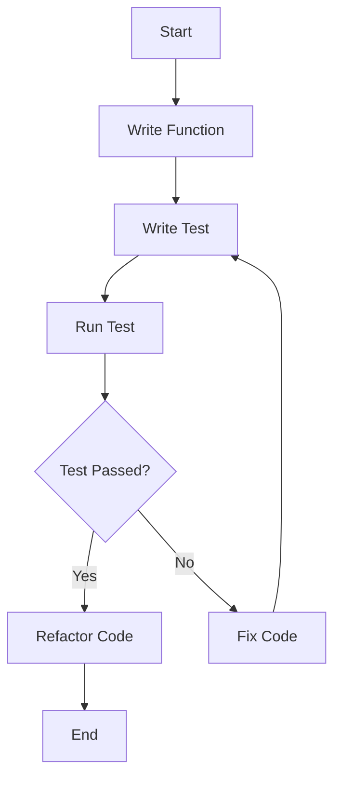

## 15.4 Testing with Jest and TypeScript

Testing is a crucial part of software development that ensures your code behaves as expected. In this section, we'll explore how to use Jest, a popular testing framework, with TypeScript. We'll cover setting up Jest, writing unit tests, mocking dependencies, and handling asynchronous tests. By the end of this guide, you'll be equipped to write effective tests for your TypeScript projects.

### Introduction to Jest

Jest is a delightful JavaScript testing framework with a focus on simplicity. It works out of the box for most JavaScript projects, and its features include:

- **Zero Configuration**: Jest requires minimal setup to get started.
- **Fast and Reliable**: It runs tests in parallel, providing quick feedback.
- **Snapshot Testing**: Allows you to capture the output of a function and compare it over time.
- **Mocking**: Easily mock dependencies to isolate the code under test.
- **Coverage Reports**: Generate detailed test coverage reports.

Jest is widely used in the JavaScript ecosystem and integrates well with TypeScript, making it an excellent choice for testing TypeScript applications.

### Setting Up Jest with TypeScript

Before we can start writing tests, we need to set up Jest in our TypeScript project. Follow these steps to get started:

1. **Initialize a TypeScript Project**

   First, ensure you have a TypeScript project set up. If not, you can initialize one using the following commands:

   ```bash
   mkdir my-typescript-project
   cd my-typescript-project
   npm init -y
   npm install typescript --save-dev
   npx tsc --init
   ```

   This creates a new directory, initializes a Node.js project, installs TypeScript, and generates a `tsconfig.json` file.

2. **Install Jest and TypeScript Support**

   Next, install Jest along with the necessary TypeScript support packages:

   ```bash
   npm install jest ts-jest @types/jest --save-dev
   ```

   - `jest`: The core Jest testing framework.
   - `ts-jest`: A TypeScript preprocessor for Jest.
   - `@types/jest`: TypeScript type definitions for Jest.

3. **Configure Jest**

   Create a `jest.config.js` file in the root of your project with the following content:

   ```javascript
   module.exports = {
     preset: 'ts-jest',
     testEnvironment: 'node',
     testMatch: ['**/__tests__/**/*.ts', '**/?(*.)+(spec|test).ts'],
   };
   ```

   This configuration tells Jest to use `ts-jest` as the preset and to look for test files with a `.ts` extension.

4. **Add a Test Script**

   Update the `scripts` section of your `package.json` to include a test script:

   ```json
   "scripts": {
     "test": "jest"
   }
   ```

   Now, you can run your tests using `npm test`.

### Writing Unit Tests

Unit tests are small, isolated tests that verify the behavior of individual functions or components. Let's write a simple unit test for a TypeScript function.

1. **Create a Function to Test**

   Create a file named `mathUtils.ts` with the following content:

   ```typescript
   export function add(a: number, b: number): number {
     return a + b;
   }
   ```

   This function takes two numbers and returns their sum.

2. **Write a Test for the Function**

   Create a test file named `mathUtils.test.ts` in a `__tests__` directory:

   ```typescript
   import { add } from '../mathUtils';

   test('adds two numbers', () => {
     expect(add(2, 3)).toBe(5);
   });
   ```

   In this test, we import the `add` function and use Jest's `test` function to define a test case. The `expect` function is used to assert that the result of `add(2, 3)` is `5`.

3. **Run the Test**

   Run the test using the following command:

   ```bash
   npm test
   ```

   You should see output indicating that the test passed.

### Mocking Dependencies

In real-world applications, functions often depend on external modules or services. Jest provides powerful mocking capabilities to isolate the code under test.

1. **Create a Module to Mock**

   Suppose we have a module `api.ts` that fetches data from an API:

   ```typescript
   export async function fetchData(url: string): Promise<any> {
     const response = await fetch(url);
     return response.json();
   }
   ```

2. **Mock the Module in Tests**

   Create a test file `api.test.ts` and mock the `fetchData` function:

   ```typescript
   import { fetchData } from '../api';

   jest.mock('../api', () => ({
     fetchData: jest.fn().mockResolvedValue({ data: 'mocked data' }),
   }));

   test('fetches data from API', async () => {
     const data = await fetchData('https://api.example.com/data');
     expect(data).toEqual({ data: 'mocked data' });
   });
   ```

   Here, we use `jest.mock` to replace the `fetchData` function with a mock implementation that returns a resolved promise with mocked data.

### Writing Asynchronous Tests

Asynchronous code is common in modern applications, and Jest provides tools to test such code effectively.

1. **Create an Asynchronous Function**

   Let's create an asynchronous function `delay.ts`:

   ```typescript
   export function delay(ms: number): Promise<void> {
     return new Promise((resolve) => setTimeout(resolve, ms));
   }
   ```

   This function returns a promise that resolves after a specified delay.

2. **Write an Asynchronous Test**

   Create a test file `delay.test.ts`:

   ```typescript
   import { delay } from '../delay';

   test('waits for the specified delay', async () => {
     const start = Date.now();
     await delay(100);
     const end = Date.now();
     expect(end - start).toBeGreaterThanOrEqual(100);
   });
   ```

   In this test, we use `async` and `await` to handle the promise returned by `delay`. We check that the elapsed time is at least the specified delay.

### Encouraging Testing as Part of Development

Testing should be an integral part of the development process. Here are some tips to encourage writing tests:

- **Test-Driven Development (TDD)**: Write tests before implementing features. This approach helps clarify requirements and ensures your code meets them.
- **Continuous Integration (CI)**: Set up a CI pipeline to run tests automatically on each commit. This provides immediate feedback and prevents regressions.
- **Code Coverage**: Use Jest's coverage reports to identify untested code and improve test coverage.
- **Refactoring Confidence**: Tests provide a safety net when refactoring code, ensuring existing functionality remains intact.

### Try It Yourself

Experiment with the examples provided in this guide. Here are some suggestions:

- Modify the `add` function to handle more complex operations and write corresponding tests.
- Create a new module with dependencies and practice mocking them in tests.
- Write tests for asynchronous functions with different scenarios, such as handling errors.

### Visual Aids

To help visualize the testing process, let's use a Mermaid.js flowchart to illustrate the flow of a typical test case:



This flowchart shows the iterative process of writing a function, testing it, and refining the code based on test results.

### References and Links

For further reading and exploration, consider the following resources:

- [Jest Documentation](https://jestjs.io/docs/getting-started)
- [TypeScript Documentation](https://www.typescriptlang.org/docs/)
- [MDN Web Docs on Promises](https://developer.mozilla.org/en-US/docs/Web/JavaScript/Guide/Using_promises)

### Engagement and Reinforcement

To reinforce your learning, try answering the following questions and challenges:

- What are the benefits of using Jest with TypeScript?
- How would you mock a module that returns a promise?
- Write a test for a function that throws an error under certain conditions.

### Key Takeaways

- Jest is a powerful testing framework that integrates seamlessly with TypeScript.
- Setting up Jest with TypeScript involves installing necessary packages and configuring Jest.
- Unit tests verify the behavior of individual functions or components.
- Mocking allows you to isolate the code under test by replacing dependencies.
- Asynchronous tests handle promises and ensure code behaves correctly over time.

## Quiz Time!



### What is Jest primarily used for?

- [x] Testing JavaScript and TypeScript applications
- [ ] Compiling TypeScript code
- [ ] Managing project dependencies
- [ ] Building user interfaces

> **Explanation:** Jest is a testing framework used to test JavaScript and TypeScript applications.

### Which package is used to integrate Jest with TypeScript?

- [x] ts-jest
- [ ] @types/jest
- [ ] jest-ts
- [ ] typescript-jest

> **Explanation:** `ts-jest` is a TypeScript preprocessor for Jest, allowing Jest to work with TypeScript files.

### How do you mock a module in Jest?

- [x] Using `jest.mock('module-path')`
- [ ] Using `jest.spyOn('module-path')`
- [ ] Using `jest.replace('module-path')`
- [ ] Using `jest.override('module-path')`

> **Explanation:** `jest.mock('module-path')` is used to mock a module in Jest.

### What is the purpose of the `expect` function in Jest?

- [x] To assert that a value meets certain conditions
- [ ] To compile TypeScript code
- [ ] To initialize a Jest test suite
- [ ] To configure Jest settings

> **Explanation:** The `expect` function is used in Jest to assert that a value meets certain conditions.

### Which of the following is a feature of Jest?

- [x] Snapshot testing
- [ ] Type inference
- [ ] Code transpilation
- [ ] Module bundling

> **Explanation:** Snapshot testing is a feature of Jest that allows you to capture and compare the output of a function over time.

### How do you handle asynchronous code in Jest tests?

- [x] Using `async` and `await`
- [ ] Using `setTimeout`
- [ ] Using `asyncTest`
- [ ] Using `promiseHandler`

> **Explanation:** `async` and `await` are used to handle asynchronous code in Jest tests.

### What is the benefit of using mocks in tests?

- [x] To isolate the code under test by replacing dependencies
- [ ] To increase test execution speed
- [ ] To reduce code complexity
- [ ] To improve code readability

> **Explanation:** Mocks are used to isolate the code under test by replacing dependencies, allowing you to test the code in isolation.

### What does the `testEnvironment` option in `jest.config.js` specify?

- [x] The environment in which the tests are executed
- [ ] The directory where test files are located
- [ ] The version of Jest to use
- [ ] The type of assertions to use

> **Explanation:** The `testEnvironment` option specifies the environment in which the tests are executed, such as `node` or `jsdom`.

### Which command is used to run tests in a Jest project?

- [x] npm test
- [ ] jest run
- [ ] jest start
- [ ] npm jest

> **Explanation:** `npm test` is the command used to run tests in a Jest project, as defined in the `scripts` section of `package.json`.

### True or False: Jest can generate test coverage reports.

- [x] True
- [ ] False

> **Explanation:** Jest can generate detailed test coverage reports, helping you identify untested code.



By incorporating Jest into your TypeScript projects, you can ensure your code is reliable and maintainable. Happy testing!
