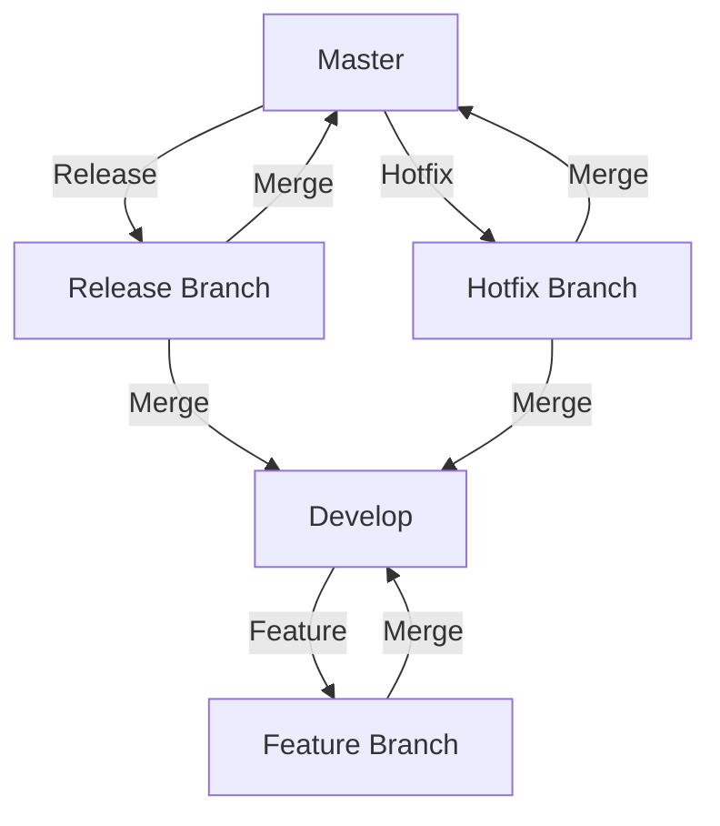

## 15.6 Version Control Best Practices

Version control is an essential part of modern software development, allowing teams to manage changes to their codebases efficiently and collaboratively. In this section, we'll explore the best practices for using Git, a popular version control system, to manage your TypeScript projects. We'll cover essential Git commands, discuss branching strategies, emphasize the importance of meaningful commit messages, and provide guidance on handling merge conflicts and code reviews. By the end of this section, you'll be equipped with the knowledge to manage your code changes effectively and collaborate seamlessly with others.

### Understanding Git and Version Control

Git is a distributed version control system that helps developers track changes in their code over time. It allows multiple developers to work on the same project simultaneously without overwriting each other's work. Let's start by exploring some fundamental Git commands that you'll use frequently in your TypeScript projects.

#### Essential Git Commands

1. **Initializing a Repository**

   To start using Git in your project, you need to initialize a Git repository. This command creates a new `.git` directory in your project folder, which Git uses to track changes.

   ```bash
   git init
   ```

2. **Cloning a Repository**

   If you want to work on an existing project, you can clone the repository from a remote source like GitHub.

   ```bash
   git clone <repository-url>
   ```

3. **Checking the Status**

   To see the current status of your working directory and staging area, use the `git status` command. It shows which files are staged, unstaged, or untracked.

   ```bash
   git status
   ```

4. **Adding Changes**

   To stage changes for commit, use the `git add` command. You can add specific files or all changes in the directory.

   ```bash
   git add <file-name>
   git add .
   ```

5. **Committing Changes**

   Once you've staged your changes, commit them with a meaningful message describing the changes.

   ```bash
   git commit -m "Add feature X"
   ```

6. **Viewing Commit History**

   To view the commit history, use the `git log` command. It displays a list of all commits in the current branch.

   ```bash
   git log
   ```

7. **Branching**

   Branching allows you to create separate lines of development. Use `git branch` to list, create, or delete branches.

   ```bash
   git branch          # List branches
   git branch <name>   # Create a new branch
   git branch -d <name> # Delete a branch
   ```

8. **Switching Branches**

   To switch between branches, use the `git checkout` command.

   ```bash
   git checkout <branch-name>
   ```

9. **Merging Branches**

   To merge changes from one branch into another, use the `git merge` command.

   ```bash
   git merge <branch-name>
   ```

10. **Pushing Changes**

    To push your local changes to a remote repository, use the `git push` command.

    ```bash
    git push origin <branch-name>
    ```

11. **Pulling Changes**

    To fetch and merge changes from a remote repository, use the `git pull` command.

    ```bash
    git pull origin <branch-name>
    ```

### Branching Strategies

Effective branching strategies are crucial for managing code changes and facilitating collaboration. Let's explore two popular branching strategies: GitFlow and trunk-based development.

#### GitFlow

GitFlow is a branching model that defines a strict branching structure for managing releases. It includes the following branches:

- **Master**: The main branch containing production-ready code.
- **Develop**: The integration branch for features and fixes.
- **Feature**: Branches created from `develop` for new features.
- **Release**: Branches created from `develop` for preparing a new release.
- **Hotfix**: Branches created from `master` for urgent fixes.

**Workflow:**

1. Create a feature branch from `develop`.
2. Work on the feature and commit changes.
3. Merge the feature branch back into `develop`.
4. When ready for release, create a release branch from `develop`.
5. After testing, merge the release branch into `master` and `develop`.
6. For urgent fixes, create a hotfix branch from `master`, then merge it back into `master` and `develop`.

#### Trunk-Based Development

Trunk-based development is a simpler model where all developers work on a single branch, often called `main` or `trunk`. Developers commit small, frequent changes directly to the trunk, minimizing the need for long-lived branches.

**Benefits:**

- Simplifies the branching model.
- Encourages continuous integration and deployment.
- Reduces the complexity of merging long-lived branches.

### Writing Meaningful Commit Messages

Commit messages are crucial for understanding the history of a project. They should be clear, concise, and descriptive. Here are some tips for writing meaningful commit messages:

- **Use the imperative mood**: Start with a verb, e.g., "Add", "Fix", "Update".
- **Be concise**: Keep the message short and to the point.
- **Provide context**: Explain why the change was made, not just what was changed.
- **Use bullet points**: For complex changes, use bullet points to list key changes.

**Example:**

```
Fix bug in user authentication

- Corrected the logic in the login function
- Updated error messages for clarity
- Added unit tests for edge cases
```

### Handling Merge Conflicts

Merge conflicts occur when changes in different branches conflict with each other. Here's how to handle them:

1. **Identify the Conflict**: Git will notify you of conflicts during a merge. Use `git status` to see which files are affected.

2. **Resolve the Conflict**: Open the conflicting files in your code editor. Git marks conflicts with `<<<<<<<`, `=======`, and `>>>>>>>` lines. Choose which changes to keep or combine them.

3. **Mark as Resolved**: Once resolved, stage the changes with `git add`.

4. **Commit the Merge**: Complete the merge by committing the resolved changes.

5. **Test the Code**: Ensure the merged code works as expected by running tests.

### Code Reviews and Collaborative Coding

Code reviews are an essential part of collaborative coding. They help ensure code quality, catch bugs, and share knowledge among team members. Here are some best practices for code reviews:

- **Review Regularly**: Conduct reviews frequently to catch issues early.
- **Be Constructive**: Provide feedback that is helpful and respectful.
- **Focus on the Code**: Avoid personal comments; focus on the code's functionality and style.
- **Use Tools**: Use code review tools like GitHub's pull requests or GitLab's merge requests to facilitate the process.

### Encouraging Regular Commits

Regular commits help track progress and make it easier to identify when issues were introduced. Here are some tips for committing regularly:

- **Commit Small Changes**: Break down large changes into smaller, manageable commits.
- **Commit Often**: Commit changes frequently to avoid losing work and to make it easier to track changes.
- **Use Branches**: Use feature branches to isolate work and keep the main branch stable.

### Try It Yourself

To practice these concepts, try the following exercises:

1. **Create a Git Repository**: Initialize a new Git repository and create a few commits with meaningful messages.

2. **Experiment with Branching**: Create a feature branch, make changes, and merge it back into the main branch.

3. **Resolve a Merge Conflict**: Simulate a merge conflict by making conflicting changes in two branches, then resolve the conflict.

4. **Conduct a Code Review**: Pair with a friend or colleague to review each other's code and provide feedback.

### Visual Aids

To better understand the GitFlow branching strategy, refer to the diagram below:



**Diagram Description:** This diagram illustrates the GitFlow branching strategy, showing the relationships between the master, develop, feature, release, and hotfix branches.

### References and Links

For more information on Git and version control, check out these resources:

- [Git Documentation](https://git-scm.com/doc)
- [Pro Git Book](https://git-scm.com/book/en/v2)
- [GitHub Guides](https://guides.github.com/)

### Engagement and Reinforcement

- **Question**: What is the main benefit of using GitFlow over trunk-based development?
- **Challenge**: Create a new Git repository and implement a simple feature using a feature branch.

### Key Takeaways

- Git is a powerful tool for managing code changes and collaborating with others.
- Branching strategies like GitFlow and trunk-based development help organize work and facilitate collaboration.
- Writing meaningful commit messages and conducting code reviews are essential for maintaining code quality.
- Regular commits and resolving merge conflicts are crucial for a smooth development process.

## Quiz Time!



### Which command is used to initialize a new Git repository?

- [x] `git init`
- [ ] `git start`
- [ ] `git new`
- [ ] `git create`

> **Explanation:** The `git init` command initializes a new Git repository in the current directory.

### What is the purpose of the `git clone` command?

- [x] To copy an existing repository to your local machine
- [ ] To create a new branch
- [ ] To delete a repository
- [ ] To merge branches

> **Explanation:** The `git clone` command is used to copy an existing repository from a remote source to your local machine.

### Which branch in GitFlow contains production-ready code?

- [x] Master
- [ ] Develop
- [ ] Feature
- [ ] Hotfix

> **Explanation:** In GitFlow, the `master` branch contains production-ready code.

### What is a key benefit of trunk-based development?

- [x] Simplifies the branching model
- [ ] Requires long-lived branches
- [ ] Delays integration
- [ ] Complicates deployment

> **Explanation:** Trunk-based development simplifies the branching model by encouraging small, frequent commits directly to the trunk.

### What should a good commit message include?

- [x] A clear description of the change
- [ ] Personal opinions
- [x] The reason for the change
- [ ] Unrelated information

> **Explanation:** A good commit message should include a clear description of the change and the reason for it.

### What is the first step in resolving a merge conflict?

- [x] Identify the conflict
- [ ] Commit the changes
- [ ] Push the changes
- [ ] Delete the conflicting branch

> **Explanation:** The first step in resolving a merge conflict is to identify the files that have conflicts.

### How can code reviews benefit a development team?

- [x] Improve code quality
- [ ] Slow down development
- [x] Share knowledge
- [ ] Increase errors

> **Explanation:** Code reviews improve code quality and facilitate knowledge sharing among team members.

### What is a common practice when committing changes?

- [x] Commit small, frequent changes
- [ ] Commit large, infrequent changes
- [ ] Avoid committing changes
- [ ] Commit without messages

> **Explanation:** Committing small, frequent changes helps track progress and makes it easier to identify issues.

### Which command is used to switch branches in Git?

- [x] `git checkout`
- [ ] `git switch`
- [ ] `git change`
- [ ] `git move`

> **Explanation:** The `git checkout` command is used to switch between branches in Git.

### True or False: In GitFlow, hotfix branches are created from the develop branch.

- [ ] True
- [x] False

> **Explanation:** In GitFlow, hotfix branches are created from the `master` branch to address urgent fixes.


