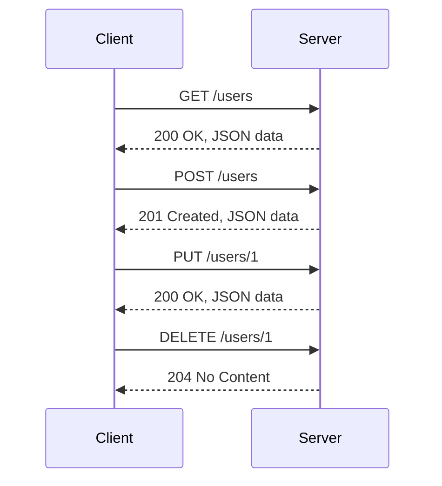

## 16.1 Introduction to RESTful APIs

In today's digital world, APIs (Application Programming Interfaces) are the backbone of modern web applications. They allow different software systems to communicate and interact with each other, enabling the seamless exchange of data and functionality. Among various types of APIs, RESTful APIs have gained immense popularity due to their simplicity and scalability. In this section, we will explore the principles of REST architecture, discuss common HTTP methods, and learn how to interact with RESTful APIs using TypeScript.

### What is a RESTful API?

A RESTful API is an API that adheres to the principles of REST (Representational State Transfer), an architectural style for designing networked applications. RESTful APIs use HTTP requests to perform operations on resources, which are identified by URLs (Uniform Resource Locators). The key principles of REST include:

- **Statelessness**: Each request from a client to a server must contain all the information needed to understand and process the request. The server does not store any client context between requests.
- **Client-Server Architecture**: The client and server are separate entities, allowing them to evolve independently. The client is responsible for the user interface, while the server manages data storage and processing.
- **Uniform Interface**: RESTful APIs use a consistent and standardized interface for interacting with resources. This includes using HTTP methods like GET, POST, PUT, and DELETE.
- **Resource-Based**: Everything is considered a resource, and each resource is identified by a unique URL.
- **Stateless Communication**: Each request from a client contains all the information needed for the server to fulfill that request.
- **Cacheability**: Responses from the server can be cached to improve performance.

### Understanding HTTP Methods

HTTP methods are the verbs that define the action to be performed on a resource. The most commonly used HTTP methods in RESTful APIs are:

- **GET**: Retrieve data from a server. It is used to fetch a resource without modifying it.
- **POST**: Send data to the server to create a new resource.
- **PUT**: Update an existing resource with new data.
- **DELETE**: Remove a resource from the server.

Let's look at a simple example of how these methods work:

```typescript
// Example of a GET request to fetch a list of users
fetch('https://api.example.com/users')
  .then(response => response.json())
  .then(data => console.log(data));

// Example of a POST request to create a new user
fetch('https://api.example.com/users', {
  method: 'POST',
  headers: {
    'Content-Type': 'application/json'
  },
  body: JSON.stringify({ name: 'John Doe', email: 'john@example.com' })
})
.then(response => response.json())
.then(data => console.log(data));

// Example of a PUT request to update a user's information
fetch('https://api.example.com/users/1', {
  method: 'PUT',
  headers: {
    'Content-Type': 'application/json'
  },
  body: JSON.stringify({ name: 'Jane Doe' })
})
.then(response => response.json())
.then(data => console.log(data));

// Example of a DELETE request to remove a user
fetch('https://api.example.com/users/1', {
  method: 'DELETE'
})
.then(response => response.json())
.then(data => console.log(data));
```

### Typical API Endpoints and Responses

API endpoints are the URLs where the API can be accessed by a client application. Each endpoint corresponds to a specific resource or action. For example, in a user management system, you might have the following endpoints:

- `GET /users`: Retrieve a list of users.
- `GET /users/{id}`: Retrieve a specific user by ID.
- `POST /users`: Create a new user.
- `PUT /users/{id}`: Update an existing user.
- `DELETE /users/{id}`: Delete a user.

Responses from the server are typically in JSON format, which is easy to read and parse. Here's an example of a JSON response for a GET request to `/users`:

```json
[
  {
    "id": 1,
    "name": "John Doe",
    "email": "john@example.com"
  },
  {
    "id": 2,
    "name": "Jane Doe",
    "email": "jane@example.com"
  }
]
```

### The Importance of APIs in Modern Web Applications

APIs play a crucial role in modern web applications by enabling different systems to communicate and share data. They allow developers to build applications that can integrate with other services, access external data, and provide a richer user experience. Some key benefits of using APIs include:

- **Scalability**: APIs enable applications to scale by allowing different components to communicate and work together.
- **Reusability**: APIs can be reused across different applications, reducing development time and effort.
- **Interoperability**: APIs enable different systems to work together, regardless of the technology stack.
- **Flexibility**: APIs allow developers to build applications that can easily integrate with other services and adapt to changing requirements.

### Considerations for Authentication and Security

When working with APIs, it's important to consider authentication and security to protect sensitive data and ensure that only authorized users can access the API. Some common authentication methods include:

- **API Keys**: A simple and widely used method where a unique key is provided to each client to access the API.
- **OAuth**: A more secure and flexible authentication method that allows users to grant access to their data without sharing their credentials.
- **JWT (JSON Web Tokens)**: A compact and self-contained way to transmit information between parties, often used for authentication.

In addition to authentication, it's important to implement security measures such as:

- **HTTPS**: Use HTTPS to encrypt data transmitted between the client and server.
- **Rate Limiting**: Limit the number of requests a client can make to prevent abuse and ensure fair usage.
- **Input Validation**: Validate and sanitize input data to prevent security vulnerabilities such as SQL injection and cross-site scripting (XSS).

### Try It Yourself

To get hands-on experience with RESTful APIs, try modifying the code examples provided above. Here are some suggestions:

- Change the URL to point to a different API and observe the response.
- Modify the data sent in a POST or PUT request and see how it affects the response.
- Implement error handling to manage failed requests gracefully.

### Visualizing RESTful API Architecture

To better understand the architecture of RESTful APIs, let's visualize the interaction between a client and server using a sequence diagram:



This diagram illustrates the typical flow of requests and responses between a client and server in a RESTful API.

### Summary

In this section, we've explored the fundamentals of RESTful APIs, including their principles, common HTTP methods, and typical endpoints. We've also discussed the importance of APIs in modern web applications and considerations for authentication and security. By understanding these concepts, you can effectively interact with RESTful APIs and build powerful, data-driven applications.

### Additional Resources

For further reading on RESTful APIs and related topics, check out the following resources:

- [MDN Web Docs: REST](https://developer.mozilla.org/en-US/docs/Glossary/REST)
- [RESTful API Design: Best Practices](https://www.restapitutorial.com/)
- [OAuth 2.0 Simplified](https://oauth.net/2/)

## Quiz Time!



### What does REST stand for?

- [x] Representational State Transfer
- [ ] Remote Execution of State Transfer
- [ ] Random State Transfer
- [ ] Rapid Execution of State Transfer

> **Explanation:** REST stands for Representational State Transfer, an architectural style for designing networked applications.

### Which HTTP method is used to retrieve data from a server?

- [x] GET
- [ ] POST
- [ ] PUT
- [ ] DELETE

> **Explanation:** The GET method is used to retrieve data from a server without modifying it.

### What is a key principle of REST architecture?

- [x] Statelessness
- [ ] Stateful communication
- [ ] Client-side storage
- [ ] Server-side rendering

> **Explanation:** Statelessness is a key principle of REST, meaning each request must contain all the information needed for the server to process it.

### Which HTTP method is used to create a new resource?

- [x] POST
- [ ] GET
- [ ] PUT
- [ ] DELETE

> **Explanation:** The POST method is used to send data to the server to create a new resource.

### What format are API responses typically in?

- [x] JSON
- [ ] XML
- [ ] CSV
- [ ] HTML

> **Explanation:** API responses are typically in JSON format, which is easy to read and parse.

### What is a common authentication method for APIs?

- [x] API Keys
- [ ] Cookies
- [ ] Sessions
- [ ] Captchas

> **Explanation:** API Keys are a common authentication method where a unique key is provided to each client to access the API.

### Which HTTP method is used to update an existing resource?

- [x] PUT
- [ ] GET
- [ ] POST
- [ ] DELETE

> **Explanation:** The PUT method is used to update an existing resource with new data.

### What is a benefit of using APIs in web applications?

- [x] Scalability
- [ ] Increased server load
- [ ] Reduced security
- [ ] Limited interoperability

> **Explanation:** APIs enable applications to scale by allowing different components to communicate and work together.

### Which HTTP method is used to delete a resource?

- [x] DELETE
- [ ] GET
- [ ] POST
- [ ] PUT

> **Explanation:** The DELETE method is used to remove a resource from the server.

### True or False: RESTful APIs require stateful communication.

- [ ] True
- [x] False

> **Explanation:** RESTful APIs are stateless, meaning each request must contain all the information needed for the server to process it.


