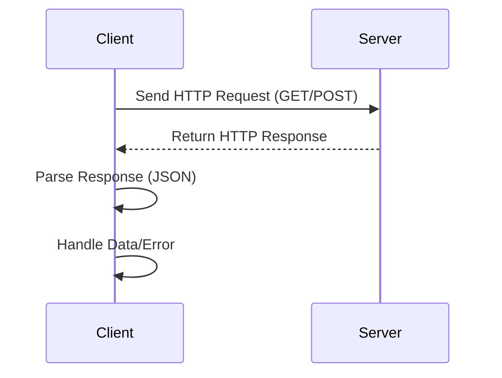

## 16.2 Using `fetch` API in TypeScript

In this section, we will explore how to use the `fetch` API in TypeScript to make HTTP requests. The `fetch` API is a modern way to interact with servers and retrieve data over the network. It is a powerful tool for web developers, and TypeScript enhances it by providing static typing, which helps catch errors early and makes your code more robust and maintainable.

### Understanding the `fetch` API

The `fetch` API is a built-in JavaScript function that allows you to make network requests similar to XMLHttpRequest (XHR). However, it is more powerful and flexible, providing a more straightforward and cleaner syntax. The `fetch` API returns a Promise, which resolves to the Response object representing the response to the request.

#### Basic Syntax

The basic syntax for a `fetch` request is as follows:

```typescript
fetch(url: string, options?: RequestInit): Promise<Response>
```

- **url**: The URL to which the request is sent.
- **options**: An optional object containing settings for the request, such as method, headers, body, etc.

### Performing a GET Request

Let's start by performing a simple GET request using the `fetch` API. A GET request is used to retrieve data from a server.

```typescript
// Define the URL for the GET request
const url = 'https://api.example.com/data';

// Perform the GET request
fetch(url)
  .then(response => {
    // Check if the response is successful
    if (!response.ok) {
      throw new Error(`HTTP error! Status: ${response.status}`);
    }
    // Parse the response as JSON
    return response.json();
  })
  .then(data => {
    // Handle the data
    console.log('Data received:', data);
  })
  .catch(error => {
    // Handle any errors
    console.error('Error fetching data:', error);
  });
```

#### Explanation

- **URL**: We specify the URL from which we want to fetch data.
- **Response Check**: We check if the response is successful using `response.ok`. If not, we throw an error with the status code.
- **JSON Parsing**: We parse the response body as JSON using `response.json()`, which returns a Promise that resolves to the parsed data.
- **Error Handling**: We catch any errors that occur during the fetch operation and log them to the console.

### Typing the Response Data

In TypeScript, we can define interfaces to type the response data, which helps in ensuring that the data structure is as expected.

```typescript
// Define an interface for the expected data structure
interface Data {
  id: number;
  name: string;
  value: number;
}

// Perform the GET request with typed response
fetch(url)
  .then(response => {
    if (!response.ok) {
      throw new Error(`HTTP error! Status: ${response.status}`);
    }
    return response.json() as Promise<Data>;
  })
  .then((data: Data) => {
    console.log('Data received:', data);
  })
  .catch(error => {
    console.error('Error fetching data:', error);
  });
```

### Performing a POST Request

A POST request is used to send data to a server. Let's see how to perform a POST request using the `fetch` API.

```typescript
// Define the URL for the POST request
const postUrl = 'https://api.example.com/submit';

// Define the data to be sent
const postData = {
  name: 'John Doe',
  age: 30
};

// Perform the POST request
fetch(postUrl, {
  method: 'POST', // Specify the request method
  headers: {
    'Content-Type': 'application/json' // Set the content type
  },
  body: JSON.stringify(postData) // Convert the data to JSON
})
  .then(response => {
    if (!response.ok) {
      throw new Error(`HTTP error! Status: ${response.status}`);
    }
    return response.json();
  })
  .then(data => {
    console.log('Response from server:', data);
  })
  .catch(error => {
    console.error('Error submitting data:', error);
  });
```

#### Explanation

- **Method**: We specify the HTTP method as `POST`.
- **Headers**: We set the `Content-Type` header to `application/json` to indicate that we are sending JSON data.
- **Body**: We use `JSON.stringify()` to convert the JavaScript object into a JSON string before sending it.

### Handling JSON Data

The `fetch` API makes it easy to handle JSON data. When you receive a response, you can use the `json()` method to parse the JSON data. This method returns a Promise that resolves to the JavaScript object represented by the JSON data.

#### Example: Parsing JSON Data

```typescript
fetch(url)
  .then(response => response.json())
  .then(data => {
    console.log('Parsed JSON data:', data);
  })
  .catch(error => {
    console.error('Error parsing JSON:', error);
  });
```

### Error Handling with `fetch`

Error handling is an essential part of working with network requests. The `fetch` API provides a straightforward way to handle errors using Promises.

#### Common Errors

- **Network Errors**: These occur when the request cannot be completed due to network issues.
- **HTTP Errors**: These occur when the server responds with a status code outside the range of 200-299.

#### Example: Handling Errors

```typescript
fetch(url)
  .then(response => {
    if (!response.ok) {
      throw new Error(`HTTP error! Status: ${response.status}`);
    }
    return response.json();
  })
  .then(data => {
    console.log('Data received:', data);
  })
  .catch(error => {
    if (error instanceof TypeError) {
      console.error('Network error:', error);
    } else {
      console.error('HTTP error:', error);
    }
  });
```

### Browser Compatibility and Polyfills

The `fetch` API is widely supported in modern browsers, but it may not be available in older browsers. To ensure compatibility across all browsers, you can use a polyfill, such as the `whatwg-fetch` library.

#### Using a Polyfill

To use a polyfill, you can include it in your project using npm:

```bash
npm install whatwg-fetch --save
```

Then, import it at the top of your TypeScript file:

```typescript
import 'whatwg-fetch';
```

This will ensure that the `fetch` API is available in environments that do not natively support it.

### Try It Yourself

Now that we've covered the basics of using the `fetch` API in TypeScript, it's time to try it yourself. Here are a few suggestions for modifications you can make to the examples above:

- **Modify the URL**: Try fetching data from a different API endpoint.
- **Add Headers**: Experiment with adding custom headers to your requests.
- **Handle Different Data Formats**: Try fetching and parsing data in formats other than JSON, such as XML or plain text.
- **Implement a PUT or DELETE Request**: Use the `fetch` API to perform other types of HTTP requests.

### Visualizing the Fetch Process

To better understand the fetch process, let's visualize the flow of a fetch request and response using a Mermaid.js sequence diagram.



### Summary

In this section, we've learned how to use the `fetch` API in TypeScript to make HTTP requests. We've covered how to perform GET and POST requests, type the request and response data, handle JSON data, and manage errors. We also discussed browser compatibility and the use of polyfills to ensure the `fetch` API works in all environments.

By understanding these concepts, you can confidently use the `fetch` API in your TypeScript projects to interact with web servers and handle data efficiently.

## Quiz Time!



### What is the primary purpose of the `fetch` API?

- [x] To make HTTP requests and handle responses
- [ ] To manipulate the DOM
- [ ] To create animations
- [ ] To manage local storage

> **Explanation:** The `fetch` API is used to make HTTP requests and handle responses, allowing you to interact with web servers.

### Which method is used to parse JSON data from a fetch response?

- [ ] response.text()
- [x] response.json()
- [ ] response.parse()
- [ ] response.stringify()

> **Explanation:** The `response.json()` method is used to parse JSON data from a fetch response.

### How do you specify a POST request using the fetch API?

- [ ] Set the method to 'GET'
- [x] Set the method to 'POST'
- [ ] Set the method to 'PUT'
- [ ] Set the method to 'DELETE'

> **Explanation:** To specify a POST request, set the method option to 'POST' in the fetch options.

### What should you do if a fetch response is not successful?

- [ ] Ignore the response
- [ ] Log the response
- [x] Throw an error
- [ ] Retry the request immediately

> **Explanation:** If a fetch response is not successful (response.ok is false), you should throw an error to handle it appropriately.

### What is the purpose of a polyfill in the context of the fetch API?

- [ ] To enhance security
- [x] To provide compatibility for older browsers
- [ ] To improve performance
- [ ] To reduce code size

> **Explanation:** A polyfill is used to provide compatibility for older browsers that do not support the fetch API natively.

### Which HTTP method is typically used to retrieve data from a server?

- [x] GET
- [ ] POST
- [ ] PUT
- [ ] DELETE

> **Explanation:** The GET method is typically used to retrieve data from a server.

### What type of data can be sent in the body of a POST request?

- [x] JSON
- [x] Form data
- [ ] HTML
- [ ] CSS

> **Explanation:** JSON and form data are commonly sent in the body of a POST request.

### How can you ensure that a fetch request sends JSON data?

- [ ] Set the body to a plain object
- [x] Use JSON.stringify() on the data
- [ ] Set the method to 'GET'
- [ ] Use response.json()

> **Explanation:** Use JSON.stringify() on the data to ensure it is sent as JSON in the fetch request body.

### What is the return type of the fetch function in TypeScript?

- [ ] Promise<string>
- [ ] Promise<object>
- [x] Promise<Response>
- [ ] Promise<number>

> **Explanation:** The fetch function returns a Promise that resolves to a Response object.

### True or False: The fetch API is only available in modern browsers.

- [x] True
- [ ] False

> **Explanation:** The fetch API is only natively available in modern browsers, but polyfills can be used to support older browsers.


