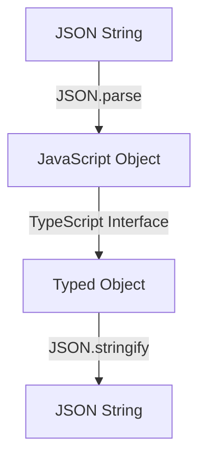

## 16.3 Handling JSON Data

JSON (JavaScript Object Notation) is a lightweight data interchange format that's easy for humans to read and write, and easy for machines to parse and generate. In modern web development, JSON is commonly used for exchanging data between a client and a server. In this section, we'll explore how to handle JSON data in TypeScript, focusing on parsing, typing, and error handling.

### Understanding JSON in TypeScript

Before diving into TypeScript specifics, let's briefly review JSON. JSON data is represented as key-value pairs, similar to JavaScript objects. Here's a simple example of JSON data:

```json
{
  "name": "Alice",
  "age": 30,
  "isStudent": false
}
```

In TypeScript, we often need to parse JSON data received from an API and ensure it matches a specific structure. This is where TypeScript's static typing shines, allowing us to define interfaces that describe the expected shape of the data.

### Parsing JSON Data

To work with JSON data in TypeScript, we typically start by parsing JSON strings into JavaScript objects using `JSON.parse`. This method takes a JSON string and converts it into a JavaScript object.

#### Example: Parsing JSON Data

```typescript
const jsonString = '{"name": "Alice", "age": 30, "isStudent": false}';

// Parse the JSON string into a JavaScript object
const parsedData = JSON.parse(jsonString);

console.log(parsedData.name); // Output: Alice
console.log(parsedData.age); // Output: 30
console.log(parsedData.isStudent); // Output: false
```

### Defining Interfaces for JSON Structures

To leverage TypeScript's type system, we can define interfaces that describe the expected structure of the JSON data. This helps ensure that the data we work with adheres to a specific format, reducing runtime errors.

#### Example: Defining an Interface

```typescript
interface Person {
  name: string;
  age: number;
  isStudent: boolean;
}

const jsonString = '{"name": "Alice", "age": 30, "isStudent": false}';
const parsedData: Person = JSON.parse(jsonString);

console.log(parsedData.name); // Output: Alice
```

### Error Handling for Invalid JSON Data

When working with JSON data, it's crucial to handle potential errors, such as invalid JSON strings or mismatched data types. TypeScript doesn't automatically validate JSON data against interfaces, so we need to implement error handling ourselves.

#### Example: Handling Invalid JSON

```typescript
const invalidJsonString = '{"name": "Alice", "age": "thirty", "isStudent": false}';

try {
  const parsedData: Person = JSON.parse(invalidJsonString);
  console.log(parsedData.name);
} catch (error) {
  console.error("Failed to parse JSON:", error);
}
```

In this example, the `age` property is a string instead of a number, which could lead to runtime errors. By using a `try-catch` block, we can catch and handle parsing errors gracefully.

### Working with Nested JSON Objects

JSON data can often be nested, containing objects within objects. TypeScript allows us to define interfaces for these nested structures, ensuring type safety throughout our code.

#### Example: Nested JSON Structure

```typescript
interface Address {
  street: string;
  city: string;
  postalCode: string;
}

interface PersonWithAddress {
  name: string;
  age: number;
  isStudent: boolean;
  address: Address;
}

const jsonString = `
{
  "name": "Alice",
  "age": 30,
  "isStudent": false,
  "address": {
    "street": "123 Main St",
    "city": "Wonderland",
    "postalCode": "12345"
  }
}`;

const parsedData: PersonWithAddress = JSON.parse(jsonString);

console.log(parsedData.address.city); // Output: Wonderland
```

### Validating JSON Data

While TypeScript provides static typing, it doesn't perform runtime validation. To ensure the data we receive matches our expectations, we can implement validation logic.

#### Example: Validating JSON Data

```typescript
function isValidPerson(data: any): data is Person {
  return (
    typeof data.name === "string" &&
    typeof data.age === "number" &&
    typeof data.isStudent === "boolean"
  );
}

const jsonString = '{"name": "Alice", "age": 30, "isStudent": false}';
const parsedData = JSON.parse(jsonString);

if (isValidPerson(parsedData)) {
  console.log(parsedData.name); // Output: Alice
} else {
  console.error("Invalid JSON data");
}
```

In this example, we define a type guard function `isValidPerson` that checks if the parsed data matches the `Person` interface. This allows us to safely access properties, knowing the data is valid.

### Serializing JSON Data

In addition to parsing JSON, we often need to convert JavaScript objects back into JSON strings for storage or transmission. This is done using `JSON.stringify`.

#### Example: Serializing JSON Data

```typescript
const person: Person = {
  name: "Alice",
  age: 30,
  isStudent: false
};

const jsonString = JSON.stringify(person);
console.log(jsonString); // Output: {"name":"Alice","age":30,"isStudent":false}
```

### Try It Yourself

Now that we've covered the basics, try modifying the examples above. For instance, add a new property to the `Person` interface and update the JSON string accordingly. Experiment with different data types and nested structures to deepen your understanding.

### Visualizing JSON Parsing and Typing

Let's use a diagram to visualize the process of parsing and typing JSON data in TypeScript.



**Diagram Description**: This flowchart illustrates the process of parsing a JSON string into a JavaScript object, applying a TypeScript interface for typing, and then serializing it back into a JSON string.

### Key Takeaways

- **JSON.parse**: Converts JSON strings into JavaScript objects.
- **JSON.stringify**: Converts JavaScript objects into JSON strings.
- **Interfaces**: Define expected JSON structures for type safety.
- **Error Handling**: Use `try-catch` blocks to manage parsing errors.
- **Validation**: Implement runtime checks to ensure data integrity.

### Further Reading

For more information on JSON and TypeScript, consider exploring the following resources:

- [MDN Web Docs: JSON](https://developer.mozilla.org/en-US/docs/Web/JavaScript/Reference/Global_Objects/JSON)
- [TypeScript Handbook: Interfaces](https://www.typescriptlang.org/docs/handbook/interfaces.html)

## Quiz Time!



### What method is used to parse a JSON string into a JavaScript object?

- [x] JSON.parse
- [ ] JSON.stringify
- [ ] JSON.validate
- [ ] JSON.convert

> **Explanation:** `JSON.parse` is used to convert a JSON string into a JavaScript object.

### Which TypeScript feature helps ensure JSON data adheres to a specific structure?

- [x] Interfaces
- [ ] Classes
- [ ] Modules
- [ ] Enums

> **Explanation:** Interfaces in TypeScript are used to define the shape of data, ensuring JSON data adheres to a specific structure.

### What does JSON.stringify do?

- [x] Converts a JavaScript object into a JSON string
- [ ] Parses a JSON string into a JavaScript object
- [ ] Validates JSON data
- [ ] Converts a JSON string into an XML string

> **Explanation:** `JSON.stringify` is used to convert a JavaScript object into a JSON string.

### How can you handle errors when parsing JSON data?

- [x] Use a try-catch block
- [ ] Use a JSON.error method
- [ ] Use a JSON.validate method
- [ ] Use a JSON.catch method

> **Explanation:** A `try-catch` block is used to handle errors that occur during JSON parsing.

### What is a type guard function used for?

- [x] To validate data types at runtime
- [ ] To parse JSON strings
- [ ] To convert objects to JSON strings
- [ ] To define interfaces

> **Explanation:** A type guard function is used to validate data types at runtime, ensuring the data matches the expected structure.

### What is the purpose of defining interfaces for JSON data?

- [x] To ensure type safety and structure
- [ ] To convert JSON to XML
- [ ] To parse JSON strings
- [ ] To handle errors

> **Explanation:** Defining interfaces ensures type safety and structure for JSON data in TypeScript.

### Which of the following is NOT a valid JSON data type?

- [ ] String
- [ ] Number
- [ ] Boolean
- [x] Function

> **Explanation:** JSON does not support functions as a data type.

### What should you do if JSON data contains unexpected types?

- [x] Implement validation logic
- [ ] Ignore the data
- [ ] Use JSON.stringify
- [ ] Use JSON.parse

> **Explanation:** Implementing validation logic helps ensure JSON data contains expected types.

### What is the output of JSON.stringify({ name: "Alice", age: 30 })?

- [x] {"name":"Alice","age":30}
- [ ] {name: "Alice", age: 30}
- [ ] {"name": Alice, "age": 30}
- [ ] {name: Alice, age: 30}

> **Explanation:** `JSON.stringify` converts a JavaScript object into a JSON string with key-value pairs in double quotes.

### True or False: TypeScript automatically validates JSON data against interfaces.

- [ ] True
- [x] False

> **Explanation:** TypeScript does not automatically validate JSON data against interfaces; validation must be implemented manually.




