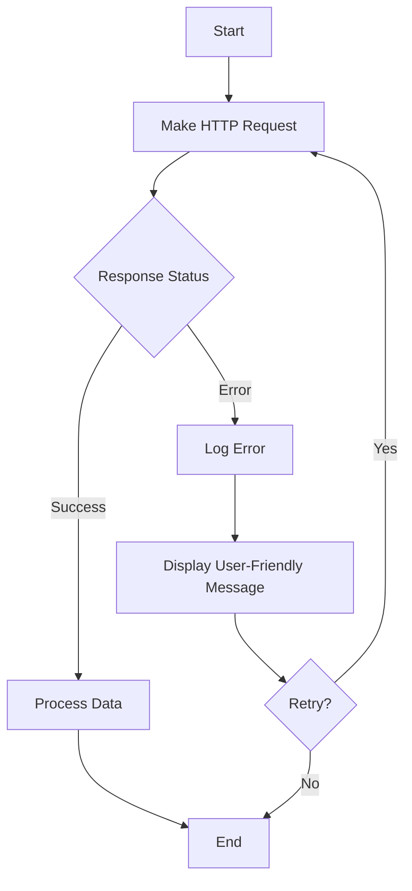

## 16.4 Error Handling in HTTP Calls

In this section, we will explore how to effectively handle errors that occur during HTTP calls in TypeScript. As we interact with APIs and web services, understanding how to manage errors is crucial for building robust and user-friendly applications. We'll cover common HTTP error codes, techniques for detecting and handling these errors, and best practices for providing feedback to users.

### Understanding HTTP Error Status Codes

HTTP status codes are issued by a server in response to a client's request made to the server. They are grouped into five classes, each representing a different category of response:

- **1xx: Informational** – Request received, continuing process.
- **2xx: Success** – The action was successfully received, understood, and accepted.
- **3xx: Redirection** – Further action must be taken to complete the request.
- **4xx: Client Error** – The request contains bad syntax or cannot be fulfilled.
- **5xx: Server Error** – The server failed to fulfill an apparently valid request.

Let's focus on the 4xx and 5xx series, as they are the most relevant for error handling:

- **400 Bad Request**: The server could not understand the request due to invalid syntax.
- **401 Unauthorized**: The client must authenticate itself to get the requested response.
- **403 Forbidden**: The client does not have access rights to the content.
- **404 Not Found**: The server can not find the requested resource.
- **500 Internal Server Error**: The server has encountered a situation it doesn't know how to handle.
- **503 Service Unavailable**: The server is not ready to handle the request.

### Detecting and Handling HTTP Errors

When making HTTP requests in TypeScript, we can use the `fetch` API or libraries like Axios. Both provide mechanisms to detect and handle errors. Let's start with the `fetch` API.

#### Using the `fetch` API

The `fetch` API returns a `Promise` that resolves to the `Response` object representing the response to the request. Here's how you can handle errors using `fetch`:

```typescript
async function fetchData(url: string): Promise<void> {
  try {
    const response = await fetch(url);

    // Check if the response status is not OK (200-299)
    if (!response.ok) {
      throw new Error(`HTTP error! status: ${response.status}`);
    }

    const data = await response.json();
    console.log(data);
  } catch (error) {
    console.error('There was a problem with the fetch operation:', error);
  }
}

fetchData('https://api.example.com/data');
```

In this example, we check if the `response.ok` property is `false`, which indicates an error status code. We then throw an error with a message that includes the status code.

#### Using Axios

Axios is a popular HTTP client library that simplifies error handling. It automatically throws an error for responses with status codes outside the range of 2xx.

```typescript
import axios from 'axios';

async function fetchData(url: string): Promise<void> {
  try {
    const response = await axios.get(url);
    console.log(response.data);
  } catch (error) {
    if (axios.isAxiosError(error)) {
      console.error('Axios error:', error.message);
      console.error('Response status:', error.response?.status);
    } else {
      console.error('Unexpected error:', error);
    }
  }
}

fetchData('https://api.example.com/data');
```

Here, we use `axios.isAxiosError` to check if the error is an Axios error. This allows us to access additional information, such as the response status.

### Providing User-Friendly Error Messages

When an error occurs, it's important to provide users with clear and helpful messages. Avoid technical jargon and focus on what the user can do next.

#### Example of User-Friendly Error Messages

```typescript
function handleError(status: number): string {
  switch (status) {
    case 400:
      return 'There was a problem with your request. Please check and try again.';
    case 401:
      return 'You are not authorized to view this content. Please log in.';
    case 404:
      return 'The requested resource could not be found.';
    case 500:
      return 'There is a problem with the server. Please try again later.';
    default:
      return 'An unexpected error occurred. Please try again.';
  }
}

// Usage
const errorMessage = handleError(404);
console.log(errorMessage);
```

### Implementing Retry Logic

Sometimes, errors are temporary and can be resolved by retrying the request. Implementing retry logic can improve the resilience of your application.

#### Simple Retry Logic Example

```typescript
async function fetchDataWithRetry(url: string, retries: number = 3): Promise<void> {
  for (let attempt = 1; attempt <= retries; attempt++) {
    try {
      const response = await fetch(url);
      if (!response.ok) {
        throw new Error(`HTTP error! status: ${response.status}`);
      }
      const data = await response.json();
      console.log(data);
      return; // Exit the function if successful
    } catch (error) {
      console.error(`Attempt ${attempt} failed:`, error);
      if (attempt === retries) {
        console.error('All retry attempts failed.');
      }
    }
  }
}

fetchDataWithRetry('https://api.example.com/data');
```

In this example, we attempt to fetch data up to three times before giving up. Each failed attempt logs an error message.

### Logging Errors for Debugging

Logging errors is crucial for debugging and monitoring the health of your application. It helps you identify patterns and recurring issues.

#### Example of Logging Errors

```typescript
function logError(error: Error, context: string): void {
  console.error(`Error in ${context}:`, error.message);
  // Additional logging logic, such as sending logs to a server
}

// Usage
try {
  // Some operation that may throw an error
} catch (error) {
  logError(error, 'fetchData');
}
```

### Best Practices for Secure Error Handling

When handling errors, it's important to avoid exposing sensitive information. Here are some best practices:

- **Do not expose stack traces or internal error details** to users. These can provide attackers with valuable information.
- **Sanitize error messages** before displaying them to users.
- **Log detailed error information** securely on the server side for debugging purposes.
- **Use HTTPS** to encrypt data in transit and protect against man-in-the-middle attacks.

### Visualizing Error Handling Flow

To better understand the flow of error handling in HTTP calls, let's visualize it using a flowchart.



**Diagram Description**: This flowchart illustrates the process of making an HTTP request, checking the response status, logging errors, displaying user-friendly messages, and retrying the request if necessary.

### Try It Yourself

Now that we've covered the basics of error handling in HTTP calls, try modifying the code examples to:

- Implement exponential backoff in the retry logic.
- Customize user-friendly error messages for additional HTTP status codes.
- Log errors to an external logging service.

### Summary

In this section, we explored how to handle errors in HTTP calls using TypeScript. We learned about common HTTP error codes, how to detect and handle these errors, and best practices for providing user-friendly messages and secure error handling. By implementing these techniques, you can create more resilient and user-friendly applications.

## Quiz Time!



### What does the HTTP status code 404 indicate?

- [ ] The request was successful.
- [ ] The server encountered an error.
- [x] The requested resource could not be found.
- [ ] The client must authenticate itself.

> **Explanation:** The 404 status code means the server cannot find the requested resource.

### Which method can be used to check if a `fetch` response was successful?

- [ ] `response.status`
- [x] `response.ok`
- [ ] `response.json()`
- [ ] `response.text()`

> **Explanation:** The `response.ok` property is a boolean that indicates if the response status is in the range 200-299.

### What is the purpose of retry logic in HTTP requests?

- [ ] To decrease server load.
- [x] To handle temporary errors by retrying the request.
- [ ] To improve application speed.
- [ ] To reduce code complexity.

> **Explanation:** Retry logic helps handle temporary errors by attempting the request multiple times.

### Why is it important to log errors?

- [ ] To increase application size.
- [ ] To expose sensitive data.
- [x] To help with debugging and monitoring application health.
- [ ] To slow down the application.

> **Explanation:** Logging errors is crucial for debugging and monitoring the health of your application.

### What should you avoid including in error messages shown to users?

- [ ] A simple explanation of the error.
- [x] Stack traces and internal error details.
- [ ] Suggestions for resolving the error.
- [ ] A contact for support.

> **Explanation:** Stack traces and internal error details should not be exposed to users to prevent information leakage.

### Which library is commonly used for making HTTP requests in TypeScript?

- [ ] Lodash
- [ ] Moment.js
- [x] Axios
- [ ] D3.js

> **Explanation:** Axios is a popular library for making HTTP requests in TypeScript.

### How can you identify an Axios error in a catch block?

- [ ] By checking `error.status`.
- [ ] By using `error.message`.
- [x] By using `axios.isAxiosError(error)`.
- [ ] By checking `error.code`.

> **Explanation:** `axios.isAxiosError(error)` is used to check if an error is an Axios error.

### What is a user-friendly error message?

- [ ] A message full of technical jargon.
- [x] A clear and helpful message that guides the user.
- [ ] A message that includes the error stack trace.
- [ ] A message that blames the user.

> **Explanation:** A user-friendly error message is clear, helpful, and guides the user on what to do next.

### What does the HTTP status code 500 indicate?

- [ ] The request was successful.
- [ ] The client made a bad request.
- [ ] The requested resource was not found.
- [x] The server encountered an internal error.

> **Explanation:** The 500 status code indicates an internal server error.

### True or False: It's safe to expose detailed error information to users.

- [ ] True
- [x] False

> **Explanation:** Exposing detailed error information to users can lead to security vulnerabilities.


