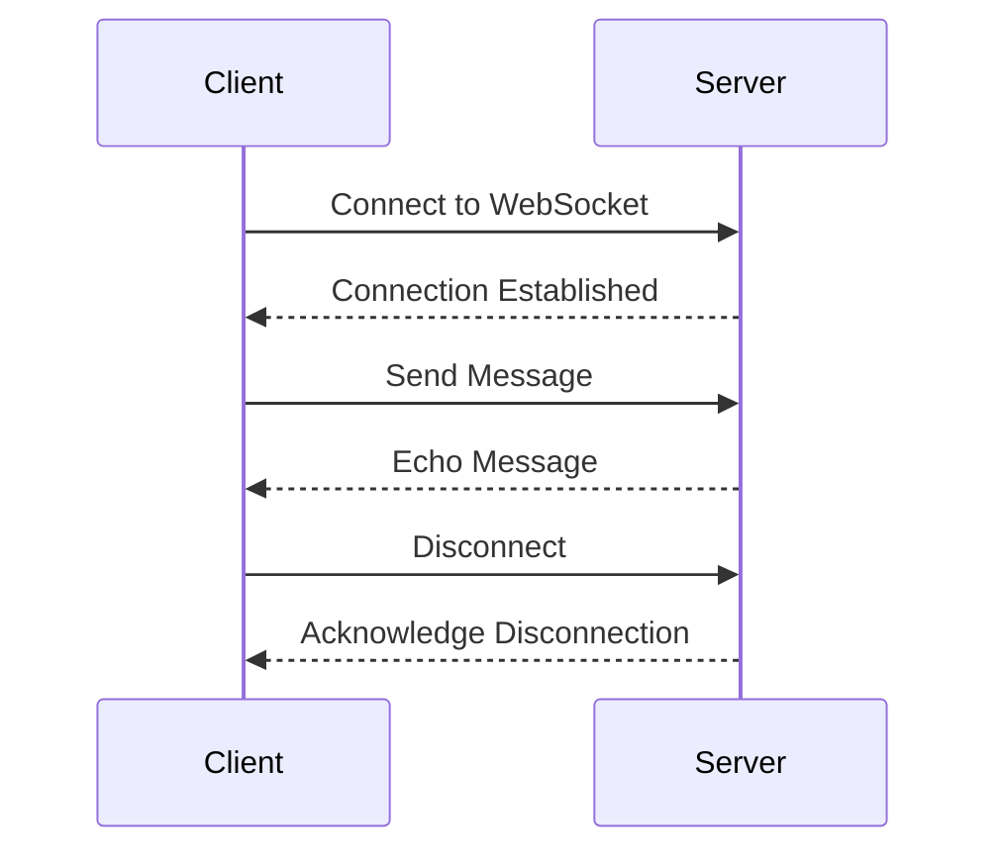

## 16.6 WebSockets and Real-time Data

In today's fast-paced digital world, real-time communication is crucial for many applications, from chat services to live notifications. WebSockets provide a powerful way to achieve this by enabling full-duplex communication channels over a single, long-lived connection. In this section, we'll explore what WebSockets are, how they differ from traditional HTTP requests, and how to use them in TypeScript applications.

### What are WebSockets?

WebSockets are a protocol that allows for two-way communication between a client and a server. Unlike HTTP, which is a request-response protocol where the client initiates every interaction, WebSockets enable both the client and server to send messages independently of each other. This makes WebSockets ideal for applications that require real-time data exchange.

#### Key Differences Between WebSockets and HTTP

- **Full-Duplex Communication**: WebSockets allow both the client and server to send and receive messages simultaneously, unlike HTTP, which is half-duplex and requires a request for every response.
- **Persistent Connection**: WebSockets maintain a single, long-lived connection, reducing the overhead of establishing new connections for each interaction.
- **Lower Latency**: Since WebSockets keep the connection open, they offer lower latency compared to HTTP, which needs to establish a new connection for each request.

### Establishing a WebSocket Connection

To establish a WebSocket connection, you need to create a WebSocket server and a client that connects to it. Let's start by setting up a simple WebSocket server using Node.js and TypeScript.

#### Setting Up a WebSocket Server

First, ensure you have Node.js and TypeScript installed. Then, create a new directory for your project and initialize it:

```bash
mkdir websocket-example
cd websocket-example
npm init -y
```

Next, install the `ws` library, which provides WebSocket server and client functionality:

```bash
npm install ws
```

Create a `server.ts` file and add the following code to set up a basic WebSocket server:

```typescript
import { WebSocketServer } from 'ws';

// Create a new WebSocket server on port 8080
const wss = new WebSocketServer({ port: 8080 });

wss.on('connection', (ws) => {
  console.log('New client connected');

  // Send a welcome message to the client
  ws.send('Welcome to the WebSocket server!');

  // Listen for messages from the client
  ws.on('message', (message) => {
    console.log(`Received message: ${message}`);
    // Echo the message back to the client
    ws.send(`You said: ${message}`);
  });

  // Handle client disconnection
  ws.on('close', () => {
    console.log('Client disconnected');
  });
});

console.log('WebSocket server is running on ws://localhost:8080');
```

#### Creating a WebSocket Client

Now, let's create a simple WebSocket client in TypeScript to connect to our server. Create a `client.ts` file and add the following code:

```typescript
const socket = new WebSocket('ws://localhost:8080');

// Event listener for when the connection is established
socket.addEventListener('open', () => {
  console.log('Connected to the server');
  // Send a message to the server
  socket.send('Hello, server!');
});

// Event listener for receiving messages from the server
socket.addEventListener('message', (event) => {
  console.log(`Message from server: ${event.data}`);
});

// Event listener for when the connection is closed
socket.addEventListener('close', () => {
  console.log('Disconnected from the server');
});
```

To run the server and client, compile the TypeScript files to JavaScript using the TypeScript compiler (`tsc`) and execute them with Node.js:

```bash
npx tsc server.ts
node server.js
```

Open another terminal, compile and run the client:

```bash
npx tsc client.ts
node client.js
```

You should see messages indicating that the client has connected to the server, sent a message, and received an echo response.

### Use Cases for WebSockets

WebSockets are incredibly versatile and can be used in various applications that require real-time data exchange. Here are a few common use cases:

#### Chat Applications

WebSockets are perfect for chat applications, where messages need to be sent and received instantly. Each user can maintain a WebSocket connection to the server, allowing for real-time message delivery.

#### Live Notifications

WebSockets can be used to push notifications to users in real-time, such as updates on stock prices, sports scores, or social media interactions.

#### Collaborative Tools

Applications like collaborative document editors or multiplayer games can use WebSockets to synchronize changes across multiple clients in real-time.

### Handling Incoming and Outgoing Messages

Handling messages in WebSockets involves listening for incoming messages and sending outgoing messages. We've already seen a basic example of this in our server and client setup. Let's explore some additional concepts.

#### Broadcasting Messages

In a chat application, you might want to broadcast a message to all connected clients. Here's how you can modify the server to achieve this:

```typescript
wss.on('connection', (ws) => {
  ws.on('message', (message) => {
    // Broadcast the message to all connected clients
    wss.clients.forEach((client) => {
      if (client.readyState === WebSocket.OPEN) {
        client.send(`Broadcast: ${message}`);
      }
    });
  });
});
```

#### Handling JSON Messages

In many applications, you'll want to send structured data rather than plain text. JSON is a popular format for this purpose. Here's how you can handle JSON messages:

```typescript
wss.on('connection', (ws) => {
  ws.on('message', (message) => {
    try {
      const data = JSON.parse(message.toString());
      console.log('Received JSON data:', data);
      // Process the data and send a response
      ws.send(JSON.stringify({ response: 'Data received' }));
    } catch (error) {
      console.error('Invalid JSON:', error);
      ws.send('Error: Invalid JSON');
    }
  });
});
```

### Libraries for Simplifying WebSocket Usage

While the native WebSocket API is powerful, libraries like Socket.IO can simplify the process of working with WebSockets, especially when dealing with complex applications.

#### Introduction to Socket.IO

Socket.IO is a popular library that provides an abstraction over WebSockets, offering additional features like automatic reconnection, broadcasting, and rooms. It also falls back to HTTP long-polling if WebSockets are not supported.

#### Setting Up a Socket.IO Server

To use Socket.IO, install the library in your project:

```bash
npm install socket.io
```

Create a `socketServer.ts` file with the following code:

```typescript
import { createServer } from 'http';
import { Server } from 'socket.io';

// Create an HTTP server
const httpServer = createServer();

// Create a Socket.IO server
const io = new Server(httpServer, {
  cors: {
    origin: '*',
  },
});

io.on('connection', (socket) => {
  console.log('New client connected');

  // Listen for messages from the client
  socket.on('message', (data) => {
    console.log(`Received message: ${data}`);
    // Broadcast the message to all clients
    io.emit('message', `Broadcast: ${data}`);
  });

  // Handle client disconnection
  socket.on('disconnect', () => {
    console.log('Client disconnected');
  });
});

// Start the server
httpServer.listen(8080, () => {
  console.log('Socket.IO server is running on http://localhost:8080');
});
```

#### Creating a Socket.IO Client

To create a Socket.IO client, install the client library:

```bash
npm install socket.io-client
```

Create a `socketClient.ts` file with the following code:

```typescript
import { io } from 'socket.io-client';

// Connect to the Socket.IO server
const socket = io('http://localhost:8080');

// Listen for messages from the server
socket.on('message', (data) => {
  console.log(`Message from server: ${data}`);
});

// Send a message to the server
socket.emit('message', 'Hello, Socket.IO server!');
```

Compile and run the server and client as before. You'll notice that Socket.IO simplifies the process of handling connections and messages.

### Visualizing WebSocket Communication

To better understand the flow of WebSocket communication, let's visualize it using a sequence diagram.



This diagram illustrates the basic sequence of events in a WebSocket communication, from establishing a connection to sending and receiving messages, and finally disconnecting.

### Try It Yourself

Now that we've covered the basics of WebSockets, it's time to experiment. Here are a few challenges to try on your own:

1. **Modify the Client**: Change the client to send a JSON object instead of a plain text message. Update the server to parse and respond to this JSON data.

2. **Implement a Chat Room**: Extend the server to support multiple chat rooms. Clients should be able to join a room and only receive messages from other clients in the same room.

3. **Add Error Handling**: Enhance the server and client to handle errors gracefully, such as invalid JSON or connection issues.

4. **Explore Socket.IO Features**: Use Socket.IO to implement features like automatic reconnection and message acknowledgments.

### Summary

WebSockets provide a robust solution for real-time communication in web applications. By maintaining a persistent connection, they enable low-latency, full-duplex communication between clients and servers. Libraries like Socket.IO further simplify the process, offering additional features and fallbacks for broader compatibility. With the knowledge gained in this section, you're well-equipped to build real-time applications using WebSockets and TypeScript.

## Quiz Time!



### What is a key feature of WebSockets compared to HTTP?

- [x] Full-duplex communication
- [ ] Half-duplex communication
- [ ] Request-response model
- [ ] Stateless protocol

> **Explanation:** WebSockets allow full-duplex communication, enabling both the client and server to send and receive messages independently.

### Which library simplifies WebSocket usage by providing additional features?

- [ ] Express
- [x] Socket.IO
- [ ] Axios
- [ ] Lodash

> **Explanation:** Socket.IO is a library that abstracts WebSockets and provides features like automatic reconnection and broadcasting.

### What is the primary advantage of using WebSockets for real-time applications?

- [ ] Higher latency
- [ ] Stateless communication
- [x] Lower latency
- [ ] Limited data exchange

> **Explanation:** WebSockets offer lower latency by maintaining a persistent connection, reducing the overhead of establishing new connections.

### How does a WebSocket connection differ from an HTTP connection?

- [x] WebSockets maintain a persistent connection
- [ ] WebSockets are stateless
- [ ] HTTP allows full-duplex communication
- [ ] HTTP maintains a persistent connection

> **Explanation:** WebSockets maintain a persistent connection, unlike HTTP, which is stateless and requires a new connection for each request.

### What is a common use case for WebSockets?

- [ ] Static websites
- [x] Chat applications
- [ ] Batch processing
- [ ] File storage

> **Explanation:** Chat applications benefit from WebSockets due to the need for real-time message delivery.

### Which method is used to send a message from a WebSocket client to the server?

- [ ] fetch()
- [ ] post()
- [x] send()
- [ ] emit()

> **Explanation:** The `send()` method is used to send messages from a WebSocket client to the server.

### What happens when a WebSocket connection is closed?

- [x] The client and server stop communicating
- [ ] The server sends a final message
- [ ] The client automatically reconnects
- [ ] The server restarts

> **Explanation:** When a WebSocket connection is closed, the client and server stop communicating until a new connection is established.

### Which event is triggered when a WebSocket client successfully connects to a server?

- [x] open
- [ ] message
- [ ] close
- [ ] error

> **Explanation:** The `open` event is triggered when a WebSocket client successfully connects to a server.

### What format is commonly used for structured data in WebSocket messages?

- [ ] XML
- [x] JSON
- [ ] CSV
- [ ] HTML

> **Explanation:** JSON is commonly used for structured data in WebSocket messages due to its simplicity and compatibility.

### True or False: WebSockets can only be used for text-based communication.

- [ ] True
- [x] False

> **Explanation:** WebSockets can be used for both text-based and binary communication, allowing for a wide range of data types.


