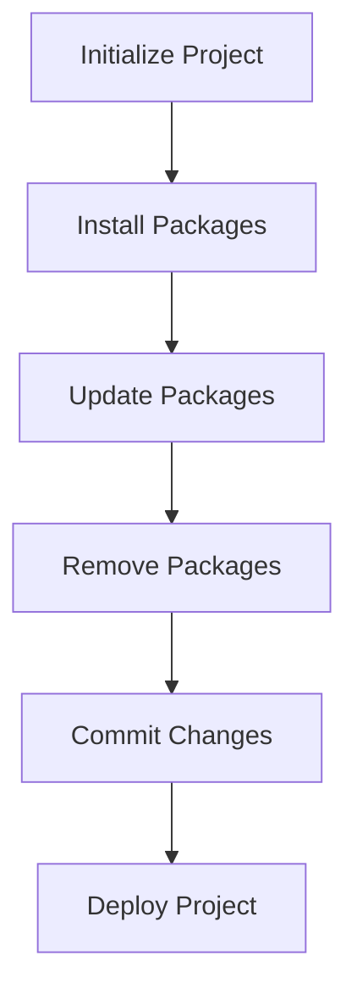

## 17.1 Introduction to NPM and Yarn

In the world of modern web development, managing dependencies efficiently is crucial for building robust and maintainable applications. Two popular tools that facilitate this process are **NPM (Node Package Manager)** and **Yarn**. In this section, we'll explore what these package managers are, their roles in dependency management, and how to use them effectively in your TypeScript projects.

### What are NPM and Yarn?

**NPM** and **Yarn** are package managers that help developers manage libraries and dependencies in JavaScript and TypeScript projects. They allow you to easily install, update, and remove packages, ensuring that your project has all the necessary components to run smoothly.

- **NPM**: NPM is the default package manager for Node.js. It comes bundled with Node.js installations and is widely used in the JavaScript ecosystem. NPM provides a vast repository of packages, making it easy to find and integrate third-party libraries into your projects.

- **Yarn**: Yarn is an alternative package manager developed by Facebook. It was created to address some of the shortcomings of NPM, such as speed and reliability. Yarn offers features like deterministic installs, which ensure that the same dependencies are installed across different environments.

### Basic Commands for NPM and Yarn

Let's dive into some basic commands that will help you get started with NPM and Yarn.

#### Installing Packages

To install a package using NPM, use the following command:

```bash
npm install <package-name>
```

For Yarn, the command is:

```bash
yarn add <package-name>
```

Both commands will download the specified package and add it to your project's dependencies.

#### Updating Packages

To update a package with NPM, you can use:

```bash
npm update <package-name>
```

With Yarn, the command is:

```bash
yarn upgrade <package-name>
```

These commands will update the specified package to the latest version that satisfies the version range specified in your `package.json`.

#### Removing Packages

To remove a package using NPM, run:

```bash
npm uninstall <package-name>
```

For Yarn, the command is:

```bash
yarn remove <package-name>
```

This will remove the package from your project and update the `package.json` file accordingly.

### Understanding `package.json` and Lock Files

#### `package.json`

The `package.json` file is a crucial component of any Node.js or TypeScript project. It serves as the manifest file that contains metadata about your project, including its name, version, dependencies, and scripts.

Here's a basic example of a `package.json` file:

```json
{
  "name": "my-typescript-project",
  "version": "1.0.0",
  "description": "A simple TypeScript project",
  "main": "index.js",
  "scripts": {
    "start": "tsc && node index.js"
  },
  "dependencies": {
    "express": "^4.17.1"
  },
  "devDependencies": {
    "typescript": "^4.4.3"
  }
}
```

- **Dependencies**: These are the packages your project needs to run. They are installed when you run `npm install` or `yarn install`.
- **DevDependencies**: These are packages needed only during development, such as testing frameworks or build tools.

#### Lock Files: `package-lock.json` and `yarn.lock`

Lock files ensure that the exact versions of dependencies are installed, providing consistency across different environments.

- **`package-lock.json`**: This file is automatically generated by NPM when you install packages. It records the exact version of each installed package, ensuring that subsequent installs produce the same dependency tree.

- **`yarn.lock`**: Similar to `package-lock.json`, this file is generated by Yarn and serves the same purpose of locking dependencies to specific versions.

### Differences Between NPM and Yarn

While both NPM and Yarn serve similar purposes, there are some key differences:

- **Speed**: Yarn is generally faster than NPM due to its parallel installation process.
- **Deterministic Installs**: Yarn ensures that the same dependencies are installed in the same order on every machine, reducing "works on my machine" issues.
- **Offline Mode**: Yarn can install packages without an internet connection if they have been installed before.
- **Security**: Yarn checks the integrity of every package before installation, adding an extra layer of security.

### Best Practices for Managing Dependencies

1. **Version Control**: Always commit your `package.json` and lock files to version control. This ensures that your project can be reliably built on any machine.

2. **Semantic Versioning**: Pay attention to semantic versioning when specifying package versions. Use caret (`^`) or tilde (`~`) to allow for minor or patch updates, respectively.

3. **Regular Updates**: Regularly update your dependencies to benefit from security patches and new features. Use tools like `npm outdated` or `yarn outdated` to check for outdated packages.

4. **Use Lock Files**: Always use lock files to ensure consistent installations across different environments.

5. **Clean Up**: Periodically remove unused dependencies to keep your project clean and reduce potential security vulnerabilities.

### Try It Yourself

Let's try a simple exercise to reinforce what we've learned. Create a new directory for a TypeScript project and initialize it with NPM or Yarn. Then, install a package, update it, and finally remove it.

```bash
mkdir my-typescript-project
cd my-typescript-project

npm init -y

npm install lodash

npm update lodash

npm uninstall lodash
```

Try the same steps with Yarn:

```bash
yarn init -y

yarn add lodash

yarn upgrade lodash

yarn remove lodash
```

Experiment with these commands and observe how the `package.json` and lock files change with each action.

### Visual Aid: Dependency Management Workflow



**Figure 1**: A typical workflow for managing dependencies in a TypeScript project.

### References and Links

- [NPM Documentation](https://docs.npmjs.com/)
- [Yarn Documentation](https://yarnpkg.com/getting-started)
- [Semantic Versioning](https://semver.org/)

### Summary

In this section, we've explored the essentials of NPM and Yarn, two powerful tools for managing dependencies in TypeScript projects. We've learned how to install, update, and remove packages, and understood the role of `package.json` and lock files. By following best practices for dependency management, you can ensure that your projects remain stable, secure, and maintainable.

## Quiz Time!



### What is the primary role of NPM and Yarn in a TypeScript project?

- [x] Managing dependencies
- [ ] Compiling TypeScript code
- [ ] Running tests
- [ ] Deploying applications

> **Explanation:** NPM and Yarn are package managers used to manage dependencies in JavaScript and TypeScript projects.

### Which command is used to install a package using NPM?

- [x] npm install <package-name>
- [ ] npm add <package-name>
- [ ] npm get <package-name>
- [ ] npm fetch <package-name>

> **Explanation:** The `npm install <package-name>` command is used to install a package with NPM.

### What file ensures that the exact versions of dependencies are installed in a project?

- [x] package-lock.json
- [ ] package.json
- [ ] index.js
- [ ] README.md

> **Explanation:** The `package-lock.json` file locks dependencies to specific versions, ensuring consistent installations.

### Which feature is unique to Yarn compared to NPM?

- [x] Offline mode
- [ ] Installing packages
- [ ] Removing packages
- [ ] Updating packages

> **Explanation:** Yarn's offline mode allows it to install packages without an internet connection if they have been installed before.

### What is the purpose of the `dependencies` field in `package.json`?

- [x] To list packages required for the project to run
- [ ] To list packages required only during development
- [ ] To specify the project's main entry point
- [ ] To define custom scripts for the project

> **Explanation:** The `dependencies` field lists packages that are necessary for the project to run.

### How can you check for outdated packages using Yarn?

- [x] yarn outdated
- [ ] yarn check
- [ ] yarn list
- [ ] yarn verify

> **Explanation:** The `yarn outdated` command is used to check for outdated packages in a project.

### Which command is used to remove a package with NPM?

- [x] npm uninstall <package-name>
- [ ] npm delete <package-name>
- [ ] npm remove <package-name>
- [ ] npm discard <package-name>

> **Explanation:** The `npm uninstall <package-name>` command removes a package from a project.

### What is the advantage of using lock files in a project?

- [x] Ensures consistent installations across environments
- [ ] Speeds up the installation process
- [ ] Reduces the size of the project
- [ ] Increases the number of available packages

> **Explanation:** Lock files ensure that the same versions of dependencies are installed across different environments.

### What does the caret (`^`) symbol in a version number signify in `package.json`?

- [x] Allows minor and patch updates
- [ ] Allows only patch updates
- [ ] Allows major updates
- [ ] Prevents any updates

> **Explanation:** The caret (`^`) symbol allows for minor and patch updates, providing flexibility while maintaining compatibility.

### True or False: Yarn can install packages without an internet connection if they have been installed before.

- [x] True
- [ ] False

> **Explanation:** Yarn's offline mode allows it to install previously installed packages without an internet connection.


