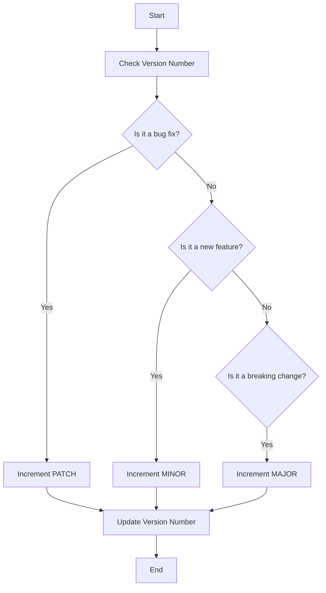

## 17.2 Semantic Versioning and Dependency Management

In the world of software development, managing dependencies is crucial to maintaining a stable and functional codebase. As we build applications, we often rely on third-party libraries and packages to speed up development and add functionality. However, with these dependencies comes the challenge of ensuring compatibility and stability. This is where semantic versioning and effective dependency management come into play.

### Understanding Semantic Versioning

Semantic Versioning (SemVer) is a versioning convention that helps developers understand the impact of changes in software packages. It uses a three-part version number format: `MAJOR.MINOR.PATCH`. Let's break down each component:

- **MAJOR**: This number is incremented when there are incompatible changes that may break backward compatibility. For example, if a function signature changes or a feature is removed, the major version should be increased.
  
- **MINOR**: This number is incremented when new features are added in a backward-compatible manner. This means that existing functionality remains unchanged, but new capabilities are introduced.
  
- **PATCH**: This number is incremented for backward-compatible bug fixes. These are changes that fix issues without altering existing functionality or introducing new features.

#### Example of Semantic Versioning

Consider a package with the version `2.3.1`:

- `2` is the MAJOR version.
- `3` is the MINOR version.
- `1` is the PATCH version.

If a new feature is added without breaking existing functionality, the version would become `2.4.0`. If a bug is fixed, it would become `2.3.2`. If a breaking change is introduced, it would become `3.0.0`.

### Specifying Dependencies in `package.json`

In a TypeScript project, dependencies are typically managed using a `package.json` file. This file contains metadata about the project, including its dependencies. Here's a basic example of a `package.json` file:

```json
{
  "name": "my-typescript-project",
  "version": "1.0.0",
  "dependencies": {
    "express": "^4.17.1",
    "lodash": "~4.17.21"
  },
  "devDependencies": {
    "typescript": "^4.5.2",
    "ts-node": "^10.4.0"
  }
}
```

#### Understanding Versioning Operators

- **Caret (`^`) Operator**: This operator allows updates that do not change the leftmost non-zero digit. For example, `^4.17.1` will match any version from `4.17.1` to less than `5.0.0`. It is commonly used because it allows for minor updates and patches, which are usually backward-compatible.

- **Tilde (`~`) Operator**: This operator allows updates to the most specific version number. For example, `~4.17.21` will match any version from `4.17.21` to less than `4.18.0`. It is more restrictive than the caret operator and is often used when you want to avoid minor version updates that might introduce new features.

### Importance of Staying Up-to-Date with Dependencies

Keeping dependencies up-to-date is essential for several reasons:

1. **Security**: Older versions of packages may have vulnerabilities that can be exploited. Regular updates help ensure that your application is protected against known security threats.

2. **Performance**: Newer versions of packages often include performance improvements that can make your application run more efficiently.

3. **Compatibility**: As the ecosystem evolves, newer versions of packages may be required to work with other updated dependencies or platforms.

4. **Bug Fixes**: Updates often include fixes for bugs that could affect the stability and reliability of your application.

### Handling Breaking Changes

When updating dependencies, you may encounter breaking changes, especially when updating to a new major version. Here are some tips for handling these changes:

- **Read Release Notes**: Always read the release notes or changelog of a package before updating. This will help you understand what has changed and whether any breaking changes have been introduced.

- **Test Thoroughly**: Before deploying updates to production, thoroughly test your application to ensure that everything works as expected with the new version.

- **Use a Staging Environment**: Test updates in a staging environment that mirrors your production setup. This allows you to catch issues before they affect your users.

- **Lock Dependencies**: Use a lock file (e.g., `package-lock.json` or `yarn.lock`) to ensure that your application uses the exact versions of dependencies that you have tested.

- **Gradual Updates**: If possible, update dependencies gradually rather than all at once. This makes it easier to identify which update caused an issue if something breaks.

### Code Example: Managing Dependencies

Let's look at a simple TypeScript project setup and how we might manage dependencies using `npm`.

1. **Initialize a New Project**

```bash
npm init -y
```

This command creates a `package.json` file with default values.

2. **Install Dependencies**

```bash
npm install express lodash
```

This command installs `express` and `lodash` as dependencies. The `package.json` file is updated to include these dependencies.

3. **Install Development Dependencies**

```bash
npm install --save-dev typescript ts-node
```

This command installs `typescript` and `ts-node` as development dependencies, which are only needed during development.

4. **Update Dependencies**

To update a specific package, you can use:

```bash
npm update express
```

This command updates the `express` package to the latest version that satisfies the version range specified in `package.json`.

### Try It Yourself

Experiment with managing dependencies in your own TypeScript project:

- **Modify the `package.json`**: Try changing the version numbers and operators for your dependencies and observe how it affects the installed versions.

- **Add a New Dependency**: Install a new package and see how it is added to the `package.json` file.

- **Update a Dependency**: Use the `npm update` command to update a dependency and test your application to ensure it still works as expected.

### Visual Aids

#### Semantic Versioning Flowchart



This flowchart illustrates the decision-making process for determining which part of the version number to increment based on the type of change.

### References and Links

- [Semantic Versioning Specification](https://semver.org/)
- [NPM Documentation](https://docs.npmjs.com/)
- [Node.js Package Manager](https://nodejs.org/en/knowledge/getting-started/npm/what-is-npm/)

### Engagement and Reinforcement

- **Question**: What is the difference between the caret (`^`) and tilde (`~`) operators in versioning?
- **Exercise**: Create a new TypeScript project and practice installing, updating, and managing dependencies using `npm`.

### Summary

In this section, we've explored the concept of semantic versioning and its importance in managing dependencies in TypeScript projects. By understanding how to specify dependencies in `package.json` and using versioning operators, we can maintain a stable and compatible codebase. Regularly updating dependencies and handling breaking changes are crucial practices for ensuring the security, performance, and reliability of our applications.

## Quiz Time!



### What does the MAJOR version number represent in semantic versioning?

- [x] Incompatible changes that may break backward compatibility
- [ ] Backward-compatible bug fixes
- [ ] New features added in a backward-compatible manner
- [ ] Performance improvements

> **Explanation:** The MAJOR version number is incremented when there are incompatible changes that may break backward compatibility.

### Which operator allows updates that do not change the leftmost non-zero digit?

- [x] Caret (`^`)
- [ ] Tilde (`~`)
- [ ] Asterisk (`*`)
- [ ] Plus (`+`)

> **Explanation:** The caret (`^`) operator allows updates that do not change the leftmost non-zero digit.

### What is the purpose of a lock file like `package-lock.json`?

- [x] To ensure the application uses the exact versions of dependencies that have been tested
- [ ] To automatically update all dependencies to their latest versions
- [ ] To provide a backup of the `package.json` file
- [ ] To list all available packages in the npm registry

> **Explanation:** A lock file ensures that the application uses the exact versions of dependencies that have been tested, providing consistency across environments.

### What should you do before updating a package to a new major version?

- [x] Read the release notes or changelog
- [ ] Delete the `node_modules` folder
- [ ] Remove the package from `package.json`
- [ ] Ignore the update

> **Explanation:** Reading the release notes or changelog helps you understand what has changed and whether any breaking changes have been introduced.

### Which versioning operator is more restrictive, allowing updates to the most specific version number?

- [ ] Caret (`^`)
- [x] Tilde (`~`)
- [ ] Asterisk (`*`)
- [ ] Plus (`+`)

> **Explanation:** The tilde (`~`) operator is more restrictive, allowing updates to the most specific version number.

### Why is it important to keep dependencies up-to-date?

- [x] To ensure security, performance, compatibility, and bug fixes
- [ ] To reduce the size of the `node_modules` folder
- [ ] To increase the number of available packages
- [ ] To automatically fix all bugs in the code

> **Explanation:** Keeping dependencies up-to-date ensures security, performance, compatibility, and bug fixes.

### What is the result of running `npm update express`?

- [x] Updates the `express` package to the latest version that satisfies the version range in `package.json`
- [ ] Removes the `express` package from the project
- [ ] Downgrades the `express` package to the previous version
- [ ] Installs a new package called `update-express`

> **Explanation:** Running `npm update express` updates the `express` package to the latest version that satisfies the version range in `package.json`.

### What should you do if you encounter a breaking change after updating a package?

- [x] Test thoroughly and consider rolling back if necessary
- [ ] Ignore the issue and continue development
- [ ] Delete the `package-lock.json` file
- [ ] Uninstall all dependencies

> **Explanation:** If you encounter a breaking change, you should test thoroughly and consider rolling back if necessary.

### What does the PATCH version number represent in semantic versioning?

- [x] Backward-compatible bug fixes
- [ ] Incompatible changes that may break backward compatibility
- [ ] New features added in a backward-compatible manner
- [ ] Performance improvements

> **Explanation:** The PATCH version number is incremented for backward-compatible bug fixes.

### True or False: The `^` operator allows updates to any version, including major versions.

- [ ] True
- [x] False

> **Explanation:** False. The `^` operator allows updates that do not change the leftmost non-zero digit, so it does not allow updates to new major versions.


