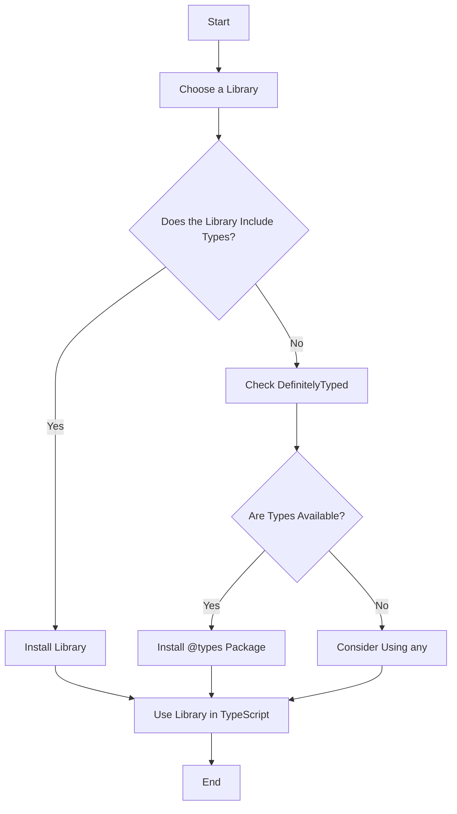

## 17.3 Installing Type Definitions

As we continue our journey into TypeScript, it's crucial to understand how to work with third-party libraries. Many of these libraries are written in JavaScript and lack the type information TypeScript needs to provide the benefits of static typing. This is where type definitions come into play. In this section, we will explore what type definitions are, how to install them, and how to use them effectively in your TypeScript projects.

### Understanding Type Definitions

Type definitions are files that provide TypeScript with information about the types used in a JavaScript library. These files have a `.d.ts` extension and describe the shape of the library's API, allowing TypeScript to check your code for errors and provide better IntelliSense in your editor.

#### The Role of DefinitelyTyped

DefinitelyTyped is a community-driven project that maintains type definitions for popular JavaScript libraries. These definitions are available as packages under the `@types` scope on NPM. The DefinitelyTyped repository is a valuable resource for TypeScript developers, as it provides a vast collection of type definitions that can be easily installed and used in your projects.

### Installing Type Definitions

To use type definitions in your TypeScript project, you need to install them using a package manager like NPM or Yarn. Let's explore how to do this.

#### Using NPM to Install Type Definitions

NPM is the default package manager for Node.js and is widely used in the JavaScript ecosystem. To install type definitions using NPM, you can use the following command:

```bash
npm install @types/library-name --save-dev
```

- `@types/library-name`: This is the name of the type definition package you want to install. Replace `library-name` with the actual name of the library.
- `--save-dev`: This flag indicates that the package is a development dependency, meaning it is only needed during development and not in production.

#### Using Yarn to Install Type Definitions

Yarn is an alternative package manager that offers similar functionality to NPM. To install type definitions using Yarn, use the following command:

```bash
yarn add @types/library-name --dev
```

- `@types/library-name`: Again, replace `library-name` with the name of the library.
- `--dev`: This flag specifies that the package is a development dependency.

### Importing and Using Type Definitions

Once you've installed the type definitions, you can start using them in your TypeScript code. Let's look at an example using the popular `lodash` library.

#### Example: Using Type Definitions with Lodash

1. **Install Lodash and Its Type Definitions**

   First, install `lodash` and its type definitions:

   ```bash
   npm install lodash
   npm install @types/lodash --save-dev
   ```

2. **Import and Use Lodash in Your TypeScript Code**

   Now, you can import and use Lodash in your TypeScript code with full type support:

   ```typescript
   import _ from 'lodash';

   const numbers = [1, 2, 3, 4, 5];
   const doubled = _.map(numbers, n => n * 2);

   console.log(doubled); // Output: [2, 4, 6, 8, 10]
   ```

   In this example, TypeScript understands the types of `lodash` functions, providing you with type checking and IntelliSense.

### Packages with Built-in Type Definitions

Some modern JavaScript libraries include their own type definitions. This means you don't need to install a separate `@types` package. These libraries typically have a `types` field in their `package.json` file pointing to the included type definitions.

#### Example: Using a Library with Built-in Type Definitions

Consider the `axios` library, which includes its own type definitions:

1. **Install Axios**

   ```bash
   npm install axios
   ```

2. **Use Axios in Your TypeScript Code**

   You can directly use Axios in your TypeScript code without installing additional type definitions:

   ```typescript
   import axios from 'axios';

   axios.get('https://api.example.com/data')
     .then(response => {
       console.log(response.data);
     })
     .catch(error => {
       console.error(error);
     });
   ```

   In this case, TypeScript automatically uses the built-in type definitions provided by `axios`.

### Checking for Available Type Definitions

Before using a third-party library in your TypeScript project, it's a good practice to check if type definitions are available. Here are some steps you can follow:

1. **Search on DefinitelyTyped**

   Visit the [DefinitelyTyped GitHub repository](https://github.com/DefinitelyTyped/DefinitelyTyped) and search for the library's name. If type definitions exist, you can install them using the `@types` scope.

2. **Check the Library's Documentation**

   Some libraries include information about type definitions in their documentation. Look for a section on TypeScript support.

3. **Inspect the `package.json` File**

   If the library includes its own type definitions, the `package.json` file will have a `types` field pointing to the type definition file.

### Avoiding the `any` Type

Using the `any` type in TypeScript can undermine the benefits of static typing, as it allows any value to be assigned to a variable. Before resorting to `any`, check if type definitions are available for the library you're using. This will help you maintain type safety and improve code quality.

### Try It Yourself

To reinforce your understanding, try the following exercise:

1. Choose a popular JavaScript library you use frequently.
2. Check if type definitions are available on DefinitelyTyped or if the library includes its own types.
3. Install the type definitions and use the library in a TypeScript file.
4. Experiment with the library's API and observe how TypeScript provides type checking and IntelliSense.

### Visual Aid: Type Definitions Installation Process



This flowchart illustrates the process of installing type definitions for a library, highlighting the decision points and actions you can take.

### Key Takeaways

- Type definitions provide TypeScript with information about the types used in a JavaScript library, enabling type checking and IntelliSense.
- DefinitelyTyped is a community-driven project that maintains type definitions for popular libraries, available under the `@types` scope on NPM.
- Use NPM or Yarn to install type definitions as development dependencies.
- Some libraries include their own type definitions, eliminating the need for separate `@types` packages.
- Always check for available type definitions before using `any` to maintain type safety.

### Additional Resources

- [TypeScript Handbook: Declaration Files](https://www.typescriptlang.org/docs/handbook/declaration-files/introduction.html)
- [DefinitelyTyped GitHub Repository](https://github.com/DefinitelyTyped/DefinitelyTyped)
- [NPM Documentation](https://docs.npmjs.com/)

By understanding and utilizing type definitions, you can enhance your TypeScript development experience, ensuring your code is robust, maintainable, and type-safe.

## Quiz Time!



### What is the primary purpose of type definitions in TypeScript?

- [x] To provide TypeScript with information about the types used in a JavaScript library.
- [ ] To convert JavaScript code into TypeScript.
- [ ] To install JavaScript libraries.
- [ ] To create new JavaScript libraries.

> **Explanation:** Type definitions describe the shape of a library's API, allowing TypeScript to check for errors and provide IntelliSense.

### Where can you find community-maintained type definitions for popular JavaScript libraries?

- [x] DefinitelyTyped
- [ ] GitHub
- [ ] Stack Overflow
- [ ] MDN Web Docs

> **Explanation:** DefinitelyTyped is a community-driven project that maintains type definitions for popular JavaScript libraries.

### How do you install type definitions for a library using NPM?

- [x] npm install @types/library-name --save-dev
- [ ] npm install library-name
- [ ] npm install library-name --save
- [ ] npm install @types/library-name

> **Explanation:** The `@types` scope is used to install type definitions, and `--save-dev` indicates a development dependency.

### What should you do if a library includes its own type definitions?

- [x] Install the library and use it directly in your TypeScript code.
- [ ] Install the `@types` package for the library.
- [ ] Use the `any` type for all variables related to the library.
- [ ] Avoid using the library in TypeScript projects.

> **Explanation:** If a library includes its own type definitions, you can use it directly without additional `@types` packages.

### Which of the following flags is used with Yarn to install type definitions as development dependencies?

- [x] --dev
- [ ] --save
- [ ] --type
- [ ] --global

> **Explanation:** The `--dev` flag specifies that the package is a development dependency.

### What is the file extension for type definition files in TypeScript?

- [x] .d.ts
- [ ] .ts
- [ ] .js
- [ ] .json

> **Explanation:** Type definition files have a `.d.ts` extension.

### Why is it important to check for available type definitions before using `any`?

- [x] To maintain type safety and improve code quality.
- [ ] To reduce the size of your codebase.
- [ ] To increase the speed of your application.
- [ ] To make your code more complex.

> **Explanation:** Using type definitions helps maintain type safety and improves code quality by avoiding the use of `any`.

### How can you verify if a library includes its own type definitions?

- [x] Check the `package.json` file for a `types` field.
- [ ] Search for the library on Stack Overflow.
- [ ] Look for a `.d.ts` file in the library's GitHub repository.
- [ ] Read the library's README file.

> **Explanation:** A `types` field in the `package.json` file indicates that the library includes its own type definitions.

### What is the benefit of using type definitions with third-party libraries?

- [x] Enhanced type checking and IntelliSense in your editor.
- [ ] Faster execution of your TypeScript code.
- [ ] Reduced file size of your TypeScript project.
- [ ] Increased complexity of your TypeScript code.

> **Explanation:** Type definitions provide enhanced type checking and IntelliSense, improving the development experience.

### True or False: You should always use the `any` type if type definitions are not available for a library.

- [ ] True
- [x] False

> **Explanation:** It's better to check for available type definitions or consider alternative solutions before using `any`, to maintain type safety.


