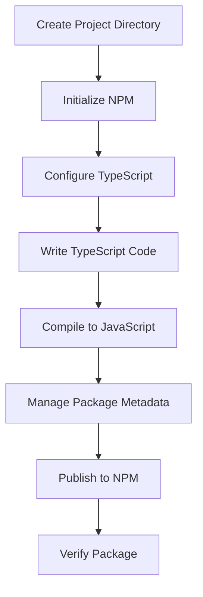

## 17.4 Creating and Publishing TypeScript Packages

Creating and publishing TypeScript packages is a powerful way to share your code with the world, contribute to the open-source community, or simply manage your code across multiple projects. In this section, we will guide you through the process of building your own TypeScript package and publishing it to NPM (Node Package Manager). We'll cover everything from setting up your project to configuring TypeScript, compiling your code, and managing package metadata.

### Step 1: Setting Up Your Project

Before we dive into the specifics of TypeScript, let's start by setting up a new project. This involves creating a new directory for your package and initializing it with NPM.

1. **Create a New Directory**: Start by creating a new directory for your package. You can name it anything you like, but it's a good practice to use a name that reflects the purpose of your package.

    ```bash
    mkdir my-awesome-package
    cd my-awesome-package
    ```

2. **Initialize NPM**: Next, initialize your project with NPM. This will create a `package.json` file, which is essential for managing your package's metadata and dependencies.

    ```bash
    npm init -y
    ```

    The `-y` flag automatically accepts the default settings, but you can run `npm init` without it to customize your package metadata interactively.

### Step 2: Configuring TypeScript

Now that we have a basic project set up, let's configure TypeScript. This involves installing TypeScript and creating a `tsconfig.json` file to specify your TypeScript settings.

1. **Install TypeScript**: First, install TypeScript as a development dependency.

    ```bash
    npm install typescript --save-dev
    ```

2. **Create a `tsconfig.json` File**: Next, create a `tsconfig.json` file to configure TypeScript. This file tells TypeScript how to compile your code.

    ```bash
    npx tsc --init
    ```

    This command generates a `tsconfig.json` file with default settings. Let's customize it for our package:

    ```json
    {
      "compilerOptions": {
        "target": "ES5", // Compile to ES5 for wider compatibility
        "module": "CommonJS", // Use CommonJS for Node.js compatibility
        "declaration": true, // Generate .d.ts files for type definitions
        "outDir": "./dist", // Output directory for compiled files
        "strict": true, // Enable all strict type-checking options
        "esModuleInterop": true, // Enable interoperability between CommonJS and ES modules
        "skipLibCheck": true // Skip type checking of declaration files
      },
      "include": ["src/**/*"]
    }
    ```

    - **`target`**: Specifies the JavaScript version to compile to.
    - **`module`**: Specifies the module system to use.
    - **`declaration`**: Generates type definition files (`.d.ts`).
    - **`outDir`**: Specifies the output directory for compiled files.
    - **`strict`**: Enables strict type-checking options.
    - **`include`**: Specifies the files to include in the compilation.

### Step 3: Writing Your TypeScript Code

With TypeScript configured, it's time to write some code. Create a `src` directory and add your TypeScript files there.

1. **Create a `src` Directory**: This is where your TypeScript source files will reside.

    ```bash
    mkdir src
    ```

2. **Write Your Code**: Let's create a simple TypeScript file as an example. Create a file named `index.ts` inside the `src` directory.

    ```typescript
    // src/index.ts

    /**
     * Greets the user with a friendly message.
     * @param name - The name of the user.
     * @returns A greeting message.
     */
    export function greet(name: string): string {
      return `Hello, ${name}! Welcome to my awesome package.`;
    }
    ```

    This simple function takes a name as an argument and returns a greeting message.

### Step 4: Compiling TypeScript to JavaScript

Once you've written your TypeScript code, you need to compile it to JavaScript so that it can be used by other projects.

1. **Compile Your Code**: Use the TypeScript compiler to compile your code. This will generate JavaScript files in the `dist` directory, as specified in `tsconfig.json`.

    ```bash
    npx tsc
    ```

    After running this command, you should see a `dist` directory containing the compiled JavaScript files and type definitions.

### Step 5: Managing Package Metadata

Before publishing your package, it's important to ensure that your `package.json` file contains all the necessary metadata. This includes versioning, licensing, and other information that helps users understand and use your package.

1. **Versioning**: Follow semantic versioning (semver) to indicate changes in your package. The format is `MAJOR.MINOR.PATCH`. Increment the:
   - **MAJOR** version for incompatible API changes,
   - **MINOR** version for backward-compatible functionality,
   - **PATCH** version for backward-compatible bug fixes.

2. **Licensing**: Choose a license for your package. This determines how others can use your code. Common licenses include MIT, Apache 2.0, and GPL. Add a `LICENSE` file to your project and specify the license in `package.json`.

    ```json
    "license": "MIT"
    ```

3. **Package Metadata**: Ensure your `package.json` includes a description, keywords, author, and repository information. This helps users find and understand your package.

    ```json
    {
      "name": "my-awesome-package",
      "version": "1.0.0",
      "description": "A package that greets users with a friendly message.",
      "main": "dist/index.js",
      "types": "dist/index.d.ts",
      "scripts": {
        "build": "tsc"
      },
      "keywords": ["greeting", "typescript", "npm"],
      "author": "Your Name",
      "license": "MIT",
      "repository": {
        "type": "git",
        "url": "https://github.com/yourusername/my-awesome-package.git"
      }
    }
    ```

### Step 6: Publishing to NPM

Now that your package is ready, it's time to publish it to NPM. This involves setting up an NPM account and using the NPM CLI to publish your package.

1. **Create an NPM Account**: If you don't already have an NPM account, create one at [npmjs.com](https://www.npmjs.com/).

2. **Login to NPM**: Use the NPM CLI to log in to your account.

    ```bash
    npm login
    ```

    Follow the prompts to enter your username, password, and email.

3. **Publish Your Package**: Finally, publish your package to NPM.

    ```bash
    npm publish
    ```

    If your package name is already taken, consider using a scoped package name (e.g., `@yourusername/my-awesome-package`).

4. **Verify Your Package**: After publishing, verify that your package is available on NPM by visiting `https://www.npmjs.com/package/my-awesome-package`.

### Try It Yourself

Now that you've learned how to create and publish a TypeScript package, try modifying the example code. Add new functions, change the greeting message, or experiment with different TypeScript features. Recompile your code and publish a new version to see the changes in action.

### Visual Aids

To help you visualize the process of creating and publishing a TypeScript package, here's a flowchart that outlines the key steps:



This flowchart summarizes the steps we've covered, from setting up your project to verifying your package on NPM.

### References and Links

- [TypeScript Documentation](https://www.typescriptlang.org/docs/)
- [NPM Documentation](https://docs.npmjs.com/)
- [Semantic Versioning](https://semver.org/)
- [Open Source Licenses](https://choosealicense.com/)

### Engagement and Reinforcement

To reinforce your learning, consider these questions:

- What are the benefits of publishing a TypeScript package?
- How does semantic versioning help manage package updates?
- Why is it important to include type definitions in your package?

### Exercises

1. Create a new TypeScript package that performs a simple mathematical operation, such as addition or multiplication. Publish it to NPM.
2. Modify the example package to include additional functions or features. Publish a new version to NPM.

### Key Takeaways

- Creating and publishing TypeScript packages allows you to share your code with others and manage it across projects.
- Properly configuring TypeScript and managing package metadata are crucial steps in the process.
- Publishing to NPM involves setting up an account, logging in, and using the NPM CLI to publish your package.

## Quiz Time!



### What is the first step in creating a TypeScript package?

- [x] Create a new directory for your package.
- [ ] Install TypeScript.
- [ ] Write TypeScript code.
- [ ] Publish to NPM.

> **Explanation:** The first step is to create a new directory for your package, which serves as the project folder.

### What command initializes a new NPM project?

- [x] npm init -y
- [ ] npm start
- [ ] npm install
- [ ] npm publish

> **Explanation:** The `npm init -y` command initializes a new NPM project with default settings.

### What file is used to configure TypeScript settings?

- [x] tsconfig.json
- [ ] package.json
- [ ] index.ts
- [ ] README.md

> **Explanation:** The `tsconfig.json` file is used to configure TypeScript settings for your project.

### Which TypeScript compiler option generates type definition files?

- [x] declaration
- [ ] module
- [ ] target
- [ ] outDir

> **Explanation:** The `declaration` option generates `.d.ts` files for type definitions.

### What is semantic versioning?

- [x] A versioning system that uses MAJOR.MINOR.PATCH format.
- [ ] A method for compiling TypeScript.
- [x] A way to manage package dependencies.
- [ ] A tool for publishing to NPM.

> **Explanation:** Semantic versioning is a versioning system that uses the `MAJOR.MINOR.PATCH` format to indicate changes in a package.

### What is the purpose of the `license` field in `package.json`?

- [x] To specify how others can use your code.
- [ ] To define the entry point of your package.
- [ ] To list package dependencies.
- [ ] To provide a description of your package.

> **Explanation:** The `license` field specifies how others can use your code, indicating the terms under which it is distributed.

### How do you publish a package to NPM?

- [x] Use the `npm publish` command.
- [ ] Use the `npm start` command.
- [ ] Use the `npm install` command.
- [ ] Use the `npm init` command.

> **Explanation:** The `npm publish` command is used to publish a package to NPM.

### What should you do if your package name is already taken on NPM?

- [x] Use a scoped package name.
- [ ] Change the version number.
- [ ] Delete the package.
- [ ] Use a different module system.

> **Explanation:** If your package name is taken, you can use a scoped package name, such as `@yourusername/package-name`.

### What is the purpose of the `types` field in `package.json`?

- [x] To specify the location of type definition files.
- [ ] To define the main entry point of your package.
- [ ] To list package dependencies.
- [ ] To provide a description of your package.

> **Explanation:** The `types` field specifies the location of type definition files, typically pointing to a `.d.ts` file.

### True or False: You need an NPM account to publish a package.

- [x] True
- [ ] False

> **Explanation:** You need an NPM account to publish a package, as it requires authentication.


