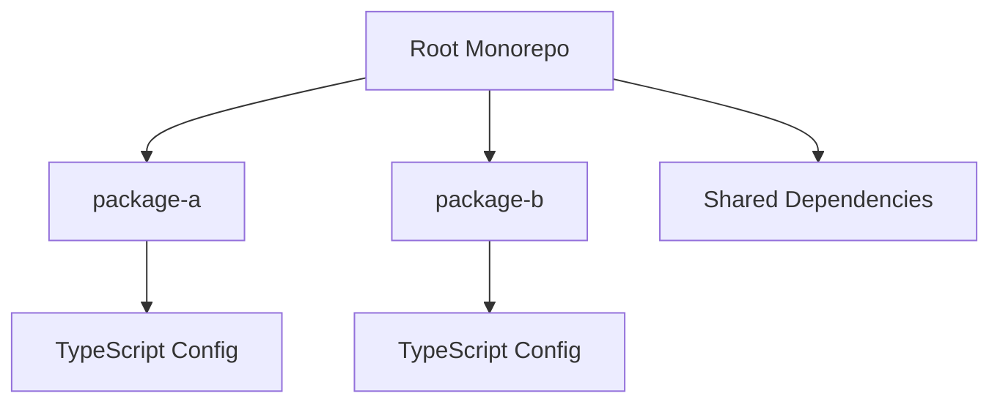

## 17.5 Monorepos with Lerna

In modern software development, managing multiple packages within a single project can be challenging. This is where the concept of a monorepo comes into play. In this section, we will explore what monorepos are, why they are beneficial, and how Lerna can help you manage them effectively. We will also provide step-by-step instructions for setting up a Lerna project, discuss best practices for organizing your code, and briefly mention alternatives like Yarn Workspaces and Nx.

### Understanding Monorepos

**Monorepo** is short for "monolithic repository." It is a version control strategy where multiple projects or packages are stored in a single repository. This approach contrasts with polyrepos, where each project or package has its own repository.

#### Benefits of Monorepos

1. **Simplified Dependency Management**: Monorepos allow you to share dependencies across projects, reducing duplication and ensuring consistency.
2. **Unified Versioning**: You can manage versions of all packages in a monorepo together, simplifying the release process.
3. **Improved Collaboration**: Developers can work on multiple packages simultaneously without switching repositories, enhancing collaboration.
4. **Consistent Tooling**: You can apply the same build, test, and deployment tools across all projects in the monorepo.
5. **Easier Refactoring**: Changes that affect multiple packages can be made in one place, reducing the risk of errors.

### Introducing Lerna

**Lerna** is a popular tool for managing JavaScript projects with multiple packages in a monorepo. It simplifies the process of managing dependencies, versioning, and publishing packages. Lerna is particularly useful for TypeScript projects, as it integrates seamlessly with TypeScript's build system.

#### Key Features of Lerna

- **Package Management**: Lerna can hoist shared dependencies to the root of the monorepo, reducing duplication.
- **Versioning and Publishing**: Lerna automates the process of versioning and publishing packages.
- **Bootstrap**: Lerna can link local dependencies, making it easier to develop and test packages together.
- **Scripts**: Lerna allows you to run scripts across all or specific packages in the monorepo.

### Setting Up a Lerna Project

Let's walk through the process of setting up a Lerna project. We'll start by creating a new monorepo and adding some packages.

#### Step 1: Install Lerna

First, ensure you have Node.js and npm installed. Then, install Lerna globally using npm:

```bash
npm install -g lerna
```

#### Step 2: Initialize a Lerna Monorepo

Create a new directory for your monorepo and navigate into it:

```bash
mkdir my-monorepo
cd my-monorepo
```

Initialize a new Lerna project:

```bash
lerna init
```

This command creates a `lerna.json` file and a `packages` directory. The `lerna.json` file contains configuration options for your monorepo.

#### Step 3: Create Packages

Inside the `packages` directory, create subdirectories for each package you want to manage. For example, let's create two packages: `package-a` and `package-b`.

```bash
mkdir packages/package-a
mkdir packages/package-b
```

Each package should have its own `package.json` file. Here's an example for `package-a`:

```json
{
  "name": "package-a",
  "version": "0.1.0",
  "main": "index.js",
  "scripts": {
    "build": "tsc"
  }
}
```

Repeat this process for `package-b`.

#### Step 4: Add TypeScript

To use TypeScript in your packages, you'll need to add TypeScript as a dependency. You can do this at the root of your monorepo to share the dependency across all packages:

```bash
npm install typescript --save-dev
```

Create a `tsconfig.json` file in each package to configure TypeScript. Here's an example for `package-a`:

```json
{
  "compilerOptions": {
    "outDir": "./dist",
    "rootDir": "./src",
    "strict": true,
    "module": "commonjs",
    "target": "es6"
  },
  "include": ["src"]
}
```

#### Step 5: Bootstrap the Monorepo

Run the following command to link local dependencies and install external dependencies:

```bash
lerna bootstrap
```

This command will install all dependencies and create symlinks between packages that depend on each other.

### Best Practices for Organizing Code

1. **Consistent Structure**: Maintain a consistent directory structure across all packages to make navigation easier.
2. **Shared Configurations**: Use shared configurations for tools like TypeScript, ESLint, and Prettier to ensure consistency.
3. **Modular Design**: Design packages to be modular and reusable. Avoid tightly coupling packages to facilitate independent development and testing.
4. **Documentation**: Document each package thoroughly, including its purpose, usage, and API.
5. **Testing**: Implement testing for each package to ensure reliability and maintainability.

### Alternatives to Lerna

While Lerna is a powerful tool for managing monorepos, there are alternatives worth considering:

- **Yarn Workspaces**: Yarn Workspaces is a built-in feature of Yarn that provides similar functionality to Lerna, including dependency hoisting and linking local packages.
- **Nx**: Nx is a powerful toolkit for building monorepos, offering advanced features like dependency graph visualization and task scheduling.

### Try It Yourself

Now that you have a basic understanding of monorepos and Lerna, try setting up your own Lerna project. Experiment with creating packages, linking dependencies, and running scripts. Here are a few challenges to get you started:

1. **Add a New Package**: Create a new package in your monorepo and link it to an existing package.
2. **Run a Script Across All Packages**: Use Lerna to run a script across all packages in your monorepo.
3. **Experiment with Dependency Hoisting**: Modify your `lerna.json` configuration to enable or disable dependency hoisting and observe the effects.

### Visual Aids

To help you visualize the structure of a monorepo managed by Lerna, here is a simple diagram:



This diagram illustrates how packages within a monorepo can share dependencies and configurations, while maintaining their own code and configurations.

### Summary

Monorepos offer a powerful way to manage multiple packages within a single repository, providing benefits like simplified dependency management, unified versioning, and improved collaboration. Lerna is a popular tool that simplifies the process of managing monorepos, making it easier to develop and maintain complex projects. By following best practices and experimenting with Lerna, you can harness the full potential of monorepos in your TypeScript projects.

## Quiz Time!



### What is a monorepo?

- [x] A single repository containing multiple projects or packages.
- [ ] A repository with a single project.
- [ ] A tool for managing package dependencies.
- [ ] A version control system.

> **Explanation:** A monorepo is a version control strategy where multiple projects or packages are stored in a single repository.

### What is one benefit of using a monorepo?

- [x] Simplified dependency management.
- [ ] Increased complexity.
- [ ] Separate versioning for each package.
- [ ] Requires multiple repositories.

> **Explanation:** Monorepos allow you to share dependencies across projects, reducing duplication and ensuring consistency.

### What is Lerna used for?

- [x] Managing JavaScript projects with multiple packages in a monorepo.
- [ ] Creating a single package.
- [ ] Version control.
- [ ] Building user interfaces.

> **Explanation:** Lerna is a tool for managing JavaScript projects with multiple packages in a monorepo.

### How do you initialize a Lerna project?

- [x] Use the command `lerna init`.
- [ ] Use the command `npm init lerna`.
- [ ] Use the command `lerna start`.
- [ ] Use the command `npm install lerna`.

> **Explanation:** The command `lerna init` initializes a new Lerna project.

### What does the `lerna bootstrap` command do?

- [x] Links local dependencies and installs external dependencies.
- [ ] Initializes a new Lerna project.
- [ ] Publishes packages to npm.
- [ ] Deletes all node_modules folders.

> **Explanation:** The `lerna bootstrap` command installs all dependencies and creates symlinks between packages that depend on each other.

### What is an alternative to Lerna for managing monorepos?

- [x] Yarn Workspaces.
- [ ] GitHub.
- [ ] npm.
- [ ] Docker.

> **Explanation:** Yarn Workspaces is an alternative to Lerna for managing monorepos, providing similar functionality.

### Which of the following is a best practice for organizing code in a monorepo?

- [x] Maintain a consistent directory structure across all packages.
- [ ] Use different configurations for each package.
- [ ] Avoid testing individual packages.
- [ ] Keep packages tightly coupled.

> **Explanation:** Maintaining a consistent directory structure across all packages makes navigation easier and promotes organization.

### What is the purpose of the `lerna.json` file?

- [x] It contains configuration options for your monorepo.
- [ ] It stores package dependencies.
- [ ] It is used for version control.
- [ ] It contains TypeScript configurations.

> **Explanation:** The `lerna.json` file contains configuration options for your monorepo.

### What is the main advantage of using shared configurations in a monorepo?

- [x] Ensures consistency across all packages.
- [ ] Increases complexity.
- [ ] Requires more storage space.
- [ ] Limits flexibility.

> **Explanation:** Shared configurations ensure consistency across all packages, making it easier to manage and maintain the monorepo.

### True or False: Lerna can only be used with TypeScript projects.

- [ ] True
- [x] False

> **Explanation:** Lerna can be used with any JavaScript project, not just TypeScript projects.


