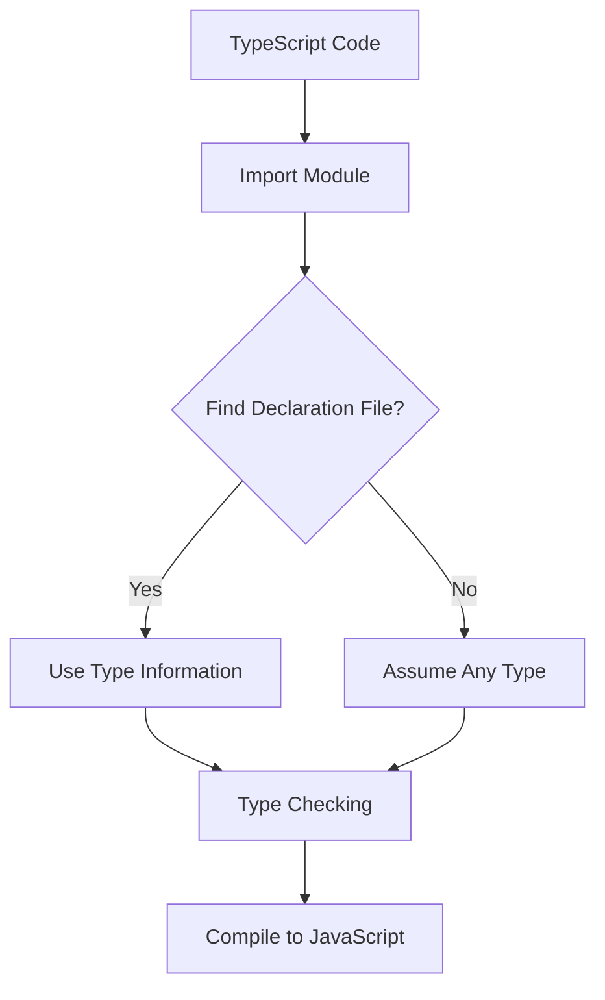

## 18.1 Understanding Declaration Files (`.d.ts`)

As we delve deeper into TypeScript, one of the key concepts that enhances its power and versatility is the use of declaration files, commonly known by their `.d.ts` file extension. These files play a crucial role in providing type information about existing JavaScript code, enabling TypeScript to seamlessly integrate with JavaScript libraries and ensuring type safety across your projects.

### What are Declaration Files?

Declaration files are TypeScript files that only contain type declarations. They do not produce any JavaScript code when compiled. Instead, they provide a way to describe the shape of JavaScript libraries, allowing TypeScript to understand and check the types of these libraries.

#### Purpose of Declaration Files

- **Type Safety**: By providing type information, declaration files allow TypeScript to perform type checking on JavaScript libraries, catching potential errors at compile time.
- **Intellisense and Tooling**: They enhance the development experience by enabling features like IntelliSense in code editors, which provides autocompletion and documentation hints.
- **Seamless Integration**: Declaration files enable TypeScript to work with existing JavaScript codebases and third-party libraries that do not have native TypeScript support.

### Anatomy of a Declaration File

A declaration file typically contains type declarations for variables, functions, classes, and modules. Let's explore a simple example to understand how these files are structured.

```typescript
// math-utils.d.ts

// Declare a module named 'math-utils'
declare module 'math-utils' {
    // Declare a function named 'add' with two number parameters
    export function add(a: number, b: number): number;

    // Declare a function named 'subtract' with two number parameters
    export function subtract(a: number, b: number): number;
}
```

In this example, we have a declaration file named `math-utils.d.ts` that describes a module called `math-utils`. It declares two functions, `add` and `subtract`, each accepting two numbers and returning a number. This file provides TypeScript with the necessary information to type-check any usage of the `math-utils` module in a TypeScript project.

### How TypeScript Uses Declaration Files

During the compilation process, TypeScript uses declaration files to understand the types of external modules or JavaScript code. When you import a module in your TypeScript code, the TypeScript compiler looks for a corresponding `.d.ts` file to gather type information. This allows TypeScript to ensure that you are using the module correctly according to its type definitions.

#### Example Usage

Let's see how we can use the `math-utils` module in a TypeScript file:

```typescript
// Import the 'math-utils' module
import { add, subtract } from 'math-utils';

// Use the 'add' function
const sum = add(5, 10); // TypeScript knows 'add' returns a number

// Use the 'subtract' function
const difference = subtract(10, 5); // TypeScript knows 'subtract' returns a number
```

In this example, TypeScript uses the `math-utils.d.ts` file to understand the types of the `add` and `subtract` functions, ensuring that we pass the correct types of arguments and handle the return values appropriately.

### Ambient Declarations vs. External Module Declarations

Declaration files can contain two types of declarations: ambient declarations and external module declarations. Understanding the difference between these two is essential for effectively using declaration files.

#### Ambient Declarations

Ambient declarations are used to describe types that are available in the global scope. They are often used for libraries that are included via a `<script>` tag in an HTML file. Ambient declarations do not use the `import` or `export` syntax.

```typescript
// ambient.d.ts

// Declare a global variable named 'globalVar'
declare var globalVar: string;

// Declare a global function named 'globalFunction'
declare function globalFunction(): void;
```

In this example, we declare a global variable `globalVar` and a global function `globalFunction`. These declarations inform TypeScript about the existence and types of these global entities.

#### External Module Declarations

External module declarations are used to describe modules that are imported and exported using the `import` and `export` syntax. They are typical for Node.js modules or ES6 modules.

```typescript
// external-module.d.ts

// Declare a module named 'external-module'
declare module 'external-module' {
    // Export a function named 'doSomething'
    export function doSomething(): void;
}
```

Here, we declare a module `external-module` with an exported function `doSomething`. This declaration allows TypeScript to understand the types of the `external-module` when it is imported into a TypeScript file.

### Referencing Existing Declaration Files

When working with third-party libraries, it's common to find existing declaration files that provide type information for those libraries. These files are often available through the DefinitelyTyped repository, which hosts type definitions for popular JavaScript libraries.

#### Using `@types` Packages

The easiest way to add type definitions for a library is by installing the corresponding `@types` package. For example, to add type definitions for the popular `lodash` library, you can run:

```bash
npm install --save-dev @types/lodash
```

This command installs the type definitions for `lodash`, allowing TypeScript to understand and type-check your usage of the library.

### Creating Your Own Declaration Files

Sometimes, you may need to create your own declaration files, especially when working with custom JavaScript code or libraries that do not have existing type definitions. Let's walk through the process of creating a declaration file for a simple JavaScript library.

#### Step-by-Step Example

Suppose you have a JavaScript file `myLibrary.js` with the following content:

```javascript
// myLibrary.js

function greet(name) {
    return `Hello, ${name}!`;
}

function farewell(name) {
    return `Goodbye, ${name}!`;
}
```

To create a declaration file for `myLibrary.js`, follow these steps:

1. **Create a new file named `myLibrary.d.ts`.**

2. **Declare a module for your library.**

```typescript
// myLibrary.d.ts

declare module 'myLibrary' {
    // Declare the 'greet' function
    export function greet(name: string): string;

    // Declare the 'farewell' function
    export function farewell(name: string): string;
}
```

3. **Use the module in a TypeScript file.**

```typescript
// app.ts

import { greet, farewell } from 'myLibrary';

console.log(greet('Alice')); // Outputs: Hello, Alice!
console.log(farewell('Bob')); // Outputs: Goodbye, Bob!
```

By following these steps, you provide TypeScript with the necessary type information to use `myLibrary.js` in a TypeScript project.

### Try It Yourself

To reinforce your understanding of declaration files, try creating a declaration file for a simple JavaScript library of your choice. Experiment with different types of declarations, such as functions, variables, and classes. Test your declaration file by using the library in a TypeScript project and observe how TypeScript provides type checking and IntelliSense.

### Visualizing Declaration Files

To better understand how declaration files fit into the TypeScript ecosystem, let's visualize the process using a flowchart.



**Figure 1**: This flowchart illustrates how TypeScript uses declaration files during the compilation process. When a module is imported, TypeScript checks for a corresponding declaration file. If found, it uses the type information for type checking. If not, it assumes the `any` type, which bypasses type checking.

### Summary

Declaration files are a powerful feature of TypeScript that enable type safety and seamless integration with JavaScript libraries. By understanding how to use and create declaration files, you can enhance your TypeScript projects and take full advantage of TypeScript's type-checking capabilities.

### Key Takeaways

- Declaration files provide type information for JavaScript libraries, enabling TypeScript to perform type checking.
- They enhance the development experience by providing IntelliSense and other tooling features.
- Ambient declarations describe global entities, while external module declarations describe modules imported with `import` and `export`.
- Use existing declaration files from the DefinitelyTyped repository or create your own for custom JavaScript code.

### Additional Resources

For further reading and exploration, consider the following resources:

- [TypeScript Handbook: Declaration Files](https://www.typescriptlang.org/docs/handbook/declaration-files/introduction.html)
- [DefinitelyTyped Repository](https://github.com/DefinitelyTyped/DefinitelyTyped)
- [MDN Web Docs: JavaScript Modules](https://developer.mozilla.org/en-US/docs/Web/JavaScript/Guide/Modules)

## Quiz Time!



### What is the primary purpose of declaration files in TypeScript?

- [x] To provide type information for JavaScript libraries
- [ ] To compile JavaScript code into TypeScript
- [ ] To execute JavaScript code in the browser
- [ ] To format TypeScript code

> **Explanation:** Declaration files provide type information, enabling TypeScript to perform type checking on JavaScript libraries.

### Which file extension is used for TypeScript declaration files?

- [ ] .ts
- [x] .d.ts
- [ ] .js
- [ ] .json

> **Explanation:** TypeScript declaration files use the `.d.ts` file extension.

### What is an ambient declaration?

- [x] A declaration for global entities available in the global scope
- [ ] A declaration for modules imported with `import` and `export`
- [ ] A declaration for private variables
- [ ] A declaration for asynchronous functions

> **Explanation:** Ambient declarations describe types available in the global scope, often used for libraries included via `<script>` tags.

### How do you install type definitions for a third-party library using npm?

- [ ] npm install lodash
- [x] npm install --save-dev @types/lodash
- [ ] npm install lodash-types
- [ ] npm install lodash-definitions

> **Explanation:** The `@types` package provides type definitions for third-party libraries, and `--save-dev` adds them as a development dependency.

### What happens if TypeScript cannot find a declaration file for an imported module?

- [ ] It throws a compilation error
- [ ] It stops the compilation process
- [x] It assumes the `any` type for the module
- [ ] It automatically creates a declaration file

> **Explanation:** If TypeScript cannot find a declaration file, it assumes the `any` type, which bypasses type checking.

### Which of the following is a benefit of using declaration files?

- [x] Enhanced IntelliSense and autocompletion
- [ ] Faster code execution
- [ ] Reduced file size
- [ ] Automatic code formatting

> **Explanation:** Declaration files enhance the development experience by providing IntelliSense and autocompletion features.

### What is the difference between ambient and external module declarations?

- [x] Ambient declarations describe global entities, while external module declarations describe modules imported with `import` and `export`.
- [ ] Ambient declarations are for private variables, while external module declarations are for public variables.
- [ ] Ambient declarations are for synchronous code, while external module declarations are for asynchronous code.
- [ ] Ambient declarations are for TypeScript, while external module declarations are for JavaScript.

> **Explanation:** Ambient declarations describe global entities, while external module declarations describe modules imported with `import` and `export`.

### How can you create a declaration file for a custom JavaScript library?

- [x] By declaring a module and its types in a `.d.ts` file
- [ ] By compiling the JavaScript library into TypeScript
- [ ] By converting the JavaScript library into a JSON file
- [ ] By using a code formatter

> **Explanation:** To create a declaration file, declare a module and its types in a `.d.ts` file.

### What is the DefinitelyTyped repository?

- [x] A repository that hosts type definitions for popular JavaScript libraries
- [ ] A repository for storing TypeScript source code
- [ ] A repository for JavaScript code snippets
- [ ] A repository for TypeScript documentation

> **Explanation:** The DefinitelyTyped repository hosts type definitions for popular JavaScript libraries, providing type information for TypeScript.

### True or False: Declaration files produce JavaScript code when compiled.

- [ ] True
- [x] False

> **Explanation:** Declaration files do not produce JavaScript code; they only provide type information for TypeScript.


