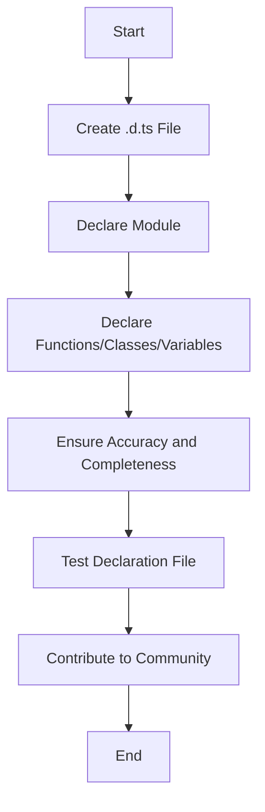

## 18.2 Writing Custom Declaration Files

As you delve deeper into TypeScript, you'll encounter situations where you want to use a JavaScript library that doesn't have TypeScript support. In these cases, writing custom declaration files becomes essential. Declaration files, with the `.d.ts` extension, allow you to describe the shape of the library, providing TypeScript with the necessary type information to ensure type safety and improved developer experience.

### Understanding Declaration Files

Declaration files are TypeScript files that contain only type information. They don't include any implementation code but instead provide a way to describe the types and interfaces of existing JavaScript code. This allows TypeScript to understand how to interact with the JavaScript library, checking types at compile time and offering better IntelliSense support in your editor.

### Why Write Custom Declaration Files?

1. **Type Safety**: By providing type information, you ensure that your code interacts with the library correctly, reducing runtime errors.
2. **Editor Support**: With declaration files, your editor can offer better autocompletion and inline documentation.
3. **Community Contribution**: Sharing your declaration files can help others in the community who use the same library.

### Steps to Write a Custom Declaration File

Let's walk through the process of creating a custom declaration file for a JavaScript library. We'll use a hypothetical library called `math-lib` as an example.

#### Step 1: Create the Declaration File

Start by creating a new file with the `.d.ts` extension. If your library is named `math-lib`, you might create a file named `math-lib.d.ts`.

```plaintext
math-lib.d.ts
```

#### Step 2: Declare the Module

Use the `declare module` syntax to define the module. This tells TypeScript that you're providing type information for a module.

```typescript
declare module 'math-lib' {
    // Module declarations go here
}
```

#### Step 3: Declare Functions, Classes, and Variables

Within the module, declare the functions, classes, and variables that the library exports. Use TypeScript's type system to describe each entity accurately.

**Example: Declaring Functions**

Suppose `math-lib` exports a function called `add` that takes two numbers and returns their sum.

```typescript
declare module 'math-lib' {
    export function add(a: number, b: number): number;
}
```

**Example: Declaring Classes**

If the library exports a class, declare it with its methods and properties.

```typescript
declare module 'math-lib' {
    export class Calculator {
        constructor(initialValue: number);
        add(value: number): number;
        subtract(value: number): number;
        multiply(value: number): number;
        divide(value: number): number;
    }
}
```

**Example: Declaring Variables**

For exported variables, declare them with their types.

```typescript
declare module 'math-lib' {
    export const PI: number;
}
```

#### Step 4: Ensure Accuracy and Completeness

It's crucial to ensure that your type declarations are accurate and complete. This means:

- **Accurate Types**: Use the correct types for function parameters, return values, class properties, etc.
- **Complete Coverage**: Include all the functions, classes, and variables that the library exports.

#### Step 5: Test Your Declaration File

Before sharing your declaration file, test it within a TypeScript project to ensure it works as expected. Create a simple TypeScript file that imports the library and uses its features.

```typescript
import { add, Calculator, PI } from 'math-lib';

console.log(add(2, 3)); // Should output 5

const calc = new Calculator(10);
console.log(calc.add(5)); // Should output 15
console.log(PI); // Should output the value of PI
```

### Example: Simple and Complex Declaration Files

Let's look at examples of both simple and complex declaration files to understand the range of possibilities.

#### Simple Declaration File

For a library that exports a single function, the declaration file is straightforward.

```typescript
declare module 'simple-lib' {
    export function greet(name: string): string;
}
```

#### Complex Declaration File

For a more complex library, the declaration file might include multiple functions, classes, and interfaces.

```typescript
declare module 'complex-lib' {
    export interface User {
        id: number;
        name: string;
        email: string;
    }

    export function getUser(id: number): User;
    export function saveUser(user: User): void;

    export class UserManager {
        constructor();
        createUser(name: string, email: string): User;
        deleteUser(id: number): void;
    }
}
```

### Contributing Declaration Files to the Community

If you've written a declaration file for a popular library, consider contributing it back to the community. The DefinitelyTyped repository on GitHub is a great place to share your work. By contributing, you help others who use the same library and improve the overall TypeScript ecosystem.

### Try It Yourself

To reinforce your understanding, try creating a custom declaration file for a simple JavaScript library you use. Start with a small library to keep things manageable. Experiment with different types and structures, and test your declaration file in a TypeScript project.

### Visual Aids

To help visualize the process of creating a declaration file, let's look at a flowchart that outlines the steps involved.



### Key Takeaways

- Declaration files provide type information for JavaScript libraries, enabling TypeScript to ensure type safety.
- Writing custom declaration files involves declaring modules, functions, classes, and variables.
- Accuracy and completeness are crucial for effective type declarations.
- Contributing declaration files to the community helps improve the TypeScript ecosystem.

### Further Reading

For more information on writing declaration files, check out the [TypeScript Handbook](https://www.typescriptlang.org/docs/handbook/declaration-files/introduction.html) and [DefinitelyTyped](https://github.com/DefinitelyTyped/DefinitelyTyped).

## Quiz Time!



### What is the primary purpose of a declaration file in TypeScript?

- [x] To provide type information for JavaScript libraries
- [ ] To compile JavaScript code into TypeScript
- [ ] To run JavaScript code in a TypeScript environment
- [ ] To convert TypeScript code into JavaScript

> **Explanation:** Declaration files provide type information for JavaScript libraries, allowing TypeScript to understand how to interact with them.

### Which file extension is used for TypeScript declaration files?

- [ ] .ts
- [x] .d.ts
- [ ] .js
- [ ] .json

> **Explanation:** Declaration files use the `.d.ts` extension.

### What is the correct syntax to declare a module in a declaration file?

- [ ] declare 'module' { }
- [ ] module declare { }
- [x] declare module 'module-name' { }
- [ ] module 'module-name' declare { }

> **Explanation:** The correct syntax is `declare module 'module-name' { }`.

### What should you ensure when writing a declaration file?

- [x] Accuracy and completeness of type declarations
- [ ] Short and concise code
- [ ] Use of complex algorithms
- [ ] Minimal use of comments

> **Explanation:** Accuracy and completeness are crucial for effective type declarations.

### How can you test your custom declaration file?

- [x] By using it in a TypeScript project
- [ ] By running it in a JavaScript console
- [ ] By compiling it with a JavaScript compiler
- [ ] By converting it to a JSON file

> **Explanation:** Testing your declaration file in a TypeScript project ensures it works as expected.

### What is the benefit of contributing declaration files to the community?

- [x] It helps others who use the same library
- [ ] It increases the file size
- [ ] It makes the code more complex
- [ ] It reduces the need for documentation

> **Explanation:** Contributing declaration files helps others and improves the TypeScript ecosystem.

### Which repository is a good place to share your declaration files?

- [ ] GitHub Pages
- [x] DefinitelyTyped
- [ ] npm Registry
- [ ] TypeScript Playground

> **Explanation:** DefinitelyTyped is a repository for sharing TypeScript declaration files.

### What is the purpose of the `declare` keyword in a declaration file?

- [x] To indicate that you're providing type information
- [ ] To execute JavaScript code
- [ ] To define variables
- [ ] To import modules

> **Explanation:** The `declare` keyword indicates that you're providing type information.

### What is the benefit of accurate type declarations?

- [x] They reduce runtime errors
- [ ] They increase code execution speed
- [ ] They make the code more readable
- [ ] They allow for dynamic typing

> **Explanation:** Accurate type declarations help reduce runtime errors by ensuring type safety.

### True or False: Declaration files contain implementation code.

- [ ] True
- [x] False

> **Explanation:** Declaration files do not contain implementation code; they only provide type information.


