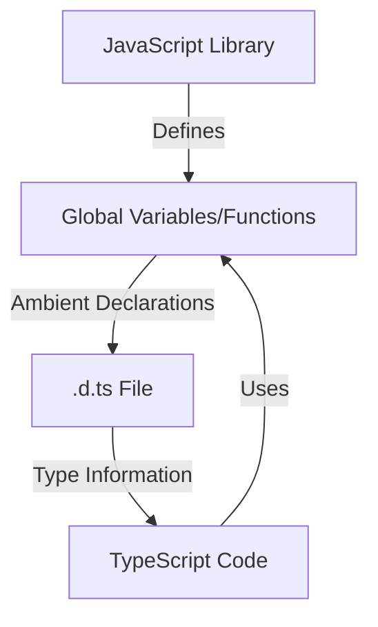

## 18.3 Ambient Declarations

As we delve deeper into TypeScript, we encounter situations where we need to describe APIs that exist in the global scope but are not inherently part of our TypeScript code. This is where ambient declarations come into play. In this section, we'll explore how to use the `declare` keyword to create ambient declarations, understand when they are necessary, and learn how to structure them effectively in `.d.ts` files.

### Understanding Ambient Declarations

Ambient declarations are a way to tell TypeScript about the existence of variables, functions, or other entities that are defined elsewhere, such as in a JavaScript library or a global script. These declarations do not provide implementations; instead, they describe the shape of the entities so that TypeScript can understand and type-check them.

#### The `declare` Keyword

The `declare` keyword is used to create ambient declarations. It tells TypeScript that the declared entity exists somewhere else, and TypeScript should not expect to find its implementation within the current codebase.

```typescript
// Declare a global variable
declare var myGlobalVariable: string;

// Declare a global function
declare function myGlobalFunction(param: number): void;
```

In the above examples, we declare a global variable `myGlobalVariable` of type `string` and a global function `myGlobalFunction` that takes a `number` as a parameter and returns `void`.

### When to Use Ambient Declarations

Ambient declarations are particularly useful in the following scenarios:

1. **Interfacing with JavaScript Libraries**: When using a JavaScript library that does not have TypeScript type definitions, ambient declarations can help you define the types for the library's API.

2. **Working with Global Scripts**: If your project includes scripts that define global variables or functions, ambient declarations allow you to describe these globals to TypeScript.

3. **Legacy Codebases**: In projects with legacy JavaScript code, ambient declarations can be used to gradually introduce TypeScript by providing type information for existing global entities.

### Structuring Ambient Declarations in `.d.ts` Files

To keep your TypeScript code organized, it's a good practice to place ambient declarations in separate `.d.ts` files. These files contain only type declarations and no implementations. They help TypeScript understand the types of global entities without cluttering your main codebase.

#### Example: Creating a `.d.ts` File

Let's create a `.d.ts` file for a hypothetical JavaScript library that provides a global function `calculateArea` and a global variable `PI`.

```typescript
// globals.d.ts

// Declare a global variable
declare var PI: number;

// Declare a global function
declare function calculateArea(radius: number): number;
```

By placing these declarations in a `globals.d.ts` file, we inform TypeScript about the existence and types of `PI` and `calculateArea`, allowing us to use them in our TypeScript code with proper type checking.

### Cautions About Polluting the Global Namespace

While ambient declarations are powerful, they come with the risk of polluting the global namespace. It's essential to be cautious and deliberate when declaring global entities to avoid naming conflicts and unintended side effects.

#### Best Practices for Ambient Declarations

- **Use Namespaces**: If possible, wrap your ambient declarations in a namespace to prevent conflicts with other global entities.

```typescript
// globals.d.ts

declare namespace MyLibrary {
    var PI: number;
    function calculateArea(radius: number): number;
}
```

- **Limit Global Declarations**: Only declare global entities when absolutely necessary. Prefer module-based imports and exports to keep your code modular and maintainable.

- **Document Your Declarations**: Provide comments and documentation for your ambient declarations to help other developers understand their purpose and usage.

### Code Example: Using Ambient Declarations

Let's see how we can use ambient declarations in a TypeScript project. We'll assume we have a JavaScript library that provides a global function `greet` and a global variable `appName`.

#### Step 1: Create a `.d.ts` File

Create a file named `externalLib.d.ts` with the following content:

```typescript
// externalLib.d.ts

// Declare a global variable
declare var appName: string;

// Declare a global function
declare function greet(name: string): string;
```

#### Step 2: Use the Declarations in TypeScript

Now, we can use the declared global entities in our TypeScript code:

```typescript
// main.ts

console.log(`Welcome to ${appName}!`);

function welcomeUser(userName: string) {
    console.log(greet(userName));
}

// Assuming appName and greet are defined in an external script
```

### Try It Yourself

To get hands-on experience with ambient declarations, try the following exercise:

1. Create a new TypeScript project.
2. Write a JavaScript file that defines a global variable `version` and a global function `getVersion`.
3. Create a `.d.ts` file to declare these global entities.
4. Use the declared entities in a TypeScript file and log the version to the console.

### Visualizing Ambient Declarations

To better understand how ambient declarations fit into the TypeScript ecosystem, let's visualize the process using a diagram.



**Diagram Description**: This flowchart illustrates how a JavaScript library defines global variables/functions, which are then described using ambient declarations in a `.d.ts` file. The TypeScript code uses these declarations to access the globals with type safety.

### References and Further Reading

- [TypeScript Handbook: Declaration Files](https://www.typescriptlang.org/docs/handbook/declaration-files/introduction.html)
- [MDN Web Docs: JavaScript Global Objects](https://developer.mozilla.org/en-US/docs/Web/JavaScript/Reference/Global_Objects)

### Engagement and Reinforcement

To reinforce your understanding of ambient declarations, consider the following questions:

- When should you use ambient declarations?
- What are the risks of polluting the global namespace?
- How can you use namespaces to prevent naming conflicts?

### Summary

In this section, we've explored the concept of ambient declarations in TypeScript. We've learned how to use the `declare` keyword to describe global entities, when ambient declarations are necessary, and how to structure them in `.d.ts` files. Remember to use ambient declarations judiciously to avoid polluting the global namespace and to keep your TypeScript code organized and maintainable.

## Quiz Time!



### What is the purpose of ambient declarations in TypeScript?

- [x] To describe APIs available in the global scope
- [ ] To implement new functions in TypeScript
- [ ] To define private variables
- [ ] To create new classes

> **Explanation:** Ambient declarations are used to describe APIs that exist in the global scope but are not part of the TypeScript codebase.

### Which keyword is used to create ambient declarations?

- [x] declare
- [ ] export
- [ ] import
- [ ] const

> **Explanation:** The `declare` keyword is used to create ambient declarations in TypeScript.

### Where should ambient declarations be placed for better organization?

- [x] In separate `.d.ts` files
- [ ] In the main `.ts` file
- [ ] In a `.js` file
- [ ] In a `.json` file

> **Explanation:** Ambient declarations should be placed in separate `.d.ts` files to keep the code organized and maintainable.

### What is a potential risk of using ambient declarations?

- [x] Polluting the global namespace
- [ ] Increasing code execution time
- [ ] Decreasing code readability
- [ ] Reducing code performance

> **Explanation:** Ambient declarations can pollute the global namespace if not used carefully, leading to naming conflicts.

### How can you prevent naming conflicts when using ambient declarations?

- [x] Use namespaces
- [ ] Use comments
- [ ] Use inline styles
- [ ] Use external scripts

> **Explanation:** Wrapping ambient declarations in a namespace can help prevent naming conflicts with other global entities.

### What should you do if a JavaScript library doesn't have TypeScript type definitions?

- [x] Create ambient declarations
- [ ] Ignore the library
- [ ] Rewrite the library in TypeScript
- [ ] Use the library without types

> **Explanation:** Creating ambient declarations allows you to define the types for a JavaScript library's API when it doesn't have TypeScript type definitions.

### What does the `declare` keyword indicate to TypeScript?

- [x] The entity exists elsewhere
- [ ] The entity is private
- [ ] The entity is a constant
- [ ] The entity is a module

> **Explanation:** The `declare` keyword indicates to TypeScript that the declared entity exists elsewhere and should not expect an implementation in the current codebase.

### Which of the following is an example of an ambient declaration?

- [x] `declare var myGlobal: string;`
- [ ] `var myGlobal: string;`
- [ ] `function myGlobal() {}`
- [ ] `const myGlobal = "Hello";`

> **Explanation:** `declare var myGlobal: string;` is an example of an ambient declaration, describing a global variable.

### Why is it important to document ambient declarations?

- [x] To help other developers understand their purpose
- [ ] To increase code execution speed
- [ ] To reduce file size
- [ ] To improve code aesthetics

> **Explanation:** Documenting ambient declarations helps other developers understand their purpose and usage, making the codebase more maintainable.

### True or False: Ambient declarations provide implementations for global entities.

- [ ] True
- [x] False

> **Explanation:** Ambient declarations do not provide implementations; they only describe the shape of global entities for TypeScript's type-checking.




