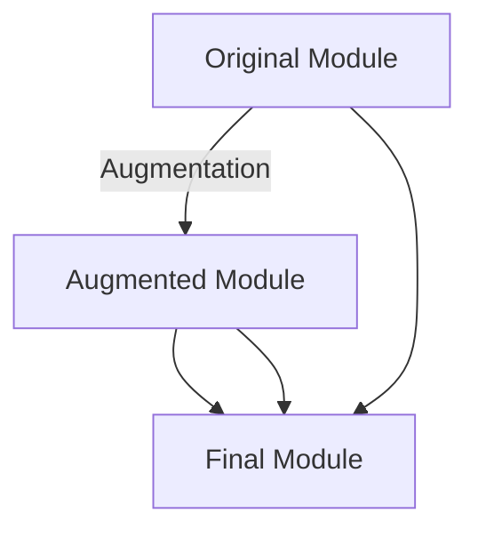

## 18.4 Module Augmentation

As we delve deeper into TypeScript, we encounter the concept of module augmentation. This powerful feature allows us to extend existing modules with additional type information, making it particularly useful when working with third-party libraries or when we need to enhance the functionality of existing code. In this section, we'll explore what module augmentation is, when to use it, and how to implement it effectively.

### What is Module Augmentation?

Module augmentation in TypeScript is a technique that allows developers to add new properties, methods, or types to existing modules. This is especially useful when you want to extend the capabilities of a module without modifying its original source code. Module augmentation is often used to enhance third-party libraries or to add custom functionality to built-in modules.

#### When to Use Module Augmentation

- **Extending Third-Party Libraries**: When a third-party library lacks certain type definitions or functionality that you need, module augmentation allows you to add them without altering the library's source code.
- **Adding Custom Functionality**: If you need to add specific methods or properties to a module for your application, module augmentation provides a clean and maintainable way to do so.
- **Enhancing Built-in Modules**: Sometimes, you may want to extend the capabilities of built-in modules in TypeScript to suit your application's needs.

### How to Implement Module Augmentation

To implement module augmentation, you need to declare a module with the same name as the one you want to extend. This is done using TypeScript's `declare module` syntax. Let's explore this with a practical example.

#### Example: Extending a Third-Party Library

Suppose we are using a third-party library called `math-lib` that provides basic mathematical operations. However, we need to add a new method to calculate the factorial of a number. Here's how we can achieve this using module augmentation:

```typescript
// math-lib.d.ts (Original Type Definitions)
declare module "math-lib" {
    export function add(a: number, b: number): number;
    export function subtract(a: number, b: number): number;
}

// math-lib-augmentation.ts (Module Augmentation)
declare module "math-lib" {
    export function factorial(n: number): number;
}

// math-lib-implementation.ts
import { add, subtract, factorial } from "math-lib";

console.log(add(5, 3)); // Output: 8
console.log(subtract(5, 3)); // Output: 2
console.log(factorial(5)); // Output: 120 (assuming implementation is provided)
```

In this example, we first declare the original module `math-lib` with its existing type definitions. Then, we create a new file `math-lib-augmentation.ts` where we declare the same module name and add the `factorial` function. This augments the original module with the new functionality.

### Key Considerations for Module Augmentation

- **Matching Module Names**: Ensure that the module name in the augmentation matches the original module name exactly. This is crucial for TypeScript to correctly merge the new types with the existing ones.
- **Avoiding Type Conflicts**: Be cautious when augmenting modules to avoid conflicts with existing types. Ensure that your additions do not disrupt the original module's functionality.
- **Testing Augmented Modules**: After augmenting a module, thoroughly test your code to ensure that the new functionality works as expected and does not introduce any errors.

### Use Cases for Module Augmentation

#### Extending Built-in Modules

TypeScript's built-in modules can also be extended using module augmentation. For example, you might want to add a custom method to the `Array` prototype:

```typescript
// array-augmentation.ts
interface Array<T> {
    customMethod(): void;
}

Array.prototype.customMethod = function() {
    console.log("Custom method called on array");
};

// usage.ts
const numbers: number[] = [1, 2, 3];
numbers.customMethod(); // Output: Custom method called on array
```

In this example, we extend the `Array` interface to include a `customMethod`. We then implement this method on the `Array` prototype, allowing us to call it on any array instance.

#### Enhancing Third-Party Libraries

Consider a scenario where a third-party library provides a `Logger` class, but you need additional logging levels. Module augmentation allows you to add these levels without modifying the library's source code:

```typescript
// logger-lib.d.ts (Original Type Definitions)
declare module "logger-lib" {
    export class Logger {
        log(message: string): void;
    }
}

// logger-lib-augmentation.ts (Module Augmentation)
declare module "logger-lib" {
    export class Logger {
        debug(message: string): void;
        error(message: string): void;
    }
}

// logger-implementation.ts
import { Logger } from "logger-lib";

const logger = new Logger();
logger.log("This is a log message");
logger.debug("This is a debug message");
logger.error("This is an error message");
```

Here, we extend the `Logger` class to include `debug` and `error` methods, enhancing the library's functionality.

### Visualizing Module Augmentation

To better understand how module augmentation works, let's visualize the process using a diagram. The following Mermaid.js diagram illustrates how TypeScript merges the original module with the augmented module:



In this diagram, the original module and the augmented module are merged to form the final module, which includes all the original and new types.

### Best Practices for Module Augmentation

- **Keep Augmentations Separate**: Store module augmentations in separate files to maintain a clear separation between original and augmented code.
- **Document Augmentations**: Clearly document any augmentations you make to ensure that other developers understand the changes and their purpose.
- **Use Augmentation Sparingly**: Avoid overusing module augmentation, as it can lead to complex and hard-to-maintain codebases. Use it only when necessary.

### Try It Yourself

To reinforce your understanding of module augmentation, try the following exercises:

1. **Exercise 1**: Extend a third-party library to include a new method. For example, add a `multiply` method to the `math-lib` module.
2. **Exercise 2**: Augment a built-in module, such as `String`, to include a custom method. Implement a `reverse` method that reverses the string.
3. **Exercise 3**: Create a module augmentation for a library of your choice and test the new functionality in a sample application.

### Summary

Module augmentation is a powerful feature in TypeScript that allows us to extend existing modules with additional type information. By understanding how to implement module augmentation, we can enhance third-party libraries, add custom functionality, and improve the capabilities of built-in modules. Remember to match module names correctly, avoid type conflicts, and test your augmented modules thoroughly.

## Quiz Time!



### What is module augmentation in TypeScript?

- [x] A technique to add new properties, methods, or types to existing modules.
- [ ] A method to remove existing properties from a module.
- [ ] A way to create new modules from scratch.
- [ ] A feature to compile TypeScript into JavaScript.

> **Explanation:** Module augmentation allows developers to extend existing modules by adding new properties, methods, or types.

### When should you use module augmentation?

- [x] To extend third-party libraries with additional functionality.
- [ ] To remove unwanted features from a module.
- [ ] To create a new module from scratch.
- [ ] To compile TypeScript into JavaScript.

> **Explanation:** Module augmentation is used to extend third-party libraries or built-in modules with additional functionality.

### How do you implement module augmentation?

- [x] By declaring a module with the same name as the one you want to extend.
- [ ] By creating a new module with a different name.
- [ ] By modifying the original module's source code.
- [ ] By using a special TypeScript compiler flag.

> **Explanation:** Module augmentation is implemented by declaring a module with the same name as the existing module you want to extend.

### What should you be cautious of when augmenting modules?

- [x] Avoiding type conflicts with existing types.
- [ ] Adding too many new properties.
- [ ] Using too few new methods.
- [ ] Changing the module's original name.

> **Explanation:** When augmenting modules, it's important to avoid type conflicts with existing types to prevent errors.

### What is a key consideration for module augmentation?

- [x] Matching module names exactly.
- [ ] Using different module names.
- [ ] Modifying the original module's source code.
- [ ] Avoiding the use of TypeScript.

> **Explanation:** Matching module names exactly is crucial for TypeScript to correctly merge the new types with the existing ones.

### Can module augmentation be used to extend built-in modules?

- [x] True
- [ ] False

> **Explanation:** Module augmentation can be used to extend built-in modules by adding new properties or methods.

### What is a best practice for module augmentation?

- [x] Keep augmentations separate from original code.
- [ ] Mix augmentations with original code.
- [ ] Avoid documenting augmentations.
- [ ] Use augmentation for every module.

> **Explanation:** Keeping augmentations separate from the original code helps maintain a clear separation and improves code maintainability.

### What should you do after augmenting a module?

- [x] Test the augmented module thoroughly.
- [ ] Ignore testing the module.
- [ ] Remove the original module.
- [ ] Change the module's name.

> **Explanation:** Testing the augmented module thoroughly ensures that the new functionality works as expected and does not introduce errors.

### What is a common use case for module augmentation?

- [x] Extending third-party libraries.
- [ ] Removing features from a module.
- [ ] Compiling TypeScript into JavaScript.
- [ ] Creating new modules from scratch.

> **Explanation:** A common use case for module augmentation is extending third-party libraries with additional functionality.

### Can module augmentation lead to complex codebases if overused?

- [x] True
- [ ] False

> **Explanation:** Overusing module augmentation can lead to complex and hard-to-maintain codebases, so it should be used sparingly.


