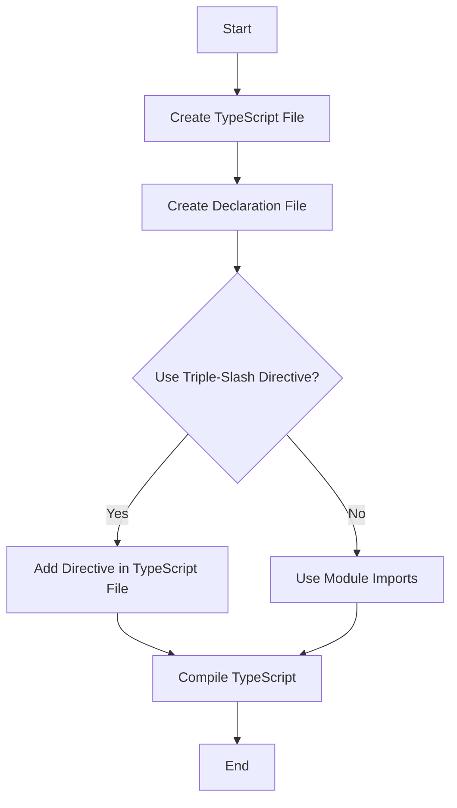

## 18.5 Triple-Slash Directives

As we continue our journey into the world of TypeScript, we encounter a feature known as triple-slash directives. These special comments are an essential part of TypeScript, particularly when dealing with declaration files and ambient modules. In this section, we'll explore what triple-slash directives are, how they work, and when to use them effectively.

### What Are Triple-Slash Directives?

Triple-slash directives are single-line comments containing a special XML-like syntax. They are used to provide compiler directives in TypeScript. The most common directive is the `/// <reference path="..." />`, which is used to include additional type information from other files.

#### Purpose of Triple-Slash Directives

- **Including Type Information**: They allow you to include type information from other files, which can be particularly useful when working with declaration files.
- **Managing Dependencies**: Triple-slash directives help manage dependencies between files by explicitly stating which files are required for the current file to compile correctly.
- **Legacy Support**: They are often used in older TypeScript projects that do not use modern module systems.

### How to Use Triple-Slash Directives

Let's dive into some examples to understand how triple-slash directives are used.

#### Example: Basic Usage

Suppose we have two TypeScript files, `a.ts` and `b.ts`. File `b.ts` contains some type information that `a.ts` needs to access.

```typescript
// b.ts
export interface User {
  name: string;
  age: number;
}
```

To use the `User` interface in `a.ts`, we can include a triple-slash directive:

```typescript
// a.ts
/// <reference path="b.ts" />

let user: User = {
  name: "Alice",
  age: 30
};
```

In this example, the directive `/// <reference path="b.ts" />` tells the TypeScript compiler to include the type information from `b.ts` in `a.ts`.

#### Example: Using with Declaration Files

Triple-slash directives are particularly useful when working with declaration files (`.d.ts`). These files provide type information for JavaScript libraries that do not have built-in TypeScript support.

```typescript
// globals.d.ts
declare var myGlobalVar: string;
```

To use `myGlobalVar` in your TypeScript file, you can add a triple-slash directive:

```typescript
// main.ts
/// <reference path="globals.d.ts" />

console.log(myGlobalVar);
```

### Role in Including Global Declaration Files

Triple-slash directives are often used to include global declaration files. These files define types that are available globally across your project. This is particularly useful when working with libraries that add global variables or functions.

#### Example: Including Global Declarations

Imagine you have a global declaration file that defines a global function:

```typescript
// globalFunctions.d.ts
declare function greet(name: string): void;
```

You can include this in your TypeScript file using a triple-slash directive:

```typescript
// app.ts
/// <reference path="globalFunctions.d.ts" />

greet("World");
```

### Triple-Slash Directives vs. Modules and Imports

With the advent of ES6 modules and TypeScript's support for them, the need for triple-slash directives has diminished. Modules and imports provide a more robust and scalable way to manage dependencies and type information.

#### When to Use Triple-Slash Directives

- **Legacy Code**: If you're working with older TypeScript codebases that don't use modules, triple-slash directives can be useful.
- **Global Declarations**: When you need to include global declaration files that aren't part of a module.
- **Quick Prototyping**: For quick prototypes where setting up a module system might be overkill.

#### When to Use Modules and Imports

- **Modern Projects**: For new projects, it's best to use modules and imports as they provide better encapsulation and dependency management.
- **Large Codebases**: Modules help in organizing large codebases by breaking them into smaller, manageable pieces.

### Best Practices for Using Triple-Slash Directives

- **Minimize Usage**: Use triple-slash directives sparingly and prefer modules and imports for managing dependencies.
- **Organize Declaration Files**: Keep your declaration files organized and use triple-slash directives to include them only when necessary.
- **Document Usage**: Clearly document why a triple-slash directive is used in your code, especially if it's not obvious.

### Alternatives to Triple-Slash Directives

In modern TypeScript development, there are alternatives to using triple-slash directives:

- **TypeScript Configuration (`tsconfig.json`)**: You can include global declaration files in your `tsconfig.json` file using the `files` or `include` options.
- **Modules and Imports**: Use ES6 modules and TypeScript's import syntax to manage dependencies and type information.
- **TypeScript's `types` Option**: Specify type definitions for third-party libraries directly in your `tsconfig.json` using the `types` option.

### Conclusion

Triple-slash directives are a powerful feature in TypeScript, allowing you to include additional type information and manage dependencies. While they are less commonly needed in modern TypeScript projects that use modules and imports, they remain a valuable tool for legacy code and specific use cases. By understanding when and how to use triple-slash directives, you can effectively manage type information in your TypeScript projects.

### Try It Yourself

To solidify your understanding of triple-slash directives, try modifying the examples provided. For instance, create your own declaration file and use a triple-slash directive to include it in a TypeScript file. Experiment with both global and module-based projects to see how triple-slash directives compare to modern module imports.

### Visual Aid: Triple-Slash Directive Workflow



This flowchart illustrates the decision-making process when considering whether to use triple-slash directives or module imports in your TypeScript project.

## Quiz Time!



### What is the primary purpose of triple-slash directives in TypeScript?

- [x] To include additional type information from other files
- [ ] To define new types within a file
- [ ] To execute TypeScript code
- [ ] To create new modules

> **Explanation:** Triple-slash directives are used to include additional type information from other files, particularly useful for declaration files.

### Which of the following is a correct triple-slash directive syntax?

- [x] `/// <reference path="file.ts" />`
- [ ] `// <reference path="file.ts" />`
- [ ] `/* <reference path="file.ts" */`
- [ ] `<!-- <reference path="file.ts" -->`

> **Explanation:** The correct syntax for a triple-slash directive is `/// <reference path="file.ts" />`.

### When are triple-slash directives particularly useful?

- [x] When working with global declaration files
- [ ] When defining new classes
- [ ] When creating new functions
- [ ] When using modern ES6 modules

> **Explanation:** Triple-slash directives are particularly useful when working with global declaration files.

### What is a common alternative to using triple-slash directives in modern TypeScript projects?

- [x] Using modules and imports
- [ ] Using `var` declarations
- [ ] Using `console.log()`
- [ ] Using `alert()`

> **Explanation:** In modern TypeScript projects, modules and imports are commonly used instead of triple-slash directives.

### Which file can be used to include global declaration files without triple-slash directives?

- [x] `tsconfig.json`
- [ ] `package.json`
- [ ] `index.html`
- [ ] `README.md`

> **Explanation:** The `tsconfig.json` file can be used to include global declaration files without needing triple-slash directives.

### What should you do if you encounter a legacy TypeScript project using triple-slash directives?

- [x] Consider refactoring to use modules and imports
- [ ] Delete all triple-slash directives
- [ ] Convert all files to JavaScript
- [ ] Ignore the directives

> **Explanation:** In legacy projects, consider refactoring to use modules and imports for better dependency management.

### How can you specify type definitions for third-party libraries in TypeScript?

- [x] Use the `types` option in `tsconfig.json`
- [ ] Use `console.log()`
- [ ] Use `alert()`
- [ ] Use `prompt()`

> **Explanation:** The `types` option in `tsconfig.json` can specify type definitions for third-party libraries.

### Which of the following is NOT a benefit of using modules over triple-slash directives?

- [ ] Better encapsulation
- [ ] Improved dependency management
- [ ] Scalability
- [x] Increased code execution speed

> **Explanation:** Modules provide better encapsulation, improved dependency management, and scalability, but they do not inherently increase code execution speed.

### True or False: Triple-slash directives are the preferred method for managing dependencies in modern TypeScript projects.

- [ ] True
- [x] False

> **Explanation:** False. In modern TypeScript projects, modules and imports are the preferred method for managing dependencies.

### What is a best practice when using triple-slash directives?

- [x] Use them sparingly and document their usage
- [ ] Use them in every TypeScript file
- [ ] Avoid using them entirely
- [ ] Use them to define all types

> **Explanation:** Best practice is to use triple-slash directives sparingly and document their usage, especially in legacy projects.


