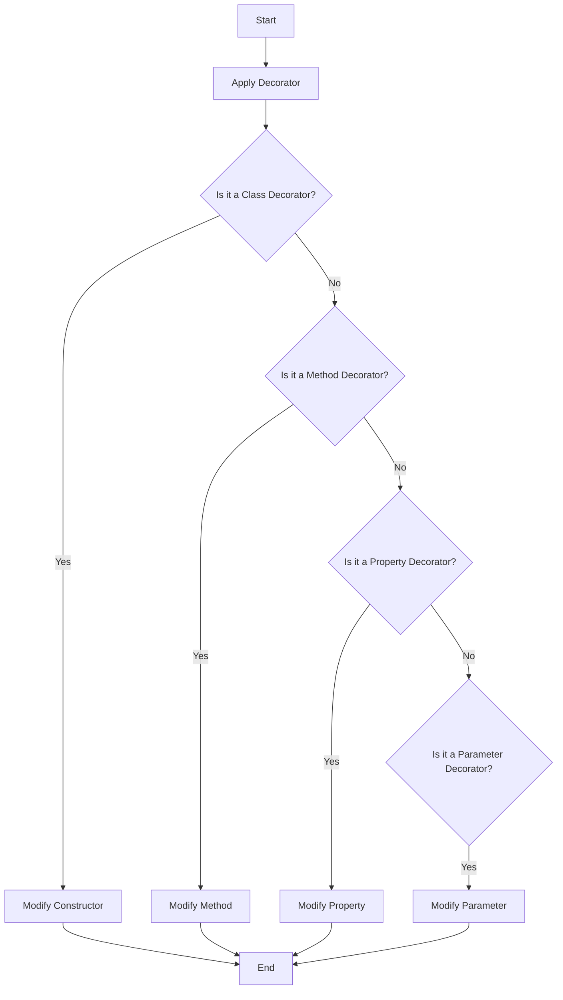

## 19.1 Decorators in TypeScript

Decorators in TypeScript offer a powerful way to add annotations and meta-programming syntax for class declarations and members. They allow developers to modify classes, methods, properties, and even parameters at design time. Although decorators are an experimental feature, they are widely used in frameworks like Angular for dependency injection and other purposes. In this section, we will explore the concept of decorators, how to enable them, and practical examples of their use.

### What are Decorators?

Decorators are special functions that can be attached to classes, methods, properties, or parameters to modify their behavior. They are a form of meta-programming, which means they allow you to add additional functionality to your code without modifying the actual code itself. Decorators can be used for a variety of purposes, such as logging, validation, or dependency injection.

### Enabling Decorators in TypeScript

Before we dive into examples, it's important to note that decorators are an experimental feature in TypeScript. To use them, you need to enable the `experimentalDecorators` option in your `tsconfig.json` file. Here's how you can do it:

```json
{
  "compilerOptions": {
    "target": "ES5",
    "experimentalDecorators": true
  }
}
```

### Types of Decorators

Decorators can be applied to different parts of your code. Let's explore the main types of decorators available in TypeScript:

1. **Class Decorators**: Applied to classes to modify or annotate them.
2. **Method Decorators**: Applied to methods within a class.
3. **Property Decorators**: Applied to properties within a class.
4. **Parameter Decorators**: Applied to parameters of a method within a class.

### Class Decorators

Class decorators are functions that are applied to the constructor of a class. They can be used to modify the class or add metadata to it. Let's look at an example:

```typescript
function sealed(constructor: Function) {
  Object.seal(constructor);
  Object.seal(constructor.prototype);
}

@sealed
class Greeter {
  greeting: string;
  constructor(message: string) {
    this.greeting = message;
  }
  greet() {
    return `Hello, ${this.greeting}`;
  }
}

const greeter = new Greeter("world");
console.log(greeter.greet());
```

In this example, the `sealed` decorator is applied to the `Greeter` class. It seals the constructor and its prototype, preventing any further modifications.

### Method Decorators

Method decorators are applied to the methods of a class. They can be used to modify the method or add metadata. Here's an example:

```typescript
function log(target: any, propertyKey: string, descriptor: PropertyDescriptor) {
  const originalMethod = descriptor.value;
  descriptor.value = function (...args: any[]) {
    console.log(`Calling ${propertyKey} with arguments: ${args}`);
    return originalMethod.apply(this, args);
  };
}

class Calculator {
  @log
  add(a: number, b: number): number {
    return a + b;
  }
}

const calculator = new Calculator();
console.log(calculator.add(2, 3));
```

In this example, the `log` decorator is applied to the `add` method of the `Calculator` class. It logs the method name and arguments each time the method is called.

### Property Decorators

Property decorators are applied to properties within a class. They can be used to modify the property or add metadata. Here's an example:

```typescript
function readonly(target: any, propertyKey: string) {
  Object.defineProperty(target, propertyKey, {
    writable: false
  });
}

class Person {
  @readonly
  name: string = "John Doe";
}

const person = new Person();
person.name = "Jane Doe"; // This will throw an error in strict mode
console.log(person.name);
```

In this example, the `readonly` decorator is applied to the `name` property of the `Person` class, making it immutable.

### Parameter Decorators

Parameter decorators are applied to the parameters of a method within a class. They can be used to modify the parameter or add metadata. Here's an example:

```typescript
function logParameter(target: any, propertyKey: string, parameterIndex: number) {
  const metadataKey = `log_${propertyKey}_parameters`;
  if (Array.isArray(target[metadataKey])) {
    target[metadataKey].push(parameterIndex);
  } else {
    target[metadataKey] = [parameterIndex];
  }
}

class User {
  greet(@logParameter message: string): string {
    return `Hello, ${message}`;
  }
}

const user = new User();
console.log(user.greet("world"));
```

In this example, the `logParameter` decorator is applied to the `message` parameter of the `greet` method in the `User` class. It logs the parameter index.

### Use Cases for Decorators

Decorators have a wide range of use cases, including:

- **Dependency Injection**: Automatically injecting dependencies into classes.
- **Logging**: Logging method calls and parameters.
- **Validation**: Validating method parameters or class properties.
- **Authorization**: Checking user permissions before executing a method.
- **Caching**: Caching method results to improve performance.

### Experimental Feature Warning

It's important to note that decorators are an experimental feature in TypeScript. This means that the syntax and behavior may change in future versions. Always check the latest TypeScript documentation for updates.

### Try It Yourself

To get a better understanding of decorators, try modifying the examples above. For instance, you can create a decorator that logs the execution time of a method or a decorator that validates the type of a property.

### Visualizing Decorators

To help visualize how decorators work, let's look at a simple flowchart:



This flowchart shows the decision-making process when applying decorators to different parts of a class.

### Key Takeaways

- Decorators are a powerful tool for meta-programming in TypeScript.
- They can be applied to classes, methods, properties, and parameters.
- Decorators are an experimental feature, so use them with caution.
- They have a wide range of use cases, including logging, validation, and dependency injection.

### Further Reading

For more information on decorators, check out the following resources:

- [TypeScript Handbook: Decorators](https://www.typescriptlang.org/docs/handbook/decorators.html)
- [MDN Web Docs: Decorators](https://developer.mozilla.org/en-US/docs/Web/JavaScript/Reference/Classes#decorators)

## Quiz Time!



### What is a decorator in TypeScript?

- [x] A function that modifies classes, methods, or properties.
- [ ] A type of variable declaration.
- [ ] A built-in TypeScript utility.
- [ ] A method of error handling.

> **Explanation:** Decorators are functions used to modify classes, methods, properties, or parameters in TypeScript.

### How do you enable decorators in TypeScript?

- [x] By setting `experimentalDecorators` to `true` in `tsconfig.json`.
- [ ] By importing a special module.
- [ ] By using a specific TypeScript version.
- [ ] By writing a custom TypeScript plugin.

> **Explanation:** Decorators are enabled by setting `experimentalDecorators` to `true` in the TypeScript configuration file.

### Which of the following is a type of decorator in TypeScript?

- [x] Class Decorator
- [x] Method Decorator
- [ ] Array Decorator
- [x] Property Decorator

> **Explanation:** TypeScript supports class, method, property, and parameter decorators.

### What is the purpose of a class decorator?

- [x] To modify or annotate a class.
- [ ] To add methods to a class.
- [ ] To change the class name.
- [ ] To create a new class instance.

> **Explanation:** Class decorators are used to modify or add metadata to a class.

### What does a method decorator modify?

- [x] The method it is applied to.
- [ ] The class constructor.
- [ ] The class properties.
- [ ] The class parameters.

> **Explanation:** Method decorators are applied to methods and can modify their behavior or add metadata.

### What is a common use case for decorators?

- [x] Logging
- [x] Dependency Injection
- [ ] Variable Declaration
- [x] Validation

> **Explanation:** Decorators are commonly used for logging, dependency injection, validation, and more.

### Are decorators a stable feature in TypeScript?

- [ ] Yes, they are stable.
- [x] No, they are experimental.
- [ ] Yes, but only in certain versions.
- [ ] No, they are deprecated.

> **Explanation:** Decorators are an experimental feature in TypeScript and may change in future versions.

### What does the `readonly` decorator do in the provided example?

- [x] Makes a property immutable.
- [ ] Logs the property value.
- [ ] Changes the property type.
- [ ] Deletes the property.

> **Explanation:** The `readonly` decorator makes a property immutable, preventing changes to its value.

### Can decorators be applied to function parameters?

- [x] Yes
- [ ] No

> **Explanation:** Parameter decorators can be applied to function parameters to modify or add metadata.

### Which TypeScript feature allows for meta-programming?

- [x] Decorators
- [ ] Interfaces
- [ ] Enums
- [ ] Generics

> **Explanation:** Decorators enable meta-programming by allowing modifications to classes, methods, properties, and parameters.


