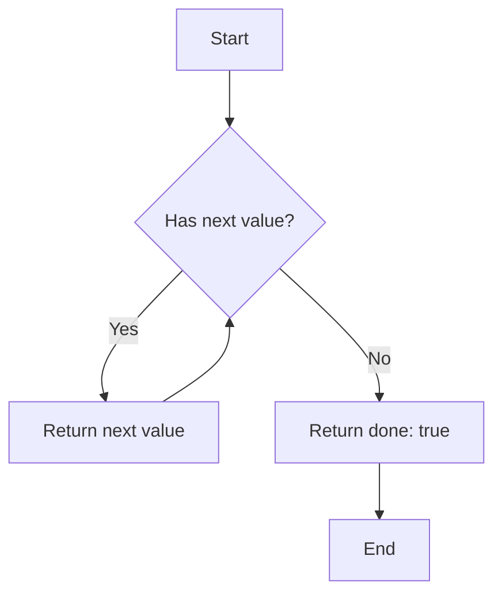

## 19.3 Working with Symbols and Iterators

In this section, we will explore two powerful features of TypeScript and JavaScript: Symbols and Iterators. These concepts can help you create more robust and flexible applications by providing unique identifiers and enabling custom iteration logic. Let's dive into each of these topics and learn how to use them effectively in TypeScript.

### Understanding Symbols

#### What Are Symbols?

Symbols are a unique and immutable primitive data type introduced in ECMAScript 6 (ES6). They are used to create unique identifiers for object properties, which can help prevent naming conflicts and ensure that property keys are unique.

#### Why Use Symbols?

Symbols are particularly useful when you need to ensure that a property key is unique and won't clash with other keys, even if they have the same name. This is especially important in large codebases or when integrating third-party libraries.

#### Creating Symbols

To create a Symbol, you use the `Symbol()` function. Each time you call `Symbol()`, it generates a new, unique Symbol.

```typescript
// Creating unique symbols
const symbol1 = Symbol();
const symbol2 = Symbol();

console.log(symbol1 === symbol2); // Output: false
```

As you can see, even though `symbol1` and `symbol2` are created in the same way, they are unique and not equal to each other.

#### Using Symbols as Property Keys

Symbols can be used as property keys in objects. This allows you to add properties to an object without risking name collisions with other properties.

```typescript
// Using symbols as property keys
const uniqueKey = Symbol('uniqueKey');

const myObject = {
  [uniqueKey]: 'This is a unique value'
};

console.log(myObject[uniqueKey]); // Output: This is a unique value
```

In this example, we use a Symbol as a property key, ensuring that it won't conflict with any other keys in the object.

#### Symbol Description

When creating a Symbol, you can provide an optional description, which is useful for debugging purposes. This description is not part of the Symbol's identity but can help you understand its purpose.

```typescript
// Creating a symbol with a description
const mySymbol = Symbol('mySymbolDescription');

console.log(mySymbol.toString()); // Output: Symbol(mySymbolDescription)
```

### Practical Applications of Symbols

Symbols are often used in scenarios where you need unique keys, such as:

- **Private properties**: Symbols can be used to create private properties in objects, as they are not accessible through standard property enumeration methods.
- **Meta-programming**: Symbols can be used to define custom behavior for built-in JavaScript operations, such as iteration and type conversion.

### Introduction to Iterators

#### What Are Iterators?

Iterators are objects that allow you to traverse a collection of items, one at a time. They provide a standardized way to access elements in a sequence without exposing the underlying structure of the collection.

#### The Iterator Protocol

The iterator protocol defines a standard way to produce a sequence of values. An object is considered an iterator if it implements a `next()` method, which returns an object with two properties:

- `value`: The next value in the sequence.
- `done`: A boolean indicating whether the sequence is complete.

Here's a simple example of an iterator:

```typescript
// Creating a simple iterator
const myIterator = {
  current: 0,
  last: 5,
  next() {
    if (this.current <= this.last) {
      return { value: this.current++, done: false };
    } else {
      return { value: undefined, done: true };
    }
  }
};

console.log(myIterator.next()); // Output: { value: 0, done: false }
console.log(myIterator.next()); // Output: { value: 1, done: false }
// ...and so on
```

### Making Objects Iterable with Symbol.iterator

To make an object iterable, you need to implement the `Symbol.iterator` method. This method should return an iterator object that adheres to the iterator protocol.

#### Implementing Symbol.iterator

Let's create a custom iterable object:

```typescript
// Creating a custom iterable object
class CustomIterable {
  private data: number[];

  constructor(data: number[]) {
    this.data = data;
  }

  [Symbol.iterator]() {
    let index = 0;
    const data = this.data;

    return {
      next(): IteratorResult<number> {
        if (index < data.length) {
          return { value: data[index++], done: false };
        } else {
          return { value: undefined, done: true };
        }
      }
    };
  }
}

const iterable = new CustomIterable([1, 2, 3, 4, 5]);

for (const value of iterable) {
  console.log(value); // Output: 1, 2, 3, 4, 5
}
```

In this example, we create a `CustomIterable` class that implements the `Symbol.iterator` method. This allows us to use the `for...of` loop to iterate over its elements.

### Practical Applications of Iterators

Iterators are useful in various scenarios, such as:

- **Custom data structures**: You can create custom data structures that can be iterated over using the `for...of` loop.
- **Lazy evaluation**: Iterators allow you to generate values on-the-fly, which can be useful for working with large datasets or streams.

### Try It Yourself

Now that we've covered the basics of Symbols and Iterators, try modifying the code examples to deepen your understanding:

- Create a custom iterable object that generates Fibonacci numbers.
- Use Symbols to create private properties in a class and access them using a method.

### Visualizing Iterators

To better understand how iterators work, let's visualize the process using a flowchart:



This flowchart illustrates the process of iterating over a collection using an iterator. The iterator checks if there is a next value, returns it if available, and continues until there are no more values.

### Additional Resources

For further reading on Symbols and Iterators, check out these resources:

- [MDN Web Docs: Symbols](https://developer.mozilla.org/en-US/docs/Web/JavaScript/Reference/Global_Objects/Symbol)
- [MDN Web Docs: Iterators and Generators](https://developer.mozilla.org/en-US/docs/Web/JavaScript/Guide/Iterators_and_Generators)

### Summary

In this section, we've explored Symbols and Iterators in TypeScript. Symbols provide a way to create unique identifiers, while Iterators allow you to traverse collections in a standardized manner. By understanding these concepts, you can create more robust and flexible applications.

## Quiz Time!



### What is a Symbol in TypeScript?

- [x] A unique and immutable primitive data type
- [ ] A mutable data type
- [ ] A type used for numbers
- [ ] A type used for strings

> **Explanation:** Symbols are unique and immutable primitive data types used for creating unique identifiers.

### How do you create a Symbol in TypeScript?

- [x] Using the `Symbol()` function
- [ ] Using the `new Symbol()` constructor
- [ ] Using the `symbol` keyword
- [ ] Using the `createSymbol()` function

> **Explanation:** You create a Symbol using the `Symbol()` function.

### What is the purpose of using Symbols as property keys?

- [x] To ensure property keys are unique and avoid naming conflicts
- [ ] To make properties mutable
- [ ] To convert properties to strings
- [ ] To make properties enumerable

> **Explanation:** Symbols ensure that property keys are unique, preventing naming conflicts.

### What does the `Symbol.iterator` method do?

- [x] It makes an object iterable
- [ ] It converts an object to a string
- [ ] It makes an object immutable
- [ ] It creates a new Symbol

> **Explanation:** The `Symbol.iterator` method makes an object iterable by returning an iterator.

### What does an iterator's `next()` method return?

- [x] An object with `value` and `done` properties
- [ ] A string
- [ ] A number
- [ ] A boolean

> **Explanation:** The `next()` method returns an object with `value` and `done` properties.

### Which loop can be used to iterate over an iterable object?

- [x] `for...of`
- [ ] `for...in`
- [ ] `while`
- [ ] `do...while`

> **Explanation:** The `for...of` loop is used to iterate over iterable objects.

### What is a practical application of iterators?

- [x] Custom data structures
- [ ] Converting strings to numbers
- [ ] Making properties enumerable
- [ ] Creating new Symbols

> **Explanation:** Iterators are useful for creating custom data structures that can be iterated over.

### Can Symbols be used to create private properties in objects?

- [x] Yes
- [ ] No

> **Explanation:** Symbols can be used to create private properties, as they are not accessible through standard property enumeration methods.

### What is the output of `console.log(Symbol('desc').toString())`?

- [x] `Symbol(desc)`
- [ ] `Symbol`
- [ ] `desc`
- [ ] `Symbol()`

> **Explanation:** The `toString()` method returns the Symbol with its description in parentheses.

### True or False: Symbols can be used to define custom behavior for built-in JavaScript operations.

- [x] True
- [ ] False

> **Explanation:** Symbols can be used to define custom behavior for operations like iteration and type conversion.


