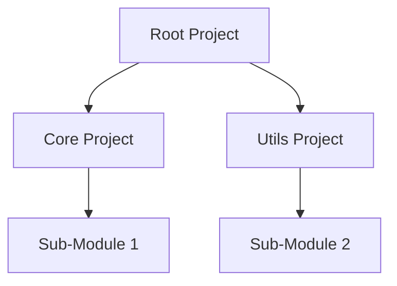

## 19.4 Building Advanced TypeScript Configurations

As we delve deeper into TypeScript, it's essential to understand how to configure your TypeScript projects effectively. The `tsconfig.json` file is a powerful tool that allows you to tailor the TypeScript compiler's behavior to meet your project's specific needs. In this section, we'll explore advanced configuration options, including `paths`, `baseUrl`, `rootDirs`, project references, composite projects, and incremental compilation. By mastering these configurations, you'll be able to optimize your TypeScript projects for performance and scalability.

### Understanding `tsconfig.json`

The `tsconfig.json` file is the cornerstone of TypeScript configuration. It tells the TypeScript compiler how to compile your code. While we've covered basic configurations earlier, let's now explore some advanced options that can significantly enhance your development workflow.

### Paths and BaseUrl

The `paths` and `baseUrl` options in `tsconfig.json` are particularly useful for managing module resolution in large projects. They allow you to define custom module paths, making it easier to import modules without using relative paths.

#### BaseUrl

The `baseUrl` option specifies the root directory for module resolution. By setting a `baseUrl`, you can import modules using absolute paths relative to this base directory.

```json
{
  "compilerOptions": {
    "baseUrl": "./src"
  }
}
```

In this example, if you have a file `src/utils/helper.ts`, you can import it using:

```typescript
import { helperFunction } from "utils/helper";
```

#### Paths

The `paths` option works in conjunction with `baseUrl` to map module paths to specific directories. This is particularly useful for aliasing directories or modules.

```json
{
  "compilerOptions": {
    "baseUrl": "./",
    "paths": {
      "@components/*": ["src/components/*"],
      "@utils/*": ["src/utils/*"]
    }
  }
}
```

With this configuration, you can import a component like this:

```typescript
import { Button } from "@components/Button";
```

### RootDirs

The `rootDirs` option allows you to specify a list of root directories whose contents are combined. This is useful when you have multiple source directories that should be treated as a single logical directory structure.

```json
{
  "compilerOptions": {
    "rootDirs": ["src", "generated"]
  }
}
```

This configuration tells TypeScript to treat files in `src` and `generated` as if they are in the same directory, allowing for seamless module resolution across these directories.

### Project References

Project references are an advanced feature that allows you to structure your TypeScript projects into smaller, manageable pieces. This is particularly beneficial for large codebases, as it enables incremental builds and better organization.

#### Configuring Project References

To set up project references, you need to create a `tsconfig.json` file for each sub-project and a root `tsconfig.json` that references these sub-projects.

**Sub-project `tsconfig.json`:**

```json
{
  "compilerOptions": {
    "composite": true,
    "outDir": "./dist"
  },
  "include": ["src"]
}
```

**Root `tsconfig.json`:**

```json
{
  "files": [],
  "references": [
    { "path": "./packages/core" },
    { "path": "./packages/utils" }
  ]
}
```

In this setup, each sub-project is treated as a standalone unit, allowing TypeScript to compile them independently.

### Composite Projects and Incremental Compilation

Composite projects and incremental compilation are features that improve build performance, especially in large projects.

#### Composite Projects

A composite project is a TypeScript project that can be referenced by other projects. To enable this, set the `composite` option to `true` in the `tsconfig.json`.

```json
{
  "compilerOptions": {
    "composite": true
  }
}
```

Composite projects generate additional metadata that allows TypeScript to understand dependencies between projects, enabling more efficient builds.

#### Incremental Compilation

Incremental compilation speeds up the build process by only recompiling files that have changed. To enable incremental compilation, set the `incremental` option to `true`.

```json
{
  "compilerOptions": {
    "incremental": true,
    "tsBuildInfoFile": "./.tsbuildinfo"
  }
}
```

The `tsBuildInfoFile` option specifies the location of the build information file, which TypeScript uses to determine which files need recompilation.

### Optimizing Compilation for Large Codebases

When working with large codebases, optimizing the TypeScript compilation process is crucial for maintaining productivity. Here are some tips to achieve this:

1. **Use Project References:** Break your codebase into smaller projects using project references to enable parallel builds and faster incremental compilation.

2. **Enable Incremental Compilation:** Use the `incremental` option to avoid recompiling unchanged files.

3. **Leverage `paths` and `baseUrl`:** Simplify module imports and reduce the complexity of your codebase by using these options.

4. **Optimize `include` and `exclude`:** Fine-tune which files are included in the compilation process to avoid unnecessary work.

5. **Use `skipLibCheck`:** If you're confident in your type definitions, you can skip type checking of declaration files to speed up compilation.

### Try It Yourself

To solidify your understanding, try setting up a TypeScript project with multiple sub-projects using project references. Experiment with the `paths` and `baseUrl` options to simplify your module imports. Enable incremental compilation and observe the difference in build times.

### Visualizing Project References

To help visualize how project references work, let's use a Mermaid.js diagram to represent the structure of a TypeScript project with multiple sub-projects.



This diagram illustrates a root project that references two sub-projects, each containing its own modules.

### Further Reading

For more in-depth information on TypeScript configurations, refer to the official [TypeScript Handbook](https://www.typescriptlang.org/docs/handbook/tsconfig-json.html). The handbook provides comprehensive details on all available compiler options and best practices for configuring TypeScript projects.

### Key Takeaways

- **Paths and BaseUrl:** Simplify module imports with custom paths.
- **RootDirs:** Combine multiple source directories for seamless module resolution.
- **Project References:** Organize large codebases into manageable sub-projects.
- **Composite Projects and Incremental Compilation:** Improve build performance with efficient compilation strategies.
- **Optimization Tips:** Enhance productivity by fine-tuning your TypeScript configuration.

By mastering these advanced TypeScript configurations, you'll be well-equipped to handle complex projects with ease. Remember to experiment with different settings and consult the official documentation to deepen your understanding.

## Quiz Time!



### What is the purpose of the `baseUrl` option in `tsconfig.json`?

- [x] To specify the root directory for module resolution
- [ ] To define the output directory for compiled files
- [ ] To set the TypeScript version for the project
- [ ] To enable incremental compilation

> **Explanation:** The `baseUrl` option sets the root directory for module resolution, allowing for absolute imports relative to this directory.

### How does the `paths` option enhance module imports?

- [x] By allowing custom module paths and aliases
- [ ] By specifying the output directory for compiled files
- [ ] By enabling incremental compilation
- [ ] By defining the TypeScript version for the project

> **Explanation:** The `paths` option allows you to define custom module paths and aliases, simplifying module imports.

### What is the benefit of using project references in TypeScript?

- [x] To structure projects into smaller, manageable pieces
- [ ] To enable dynamic imports
- [ ] To disable type checking
- [ ] To set the TypeScript version for the project

> **Explanation:** Project references allow you to break down large codebases into smaller, manageable sub-projects, improving organization and build efficiency.

### What does the `composite` option enable in a TypeScript project?

- [x] It allows the project to be referenced by other projects
- [ ] It enables dynamic imports
- [ ] It disables type checking
- [ ] It sets the TypeScript version for the project

> **Explanation:** The `composite` option allows a TypeScript project to be referenced by other projects, facilitating project references.

### How does incremental compilation improve build performance?

- [x] By recompiling only changed files
- [ ] By disabling type checking
- [ ] By enabling dynamic imports
- [ ] By setting the TypeScript version for the project

> **Explanation:** Incremental compilation improves build performance by recompiling only the files that have changed since the last build.

### What is the role of the `tsBuildInfoFile` option?

- [x] To specify the location of the build information file
- [ ] To set the TypeScript version for the project
- [ ] To enable dynamic imports
- [ ] To disable type checking

> **Explanation:** The `tsBuildInfoFile` option specifies where to store the build information file, which is used for incremental compilation.

### How can `rootDirs` be useful in a TypeScript project?

- [x] By treating multiple directories as a single logical directory
- [ ] By enabling dynamic imports
- [ ] By disabling type checking
- [ ] By setting the TypeScript version for the project

> **Explanation:** The `rootDirs` option allows TypeScript to treat multiple directories as a single logical directory, facilitating seamless module resolution.

### What is a composite project in TypeScript?

- [x] A project that can be referenced by other projects
- [ ] A project with dynamic imports
- [ ] A project without type checking
- [ ] A project with a specific TypeScript version

> **Explanation:** A composite project is a TypeScript project that can be referenced by other projects, enabling project references.

### Which option should you enable for faster builds in large codebases?

- [x] Incremental compilation
- [ ] Dynamic imports
- [ ] Disable type checking
- [ ] Set a specific TypeScript version

> **Explanation:** Enabling incremental compilation allows for faster builds by recompiling only changed files.

### True or False: The `skipLibCheck` option skips type checking of declaration files.

- [x] True
- [ ] False

> **Explanation:** The `skipLibCheck` option skips type checking of declaration files, which can speed up the compilation process if you're confident in your type definitions.


