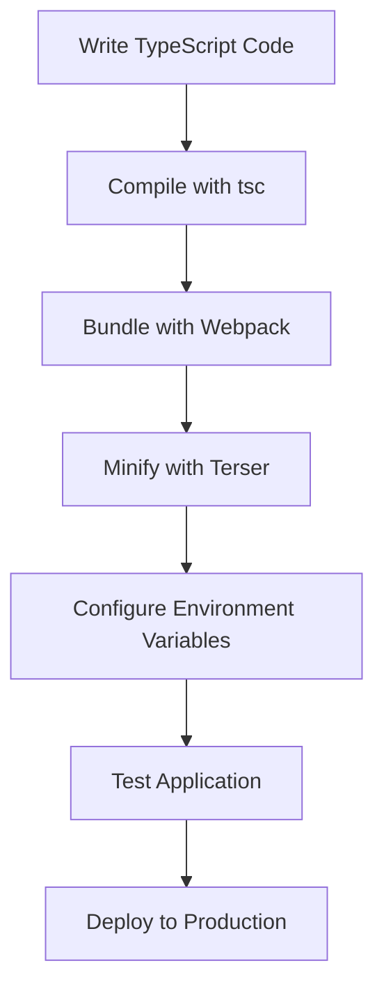

## 19.6 Preparing for Production Deployment

Deploying a TypeScript application to production is a crucial step in the software development lifecycle. It involves more than just writing code; it requires careful planning and execution to ensure that your application runs smoothly and efficiently in a live environment. In this section, we will explore the best practices for preparing your TypeScript applications for production deployment. We will cover building and bundling strategies, code optimization, environment configurations, and the importance of thorough testing.

### Building and Bundling Strategies

Before deploying your TypeScript application, it's essential to build and bundle your code. This process involves compiling your TypeScript files into JavaScript and packaging them for deployment. Let's explore some key strategies for building and bundling your application.

#### Using the TypeScript Compiler

The TypeScript compiler (`tsc`) is a powerful tool that converts TypeScript code into JavaScript. To compile your TypeScript files, you can use the following command:

```bash
tsc
```

This command will look for a `tsconfig.json` file in your project directory and use its configuration to compile your TypeScript files. Ensure that your `tsconfig.json` is properly configured for production. Here is a sample configuration:

```json
{
  "compilerOptions": {
    "target": "ES5",
    "module": "commonjs",
    "outDir": "./dist",
    "strict": true,
    "esModuleInterop": true,
    "skipLibCheck": true,
    "forceConsistentCasingInFileNames": true
  },
  "include": ["src"]
}
```

**Key Points:**
- **`target`:** Specifies the ECMAScript version to compile to. ES5 is a common target for compatibility.
- **`module`:** Defines the module system. CommonJS is often used for Node.js applications.
- **`outDir`:** Specifies the output directory for compiled files.
- **`strict`:** Enables all strict type-checking options.

#### Bundling with Webpack

Webpack is a popular module bundler that can package your TypeScript application for deployment. It can handle not only JavaScript files but also assets like CSS and images. To use Webpack, you'll need to create a `webpack.config.js` file. Here's a basic configuration:

```javascript
const path = require('path');

module.exports = {
  entry: './src/index.ts',
  output: {
    filename: 'bundle.js',
    path: path.resolve(__dirname, 'dist')
  },
  resolve: {
    extensions: ['.ts', '.js']
  },
  module: {
    rules: [
      {
        test: /\.ts$/,
        use: 'ts-loader',
        exclude: /node_modules/
      }
    ]
  },
  mode: 'production'
};
```

**Key Points:**
- **`entry`:** Specifies the entry point of your application.
- **`output`:** Defines the output file and directory.
- **`resolve`:** Allows Webpack to resolve TypeScript and JavaScript files.
- **`module`:** Uses `ts-loader` to handle `.ts` files.
- **`mode`:** Set to `'production'` for optimized builds.

### Code Optimization for Production

Optimizing your code for production is crucial to ensure fast load times and efficient resource usage. Let's explore some techniques for minimizing and optimizing your TypeScript code.

#### Minification with Terser

Minification reduces the size of your JavaScript files by removing unnecessary whitespace, comments, and shortening variable names. Terser is a popular tool for minifying JavaScript. When using Webpack, Terser is included by default in production mode. Here's how you can configure it:

```javascript
const TerserPlugin = require('terser-webpack-plugin');

module.exports = {
  // ... other configurations ...
  optimization: {
    minimize: true,
    minimizer: [new TerserPlugin()]
  }
};
```

**Key Points:**
- **`minimize`:** Enables minification.
- **`minimizer`:** Specifies the minification tool, in this case, Terser.

#### Tree Shaking

Tree shaking is a technique used to eliminate unused code from your final bundle. Webpack automatically performs tree shaking in production mode. Ensure that your code is structured in a way that allows for effective tree shaking by using ES6 module syntax (`import` and `export`).

#### Lazy Loading

Lazy loading is a strategy to load parts of your application only when needed. This can significantly reduce the initial load time of your application. You can implement lazy loading in your application using dynamic `import()` statements.

```typescript
async function loadComponent() {
  const { Component } = await import('./Component');
  // Use the component
}
```

### Environment Variables and Configurations

Managing environment variables and configurations is essential for adapting your application to different environments (development, testing, production). Let's explore how to handle these configurations effectively.

#### Using Environment Variables

Environment variables allow you to configure your application without changing the code. You can use a package like `dotenv` to manage environment variables in your TypeScript application.

1. **Install `dotenv`:**

   ```bash
   npm install dotenv
   ```

2. **Create a `.env` file:**

   ```
   API_URL=https://api.example.com
   ```

3. **Load environment variables in your application:**

   ```typescript
   import * as dotenv from 'dotenv';

   dotenv.config();

   const apiUrl = process.env.API_URL;
   ```

#### Configuration Files

In addition to environment variables, you can use configuration files to manage settings specific to different environments. Create separate configuration files for development, testing, and production, and load the appropriate file based on the environment.

### Testing Before Deployment

Thorough testing is crucial to ensure that your application works as expected in production. Let's explore some testing strategies.

#### Unit Testing

Unit testing involves testing individual components or functions in isolation. Use a testing framework like Jest to write unit tests for your TypeScript application.

```typescript
// Example unit test using Jest
import { sum } from './math';

test('adds 1 + 2 to equal 3', () => {
  expect(sum(1, 2)).toBe(3);
});
```

#### Integration Testing

Integration testing involves testing the interaction between different components of your application. Use tools like Cypress or Selenium for integration testing.

#### End-to-End Testing

End-to-end (E2E) testing involves testing the entire application flow from start to finish. This ensures that all parts of your application work together as expected. Use tools like Cypress or TestCafe for E2E testing.

### Tools for Production Deployment

Several tools can help streamline the deployment process and ensure that your application is production-ready.

#### Continuous Integration and Deployment (CI/CD)

CI/CD pipelines automate the process of testing and deploying your application. Tools like Jenkins, GitHub Actions, and Travis CI can help you set up CI/CD pipelines for your TypeScript application.

#### Monitoring and Logging

Monitoring and logging are essential for identifying and resolving issues in production. Use tools like LogRocket, Sentry, or New Relic to monitor your application and capture logs.

### Try It Yourself

To reinforce your understanding, try modifying the code examples provided in this section. For instance, experiment with different Webpack configurations or implement lazy loading in a sample application. Observe how these changes affect the build process and the performance of your application.

### Visual Aids

To help visualize the production deployment process, let's look at a flowchart that outlines the steps involved in preparing a TypeScript application for deployment.



**Diagram Description:** This flowchart illustrates the steps involved in preparing a TypeScript application for production deployment, from writing code to deploying the application.

### Summary

In this section, we explored the best practices for preparing a TypeScript application for production deployment. We discussed building and bundling strategies, code optimization techniques, managing environment variables, and the importance of thorough testing. By following these practices, you can ensure that your application is efficient, reliable, and ready for a live environment.

## Quiz Time!



### What is the purpose of the TypeScript compiler (`tsc`)?

- [x] To convert TypeScript code into JavaScript
- [ ] To bundle JavaScript files
- [ ] To minify JavaScript code
- [ ] To manage environment variables

> **Explanation:** The TypeScript compiler (`tsc`) is used to convert TypeScript code into JavaScript.

### Which tool is commonly used for bundling TypeScript applications?

- [x] Webpack
- [ ] Terser
- [ ] Jest
- [ ] Cypress

> **Explanation:** Webpack is a popular module bundler used for bundling TypeScript applications.

### What is the purpose of minification in production deployment?

- [x] To reduce the size of JavaScript files
- [ ] To convert TypeScript to JavaScript
- [ ] To manage environment variables
- [ ] To perform unit testing

> **Explanation:** Minification reduces the size of JavaScript files by removing unnecessary whitespace, comments, and shortening variable names.

### How can you implement lazy loading in a TypeScript application?

- [x] By using dynamic `import()` statements
- [ ] By using `require()` statements
- [ ] By using `console.log()` statements
- [ ] By using `alert()` statements

> **Explanation:** Lazy loading can be implemented using dynamic `import()` statements to load parts of the application only when needed.

### What package can be used to manage environment variables in a TypeScript application?

- [x] dotenv
- [ ] Webpack
- [ ] Terser
- [ ] Jest

> **Explanation:** The `dotenv` package can be used to manage environment variables in a TypeScript application.

### Which type of testing involves testing individual components or functions in isolation?

- [x] Unit Testing
- [ ] Integration Testing
- [ ] End-to-End Testing
- [ ] Load Testing

> **Explanation:** Unit testing involves testing individual components or functions in isolation.

### What is the purpose of CI/CD pipelines?

- [x] To automate testing and deployment
- [ ] To convert TypeScript to JavaScript
- [ ] To bundle JavaScript files
- [ ] To minify JavaScript code

> **Explanation:** CI/CD pipelines automate the process of testing and deploying applications.

### Which tool is used for monitoring and logging in production?

- [x] LogRocket
- [ ] Webpack
- [ ] Terser
- [ ] Jest

> **Explanation:** LogRocket is a tool used for monitoring and logging in production environments.

### What is tree shaking?

- [x] A technique to eliminate unused code
- [ ] A method to minify JavaScript files
- [ ] A process to manage environment variables
- [ ] A type of testing

> **Explanation:** Tree shaking is a technique used to eliminate unused code from the final bundle.

### True or False: Lazy loading can reduce the initial load time of an application.

- [x] True
- [ ] False

> **Explanation:** Lazy loading can reduce the initial load time by loading parts of the application only when needed.


