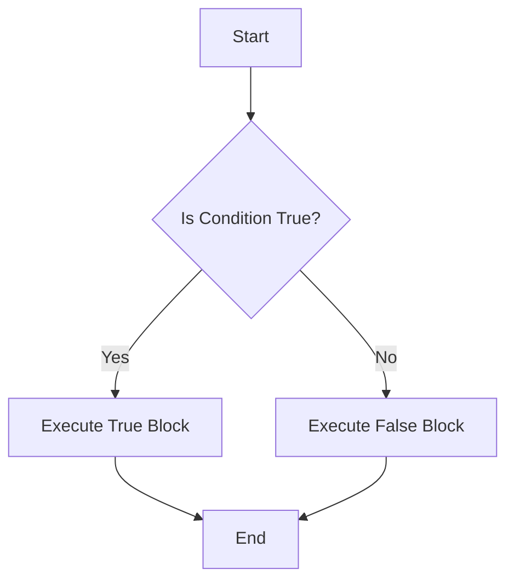

## 2.3 Boolean Types

In this section, we will delve into the `boolean` type in TypeScript, a fundamental data type that represents logical true and false values. Understanding how to use booleans effectively is crucial for controlling the flow of your programs and making decisions based on conditions.

### Understanding the Boolean Type

The `boolean` type in TypeScript is used to represent two values: `true` and `false`. These values are essential in programming because they allow us to make decisions and control the flow of our applications. Whether you're checking if a user is logged in, determining if a number is even, or validating input, booleans are the backbone of decision-making in code.

#### Defining Boolean Variables

In TypeScript, you can declare a boolean variable using the `boolean` keyword. Here's a simple example:

```typescript
let isLoggedIn: boolean = true;
let hasAccess: boolean = false;
```

In this example, `isLoggedIn` is a boolean variable set to `true`, indicating that a user is logged in, while `hasAccess` is set to `false`, indicating that the user does not have access to a particular feature.

### Using Booleans in Conditional Statements

Conditional statements allow us to execute different blocks of code based on whether a condition is true or false. The most common conditional statement is the `if` statement.

#### If Statements

An `if` statement evaluates a boolean expression and executes the code block inside it if the expression is true. Here's an example:

```typescript
let isAuthenticated: boolean = true;

if (isAuthenticated) {
    console.log("Welcome, user!");
} else {
    console.log("Please log in.");
}
```

In this example, the message "Welcome, user!" will be logged to the console because `isAuthenticated` is `true`. If it were `false`, the message "Please log in." would be displayed instead.

#### Else If and Else

You can extend the `if` statement with `else if` and `else` to handle multiple conditions:

```typescript
let userRole: string = "admin";

if (userRole === "admin") {
    console.log("Access granted to admin panel.");
} else if (userRole === "editor") {
    console.log("Access granted to editor panel.");
} else {
    console.log("Access denied.");
}
```

This code checks the `userRole` variable and grants access based on its value. If `userRole` is neither "admin" nor "editor", access is denied.

### Boolean Expressions

Boolean expressions are expressions that evaluate to either `true` or `false`. They are often used in conditional statements to determine which code block should be executed.

#### Comparison Operators

Comparison operators are used to compare values and return a boolean result. Here are some common comparison operators:

- `===`: Strict equality
- `!==`: Strict inequality
- `<`: Less than
- `>`: Greater than
- `<=`: Less than or equal to
- `>=`: Greater than or equal to

Example:

```typescript
let age: number = 18;
let isAdult: boolean = age >= 18; // true

if (isAdult) {
    console.log("You are an adult.");
} else {
    console.log("You are not an adult.");
}
```

In this example, `isAdult` is `true` because `age` is greater than or equal to 18.

#### Logical Operators

Logical operators are used to combine multiple boolean expressions:

- `&&`: Logical AND
- `||`: Logical OR
- `!`: Logical NOT

Example:

```typescript
let hasTicket: boolean = true;
let isVIP: boolean = false;

if (hasTicket && isVIP) {
    console.log("Welcome to the VIP area.");
} else if (hasTicket || isVIP) {
    console.log("Welcome to the event.");
} else {
    console.log("No entry.");
}
```

In this example, the program checks if the user has a ticket or is a VIP to determine access.

### Truthy and Falsy Values

In JavaScript, values can be "truthy" or "falsy". A truthy value is a value that is considered true when evaluated in a boolean context, while a falsy value is considered false. Here are some examples:

- **Falsy values**: `false`, `0`, `""` (empty string), `null`, `undefined`, `NaN`
- **Truthy values**: All values that are not falsy, such as `true`, non-zero numbers, non-empty strings, objects, and arrays.

TypeScript enforces boolean types, which means you need to explicitly convert truthy and falsy values to booleans when necessary.

#### Example of Truthy and Falsy Values

```typescript
let value: any = "Hello";

if (value) {
    console.log("This is a truthy value.");
} else {
    console.log("This is a falsy value.");
}
```

In this example, the string "Hello" is a truthy value, so the message "This is a truthy value." will be logged.

### Booleans in Loops

Booleans are also used in loops to control iteration. The most common loop that uses booleans is the `while` loop.

#### While Loop

A `while` loop continues to execute as long as its condition is true:

```typescript
let count: number = 0;

while (count < 5) {
    console.log("Count is: " + count);
    count++;
}
```

In this example, the loop will run until `count` is no longer less than 5. The message "Count is: X" will be logged for each iteration.

### Booleans in Functions

Functions can return boolean values, allowing you to encapsulate logic and reuse it throughout your code.

#### Example Function Returning a Boolean

```typescript
function isEven(number: number): boolean {
    return number % 2 === 0;
}

let number: number = 4;
if (isEven(number)) {
    console.log(number + " is even.");
} else {
    console.log(number + " is odd.");
}
```

In this example, the `isEven` function checks if a number is even and returns a boolean result. The `if` statement then uses this result to determine which message to log.

### Try It Yourself

Now it's your turn! Try modifying the code examples above to see how changing the boolean values affects the program's output. For example, change the `isAuthenticated` variable to `false` and observe the change in the console output. Experiment with different comparison and logical operators to deepen your understanding.

### Visualizing Boolean Logic

To help visualize how boolean logic works, let's look at a simple flowchart that represents the decision-making process in an `if-else` statement.



This flowchart shows that the program checks a condition and executes the corresponding block of code based on whether the condition is true or false.

### Summary

In this section, we've explored the `boolean` type in TypeScript and how it is used to control the flow of programs. We've covered boolean variables, expressions, and their use in conditional statements, loops, and functions. By understanding booleans, you can make your programs more dynamic and responsive to different conditions.

### Additional Resources

For further reading on booleans and conditional logic, check out these resources:

- [MDN Web Docs: Boolean](https://developer.mozilla.org/en-US/docs/Web/JavaScript/Reference/Global_Objects/Boolean)
- [W3Schools: JavaScript Booleans](https://www.w3schools.com/js/js_booleans.asp)

---

## Quiz Time!



### What is the boolean value of `isLoggedIn` in the following code: `let isLoggedIn: boolean = true;`?

- [x] true
- [ ] false
- [ ] undefined
- [ ] null

> **Explanation:** The boolean variable `isLoggedIn` is explicitly set to `true`.

### Which of the following is a falsy value in JavaScript?

- [ ] "Hello"
- [x] 0
- [ ] {}
- [ ] []

> **Explanation:** In JavaScript, `0` is considered a falsy value, while non-empty strings, objects, and arrays are truthy.

### What will be logged to the console in the following code snippet?

```typescript
let isAuthenticated: boolean = false;

if (isAuthenticated) {
    console.log("Welcome, user!");
} else {
    console.log("Please log in.");
}
```

- [ ] "Welcome, user!"
- [x] "Please log in."
- [ ] "Error"
- [ ] "Undefined"

> **Explanation:** Since `isAuthenticated` is `false`, the `else` block will execute, logging "Please log in."

### Which operator is used to combine multiple boolean expressions?

- [ ] +
- [ ] -
- [x] &&
- [ ] /

> **Explanation:** The `&&` operator is used to combine multiple boolean expressions in a logical AND operation.

### How can you declare a boolean variable in TypeScript?

- [ ] `let isActive: string = "true";`
- [x] `let isActive: boolean = true;`
- [ ] `let isActive: number = 1;`
- [ ] `let isActive: boolean = "true";`

> **Explanation:** The correct way to declare a boolean variable in TypeScript is using the `boolean` type with a value of `true` or `false`.

### What will the `isEven` function return when called with the argument `5`?

```typescript
function isEven(number: number): boolean {
    return number % 2 === 0;
}
```

- [ ] true
- [x] false
- [ ] undefined
- [ ] null

> **Explanation:** The function checks if the number is divisible by 2. Since 5 is not, it returns `false`.

### Which of the following is a truthy value?

- [x] "Hello"
- [ ] 0
- [ ] false
- [ ] null

> **Explanation:** In JavaScript, non-empty strings like "Hello" are considered truthy values.

### What does the `!` operator do in a boolean expression?

- [ ] Adds two numbers
- [ ] Divides two numbers
- [x] Negates a boolean value
- [ ] Multiplies two numbers

> **Explanation:** The `!` operator negates a boolean value, turning `true` into `false` and vice versa.

### What is the result of the following expression: `true && false`?

- [ ] true
- [x] false
- [ ] undefined
- [ ] null

> **Explanation:** The `&&` operator returns `true` only if both operands are true. Since one operand is false, the result is `false`.

### True or False: In TypeScript, you can assign a number directly to a boolean variable.

- [ ] True
- [x] False

> **Explanation:** TypeScript enforces type safety, so you cannot directly assign a number to a boolean variable without explicit conversion.


