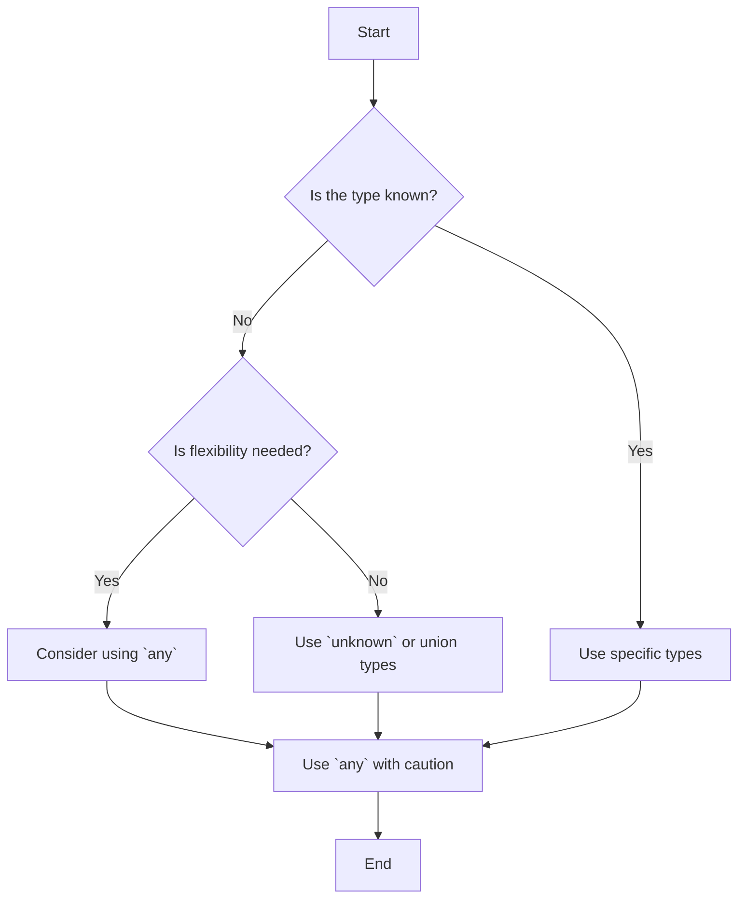

## 2.4 The `any` Type

In our journey through TypeScript, we've encountered various types that help us ensure our code is robust and predictable. However, there are times when we need flexibility, and that's where the `any` type comes into play. In this section, we'll dive into the `any` type, understand its purpose, explore scenarios where it might be necessary, and discuss its implications on type safety. We'll also look at alternatives to using `any` to maintain the benefits of TypeScript's type system.

### Understanding the Purpose of the `any` Type

The `any` type in TypeScript is a powerful tool that allows developers to opt out of type checking for a particular variable. When a variable is declared with the `any` type, it can hold any value, just like a variable in plain JavaScript. This flexibility can be useful in certain situations, but it comes with trade-offs.

#### Why Use the `any` Type?

- **Interoperability with JavaScript Libraries**: When working with third-party JavaScript libraries that don't have TypeScript type definitions, the `any` type can be a quick way to integrate these libraries into your TypeScript code.
- **Gradual Migration**: If you're migrating a large JavaScript codebase to TypeScript, using `any` can help you transition gradually by allowing you to focus on typing critical parts of your code first.
- **Dynamic Content**: In scenarios where the type of data is not known upfront, such as when dealing with user input or data from external APIs, the `any` type can provide the necessary flexibility.

### Implications of Using the `any` Type

While the `any` type offers flexibility, it also undermines TypeScript's ability to catch errors at compile time. By using `any`, you lose the benefits of type safety, which can lead to potential runtime errors. It's essential to use `any` judiciously and understand the implications of its use.

#### Example: Using `any` in TypeScript

Let's look at a simple example to illustrate how the `any` type works:

```typescript
let dynamicVariable: any;

dynamicVariable = 42; // Assigning a number
console.log(dynamicVariable); // Output: 42

dynamicVariable = "Hello, TypeScript!"; // Assigning a string
console.log(dynamicVariable); // Output: Hello, TypeScript!

dynamicVariable = { key: "value" }; // Assigning an object
console.log(dynamicVariable); // Output: { key: "value" }
```

In this example, `dynamicVariable` is declared with the `any` type, allowing it to hold a number, a string, and an object without any type errors. However, this flexibility comes at the cost of losing type safety.

### Scenarios Where `any` Might Be Necessary

While it's advisable to avoid using `any` whenever possible, there are scenarios where it might be necessary:

1. **Third-Party Libraries**: When working with libraries that don't have TypeScript type definitions, using `any` can help you integrate them into your TypeScript codebase.

2. **Dynamic Data**: In cases where data types are not known at compile time, such as data from external APIs or user input, `any` can provide the necessary flexibility.

3. **Prototyping**: During the initial stages of development, when you're rapidly prototyping and iterating on ideas, using `any` can speed up the process. However, it's crucial to replace `any` with specific types as the codebase matures.

### The Risks of Overusing `any`

Overusing the `any` type can lead to several issues:

- **Loss of Type Safety**: The primary benefit of TypeScript is its type safety, which helps catch errors at compile time. Using `any` negates this advantage.
- **Increased Risk of Runtime Errors**: Without type checks, you're more likely to encounter runtime errors, which can be challenging to debug.
- **Reduced Code Readability**: Code with `any` types can be harder to understand and maintain, as it lacks the explicit type information that TypeScript provides.

### Alternatives to Using `any`

To maintain the benefits of TypeScript's type system, consider using alternatives to `any`:

1. **Union Types**: Use union types to specify that a variable can hold one of several types. This approach provides flexibility while maintaining type safety.

    ```typescript
    let flexibleVariable: number | string;

    flexibleVariable = 10; // Valid
    flexibleVariable = "TypeScript"; // Valid
    // flexibleVariable = true; // Error: Type 'boolean' is not assignable to type 'number | string'.
    ```

2. **Unknown Type**: The `unknown` type is similar to `any`, but it requires you to perform type checks before using the variable, which helps maintain type safety.

    ```typescript
    let uncertainVariable: unknown;

    uncertainVariable = "Hello, World!";
    if (typeof uncertainVariable === "string") {
        console.log(uncertainVariable.toUpperCase()); // Valid
    }
    ```

3. **Type Assertions**: Use type assertions to specify the expected type of a variable. This approach allows you to inform the TypeScript compiler about the type you're confident a variable holds.

    ```typescript
    let someValue: any = "This is a string";
    let stringLength: number = (someValue as string).length;
    console.log(stringLength); // Output: 16
    ```

### Code Examples: With and Without `any`

Let's compare code examples with and without the `any` type to highlight the differences:

#### Example Without `any`

```typescript
function processInput(input: string | number): void {
    if (typeof input === "string") {
        console.log("Processing string:", input.toUpperCase());
    } else {
        console.log("Processing number:", input.toFixed(2));
    }
}

processInput("Hello");
processInput(42);
```

In this example, we use a union type to handle both strings and numbers, maintaining type safety.

#### Example With `any`

```typescript
function processInput(input: any): void {
    if (typeof input === "string") {
        console.log("Processing string:", input.toUpperCase());
    } else if (typeof input === "number") {
        console.log("Processing number:", input.toFixed(2));
    } else {
        console.log("Unsupported type");
    }
}

processInput("Hello");
processInput(42);
processInput(true); // No compile-time error, but unexpected behavior
```

Here, using `any` allows us to pass any type of input, but it also introduces the risk of runtime errors.

### Try It Yourself

Now it's your turn! Try modifying the code examples above to see how changing the types affects the behavior of the program. Experiment with different inputs and observe the results. This hands-on approach will help reinforce your understanding of the `any` type and its alternatives.

### Visual Aids

To further illustrate the concept of the `any` type, let's use a flowchart to represent the decision-making process when choosing between `any` and other types.



This flowchart helps visualize the decision-making process when deciding whether to use `any` or other types in your TypeScript code.

### References and Links

For further reading on the `any` type and its alternatives, check out these resources:

- [TypeScript Handbook: Basic Types](https://www.typescriptlang.org/docs/handbook/2/everyday-types.html)
- [MDN Web Docs: JavaScript Data Types and Data Structures](https://developer.mozilla.org/en-US/docs/Web/JavaScript/Data_structures)
- [TypeScript Deep Dive: The `any` Type](https://basarat.gitbook.io/typescript/type-system/any)

### Engagement and Reinforcement

To reinforce your understanding of the `any` type, consider the following questions:

- When might it be appropriate to use the `any` type in your code?
- What are the risks associated with using `any`?
- How can you achieve flexibility in your code without using `any`?

### Exercises

1. **Exercise 1**: Modify the `processInput` function to handle boolean inputs without using the `any` type.
2. **Exercise 2**: Create a function that accepts an array of mixed types (numbers and strings) and processes each element appropriately. Avoid using `any`.

### Key Takeaways

- The `any` type provides flexibility but at the cost of type safety.
- Use `any` sparingly and only when necessary, such as when dealing with third-party libraries or dynamic data.
- Consider alternatives like union types, `unknown`, and type assertions to maintain type safety.
- Experiment with code examples to deepen your understanding of the `any` type and its implications.

By understanding the `any` type and its alternatives, you'll be better equipped to write flexible yet type-safe TypeScript code.

## Quiz Time!



### What is the primary purpose of the `any` type in TypeScript?

- [x] To allow variables to hold any value without type checking.
- [ ] To enforce strict type checking on variables.
- [ ] To automatically convert types at runtime.
- [ ] To improve code performance.

> **Explanation:** The `any` type allows variables to hold any value, bypassing TypeScript's type checking.

### When might using the `any` type be necessary?

- [x] When integrating third-party libraries without type definitions.
- [ ] When you want to ensure type safety.
- [ ] When you need to optimize code performance.
- [ ] When you want to enforce strict type checks.

> **Explanation:** The `any` type is useful when working with libraries that lack TypeScript type definitions.

### What is a potential risk of overusing the `any` type?

- [x] Increased risk of runtime errors.
- [ ] Improved code readability.
- [ ] Enhanced type safety.
- [ ] Faster code execution.

> **Explanation:** Overusing `any` can lead to runtime errors due to the lack of compile-time type checks.

### Which alternative to `any` requires type checks before use?

- [x] `unknown`
- [ ] `string`
- [ ] `number`
- [ ] `boolean`

> **Explanation:** The `unknown` type requires type checks before using the variable, maintaining type safety.

### How can you specify that a variable can hold multiple types?

- [x] Use union types.
- [ ] Use the `any` type.
- [ ] Use type assertions.
- [ ] Use the `unknown` type.

> **Explanation:** Union types allow a variable to hold one of several specified types.

### What is a benefit of using union types over `any`?

- [x] Maintains type safety while allowing flexibility.
- [ ] Provides more flexibility than `any`.
- [ ] Automatically converts types at runtime.
- [ ] Improves code performance.

> **Explanation:** Union types maintain type safety while allowing a variable to hold multiple types.

### Which of the following is a correct use of type assertions?

- [x] `let length: number = (value as string).length;`
- [ ] `let length: number = value.length;`
- [ ] `let length: number = value as number;`
- [ ] `let length: number = (value: string).length;`

> **Explanation:** Type assertions inform the TypeScript compiler about the expected type of a variable.

### What is a key takeaway when using the `any` type?

- [x] Use `any` sparingly and only when necessary.
- [ ] Use `any` to enforce strict type checks.
- [ ] Use `any` to improve code performance.
- [ ] Use `any` to automatically convert types.

> **Explanation:** It's important to use `any` sparingly to maintain the benefits of TypeScript's type system.

### Which type is similar to `any` but requires type checks before use?

- [x] `unknown`
- [ ] `string`
- [ ] `number`
- [ ] `boolean`

> **Explanation:** The `unknown` type is similar to `any` but requires type checks before using the variable.

### True or False: Using the `any` type can lead to compile-time errors.

- [ ] True
- [x] False

> **Explanation:** The `any` type bypasses compile-time type checks, so it does not lead to compile-time errors.


